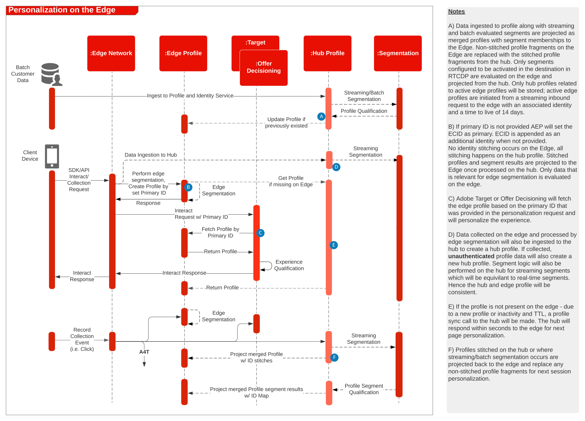

# Architekturdiagramm für Experience Platform Web SDK und [!DNL Edge Network]

Einen Überblick und Details zur Web- und Mobile-SDK sowie zur [!DNL Edge Network]-Server-API finden Sie unter folgenden Themen.

* [Web SDK - Überblick](https://experienceleague.adobe.com/en/docs/blueprints-learn/architecture/architecture-overview/deployment/websdk)
* [Mobile SDK - Überblick](https://developer.adobe.com/client-sdks/documentation/)
* [[!DNL Edge Network] Server-API](https://experienceleague.adobe.com/docs/experience-platform/edge-network-server-api/overview.html?lang=de)

Eine ausführliche Beschreibung der im Web SDK unterstützten Programmfunktionen finden Sie in der folgenden Dokumentation.

* [Im Web SDK unterstützte Programmfunktionen](https://github.com/orgs/adobe/projects/18/views/1)

Weitere Informationen zur Migration von programmspezifischen SDKs zu Web- und Mobile-SDKs finden Sie in der folgenden Dokumentation.

* [Identitäts-Services](https://experienceleague.adobe.com/docs/experience-platform/edge/identity/overview.html?lang=de)
* [Analytics](https://experienceleague.adobe.com/docs/experience-platform/edge/data-collection/adobe-analytics/analytics-overview.html?lang=de)
* [Target](https://experienceleague.adobe.com/docs/experience-platform/edge/personalization/adobe-target/target-overview.html?lang=de)
* [Analytics for Target](https://experienceleague.adobe.com/docs/experience-platform/edge/personalization/adobe-target/a4t/overview.html?lang=de)

## Bereitstellung der Experience Platform Web/Mobile SDK- oder [!DNL Edge Network] Server-API

Das folgende Architekturdiagramm veranschaulicht die Implementierung und die Datenerfassung mit dem Experience Platform Web SDK.

Sequenzdiagramm von Experience Edge, Experience Platform-Services und Programmen

## Referenzdokumentation

* [Tutorial zur Implementierung von Adobe Experience Cloud mit Web SDK](https://experienceleague.adobe.com/docs/platform-learn/implement-web-sdk/overview.html?lang=de)
* [Tutorial zur Implementierung von Adobe Experience Cloud in Mobile Apps](https://experienceleague.adobe.com/docs/platform-learn/implement-mobile-sdk/overview.html?lang=de)
