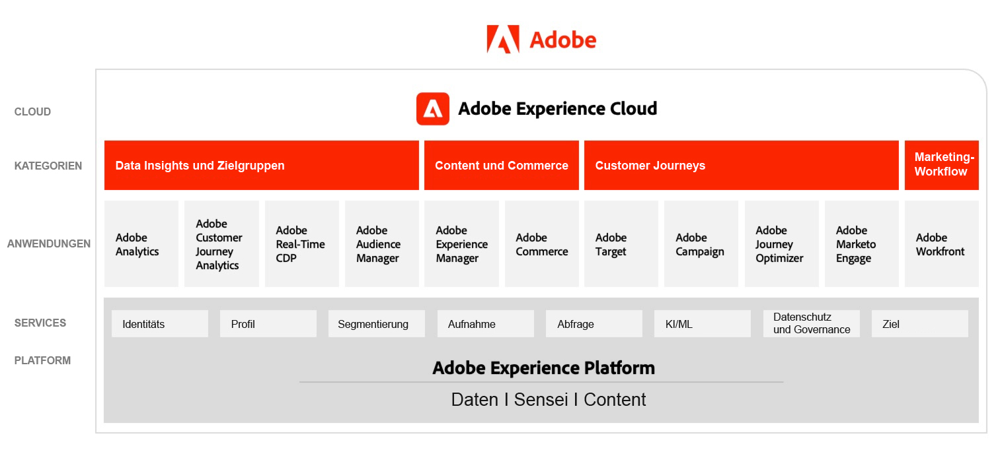
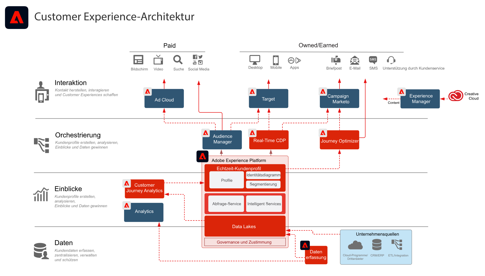

# Architekturdiagramme zu Adobe Experience Cloud

## Markt-Architektur von Adobe Experience Cloud

Das folgende Diagramm zeigt die verschiedenen Komponenten von Adobe Experience Cloud für die Bereiche „Datenerkenntnisse und Zielgruppen“, „Content und Handel“, „Customer Journeys“ und „Marketing-Workflow“, die auf der Grundlage von Adobe Experience Platform erstellt und integriert wurden.

## Integrationsarchitektur von „Daten und Erkenntnissen“, „Content und Commerce“ und „Bereitstellung von Erlebnissen“

Das folgende Architekturdiagramm veranschaulicht, wie die verschiedenen Komponenten von Adobe Experience Cloud miteinander verbunden und integriert sind, um bei der Bereitstellung von Daten, Inhalten und Erlebnissen skalierbare Personalisierung zu ermöglichen.

## Adobe Experience Cloud im Unternehmensumfeld

Das nachstehende Architekturdiagramm veranschaulicht, wie Adobe Experience Cloud-Anwendungen und Adobe Experience Platform in den vier Kategorien „Daten“, „Erkenntnisse“, „Orchestrierung“ und „Interaktion“ in eine Customer-Experience-Architektur auf Unternehmensebene eingebunden sind.

