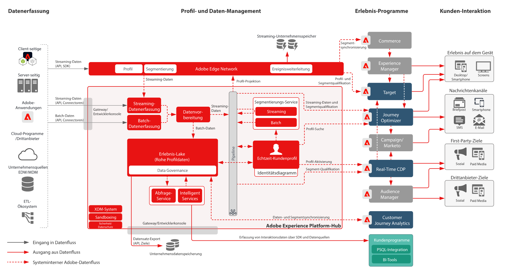

# Architekturdiagramme zu Adobe Experience Platform und Programmen

## Architekturdiagramm zu Adobe Experience Platform und Programmen

Dieses Architekturdiagramm zeigt, wie Adobe Experience Platform mit Programmen und Programm-Services von Adobe Experience Cloud zusammenarbeitet.

## Detailliertes Architekturdiagramm zu Adobe Experience Platform und Programmen

>[!VIDEO](https://video.tv.adobe.com/v/32456/?quality=12&learn=on)

## Integrationen von Adobe Experience Platform und Experience Cloud-Programmen

<table class="relative-table wrapped" style="width: 100%;">
<colgroup>
<col style="width: 16.0202%;" />
<col style="width: 29.3423%;" />
<col style="width: 33.5582%;" />
<col style="width: 21.0793%;" />
</colgroup>
<tbody>
<tr>
<th>Programm</th>
<th>Von Experience Platform zum Programm</th>
<th>Vom Programm zu Experience Platform</th>
<th>Verwandte Blueprints</th>
</tr>
<tr>
<td colspan="1">Ad Cloud</td>
<td colspan="1">
<ul>
<li>In Real-time Customer Data Platform definierte Zielgruppen können für Ad Cloud zum Targeting über Audience Manager freigegeben werden.</li>
</ul>
</td>
<td colspan="1">
<ul>
<li>Keine aktuelle Integration</li>
</ul>
</td>
<td colspan="1">
<ul>
<li><a href="https://experienceleague.adobe.com/docs/blueprints-learn/architecture/audience-activation/anonymous.html?lang=de">Anonyme Zielgruppenaktivierung</a></li>
<li><a href="https://experienceleague.adobe.com/docs/blueprints-learn/architecture/audience-activation/known-customer-audience-activation/known.html?lang=de">Aktivierung einer bekannten Kundin/eines bekannten Kunden</a></li>
<li><a href="https://experienceleague.adobe.com/docs/blueprints-learn/architecture/architecture-overview/platform-applications.html?lang=de">Aktivierung mit Experience Platform und Programmen</a></li>
</ul>
</td>
</tr>
<tr>
<td>Analytics</td>
<td>
<ul>
<li>Über das Web-/Mobile-SDK erfasste Daten können an Adobe Analytics weitergeleitet werden.</li>
</ul>
</td>
<td>
<ul>
<li>Von Analytics erfasste Daten können an den Data Lake und Profilspeicher von Experience Platform gesendet werden. <a href="https://experienceleague.adobe.com/docs/experience-platform/sources/connectors/adobe-applications/analytics.html?lang=de">Analytics Data Connector</a></li>
</ul>
</td>
<td>
<ul>
<li><a href="https://experienceleague.adobe.com/docs/blueprints-learn/architecture/architecture-overview/platform-data-flow.html?lang=de">Datenflüsse in Experience Platform </a></li>
</ul>
</td>
</tr>
<tr>
<td>Audience Manager</td>
<td>
<ul>
<li>In Real-time Customer Data Platform definierte Zielgruppen können für Audience Manager freigegeben werden, um sie für Drittanbieter-Cookie-Ziele zu aktivieren.</li>
</ul>
</td>
<td>
<ul>
<li>Daten, die gemeinsam mit den Zielgruppenzugehörigkeiten in Audience Manager erfasst und ausgewertet werden, können für den Data Lake und Profilspeicher von Experience Platform freigegeben werden. <a href="https://experienceleague.adobe.com/docs/experience-platform/sources/connectors/adobe-applications/audience-manager.html?lang=de">Audience Manager Source Connector</a></li>
</ul>
</td>
<td>
<ul>
<li><a href="https://experienceleague.adobe.com/docs/blueprints-learn/architecture/audience-activation/anonymous.html?lang=de">Anonyme Zielgruppenaktivierung</a></li>
<li><a href="https://experienceleague.adobe.com/docs/blueprints-learn/architecture/audience-activation/known-customer-audience-activation/known.html?lang=de">Aktivierung einer bekannten Kundin/eines bekannten Kunden</a></li>
<li><a href="https://experienceleague.adobe.com/docs/blueprints-learn/architecture/audience-activation/platform-and-applications.html?lang=de">Aktivierung mit Experience Platform und Programmen</a></li>
</ul>
</td>
</tr>
<tr>
<td colspan="1">Campaign Classic</td>
<td colspan="1">
<ul>
<li>In Real-time Customer Data Platform definierte Zielgruppen können für Campaign Classic als Zielgruppe zum Initiieren von Kampagnen freigegeben werden.</li>
</ul>
</td>
<td colspan="1">
<ul>
<li>Die von Campaign erfassten Interaktions- und Kampagnendaten können in Experience Platform als Datenquelle erfasst werden, die über Real-time Customer Data Platform zur weiteren Verwendung beim Erstellen von Zielgruppen und über den Customer Journey Analytics- und Experience Platform-Abfragedienst zur Analyse genutzt werden kann.</li>
</ul>
</td>
<td colspan="1">
<ul>
<li><a href="https://experienceleague.adobe.com/docs/blueprints-learn/architecture/customer-journeys/overview.html?lang=de">Customer Journeys</a></li>
</ul>
</td>
</tr>
<tr>
<td colspan="1">Campaign Standard</td>
<td colspan="1">
<ul>
<li>In Real-time Customer Data Platform definierte Zielgruppen können für Campaign Standard als Zielgruppe zum Initiieren von Kampagnen freigegeben werden.</li>
</ul>
</td>
<td colspan="1">
<ul>
<li>Die von Campaign erfassten Interaktions- und Kampagnendaten können in Experience Platform als Datenquelle erfasst werden, die über Real-time Customer Data Platform zur weiteren Verwendung beim Erstellen von Zielgruppen und über den Customer Journey Analytics- und Experience Platform-Abfragedienst zur Analyse genutzt werden kann.</li>
</ul>
</td>
<td colspan="1">
<ul>
<li><a href="https://experienceleague.adobe.com/docs/blueprints-learn/architecture/customer-journeys/overview.html?lang=de">Customer Journeys</a></li>
</ul>
</td>
</tr>
<tr>
<td colspan="1">Customer Journey Analytics</td>
<td colspan="1">
<ul>
<li>Daten, die erfasst und in den Data Lake von Experience Platform aufgenommen wurden, werden zur Verarbeitung in Customer Journey Analytics zur Verfügung gestellt. </li>
<li>Profil- und Zielgruppendaten aus Real-time Customer Data Platform können in Customer Journey Analytics erfasst werden. <a href="https://experienceleague.adobe.com/docs/analytics-platform/using/cja-usecases/ingest-aep-segments.html?lang=de">Integration von RTCDP mit CJA</a>.
</li>
</ul>
</ul>
</td>
<td colspan="1">
<ul>
<li>Erstellen Sie Zielgruppen in Customer Journey Analytics und geben Sie die Zielgruppenergebnisse für Real-time Customer Data Platform frei. <a href="https://experienceleague.adobe.com/docs/analytics-platform/using/cja-components/audiences/publish.html?lang=de">Veröffentlichung von CJA-Zielgruppen</a></li>
</ul>
</td>
<td colspan="1">
<ul>
<li><a href="https://experienceleague.adobe.com/docs/blueprints-learn/architecture/customer-journey-analytics/overview.html?lang=de">Customer Journey Analytics</a></li>
</ul>
</td>
</tr>
<tr>
<td colspan="1">Experience Manager</td>
<td colspan="1">
<ul>
<li>Das Experience Platform-Profil kann Server-seitig direkt aufgerufen werden, um personalisierte Erlebnisse zu ermöglichen, die über Experience Manager bereitgestellt werden. Beachten Sie, dass Personalisierungsaktivitäten meist durch Experience Manager über die Target-Integration bereitgestellt werden. </li>
</ul>
</td>
<td colspan="1">
<ul>
<li>Keine aktuelle Integration; Verhaltens- und Interaktionsdaten auf Experience Manager-Sites werden direkt über das Experience Platform Web and Mobile SDK erfasst.</li>
</ul>
</td>
<td colspan="1">
<ul>
<li><a href="https://experienceleague.adobe.com/docs/blueprints-learn/architecture/audience-activation/known-customer-audience-activation/known.html?lang=de">Aktivierung einer bekannten Kundin/eines bekannten Kunden</a></li>
</ul>
</td>
</tr>
<tr>
<td colspan="1">Journey Optimizer</td>
<td colspan="1">
<ul>
<li>Datenereignisse und -profile, die in Experience Platform aufgenommen werden, werden Journey Optimizer zur Verfügung gestellt, um Journeys in Journey Optimizer zu initiieren und zu unterstützen.</li>
</ul>
</td>
<td colspan="1">
<ul>
<li>Die von Journey Optimizer erzeugten Interaktions- und Kampagnendaten werden in Experience Platform erfasst und können über Real-time Customer Data Platform und die Analyse über Customer Journey Analytics sowie den Query Service für Experience Platformen weiter verwendet werden.</li>
</ul>
</td>
<td colspan="1">
<ul>
<li><a href="https://experienceleague.adobe.com/docs/blueprints-learn/architecture/customer-journeys/journey-optimizer.html?lang=de">Journey Optimizer</a></li>
</ul>
</td>
</tr>
<tr>
<td colspan="1">Adobe Commerce</td>
<td colspan="1">
<ul>
<li>In Real-time Customer Data Platform erstellte Profile und Zielgruppen können in Adobe Commerce für die Personalisierung bereitgestellt werden. </li>
</ul>
</td>
<td colspan="1">
<ul>
<li>Native Daten in Adobe Commerce können über einen Adobe Commerce-Quell-Connector an Experience Platform gesendet werden. </li>
</ul>
</td>
<td colspan="1">Keine aktuelle Integration</td>
</tr>
<tr>
<td colspan="1">Marketo</td>
<td colspan="1">
<ul>
<li>In Real-time Customer Data Platform definierte Zielgruppen können für Marketo als Zielgruppe freigegeben werden, um Marketo-Kampagnen zu initiieren und Marketo-Objekte zu aktualisieren.</li>
</ul>
</td>
<td colspan="1">
<ul>
<li>Marketo-Accounts, -Kontakte und -Opportunity-Daten sowie von Marketo erstellte Interaktions- und Kampagnendaten werden in Experience Platform aufgenommen und können zur weiteren Verwendung in der Zielgruppenerstellung über die B2B-Kundendatenplattform und zur Analyse über Customer Journey Analytics und den Abfrage-Service von Experience Platform verwendet werden. <a href="https://experienceleague.adobe.com/docs/experience-platform/sources/connectors/adobe-applications/marketo/marketo.html?lang=de">Marketo Engage Connector</a></li>
</ul>
</td>
<td colspan="1">
<ul>
<li><a href="https://experienceleague.adobe.com/docs/blueprints-learn/architecture/b2b-activation/b2bactivation.html?lang=de">Blueprint: B2B-Aktivierung</a></li>
</ul>
</td>
</tr>
<tr>
<td colspan="1">Real-Time CDP</td>
<td colspan="1">
<ul>
<li>Daten, die in Experience Platform erfasst und erfasst werden, sind die Datenquelle für die Zusammenstellung von Echtzeit-Kundenprofilen, die für die Real-time Customer Data Platform bereitgestellt werden.</li>
</ul>
</td>
<td colspan="1">
<ul>
<li>Zielgruppen- und Profilmetriken werden an den Data Lake von Experience Platform gesendet und in den Dashboards für Berichte zu Profilerkenntnissen genutzt.</li>
<li>Die Zielgruppen- und Profildaten im Data Lake können über den Abfrage-Service und Customer Journey Analytics für weitere Erkenntnisse verwendet werden.</li>
</ul>
</td>
<td colspan="1">
<ul>
<li><a href="https://experienceleague.adobe.com/docs/blueprints-learn/architecture/audience-activation/known-customer-audience-activation/known.html?lang=de">Aktivierung einer bekannten Kundin/eines bekannten Kunden</a></li>
<li><a href="https://experienceleague.adobe.com/docs/blueprints-learn/architecture/audience-activation/platform-and-applications.html?lang=de">Aktivierung mit Experience Platform und Programmen</a></li>
</ul>
</td>
</tr>
<tr>
<td colspan="1">Target</td>
<td colspan="1">
<ul>
<li>In Real-time Customer Data Platform definierte Zielgruppen und Profilattribute können für Target freigegeben und in von Target bereitgestellten Personalisierungs- und Targeting-Erlebnissen verwendet werden.</li>
</ul>
</td>
<td colspan="1">
<ul>
<li>Daten, die für Target-Erlebnisse und -Interaktionen erfasst werden, können über das Experience Platform Web/Mobile SDK für Experience Platform erfasst werden. Diese Daten können beim Erstellen von Zielgruppen über Real-time Customer Data Platform und zur Analyse über Customer Journey Analytics und Query Service für Experience Platformen verwendet werden.</li>
</ul>
</td>
<td colspan="1">
<ul>
<li><a href="https://experienceleague.adobe.com/docs/blueprints-learn/architecture/audience-activation/known-customer-audience-activation/known.html?lang=de">Aktivierung einer bekannten Kundin/eines bekannten Kunden</a></li>
<li><a href="https://experienceleague.adobe.com/docs/blueprints-learn/architecture/audience-activation/platform-and-applications.html?lang=de">Aktivierung mit Experience Platform und Programmen</a></li>
</ul>
</td>
</tr>
</tbody>
</table>