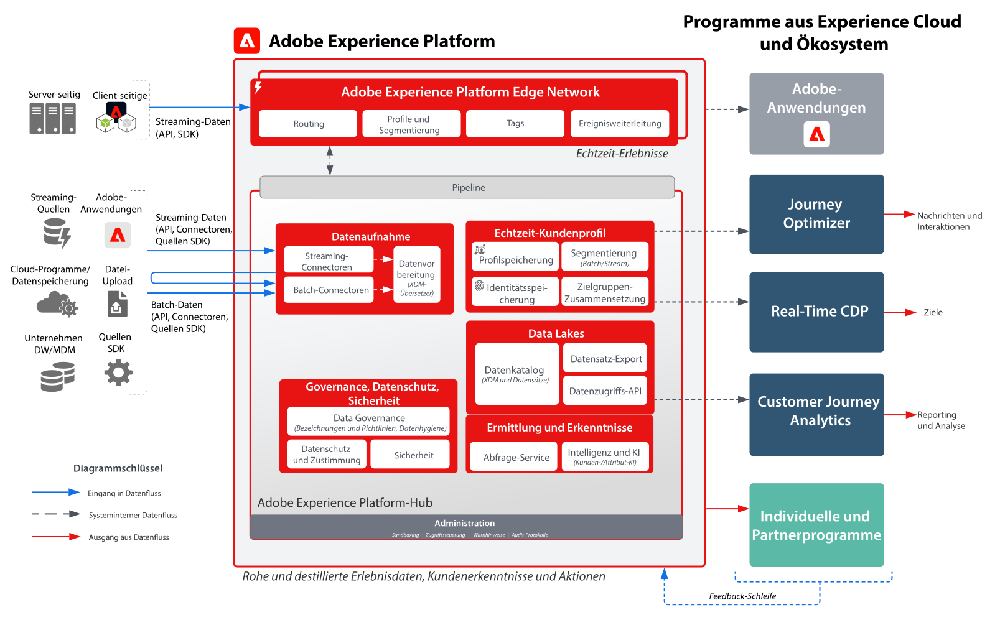
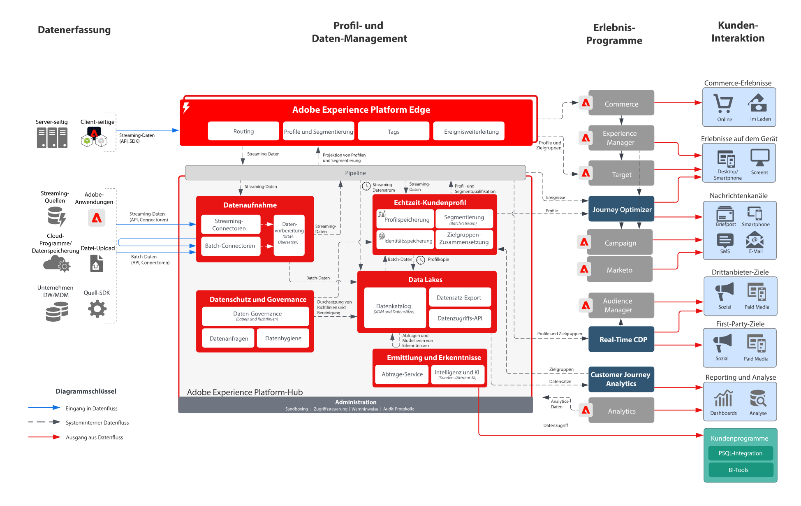

# Architekturdiagramme für Adobe Experience Platform und Programme

Diese Architekturdiagramme zeigen, wie Experience Platform (AEP) mit anderen Experience Cloud-Anwendungen und Anwendungs-Services in Beziehung steht.

>[!MORELIKETHIS]
>
>[Integrationskonfigurationen für Experience Cloud-Anwendungsintegrationen](https://experienceleague.adobe.com/docs/integrations-learn/experience-cloud/overview.html?lang=de).

## Architekturdiagramm

Dieses Architekturdiagramm zeigt, wie Adobe Experience Platform mit Programmen und Programm-Services von Adobe Experience Cloud zusammenarbeitet.

## Detailliertes Architekturdiagramm

