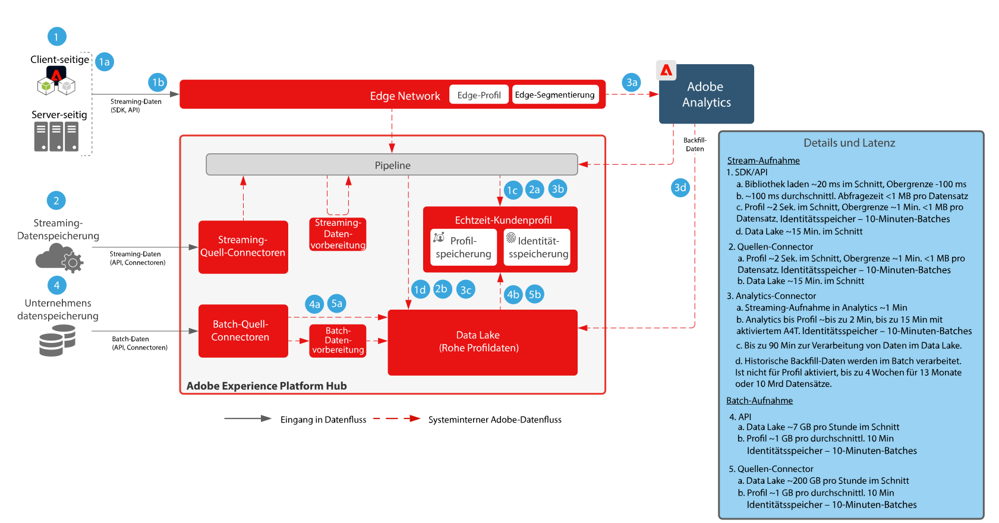

# Architekturdiagramme zum Datenfluss in Adobe Experience Platform

## Datenflussdiagramm

Das Diagramm unten veranschaulicht die verschiedenen Pfade für die Datenerfassung und -ausgabe aus Adobe Experience Platform.

## Dateneingabe- und -ausgangsmuster

Eine detaillierte Liste aller Datenaufnahme-, Datenerfassungs- und Dateneingangsmuster finden Sie in der [Blueprint für die Datenvorbereitung und -aufnahme](../data-ingestion/ingestion.md).

Eine detaillierte Liste aller Datenausgangs- und Datenzugriffsmuster finden Sie in der [Blueprint für den Datenzugriff und Datenexport](../data-ingestion/egress.md).

## Leitlinien für die Datenaufnahme

Das folgende Diagramm zeigt die Leitlinien zur Erlangung einer durchschnittlichen Leistung sowie die Latenz bei der Datenaufnahme in Adobe Experience Platform.

