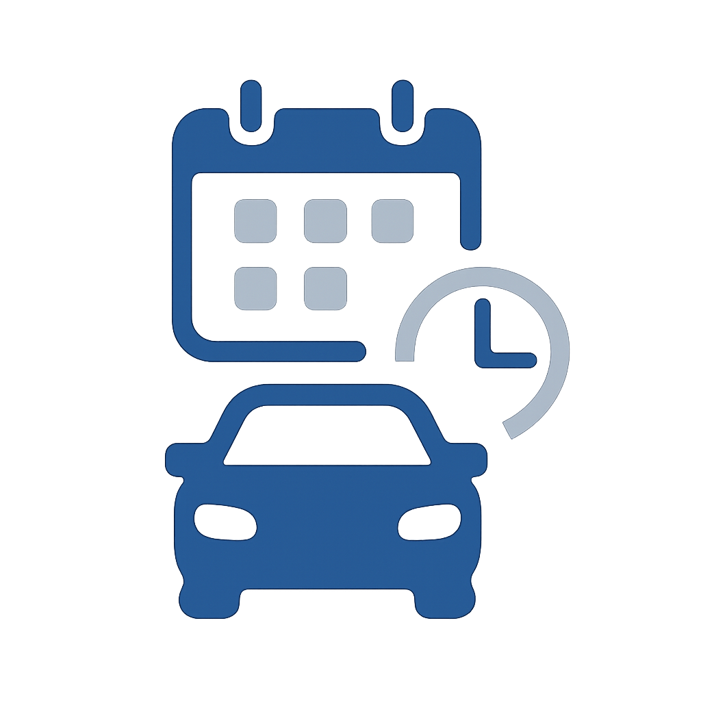
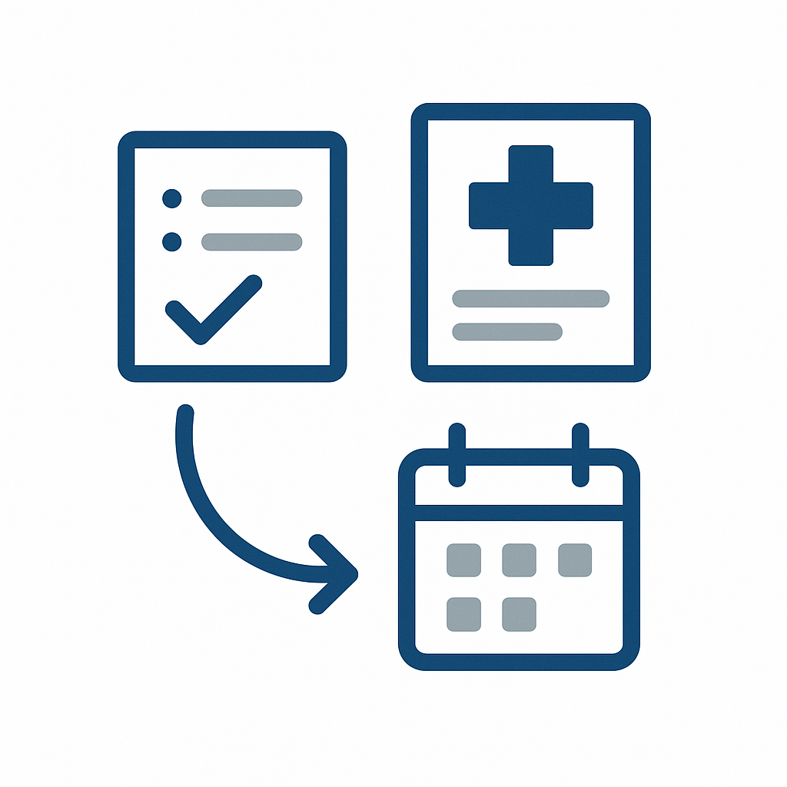
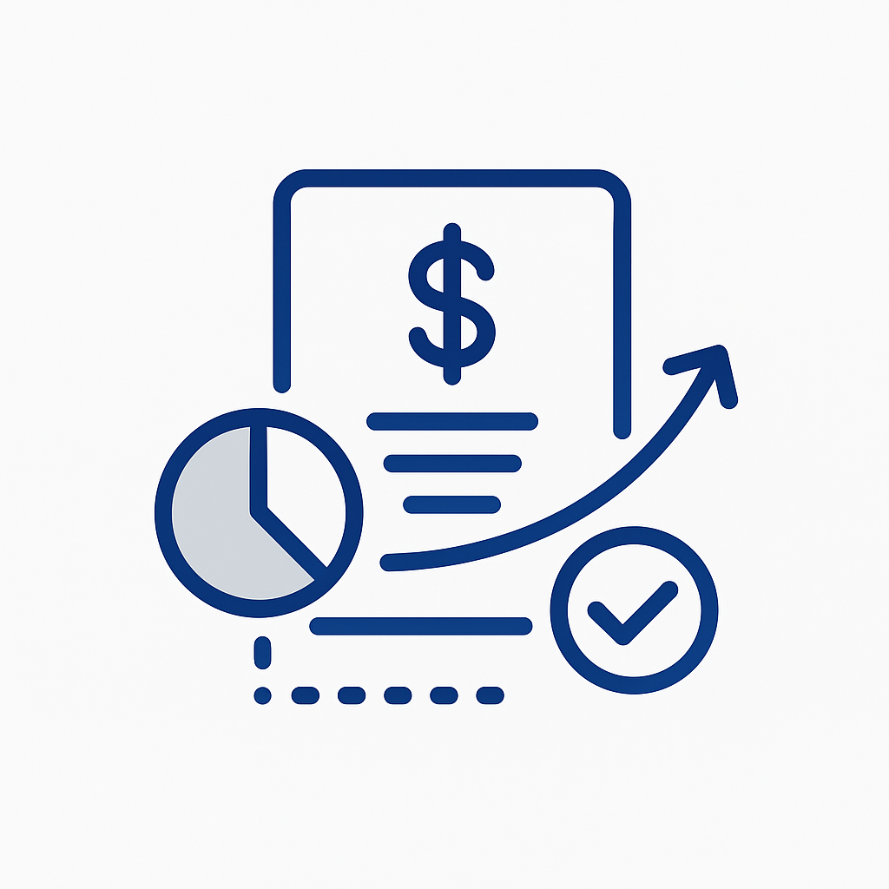
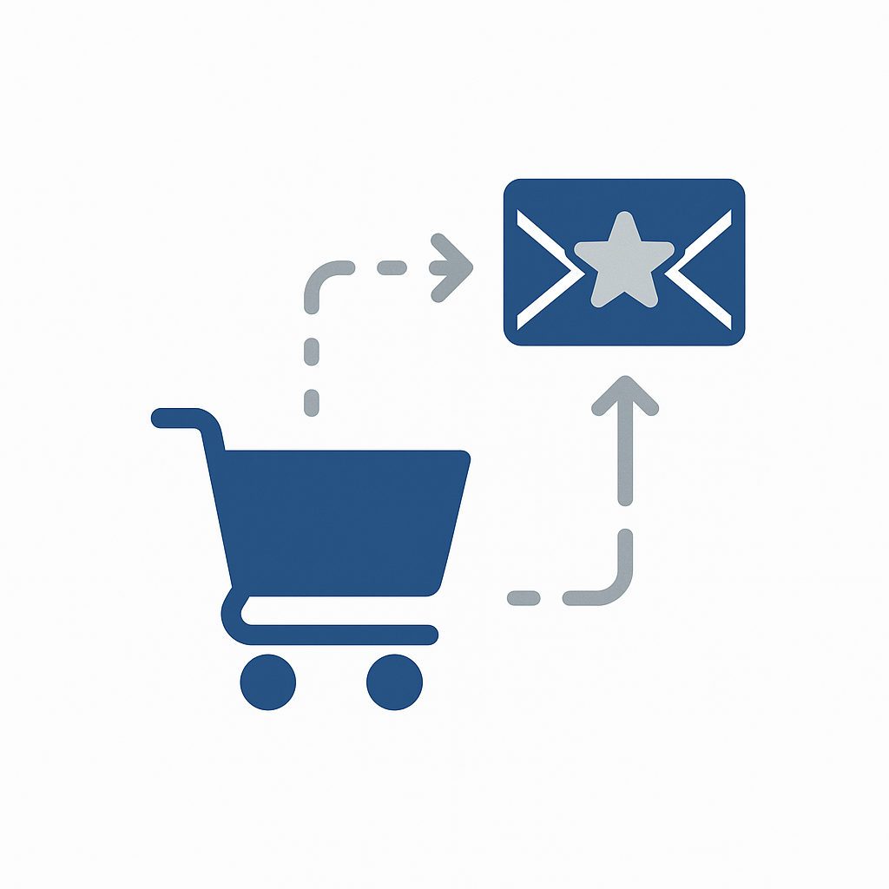
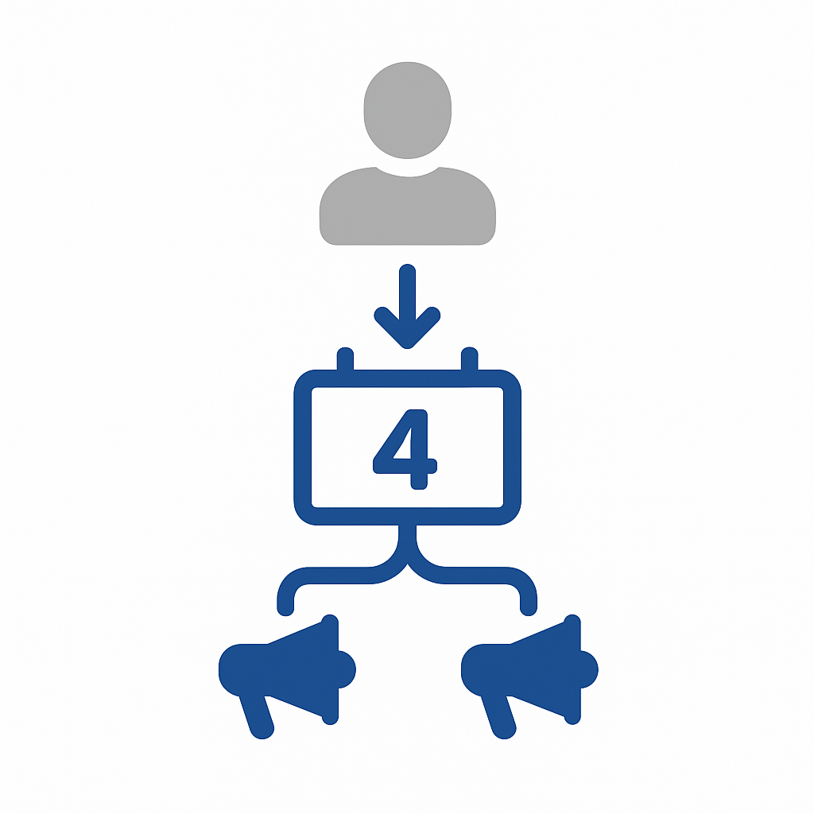

# Anwendungsfallkatalog

Anwendungsfälle aus der Branche zeigen, wie Unternehmen in bestimmten Branchen Adobe Experience Platform und Anwendungen einsetzen, um messbare Geschäftsergebnisse zu erzielen. Jeder Anwendungsfall beschreibt ein konkretes Geschäftsszenario, dessen erwartete Auswirkungen und Links zum Anwendungsfallmuster[ das ](/help/blueprints/use-case-patterns/overview.md) Implementierungshandbücher bietet.

Durchsuchen Sie die nach Branchen geordneten Seiten, um Anwendungsfälle zu finden, die für Ihr Unternehmen relevant sind, und folgen Sie dann den Muster-Links für Implementierungsreferenzen, einschließlich Entscheidungshilfen, Funktionsketten und Experience League-Dokumentation.

| Branche | Schlüsselthemen |
| --- | --- |
| [Automotive](automotive/automotive-overview.md) | Fahrzeugkauf-Journey, Service-Lebenszyklus, vernetzte Autoerlebnisse, Loyalität des Eigentümers |
| [B2B](b2b/b2b-overview.md) | Account-basiertes Marketing, Lead-Scoring, Pipeline-Beschleunigung, Kundenerweiterung |
| [Finanzdienstleistungen](financial-services/financial-services-overview.md) | Produktempfehlungen, Abwanderungsprävention, Angebote in der Lebensphase, Betrugspersonalisierung |
| [Gesundheitswesen](healthcare/healthcare-overview.md) | Terminverwaltung, Einhaltung von Medikamenten, Onboarding von Patienten, Betreuung und Koordination |
| [Versicherung](insurance/insurance-overview.md) | Richtlinienverlängerung, Schadenserfahrung, Risikoprävention, Crosssell-Optimierung |
| [Medien und Unterhaltung](media-entertainment/media-entertainment-overview.md) | Inhaltsempfehlungen, Abonnement-Aufbewahrung, Testkonvertierung, plattformübergreifende Interaktion |
| [Einzelhandel](retail/retail-overview.md) | Produktpersonalisierung, Wiederherstellung des Warenkorbs, Crosssell-Optimierung, Interaktion mit Treueprogrammen |
| [Telekommunikation](telecommunications/telecommunications-overview.md) | Geräte-Upgrades, Abwanderungsprävention, Planoptimierung, Netzwerkinteraktion |
| [Reisen und Gastgewerbe](travel-hospitality/travel-hospitality-overview.md) | Buchungspersonalisierung, Abbruch, Wiederherstellung, Treueprogramme, saisonale Kampagnen |

## Verbinden von Anwendungsfällen mit dem Implementierungshandbuch

Jeder Anwendungsfall ist verknüpft mit einem **Anwendungsfallmuster** - einem wiederholbaren Implementierungsansatz, der die Funktionskette, Entscheidungspunkte und Konfigurationsschritte beschreibt, die erforderlich sind, um den Anwendungsfall zum Leben zu erwecken. Anwendungsfallmuster wiederum stehen in Verbindung mit [wichtigen Geschäftszielen](/help/blueprints/business-objectives/overview.md) und helfen Ihnen, die Implementierungsarbeit an strategische Ergebnisse anzupassen.

```
Industry Use Case → Use Case Pattern → Key Business Objective
```

## Nach Branche durchsuchen

>[!BEGINTABS]

>[!TAB Einzelhandel]

| | Nutzungsszenario | Beschreibung | Reife | Muster |
| --- | --- | --- | --- | --- |
|  | [E-Mail-Wiederherstellung bei Transaktionsabbruch](retail/retail-overview.md#abandoned-cart-email-recovery) | Senden personalisierter Erinnerungen an Transaktionsabbrüche | [!BADGE Foundation]{type=Neutral} | [Ereignisausgelöstes Messaging](/help/blueprints/use-case-patterns/campaign-management-orchestration/event-triggered-messaging.md) |
|  | [Inventarbasierte Dringlichkeitskampagnen](retail/retail-overview.md#inventory-based-urgency-campaigns) | Echtzeit-Warnhinweise für Trigger bei niedrigem Produktbestand | [!BADGE Foundation]{type=Neutral} | [Ereignisausgelöstes Messaging](/help/blueprints/use-case-patterns/campaign-management-orchestration/event-triggered-messaging.md) |
|  | [Warnhinweise bei Preisverfall](retail/retail-overview.md#price-drop-alerts) | Kunden benachrichtigen, wenn Wunschliste oder angezeigte Artikel im Preis fallen | [!BADGE Foundation]{type=Neutral} | [Ereignisausgelöstes Messaging](/help/blueprints/use-case-patterns/campaign-management-orchestration/event-triggered-messaging.md) |
| | [Nicht vorrätige Benachrichtigungen](retail/retail-overview.md#out-of-stock-notifications) | Kunden benachrichtigen, wenn nicht vorrätige Produkte verfügbar werden | [!BADGE Foundation]{type=Neutral} | [Ereignisausgelöstes Messaging](/help/blueprints/use-case-patterns/campaign-management-orchestration/event-triggered-messaging.md) |
|  | [Personalisierte Produktempfehlungen](retail/retail-overview.md#personalized-product-recommendations) | Anzeigen personalisierter Produkte basierend auf dem Browse- und Kaufverlauf | [!BADGE Emerging]{type=Informative} | [Verhaltensempfehlung](/help/blueprints/use-case-patterns/personalization/behavioral-recommendation.md) |
|  | [Personalisierte Kategorieseiten](retail/retail-overview.md#personalized-category-pages) | Kategorieseiten basierend auf Kundenvoreinstellungen dynamisch neu anordnen | [!BADGE Emerging]{type=Informative} | [Verhaltensempfehlung](/help/blueprints/use-case-patterns/personalization/behavioral-recommendation.md) |
|  | [Neue Kunden-Begrüßungsreihe](retail/retail-overview.md#new-customer-welcome-series) | Automatisieren von Willkommensserien mit mehreren E-Mails und personalisierten Empfehlungen | [!BADGE Emerging]{type=Informative} | [Mehrstufige orchestrierte Journey](/help/blueprints/use-case-patterns/campaign-management-orchestration/multi-step-orchestrated-journey.md) |
|  | [Erinnerungs-](retail/retail-overview.md#replenishment-reminders) | Senden automatischer Erinnerungen für regelmäßig gekaufte Verbrauchsgüter | [!BADGE Emerging]{type=Informative} | [Mehrstufige orchestrierte Journey](/help/blueprints/use-case-patterns/campaign-management-orchestration/multi-step-orchestrated-journey.md) |
|  | [Follow-up-Kampagnen nach dem Kauf](retail/retail-overview.md#post-purchase-follow-up-campaigns) | Senden von Tipps zur Pflege, Überprüfungsanfragen und zugehörigen Produktvorschlägen | [!BADGE Emerging]{type=Informative} | [Mehrstufige orchestrierte Journey](/help/blueprints/use-case-patterns/campaign-management-orchestration/multi-step-orchestrated-journey.md) |
| | [Social Proof Personalization](retail/retail-overview.md#social-proof-personalization) | Anzeigen personalisierter Bewertungen und Bewertungen basierend auf dem Kundenprofil | [!BADGE Emerging]{type=Informative} | [Web-/App-Personalization für bekannte Besucher](/help/blueprints/use-case-patterns/personalization/known-visitor-web-app-personalization.md) |
|  | [Crosssell- und Upsell-Empfehlungen](retail/retail-overview.md#cross-sell-and-upsell-recommendations) | Anzeigen relevanter Crosssell- und Upsell-Produkte an der Kasse und in E-Mails | [!BADGE Erweitert]{type=Caution} | [Offer Decisioning](/help/blueprints/use-case-patterns/personalization/offer-decisioning.md) |
| | [Exklusive VIP-Kundenangebote](retail/retail-overview.md#vip-customer-exclusive-offers) | Exklusive Angebote und frühzeitiger Zugriff auf hochwertige Kunden | [!BADGE Erweitert]{type=Caution} | [Cross-Channel-Journey mit Decisioning](/help/blueprints/use-case-patterns/campaign-management-orchestration/cross-channel-journey-with-decisioning.md) |

>[!TAB Automotive]

| | Nutzungsszenario | Beschreibung | Reife | Muster |
| --- | --- | --- | --- | --- |
|  | [Service-Terminerinnerungen](automotive/automotive-overview.md#service-appointment-reminders) | Senden personalisierter Service-Mahnungen basierend auf Fahrzeugkilometerleistung und Service-Verlauf | [!BADGE Foundation]{type=Neutral} | [Ereignisausgelöstes Messaging](/help/blueprints/use-case-patterns/campaign-management-orchestration/event-triggered-messaging.md) |
|  | [Rückrufaktionen für Fahrzeuge](automotive/automotive-overview.md#vehicle-recall-notifications) | Senden von personalisierten Rückrufbenachrichtigungen mit Zeitplanoptionen für Services | [!BADGE Foundation]{type=Neutral} | [Ereignisausgelöstes Messaging](/help/blueprints/use-case-patterns/campaign-management-orchestration/event-triggered-messaging.md) |
|  | [Planung der Testfahrt](automotive/automotive-overview.md#test-drive-scheduling) | Personalisierte Planung von Testfahrten mit Händlerempfehlungen aktivieren | [!BADGE Foundation]{type=Neutral} | [Ereignisausgelöstes Messaging](/help/blueprints/use-case-patterns/campaign-management-orchestration/event-triggered-messaging.md) |
|  | [Neue Modellstart-Kampagnen](automotive/automotive-overview.md#new-model-launch-campaigns) | Targeting von Kunden, die an neuen Modellen interessiert sind, basierend auf dem aktuellen Fahrzeug und den aktuellen Präferenzen | [!BADGE Foundation]{type=Neutral} | [Batch-Aktivierung ausgehender Nachrichten](/help/blueprints/use-case-patterns/campaign-management-orchestration/batch-outbound-message-activation.md) |
|  | [Trade-In-Value-Kampagnen](automotive/automotive-overview.md#trade-in-value-campaigns) | Proaktive Bewertung des Inzahlungswerts für Kunden, die für ein Upgrade bereit sind | [!BADGE Emerging]{type=Informative} | [Mehrstufige orchestrierte Journey](/help/blueprints/use-case-patterns/campaign-management-orchestration/multi-step-orchestrated-journey.md) |
|  | [Empfehlungen für Teile und Zubehör](automotive/automotive-overview.md#parts-and-accessories-recommendations) | Empfehlen von Teilen und Zubehör basierend auf Fahrzeugmodell und Betriebsdauer | [!BADGE Emerging]{type=Informative} | [Verhaltensempfehlung](/help/blueprints/use-case-patterns/personalization/behavioral-recommendation.md) |
|  | [Garantiepläne und erweiterte Servicepläne](automotive/automotive-overview.md#warranty-and-extended-service-plans) | Empfehlen von Garantie- und Serviceplänen zu optimalen Zeiten je nach Fahrzeugalter | [!BADGE Emerging]{type=Informative} | [Mehrstufige orchestrierte Journey](/help/blueprints/use-case-patterns/campaign-management-orchestration/multi-step-orchestrated-journey.md) |
|  | [Connected Car Feature Activation](automotive/automotive-overview.md#connected-car-feature-activation) | Personalisieren von Recommendations zu vernetzten Fahrzeugfunktionen basierend auf den Fahrzeugfunktionen | [!BADGE Emerging]{type=Informative} | [Mehrstufige orchestrierte Journey](/help/blueprints/use-case-patterns/campaign-management-orchestration/multi-step-orchestrated-journey.md) |
|  | [Händlernetzwerk-Koordination](automotive/automotive-overview.md#dealer-network-coordination) | Personalisierte Händlerempfehlungen basierend auf Standort und Präferenzen aktivieren | [!BADGE Emerging]{type=Informative} | [Web-/App-Personalization für bekannte Besucher](/help/blueprints/use-case-patterns/personalization/known-visitor-web-app-personalization.md) |
|  | [Fahrzeugkauf Journey Personalization](automotive/automotive-overview.md#vehicle-purchase-journey-personalization) | Personalisieren der Fahrzeugkauf-Journey von der Recherche bis zum Kauf | [!BADGE Erweitert]{type=Caution} | [Cross-Channel-Journey mit Decisioning](/help/blueprints/use-case-patterns/campaign-management-orchestration/cross-channel-journey-with-decisioning.md) |
|  | [Finanzierungs- und Versicherungsangebote](automotive/automotive-overview.md#financing-and-insurance-offers) | Personalisierte Finanzierungs- und Versicherungsangebote basierend auf dem Kreditprofil unterbreiten | [!BADGE Erweitert]{type=Caution} | [Offer Decisioning](/help/blueprints/use-case-patterns/personalization/offer-decisioning.md) |
|  | [Treueprogramme für Inhaber](automotive/automotive-overview.md#owner-loyalty-programs) | Personalisieren von Treuekommunikation, Prämien und exklusiven Angeboten nach Eigentümerverlauf | [!BADGE Erweitert]{type=Caution} | [Cross-Channel-Journey mit Decisioning](/help/blueprints/use-case-patterns/campaign-management-orchestration/cross-channel-journey-with-decisioning.md) |

>[!TAB Finanzdienstleistungen]

| | Nutzungsszenario | Beschreibung | Reife | Muster |
| --- | --- | --- | --- | --- |
| | [Transaktionsbasierte Warnhinweise und Empfehlungen](financial-services/financial-services-overview.md#transaction-based-alerts-and-recommendations) | Senden von Echtzeitwarnungen für Transaktionen und personalisierte Empfehlungen | [!BADGE Foundation]{type=Neutral} | [Ereignisausgelöstes Messaging](/help/blueprints/use-case-patterns/campaign-management-orchestration/event-triggered-messaging.md) |
| | [Rückforderung bei Abbruch einer Kreditkartenanwendung](financial-services/financial-services-overview.md#credit-card-application-abandonment-recovery) | Erneutes Ansprechen von Kunden, die mit Kreditkartenanträgen begonnen, diese aber nicht abgeschlossen haben | [!BADGE Foundation]{type=Neutral} | [Ereignisausgelöstes Messaging](/help/blueprints/use-case-patterns/campaign-management-orchestration/event-triggered-messaging.md) |
| | [Betrugswarnung Personalization](financial-services/financial-services-overview.md#fraud-alert-personalization) | Personalisieren von Warnhinweisen zu Betrug und Sicherheitskommunikation nach Kundenpräferenzen | [!BADGE Foundation]{type=Neutral} | [Ereignisausgelöstes Messaging](/help/blueprints/use-case-patterns/campaign-management-orchestration/event-triggered-messaging.md) |
|  | [Hochwertige Bleipflege](financial-services/financial-services-overview.md#high-value-lead-nurturing) | Identifizieren Sie hochwertige Interessenten und pflegen Sie sie mit personalisierten Inhalten und Angeboten. | [!BADGE Emerging]{type=Informative} | [Mehrstufige orchestrierte Journey](/help/blueprints/use-case-patterns/campaign-management-orchestration/multi-step-orchestrated-journey.md) |
|  | [Personalisiertes Konto-Dashboard](financial-services/financial-services-overview.md#personalized-account-dashboard) | Personalisieren des Online-Banking-Dashboards basierend auf der Kontoaktivität und den finanziellen Zielen | [!BADGE Emerging]{type=Informative} | [Web-/App-Personalization für bekannte Besucher](/help/blueprints/use-case-patterns/personalization/known-visitor-web-app-personalization.md) |
| | [Empfehlungen für Investment Portfolio](financial-services/financial-services-overview.md#investment-portfolio-recommendations) | Personalisierte Anlageempfehlungen auf der Grundlage von Risikoprofil und Zielen bereitstellen | [!BADGE Emerging]{type=Informative} | [Verhaltensempfehlung](/help/blueprints/use-case-patterns/personalization/behavioral-recommendation.md) |
| | [Kampagnen zur Vorabgenehmigung von Hypotheken](financial-services/financial-services-overview.md#mortgage-pre-approval-campaigns) | Targeting von Kunden, die wahrscheinlich am Markt für eine Hypothek sind, basierend auf Profil und Lebensstadium | [!BADGE Emerging]{type=Informative} | [Mehrstufige orchestrierte Journey](/help/blueprints/use-case-patterns/campaign-management-orchestration/multi-step-orchestrated-journey.md) |
|  | [Produktempfehlung für Bestandskunden](financial-services/financial-services-overview.md#product-recommendation-for-existing-customers) | Auf Profil, Transaktionen und Lebensstadium basierende Empfehlung relevanter Finanzprodukte | [!BADGE Erweitert]{type=Caution} | [Offer Decisioning](/help/blueprints/use-case-patterns/personalization/offer-decisioning.md) |
|  | [Kampagnen zur Verhinderung von Abwanderungen](financial-services/financial-services-overview.md#churn-prevention-campaigns) | Identifizieren Sie gefährdete Kunden mit KI-gestützten Prognosen und interagieren Sie mit Aufbewahrungsangeboten | [!BADGE Erweitert]{type=Caution} | [Cross-Channel-Journey mit Decisioning](/help/blueprints/use-case-patterns/campaign-management-orchestration/cross-channel-journey-with-decisioning.md) |
|  | [Life Stage-basierte Produktangebote](financial-services/financial-services-overview.md#life-stage-based-product-offers) | Identifizieren Sie Kunden, die in neue Lebensstadien eintreten, und bieten Sie relevante Finanzprodukte an | [!BADGE Erweitert]{type=Caution} | [Cross-Channel-Journey mit Decisioning](/help/blueprints/use-case-patterns/campaign-management-orchestration/cross-channel-journey-with-decisioning.md) |
| | [Interaktion mit Treueprogrammen](financial-services/financial-services-overview.md#loyalty-program-engagement) | Personalisieren von Treuekommunikation, Prämien und Angeboten nach Stufe und Verlauf | [!BADGE Erweitert]{type=Caution} | [Cross-Channel-Journey mit Decisioning](/help/blueprints/use-case-patterns/campaign-management-orchestration/cross-channel-journey-with-decisioning.md) |
| | [Personalisierte Inhalte zur Finanzbildung](financial-services/financial-services-overview.md#personalized-financial-education-content) | Bereitstellung personalisierter Finanzschulungen basierend auf Kundenprofil und Interessen | [!BADGE Erweitert]{type=Caution} | [Cross-Channel-Journey mit Decisioning](/help/blueprints/use-case-patterns/campaign-management-orchestration/cross-channel-journey-with-decisioning.md) |

>[!TAB Gesundheitswesen]

| | Nutzungsszenario | Beschreibung | Reife | Muster |
| --- | --- | --- | --- | --- |
|  | [Terminerinnerungsautomatisierung](healthcare/healthcare-overview.md#appointment-reminder-automation) | Senden personalisierter Terminerinnerungen über bevorzugte Kommunikationskanäle | [!BADGE Foundation]{type=Neutral} | [Ereignisausgelöstes Messaging](/help/blueprints/use-case-patterns/campaign-management-orchestration/event-triggered-messaging.md) |
|  | [Follow-up-Kampagnen nach einem Besuch](healthcare/healthcare-overview.md#post-visit-follow-up-campaigns) | Nach dem Besuch durchgeführte Umfragen, Pflegehinweise und Follow-up-Termine versenden | [!BADGE Foundation]{type=Neutral} | [Ereignisausgelöstes Messaging](/help/blueprints/use-case-patterns/campaign-management-orchestration/event-triggered-messaging.md) |
| | [Benachrichtigung zu Laborergebnissen](healthcare/healthcare-overview.md#lab-results-notification) | Patienten benachrichtigen, wenn Laborergebnisse über ihren bevorzugten Kanal verfügbar sind | [!BADGE Foundation]{type=Neutral} | [Ereignisausgelöstes Messaging](/help/blueprints/use-case-patterns/campaign-management-orchestration/event-triggered-messaging.md) |
| | [Überprüfung des Versicherungsschutzes](healthcare/healthcare-overview.md#insurance-coverage-verification) | Proaktive Überprüfung und Kommunikation des Versicherungsschutzes vor Terminvereinbarung | [!BADGE Foundation]{type=Neutral} | [Ereignisausgelöstes Messaging](/help/blueprints/use-case-patterns/campaign-management-orchestration/event-triggered-messaging.md) |
| | [Telehealth-Terminerinnerungen](healthcare/healthcare-overview.md#telehealth-appointment-reminders) | Senden personalisierter Erinnerungen an Telehealth-Termine mit Verbindungsanweisungen | [!BADGE Foundation]{type=Neutral} | [Ereignisausgelöstes Messaging](/help/blueprints/use-case-patterns/campaign-management-orchestration/event-triggered-messaging.md) |
|  | [Erinnerungen zur Vorsorge](healthcare/healthcare-overview.md#preventive-care-reminders) | Patienten an empfohlene vorbeugende Maßnahmen aufgrund des Alters und der Krankengeschichte erinnern | [!BADGE Foundation]{type=Neutral} | [Batch-Aktivierung ausgehender Nachrichten](/help/blueprints/use-case-patterns/campaign-management-orchestration/batch-outbound-message-activation.md) |
|  | [Kampagnen zur Einhaltung von Medikamenten](healthcare/healthcare-overview.md#medication-adherence-campaigns) | Senden Sie personalisierte Erinnerungen, damit die Patienten bei der Einnahme von Medikamenten auf Kurs bleiben | [!BADGE Emerging]{type=Informative} | [Mehrstufige orchestrierte Journey](/help/blueprints/use-case-patterns/campaign-management-orchestration/multi-step-orchestrated-journey.md) |
| | [Programme zur Behandlung chronischer Krankheiten](healthcare/healthcare-overview.md#chronic-disease-management-programs) | Personalisieren von Erinnerungen an die Verwaltung chronischer Krankheiten und Überwachung | [!BADGE Emerging]{type=Informative} | [Mehrstufige orchestrierte Journey](/help/blueprints/use-case-patterns/campaign-management-orchestration/multi-step-orchestrated-journey.md) |
| | [Neue Patienten-Onboarding-Journey](healthcare/healthcare-overview.md#new-patient-onboarding-journey) | Automatisieren Sie das mehrstufige Onboarding mit Begrüßungsinformationen, Portalzugriff und Zeitplan | [!BADGE Emerging]{type=Informative} | [Mehrstufige orchestrierte Journey](/help/blueprints/use-case-patterns/campaign-management-orchestration/multi-step-orchestrated-journey.md) |
| | [Engagement im Wellnessprogramm](healthcare/healthcare-overview.md#wellness-program-engagement) | Kommunikation, Herausforderungen und Prämien für Wellnessprogramme personalisieren | [!BADGE Emerging]{type=Informative} | [Mehrstufige orchestrierte Journey](/help/blueprints/use-case-patterns/campaign-management-orchestration/multi-step-orchestrated-journey.md) |
| | [Betreuerteam-Koordinierung](healthcare/healthcare-overview.md#care-team-coordination) | Personalisierte Kommunikation zwischen Patienten und ihrem Betreuerteam ermöglichen | [!BADGE Emerging]{type=Informative} | [Mehrstufige orchestrierte Journey](/help/blueprints/use-case-patterns/campaign-management-orchestration/multi-step-orchestrated-journey.md) |
| | [Bereitstellung personalisierter Gesundheitsinhalte](healthcare/healthcare-overview.md#personalized-health-content-delivery) | Bereitstellung personalisierter Inhalte zur Gesundheitserziehung, die auf die Bedingungen des Patienten zugeschnitten sind | [!BADGE Erweitert]{type=Caution} | [Cross-Channel-Journey mit Decisioning](/help/blueprints/use-case-patterns/campaign-management-orchestration/cross-channel-journey-with-decisioning.md) |

>[!TAB Versicherung]

| | Nutzungsszenario | Beschreibung | Reife | Muster |
| --- | --- | --- | --- | --- |
|  | [Kampagnen zur Erneuerung der Politik](insurance/insurance-overview.md#policy-renewal-campaigns) | Senden personalisierter Erinnerungen und Angebote zur Richtlinienverlängerung | [!BADGE Foundation]{type=Neutral} | [Ereignisausgelöstes Messaging](/help/blueprints/use-case-patterns/campaign-management-orchestration/event-triggered-messaging.md) |
| | [Benachrichtigungen zu Richtlinienänderungen](insurance/insurance-overview.md#policy-change-notifications) | Senden von personalisierten Benachrichtigungen über Richtlinienänderungen und Aktualisierungen der Abdeckung | [!BADGE Foundation]{type=Neutral} | [Ereignisausgelöstes Messaging](/help/blueprints/use-case-patterns/campaign-management-orchestration/event-triggered-messaging.md) |
| | [Quote Abbruch Wiederherstellung](insurance/insurance-overview.md#quote-abandonment-recovery) | Rückgewinnung von Kunden, die begonnen, aber kein Versicherungsangebot abgeschlossen haben | [!BADGE Foundation]{type=Neutral} | [Ereignisausgelöstes Messaging](/help/blueprints/use-case-patterns/campaign-management-orchestration/event-triggered-messaging.md) |
| | [Betrugsbekämpfung](insurance/insurance-overview.md#claims-fraud-prevention) | Intelligente Betrugserkennung zur Erkennung verdächtiger Schadenmuster verwenden | [!BADGE Foundation]{type=Neutral} | [Ereignisausgelöstes Messaging](/help/blueprints/use-case-patterns/campaign-management-orchestration/event-triggered-messaging.md) |
| | [Reaktion auf Katastrophenereignisse](insurance/insurance-overview.md#catastrophic-event-response) | Proaktive Kommunikation mit Kunden in betroffenen Gebieten während Naturkatastrophen | [!BADGE Foundation]{type=Neutral} | [Ereignisausgelöstes Messaging](/help/blueprints/use-case-patterns/campaign-management-orchestration/event-triggered-messaging.md) |
| | [Agent- und Broker-Koordination](insurance/insurance-overview.md#agent-and-broker-coordination) | Personalisierte Kommunikation zwischen Kunden und zugewiesenen Agenten aktivieren | [!BADGE Foundation]{type=Neutral} | [Batch-Aktivierung ausgehender Nachrichten](/help/blueprints/use-case-patterns/campaign-management-orchestration/batch-outbound-message-activation.md) |
|  | [Claims Process Personalization](insurance/insurance-overview.md#claims-process-personalization) | Personalisieren von Schadensfällen, Prozesskommunikation, Statusaktualisierungen und Support-Ressourcen | [!BADGE Emerging]{type=Informative} | [Mehrstufige orchestrierte Journey](/help/blueprints/use-case-patterns/campaign-management-orchestration/multi-step-orchestrated-journey.md) |
| | [Risikobewertung und -prävention](insurance/insurance-overview.md#risk-assessment-and-prevention) | Bereitstellen von Informationen zur personalisierten Risikobewertung und Tipps zur Prävention | [!BADGE Emerging]{type=Informative} | [Mehrstufige orchestrierte Journey](/help/blueprints/use-case-patterns/campaign-management-orchestration/multi-step-orchestrated-journey.md) |
| | [Wellness- und Präventionsprogramme](insurance/insurance-overview.md#wellness-and-prevention-programs) | Personalisieren von Mitteilungen und Prämien des Wellness-Programms für Versicherungskunden | [!BADGE Emerging]{type=Informative} | [Mehrstufige orchestrierte Journey](/help/blueprints/use-case-patterns/campaign-management-orchestration/multi-step-orchestrated-journey.md) |
|  | [Crosssell-Produktempfehlungen](insurance/insurance-overview.md#cross-sell-product-recommendations) | Auf bestehenden Versicherungspolicen und Lebensstadien basierende Empfehlung zusätzlicher Versicherungsprodukte | [!BADGE Erweitert]{type=Caution} | [Offer Decisioning](/help/blueprints/use-case-patterns/personalization/offer-decisioning.md) |
|  | [Life Stage-basierte Produktangebote](insurance/insurance-overview.md#life-stage-based-product-offers) | Identifizieren Sie Kunden, die in neue Lebensstadien eintreten, und bieten Sie relevante Versicherungsprodukte an | [!BADGE Erweitert]{type=Caution} | [Cross-Channel-Journey mit Decisioning](/help/blueprints/use-case-patterns/campaign-management-orchestration/cross-channel-journey-with-decisioning.md) |
| | [Rabatt und Sparmöglichkeiten](insurance/insurance-overview.md#discount-and-savings-opportunities) | Identifizieren und Kommunizieren personalisierter Rabattangebote | [!BADGE Erweitert]{type=Caution} | [Offer Decisioning](/help/blueprints/use-case-patterns/personalization/offer-decisioning.md) |

>[!TAB Medien und Unterhaltung]

| | Nutzungsszenario | Beschreibung | Reife | Muster |
| --- | --- | --- | --- | --- |
|  | [Benachrichtigungen zu neuen Inhaltsversionen](media-entertainment/media-entertainment-overview.md#new-content-release-notifications) | Abonnenten über neue Inhalte benachrichtigen, die ihren Voreinstellungen entsprechen | [!BADGE Foundation]{type=Neutral} | [Ereignisausgelöstes Messaging](/help/blueprints/use-case-patterns/campaign-management-orchestration/event-triggered-messaging.md) |
| | [Erinnerungen - Watchlist und Favoriten](media-entertainment/media-entertainment-overview.md#watchlist-and-favorites-reminders) | Senden von Erinnerungen zu nicht überwachten Inhalten in Watchlists | [!BADGE Foundation]{type=Neutral} | [Ereignisausgelöstes Messaging](/help/blueprints/use-case-patterns/campaign-management-orchestration/event-triggered-messaging.md) |
| | [Live-Ereignisanzeige - Erinnerungen](media-entertainment/media-entertainment-overview.md#live-event-viewing-reminders) | Benutzer über bevorstehende Live-Ereignisse benachrichtigen, die ihren Interessen entsprechen | [!BADGE Foundation]{type=Neutral} | [Ereignisausgelöstes Messaging](/help/blueprints/use-case-patterns/campaign-management-orchestration/event-triggered-messaging.md) |
| | [Kampagnen zum Abschluss von Inhalten](media-entertainment/media-entertainment-overview.md#content-completion-campaigns) | Benutzer daran erinnern, den Inhalt zu beenden, den sie begonnen, aber nicht abgeschlossen haben | [!BADGE Foundation]{type=Neutral} | [Ereignisausgelöstes Messaging](/help/blueprints/use-case-patterns/campaign-management-orchestration/event-triggered-messaging.md) |
|  | [Content Recommendation Engine](media-entertainment/media-entertainment-overview.md#content-recommendation-engine) | Bereitstellung personalisierter Inhaltsempfehlungen auf der Grundlage des Anzeigeverlaufs | [!BADGE Emerging]{type=Informative} | [Verhaltensempfehlung](/help/blueprints/use-case-patterns/personalization/behavioral-recommendation.md) |
| | [Personalisierte Startseiten-Erfahrung](media-entertainment/media-entertainment-overview.md#personalized-homepage-experience) | Startseite dynamisch personalisieren, um die wichtigsten Inhalte zuerst anzuzeigen | [!BADGE Emerging]{type=Informative} | [Verhaltensempfehlung](/help/blueprints/use-case-patterns/personalization/behavioral-recommendation.md) |
| | [Generierung personalisierter Wiedergabelisten](media-entertainment/media-entertainment-overview.md#personalized-playlist-generation) | Automatische Generierung von Wiedergabelisten basierend auf dem Listening-Verlauf und den Voreinstellungen | [!BADGE Emerging]{type=Informative} | [Verhaltensempfehlung](/help/blueprints/use-case-patterns/personalization/behavioral-recommendation.md) |
| | [Kostenlose Probekonversionskampagnen](media-entertainment/media-entertainment-overview.md#free-trial-conversion-campaigns) | Gewinnen Sie kostenlose Testbenutzer mit personalisierten Inhalten, um die Konversion zu fördern | [!BADGE Emerging]{type=Informative} | [Mehrstufige orchestrierte Journey](/help/blueprints/use-case-patterns/campaign-management-orchestration/multi-step-orchestrated-journey.md) |
| | [Plattformübergreifende Inhaltssynchronisierung](media-entertainment/media-entertainment-overview.md#cross-platform-content-sync) | Bereitstellen eines nahtlosen Inhaltserlebnisses auf allen Geräten mit synchronisierten Voreinstellungen | [!BADGE Emerging]{type=Informative} | [Web-/App-Personalization für bekannte Besucher](/help/blueprints/use-case-patterns/personalization/known-visitor-web-app-personalization.md) |
| | [Social Sharing Personalization](media-entertainment/media-entertainment-overview.md#social-sharing-personalization) | Eingabeaufforderungen zur Social-Media-Freigabe basierend auf den Inhaltsvoreinstellungen personalisieren | [!BADGE Emerging]{type=Informative} | [Web-/App-Personalization für bekannte Besucher](/help/blueprints/use-case-patterns/personalization/known-visitor-web-app-personalization.md) |
|  | [Verhinderung von Abwanderungen](media-entertainment/media-entertainment-overview.md#subscription-churn-prevention) | Identifizieren von gefährdeten Abonnentinnen und Abonnenten und Interagieren mit Aufbewahrungsangeboten | [!BADGE Erweitert]{type=Caution} | [Cross-Channel-Journey mit Decisioning](/help/blueprints/use-case-patterns/campaign-management-orchestration/cross-channel-journey-with-decisioning.md) |
| | [Premium-Funktion Upsell](media-entertainment/media-entertainment-overview.md#premium-feature-upsell) | Identifizieren Sie Benutzer, die von Premium-Funktionen mit personalisierten Angeboten profitieren würden. | [!BADGE Erweitert]{type=Caution} | [Offer Decisioning](/help/blueprints/use-case-patterns/personalization/offer-decisioning.md) |

>[!TAB Telekommunikation]

| | Nutzungsszenario | Beschreibung | Reife | Muster |
| --- | --- | --- | --- | --- |
| | [Warnhinweise und Empfehlungen zur Datennutzung](telecommunications/telecommunications-overview.md#data-usage-alerts-and-recommendations) | Senden personalisierter Warnhinweise, wenn Kunden Datenbeschränkungen erreichen | [!BADGE Foundation]{type=Neutral} | [Ereignisausgelöstes Messaging](/help/blueprints/use-case-patterns/campaign-management-orchestration/event-triggered-messaging.md) |
| | [Service-Ausfallbenachrichtigungen](telecommunications/telecommunications-overview.md#service-outage-notifications) | Proaktive Benachrichtigung der Kunden über Service-Ausfälle in ihrem Bereich | [!BADGE Foundation]{type=Neutral} | [Ereignisausgelöstes Messaging](/help/blueprints/use-case-patterns/campaign-management-orchestration/event-triggered-messaging.md) |
| | [Erinnerungen für Rechnungszahlungen](telecommunications/telecommunications-overview.md#bill-payment-reminders) | Senden personalisierter Zahlungserinnerungen für Rechnungen mit Zahlungsoptionen | [!BADGE Foundation]{type=Neutral} | [Ereignisausgelöstes Messaging](/help/blueprints/use-case-patterns/campaign-management-orchestration/event-triggered-messaging.md) |
| | [5G-Upgrade-Kampagnen](telecommunications/telecommunications-overview.md#5g-upgrade-campaigns) | Kunden, die für 5G-Upgrades infrage kommen, mit personalisierten Angeboten ansprechen | [!BADGE Foundation]{type=Neutral} | [Batch-Aktivierung ausgehender Nachrichten](/help/blueprints/use-case-patterns/campaign-management-orchestration/batch-outbound-message-activation.md) |
|  | [Optimierungskampagnen planen](telecommunications/telecommunications-overview.md#plan-optimization-campaigns) | Nutzungsmuster analysieren und optimale Planänderungen empfehlen | [!BADGE Emerging]{type=Informative} | [Mehrstufige orchestrierte Journey](/help/blueprints/use-case-patterns/campaign-management-orchestration/multi-step-orchestrated-journey.md) |
| | [Onboarding-Journey für neue Kunden](telecommunications/telecommunications-overview.md#new-customer-onboarding-journey) | Automatisieren von personalisiertem Onboarding mit Begrüßungsinformationen und Tutorials zu Funktionen | [!BADGE Emerging]{type=Informative} | [Mehrstufige orchestrierte Journey](/help/blueprints/use-case-patterns/campaign-management-orchestration/multi-step-orchestrated-journey.md) |
| | [Netzwerkleistung Personalization](telecommunications/telecommunications-overview.md#network-performance-personalization) | Informationen zur Netzwerkleistung basierend auf Standort und Gerät personalisieren | [!BADGE Emerging]{type=Informative} | [Web-/App-Personalization für bekannte Besucher](/help/blueprints/use-case-patterns/personalization/known-visitor-web-app-personalization.md) |
|  | [Empfehlungen für Geräte-Upgrades](telecommunications/telecommunications-overview.md#device-upgrade-recommendations) | Identifizieren Sie geeignete Kunden und präsentieren Sie personalisierte Geräteempfehlungen | [!BADGE Erweitert]{type=Caution} | [Cross-Channel-Journey mit Decisioning](/help/blueprints/use-case-patterns/campaign-management-orchestration/cross-channel-journey-with-decisioning.md) |
|  | [Abwanderungsprävention für hochwertige Kunden](telecommunications/telecommunications-overview.md#churn-prevention-for-high-value-customers) | Identifizieren von Kunden mit hohem Risiko und Interaktion mit Aufbewahrungsangeboten | [!BADGE Erweitert]{type=Caution} | [Cross-Channel-Journey mit Decisioning](/help/blueprints/use-case-patterns/campaign-management-orchestration/cross-channel-journey-with-decisioning.md) |
| | [Familienplanverwaltung](telecommunications/telecommunications-overview.md#family-plan-management) | Personalisieren der Kommunikation für Familienplanadministratoren nach Verwendung in der Familie | [!BADGE Erweitert]{type=Caution} | [Cross-Channel-Journey mit Decisioning](/help/blueprints/use-case-patterns/campaign-management-orchestration/cross-channel-journey-with-decisioning.md) |
| | [Add-on-Service-Empfehlungen](telecommunications/telecommunications-overview.md#add-on-service-recommendations) | Empfehlungen zu relevanten Add-on-Services basierend auf Plan, Nutzung und Voreinstellungen | [!BADGE Erweitert]{type=Caution} | [Offer Decisioning](/help/blueprints/use-case-patterns/personalization/offer-decisioning.md) |
| | [Interaktion mit Treueprogrammen](telecommunications/telecommunications-overview.md#loyalty-program-engagement) | Personalisieren von Treuekommunikation, Prämien und Angeboten nach Stufe und Verlauf | [!BADGE Erweitert]{type=Caution} | [Cross-Channel-Journey mit Decisioning](/help/blueprints/use-case-patterns/campaign-management-orchestration/cross-channel-journey-with-decisioning.md) |

>[!TAB Reisen und Gastgewerbe]

| | Nutzungsszenario | Beschreibung | Reife | Muster |
| --- | --- | --- | --- | --- |
|  | [Warenkorbabbruch Wiederherstellungs-Journey](travel-hospitality/travel-hospitality-overview.md#cart-abandonment-recovery-journey) | Erkennen von Transaktionsabbrüchen und personalisiertem Trigger-E-Mail-Journey | [!BADGE Foundation]{type=Neutral} | [Ereignisausgelöstes Messaging](/help/blueprints/use-case-patterns/campaign-management-orchestration/event-triggered-messaging.md) |
|  | [Multi-Channel-Buchungserinnerungen](travel-hospitality/travel-hospitality-overview.md#multi-channel-booking-reminders) | Senden von personalisierten Buchungs-Erinnerungen per E-Mail, Text und Push | [!BADGE Foundation]{type=Neutral} | [Ereignisausgelöstes Messaging](/help/blueprints/use-case-patterns/campaign-management-orchestration/event-triggered-messaging.md) |
|  | [Saisonkampagne Personalization](travel-hospitality/travel-hospitality-overview.md#seasonal-campaign-personalization) | Personalisieren von Kampagnen basierend auf saisonalen Präferenzen und früheren Buchungen | [!BADGE Foundation]{type=Neutral} | [Batch-Aktivierung ausgehender Nachrichten](/help/blueprints/use-case-patterns/campaign-management-orchestration/batch-outbound-message-activation.md) |
|  | [Personalisierte Homepage für neue Besucher](travel-hospitality/travel-hospitality-overview.md#personalized-homepage-for-new-visitors) | Anzeigen personalisierter Empfehlungen basierend auf Standort und Browser-Verhalten | [!BADGE Emerging]{type=Informative} | [Web-Personalization für anonyme Besucher](/help/blueprints/use-case-patterns/personalization/anonymous-visitor-web-personalization.md) |
|  | [Zielgruppenbestimmung für Besucher mit hoher Absicht](travel-hospitality/travel-hospitality-overview.md#high-intent-visitor-targeting) | Mit KI-Bewertung und personalisierten Angeboten zielgerichtete Besucher mit hoher Absicht identifizieren | [!BADGE Emerging]{type=Informative} | [Web-/App-Personalization für bekannte Besucher](/help/blueprints/use-case-patterns/personalization/known-visitor-web-app-personalization.md) |
|  | [Upsell-Kampagnen nach der Buchung](travel-hospitality/travel-hospitality-overview.md#post-booking-upsell-campaigns) | Trigger-Upsell-Kampagnen für Upgrades, Ausflüge und Pakete nach der Buchung | [!BADGE Emerging]{type=Informative} | [Mehrstufige orchestrierte Journey](/help/blueprints/use-case-patterns/campaign-management-orchestration/multi-step-orchestrated-journey.md) |
|  | [Win-Back-Kampagnen für abgelaufene Kunden](travel-hospitality/travel-hospitality-overview.md#win-back-campaigns-for-lapsed-customers) | Interagieren abgelaufener Kundinnen und Kunden mit personalisierten Win-back-Angeboten | [!BADGE Emerging]{type=Informative} | [Mehrstufige orchestrierte Journey](/help/blueprints/use-case-patterns/campaign-management-orchestration/multi-step-orchestrated-journey.md) |
|  | [Empfehlungen für dynamische Routen](travel-hospitality/travel-hospitality-overview.md#dynamic-itinerary-recommendations) | Personalisierte Routen basierend auf früheren Buchungen und Voreinstellungen anzeigen | [!BADGE Emerging]{type=Informative} | [Web-/App-Personalization für bekannte Besucher](/help/blueprints/use-case-patterns/personalization/known-visitor-web-app-personalization.md) |
|  | [Kürzlich durchsuchte Produkte auf Homepage](travel-hospitality/travel-hospitality-overview.md#recently-browsed-products-on-homepage) | Zuletzt angezeigte Ziele anzeigen, um zu wiederkehrenden Besuchen zu ermutigen | [!BADGE Emerging]{type=Informative} | [Web-/App-Personalization für bekannte Besucher](/help/blueprints/use-case-patterns/personalization/known-visitor-web-app-personalization.md) |
|  | [Empfehlungen für Gruppenbuchungen](travel-hospitality/travel-hospitality-overview.md#group-booking-recommendations) | Empfehlen Sie Gruppenpauschalen und familienfreundliche Optionen für häufige Gruppenbucher | [!BADGE Emerging]{type=Informative} | [Verhaltensempfehlung](/help/blueprints/use-case-patterns/personalization/behavioral-recommendation.md) |
|  | [Exitintent-Modal mit zielgerichteten Angeboten](travel-hospitality/travel-hospitality-overview.md#exit-intent-modal-with-targeted-offers) | Personalisiertes Modal mit relevanten Angeboten anzeigen, wenn der Besucher eine Exitintent anzeigt | [!BADGE Erweitert]{type=Caution} | [Offer Decisioning](/help/blueprints/use-case-patterns/personalization/offer-decisioning.md) |
|  | [Treueprogramm Personalization](travel-hospitality/travel-hospitality-overview.md#loyalty-program-personalization) | Personalisieren von Website, Angeboten und Kommunikation nach Treuestufe und Punktestand | [!BADGE Erweitert]{type=Caution} | [Cross-Channel-Journey mit Decisioning](/help/blueprints/use-case-patterns/campaign-management-orchestration/cross-channel-journey-with-decisioning.md) |

>[!TAB B2B]

| | Nutzungsszenario | Beschreibung | Reife | Muster |
| --- | --- | --- | --- | --- |
|  | [Planung von Webinaren und Demos](b2b/b2b-overview.md#webinar-and-demo-scheduling) | Einladungen für Webinare personalisieren und Planung der Demos auf der Grundlage der Interessen potenzieller Kunden vornehmen | [!BADGE Foundation]{type=Neutral} | [Ereignisausgelöstes Messaging](/help/blueprints/use-case-patterns/campaign-management-orchestration/event-triggered-messaging.md) |
|  | [Account-Based Marketing Personalization](b2b/b2b-overview.md#account-based-marketing-personalization) | Personalisieren der Marketing-Kommunikation für Zielkonten auf der Grundlage von Kaufsignalen | [!BADGE Emerging]{type=Informative} | [B2B: Zielgruppenaktivierung](/help/blueprints/use-case-patterns/audience-building-activation/b2b-audience-activation.md) |
|  | [Lead-Bewertung und -Pflege](b2b/b2b-overview.md#lead-scoring-and-nurturing) | Automatische Bewertung von Leads und Weiterleitung von Leads mit hoher Punktzahl an den Verkauf mit Nurture-Kampagnen | [!BADGE Emerging]{type=Informative} | [Mehrstufige orchestrierte Journey](/help/blueprints/use-case-patterns/campaign-management-orchestration/multi-step-orchestrated-journey.md) |
|  | [Content Personalization für potenzielle Kunden](b2b/b2b-overview.md#content-personalization-for-prospects) | Personalisieren von Website-Inhalten und -Ressourcen basierend auf Interessentenbranche, Rolle und Interaktion | [!BADGE Emerging]{type=Informative} | [Web-/App-Personalization für bekannte Besucher](/help/blueprints/use-case-patterns/personalization/known-visitor-web-app-personalization.md) |
|  | [Veranstaltungsregistrierung und -nachbereitung](b2b/b2b-overview.md#event-registration-and-follow-up) | Automatisieren Sie Registrierungsbestätigungen, Erinnerungen und Folgemaßnahmen für personalisierte Ereignisse | [!BADGE Emerging]{type=Informative} | [Mehrstufige orchestrierte Journey](/help/blueprints/use-case-patterns/campaign-management-orchestration/multi-step-orchestrated-journey.md) |
|  | [Konversionskampagnen zu Produktversuchen](b2b/b2b-overview.md#product-trial-conversion-campaigns) | Ansprechen von Testbenutzenden mit personalisierten Empfehlungen, um die gebührenpflichtige Konversion zu fördern | [!BADGE Emerging]{type=Informative} | [Mehrstufige orchestrierte Journey](/help/blueprints/use-case-patterns/campaign-management-orchestration/multi-step-orchestrated-journey.md) |
|  | [Customer Success und Onboarding](b2b/b2b-overview.md#customer-success-and-onboarding) | Personalisieren Sie Onboarding-Journey mit relevanten Schulungen und Ressourcen | [!BADGE Emerging]{type=Informative} | [Mehrstufige orchestrierte Journey](/help/blueprints/use-case-patterns/campaign-management-orchestration/multi-step-orchestrated-journey.md) |
|  | [Wettbewerbsersatzkampagnen](b2b/b2b-overview.md#competitive-replacement-campaigns) | Potenzielle Kunden mithilfe von Produkten von Mitbewerbern mit personalisierten Migrationsangeboten ansprechen | [!BADGE Emerging]{type=Informative} | [Mehrstufige orchestrierte Journey](/help/blueprints/use-case-patterns/campaign-management-orchestration/multi-step-orchestrated-journey.md) |
|  | [Fallstudie und ROI Personalization](b2b/b2b-overview.md#case-study-and-roi-personalization) | Bereitstellung personalisierter Fallstudien und ROI-Rechner basierend auf der Branche des potenziellen Kunden | [!BADGE Emerging]{type=Informative} | [Web-/App-Personalization für bekannte Besucher](/help/blueprints/use-case-patterns/personalization/known-visitor-web-app-personalization.md) |
| | [Programme zur Kundenunterstützung](b2b/b2b-overview.md#customer-advocacy-programs) | Identifizieren und Interagieren zufriedener Kunden mit Referenzen und Testimonials | [!BADGE Emerging]{type=Informative} | [Mehrstufige orchestrierte Journey](/help/blueprints/use-case-patterns/campaign-management-orchestration/multi-step-orchestrated-journey.md) |
|  | [Kampagnen zur Vertragsverlängerung](b2b/b2b-overview.md#contract-renewal-campaigns) | Proaktive Kundeninteraktion mit personalisierten Angeboten bei bevorstehenden Verlängerungen | [!BADGE Erweitert]{type=Caution} | [Cross-Channel-Journey mit Decisioning](/help/blueprints/use-case-patterns/campaign-management-orchestration/cross-channel-journey-with-decisioning.md) |
|  | [Upsell- und Erweiterungsmöglichkeiten](b2b/b2b-overview.md#upsell-and-expansion-opportunities) | Identifizieren Sie Kunden, die für Upgrades bereit sind, basierend auf Nutzungsmustern und Wachstumsindikatoren. | [!BADGE Erweitert]{type=Caution} | [Cross-Channel-Journey mit Decisioning](/help/blueprints/use-case-patterns/campaign-management-orchestration/cross-channel-journey-with-decisioning.md) |

>[!ENDTABS]
