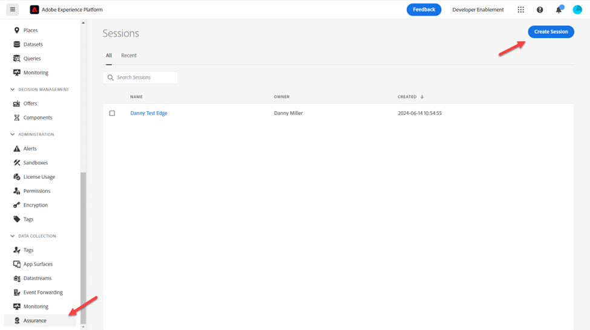
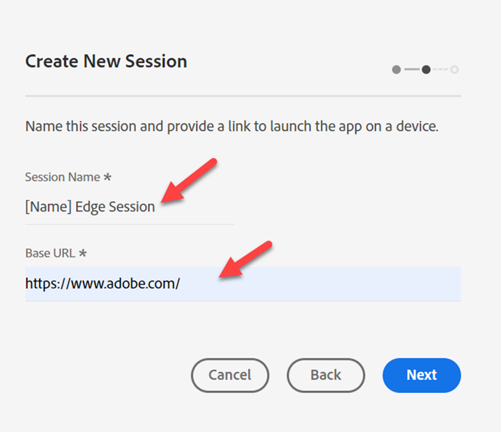
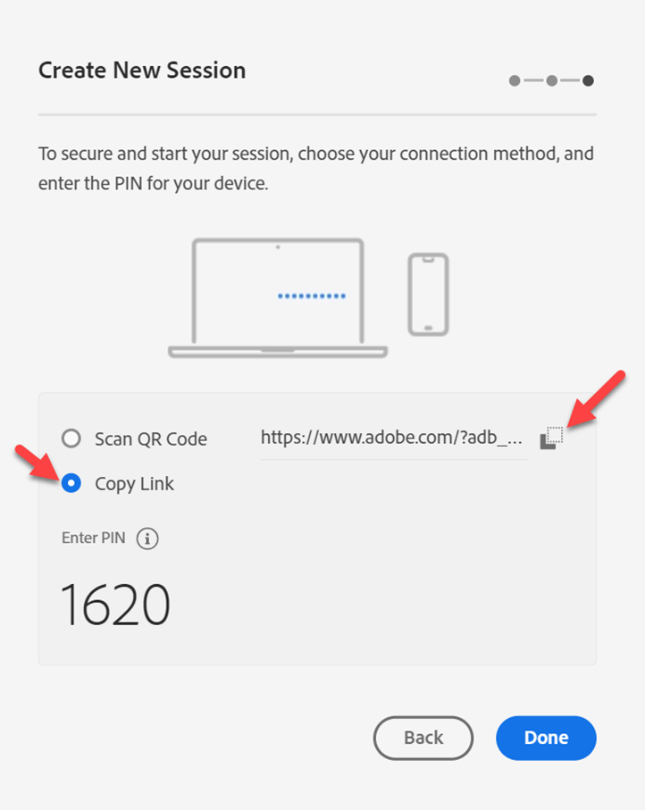
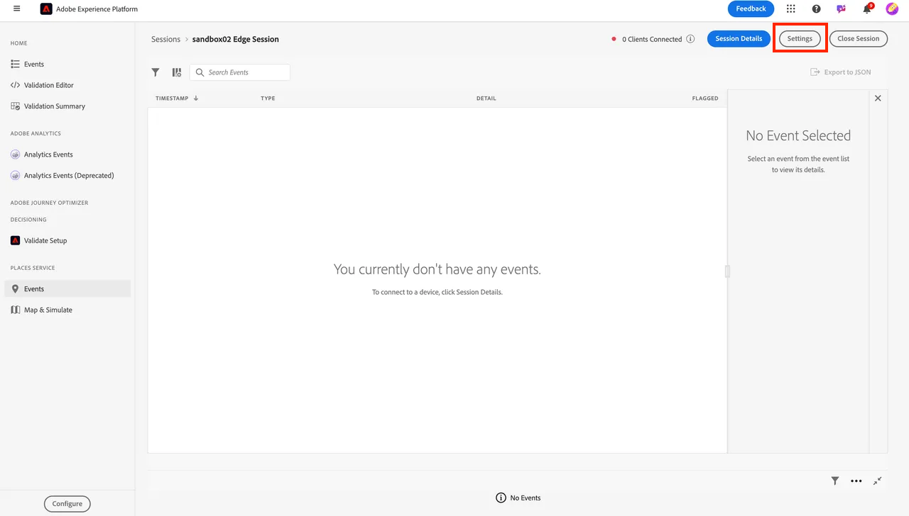
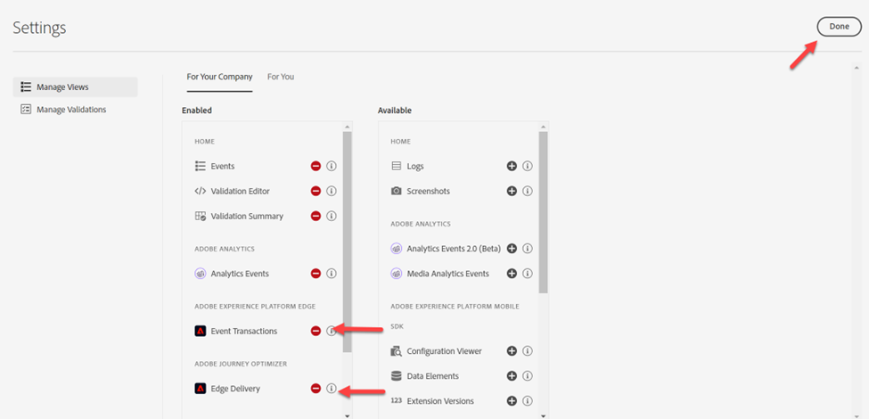
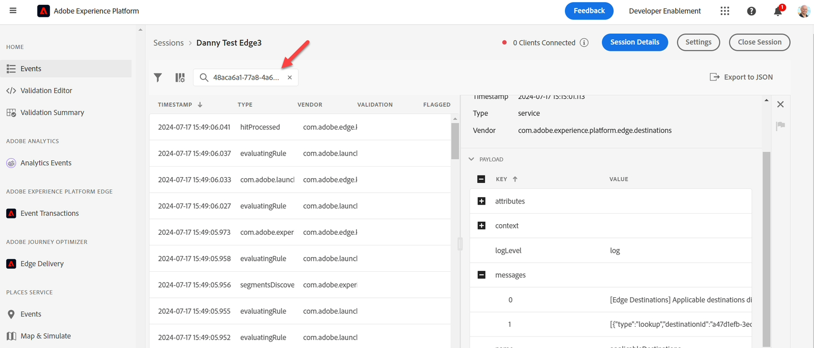
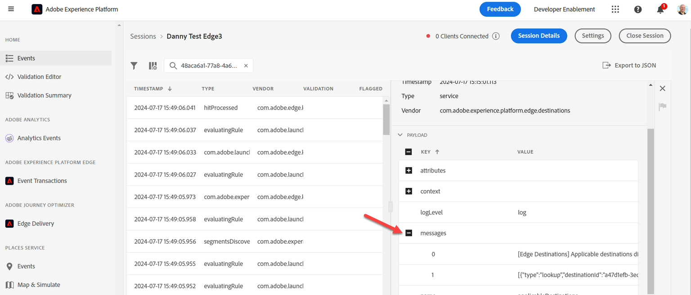
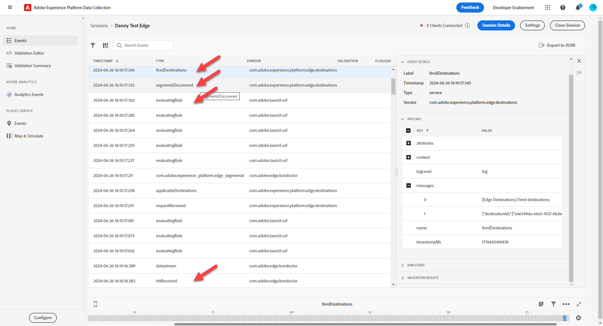

# Überwachen des Ereignisses

## Zu Assurance navigieren

[Adobe Experience Platform Assurance](https://experienceleague.adobe.com/de/docs/experience-platform/assurance/home) ist ein Produkt von Adobe Experience Cloud, mit dem Sie die Datenerfassung in Adobe Experience Platform Edge untersuchen, testen, simulieren und validieren können.

1. Gehen Sie zu Adobe Experience Platform > Assurance > Sitzung erstellen .

2. Klicken Sie auf die Schaltfläche **Starten**.

## Konfigurieren einer Sitzung

1. Name —> \[Sandbox] Edge-Sitzung
1. URL —> https\://www\.adobe.com
   - Beachten Sie, dass diese URL durch die tatsächliche Website Ihres Kunden ersetzt wird
1. Klicken Sie auf die Schaltfläche Weiter

4. Kopieren Sie den Link an eine Stelle, auf die Sie später verweisen können.

5. Klicken Sie auf **Fertig**-Schaltfläche

6. Navigieren Sie zu **Einstellungen**

7. Aktivieren Sie **Ereignistransaktionen** und **Edge Delivery**, indem Sie auf die Schaltfläche **+** und dann **Fertig**

## Postman öffnen

Wechseln Sie zu Postman -> Web-Ereignis-Edge erstellen (keine Authentifizierung) -> Kopfzeilen

1. Fügen Sie den Headern **x-adobe-aep-validation**-token mit dem oben aus Assurance kopierten Link hinzu. Erfassen Sie **nur die ID**-Wert nach dem = in der Relation, die Sie aus Assurance kopiert haben. z. B. [https://www.adobe.com/?adb\_validation\_sessionid=](https://www.adobe.com/?adb_validation_sessionid=efa4a9ed-02d8-4647-80fa-f01a5be273d0)[`efa4a9ed-02d8-4647-80fa-f01a5be273d0`](https://www.adobe.com/?adb_validation_sessionid=efa4a9ed-02d8-4647-80fa-f01a5be273d0)
1. Wir würden nur den [`efa4a9ed-02d8-4647-80fa-f01a5be273d0`](https://www.adobe.com/?adb_validation_sessionid=efa4a9ed-02d8-4647-80fa-f01a5be273d0)-Wert verwenden, nicht die vollständige URL

3. Speichern und führen Sie in Postman die Anfrage **Web-Ereignis-Edge erstellen (keine Authentifizierung)** aus

## Assurance-Protokolle anzeigen

Kehren Sie zu Assurance zurück. Dort sollten Sie eine Reihe von Ereignissen sehen. Filtern Sie nach nur relevanten Ereignistypen, indem Sie Ihre Datenstrom-ID in die Suche einfügen

Wählen Sie ein Ereignis aus und öffnen Sie bei Bedarf alle Nachrichten in der rechten Leiste.

Ereignistypen, nach denen gesucht werden soll:

- hitReceived (zeigt die Payload an, die von der Edge empfangen wurde)
- EvaluatingRule (wenn Sie SSF einrichten, zeigt die ausgewerteten Regeln an)
- firedestinations (Ziele, an die das gesendet wurde)
- Segmente gefunden (konnte er für beliebige Edge-Segmente qualifiziert werden)
- com.adobe.experience\_platform.edge\_segmentation/response (mit welchen Segmenten hat sie geantwortet)

Erkunden Sie diese und sehen Sie, wie die einzelnen Schritte von Assurance interpretiert werden.
