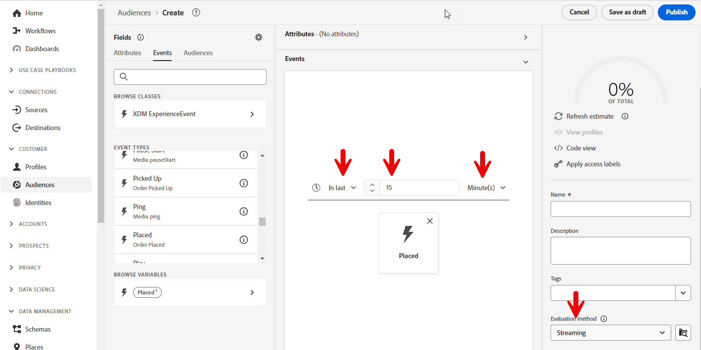
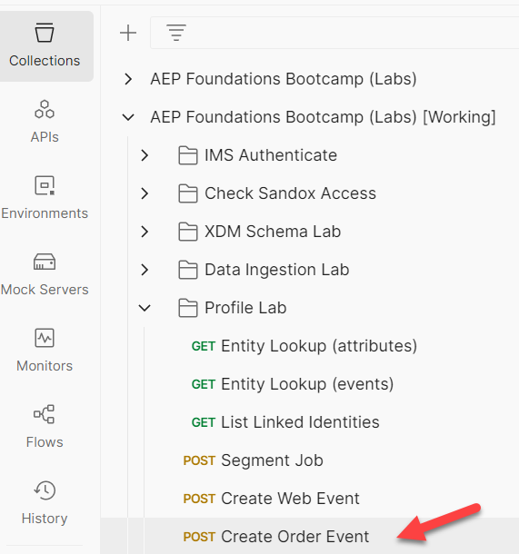
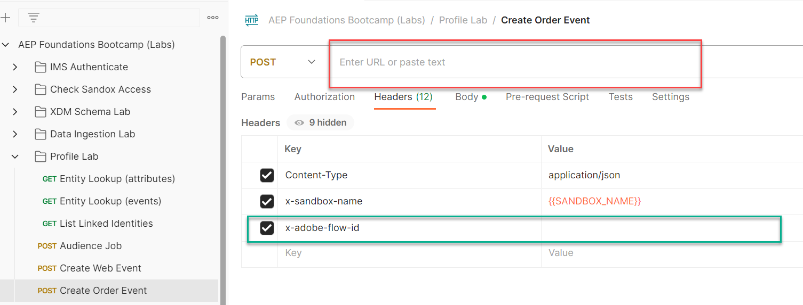

# Auftragsereignis an Hub senden

## Streaming zu Hub und Edge im Vergleich

Im #1 haben wir ein Ereignis an die Edge gesendet.  Es gibt einige Anwendungsfälle, in denen wir möglicherweise ein Back-End-System haben, das in einem Ereignis streamen möchte, es jedoch nicht an Edge senden muss.  In diesem Labor wird gezeigt, wie dies funktioniert, indem ein Order-Ereignis an den Hub gestreamt wird.

## Erstellen Sie ein Auftragssegment (falls noch nicht geschehen).

Klicken Sie in der linken Leiste auf Audience und dann oben rechts auf die Schaltfläche Audience erstellen .


Suchen Sie die Karte Ereignistyp „Bestellung platziert“ und ziehen Sie sie auf die Arbeitsfläche.


## Ereignisregeln aktualisieren

Nehmen Sie die folgenden Änderungen an den Ereignisregeln vor (möglicherweise müssen Sie das Ereignis erweitern, um es anzuzeigen)

1. Letzte
1. 15
1. Minuten
1. Änderung an Streaming-Auswertung

Speichern unter **Ereignis-Streaming bestellen (innerhalb von 15 Minuten)**




## Für Ziel aktivieren

Öffnen Sie die soeben erstellte Zielgruppe, falls sie geschlossen ist.

Klicken Sie auf Für Ziel aktivieren


### Ziel

Wählen Sie das zuvor erstellte Streaming-Ziel aus (Streaming DEP Webhook)


### Mapping

Lassen Sie die Zuordnung unverändert und klicken Sie auf „Weiter“


Klicken Sie auf Beenden

## Postman öffnen

Starten Sie Postman auf Ihrem Computer und navigieren Sie zum folgenden API-Aufruf:

1. **Postman linke Seitenleiste** —> `Collections`
1. **collection** —> `AEP Foundations Bootcamps (labs)`
1. **Ordner** —> Profile Lab
1. **API-Anfrage** —> `Create Order Event`




## API-Anfrage ändern

Um eine Beispiel-API-Anfrage zu erstellen, müssen Sie die folgenden Teile im Hauptteil der API-Anfrage ausfüllen.

Erfassen Sie zunächst die folgenden Werte:

## Konto-Streaming-Endpunkt suchen

1. Navigieren Sie **linken Leiste zu** Quellen“ und klicken Sie dann **oberen Navigationsbereich auf** Konten“
1. Suchen Sie nach **dep: HTTP API \[raw]** markieren Sie die Zeile und kopieren und speichern Sie den Wert des **Streaming-Endpunkts** an einen anderen Ort, auf den Sie später verweisen können

Konto  und seinen Streaming-Endpunkt kopieren&rbrack;(assets/send-order-event-to-hub-http-api-raw-streaming-endpoint.png „dep: HTTP API \[raw]„)

## Datenfluss-ID suchen

1. Suchen Sie den Datensatz für **dep: Orders (Stream)** und klicken Sie auf den Link Datenflüsse .
1. Kopieren Sie in der rechten Leiste die Werte **Datenfluss-ID** an eine Stelle, auf die Sie später verweisen können

>[!NOTE]
>
>Klicken Sie in ein leeres Feld in der Zeile.  Klicken Sie NICHT auf die blauen Links!

")

## Endgültige API-Anfrage erstellen

Kopieren Sie die in den vorherigen Schritten gespeicherten Werte an die unten hervorgehobenen Stellen.

- **red** —> `Streaming Endpoint URL`
- **grün** —> `Dataflow ID`

Ihre endgültige API-Anfrage sollte dann wie folgt aussehen

>[!CAUTION]
>
>NOCH NICHT AUSFÜHREN!




## Ausführen der API

1. Speichern Sie den API-Aufruf, indem Sie auf die Schaltfläche **Speichern** klicken
1. Ausführen einer Anfrage durch Klicken auf die Schaltfläche **Senden**

Ein erfolgreicher Aufruf sollte zu der folgenden Antwort führen…


## Validieren

1. Navigieren Sie zu Ihrem Profil und suchen Sie Ihr Profil, um zu sehen, ob das Ereignis in das Profil aufgenommen wurde.  Es sollte in Sekunden angezeigt werden.
   1. Profil mithilfe der E-Mail in der Reihenfolge nachschlagen
1. Überprüfen Sie, ob sich das Profil für die Segmente qualifiziert hat (dies kann einige Minuten dauern). Sie sollte in Sekunden bis Minuten angezeigt werden.
   1. Ereignis-Streaming bestellen (innerhalb von 15 Minuten)
1. Überprüfen Sie Ihren Webhook, um festzustellen, ob das Ziel den Webhook über ein Segment „realized“ benachrichtigt hat.  Es sollte in 5-10 Minuten angezeigt werden.
1. Nach 15-30 Minuten können Sie Ihren Datensatz sogar mit den folgenden Elementen überprüfen:
   1. Ändern Sie den unten stehenden Tabellennamen in den aus Ihrer Sandbox.  Um ihn zu finden, gehen Sie zu Ihrer Datensatzliste und filtern Sie nach &quot;`dest`&quot;, öffnen Sie den Datensatz und kopieren Sie den Tabellennamen in die rechte Leiste.

```sql
SELECT * FROM profile_export_for_destination_merge_policy_xxx
WHERE extSourceSystemAudit.LASTREFERENCEDDATE >= CURRENT_DATE
AND identitymap['email'][0].ID in ('depche.mode@dep.com')
ORDER BY extSourceSystemAudit.LASTREFERENCEDDATE DESC
LIMIT 10
```
