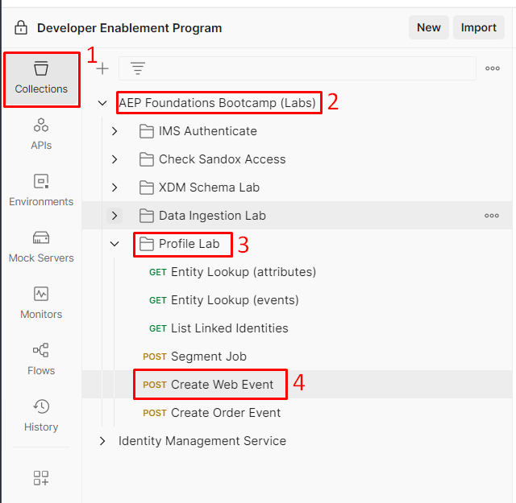
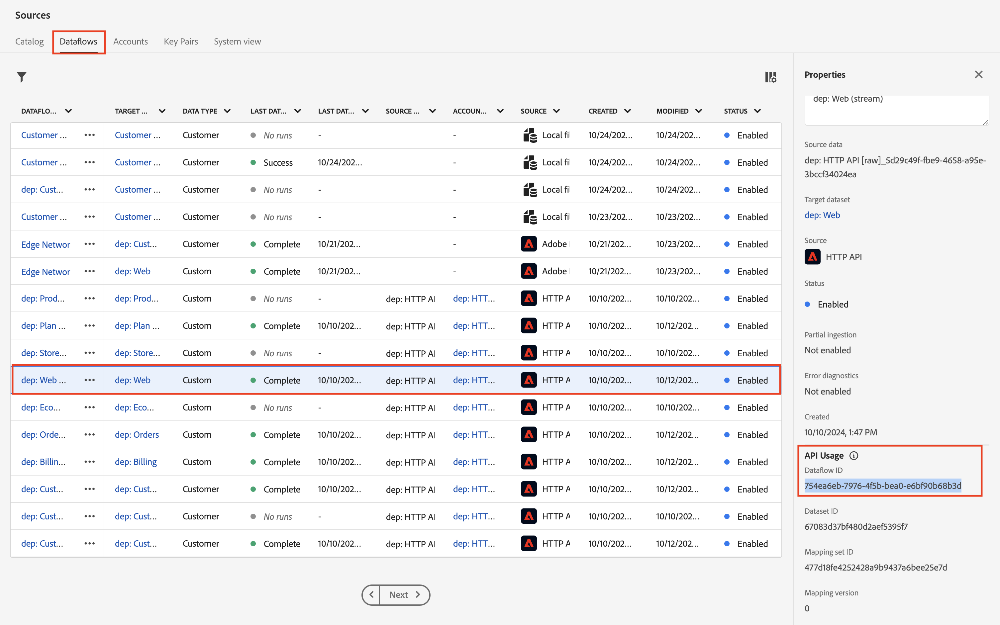
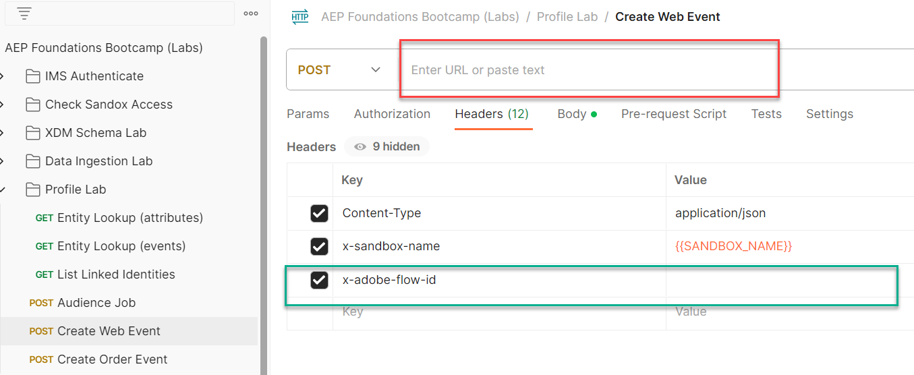

# Web-Ereignis an Hub senden

>[!IMPORTANT]
>
>Schließen Sie [die Postman-Einrichtung ab](../../postman-setup/postman-installation.md) bevor Sie dieses Labor starten. Sie benötigen auch Zugriff auf [webhook.site](https://webhook.site/) für den zugehörigen [Aktivierungs-Workflow für externe Ziele](../use-case-1-acquisition/configure-destinations/setup-streaming-destination.md).

## Postman öffnen

Starten Sie Postman auf Ihrem Computer und navigieren Sie zum folgenden API-Aufruf:

1. **Postman linke Seitenleiste** —> `Collections`
1. **collection** —> `AEP Foundations Bootcamps (labs)`
1. **Ordner** —> Profile Lab
1. **API-Anfrage** —> `Create Web Event`




## API-Anfrage ändern

Um eine Beispiel-API-Anfrage zu erstellen, müssen Sie die folgenden Teile im Hauptteil der API-Anfrage ausfüllen.

Erfassen Sie zunächst die folgenden Werte:


## Konto-Streaming-Endpunkt suchen

1. Navigieren Sie **linken Leiste zu** Quellen“ und klicken Sie dann **oberen Navigationsbereich auf** Konten“
1. Suchen Sie nach **dep: HTTP API \[raw]** markieren Sie die Zeile und kopieren und speichern Sie den Wert des **Streaming-Endpunkts** an einen anderen Ort, auf den Sie später verweisen können

Konto  und seinen Streaming-Endpunkt kopieren](assets/send-order-event-to-hub-http-api-raw-streaming-endpoint.png „dep: HTTP API \[raw]„)

## Web-Datenfluss-ID suchen

1. Klicken Sie in das **HTTP-API \[raw]** Konto
1. Suchen Sie die Datenflusszeile mit dem Namen **dep: Web (Stream)**
1. Kopieren Sie in der rechten Leiste die Werte **Datenfluss-ID** an eine Stelle, auf die Sie später verweisen können

>[!NOTE]
>
>Klicken Sie in ein leeres Feld in der Zeile.  Klicken Sie NICHT auf die blauen Links!



## Endgültige API-Anfrage erstellen

Kopieren Sie die in den vorherigen Schritten gespeicherten Werte an die unten hervorgehobenen Stellen.

- **red** —> `Streaming Endpoint URL`
- **grün** —> `Dataflow ID`

Ihre endgültige API-Anfrage sollte dann wie folgt aussehen

>[!CAUTION]
>
>NOCH NICHT AUSFÜHREN!



## Ausführen der API

1. Speichern Sie den API-Aufruf, indem Sie auf die Schaltfläche **Speichern** klicken
1. Ausführen einer Anfrage durch Klicken auf die Schaltfläche **Senden**

Ein erfolgreicher Aufruf sollte zu der folgenden Antwort führen…


## Validieren

1. Navigieren Sie zu Ihrem Profil und suchen Sie Ihr Profil, um zu sehen, ob das Ereignis in das Profil aufgenommen wurde.  Es sollte in Sekunden angezeigt werden.
   1. Verwenden Sie die E-Mail in Ihrem Aufruf, um das Profil zu suchen
1. Je nachdem, wie lange es her ist, seit Sie zuletzt ein Ereignis gesendet haben, sind Sie möglicherweise nicht für neue Segmente qualifiziert. Andernfalls können Sie diese oder andere sehen:
   1. Beliebige Event Edge (innerhalb von 15 Minuten)
      1. Denken Sie daran: Alle mit einer Edge-Auswertung gespeicherten Zielgruppen werden auch im Hub ausgewertet, wenn Streaming-Daten eingehen
   2. Tiefe: Beliebiges Ereignis-Streaming (innerhalb einer Stunde)
1. Dieses Hub-Ereignis wird nicht an Ihren Webhook gesendet.
   1. Die Ereignisweiterleitung verarbeitet Ereignisse, die an den Edge gesendet werden, nicht Ereignisse, die direkt an den Hub gesendet werden. Verwenden Sie den [Aktivierungs-Workflow für externe Ziele](../use-case-1-acquisition/configure-destinations/setup-streaming-destination.md), um ein Ereignis auf webhook.site zu erfassen.
1. Nach mindestens 30 Minuten können Sie Ihren Datensatz sogar mit den folgenden Elementen überprüfen:
   1. Ändern Sie den unten stehenden Tabellennamen in den aus Ihrer Sandbox.  Um ihn zu finden, gehen Sie zu Ihrer Datensatzliste und filtern Sie nach &quot;`dest`&quot;, öffnen Sie den Datensatz und kopieren Sie den Tabellennamen in die rechte Leiste.

```sql
SELECT * FROM profile_export_for_destination_merge_policy_xxx
WHERE extSourceSystemAudit.LASTREFERENCEDDATE >= CURRENT_DATE
AND identitymap['email'][0].ID in ('depche.mode@dep.com')
ORDER BY extSourceSystemAudit.LASTREFERENCEDDATE DESC
LIMIT 10
```
