# Zielgruppen-#1 erstellen

## Laborziel

Erstellen Sie eine Zielgruppe, die nur Profile findet, die eine Bestellung für eine iPhone 14 aufgegeben haben

## Aufschlüsselung der Zielgruppe

Erstellen Sie zunächst Ihre erste Audience. Es besteht aus vielen Teilen, die wir einbauen müssen. Klicken Sie in der linken Leiste auf Audience und dann oben rechts auf die Schaltfläche Audience erstellen .

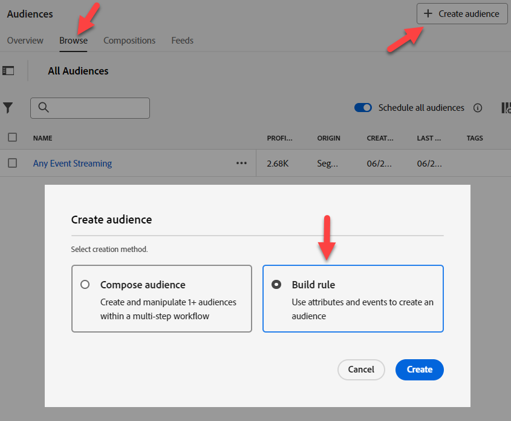

Wir werden diesen Anwendungsfall in Teile aufteilen und sie mit mehreren Zielgruppen lösen. Der Grund dafür ist, dass wir versuchen, dies zu einem Streaming zu machen, und zwei Dinge verhindern dies:

1. Die Ausschlussklausel „Für iPhone 14/Pixel 7 existiert keine Reihenfolge“
1. Die Ausschlussklausel „Kein aktives iPhone 14/Pixel 7“. Wir werden am Ende die Auswirkungen darauf noch einmal untersuchen.

## Teil 1: Erkennung

Der erste Teil unserer Audience besteht darin, nach „Für ein iPhone 14 gibt es keine Bestellung“ zu suchen. Stellen Sie sich vor, wir sind ein neuer Marketing-Experte für AEP und haben das Schema nicht entworfen. Suchen Sie in der Registerkarte „Ereignisse“ in der linken Leiste nach „Bestellung“

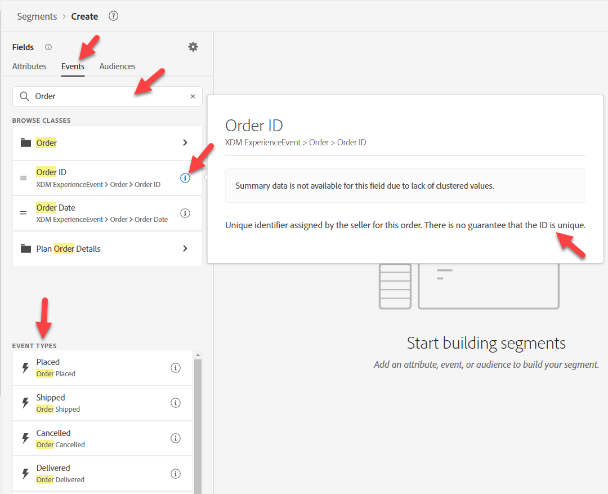

Es gibt viele Objekte, die mit einer Bestellung in Verbindung stehen

- Attribute: z. B. Auftrags-ID, Bestelldatum
- Ordner: z. B. Bestellung, Details zur Planbestellung
- Ereignistypen: z. B. aufgegebene Bestellung, versendete Bestellung usw.

>[!NOTE]
>
>&#x200B;* Für die Bestellung „Ordner“ ist kein „i“ vorhanden. Auch wenn unsere Beschreibung ausgefüllt wurde, ist sie dort nicht vorhanden, und dies kann für Ihren Marketer verwirrend sein, da er versuchen kann, sie zu verwenden, oder wissen möchte, was sie ist.
>&#x200B;* Das „i“ für Ereigniskarten wiederholt nur den Typ, da der Ereignistyp ein Feld ist, nicht viele.
>&#x200B;* Zusammenfassungsdaten werden nur angezeigt, wenn der Wert in mehr als 2 % der zusammengeführten Profile vorhanden ist. Dies führt auch zu einer automatischen Vervollständigung beim Filtern nach einer Zeichenfolge.

Verwenden Sie die Karte Ereignistyp „Reihenfolge“ und ziehen Sie sie auf die Arbeitsfläche.

&#x200B;> [!TIP]
>
>**optional:**
>
>Jedes Ereignis hat einen Ereignistyp.  Wir können nach Ereignistyp filtern, anstatt eine Ereignistypkarte zu verwenden.
>
>Denken Sie daran, wie wir den Ereignistyp Bestellschema erweitert haben. Wir haben die Werte hinzugefügt, die wir jetzt in der Dropdown-Liste sehen.  Die gleichen Werte werden als Ereignistyp-Karten angezeigt
>
>Wenn Sie möchten, können Sie einen der beiden Ansätze verwenden.
>
>Wechseln Sie in einer neuen Zielgruppe zum XDM-Erlebnisereignis und ziehen Sie den Ereignistyp hinein.
>
>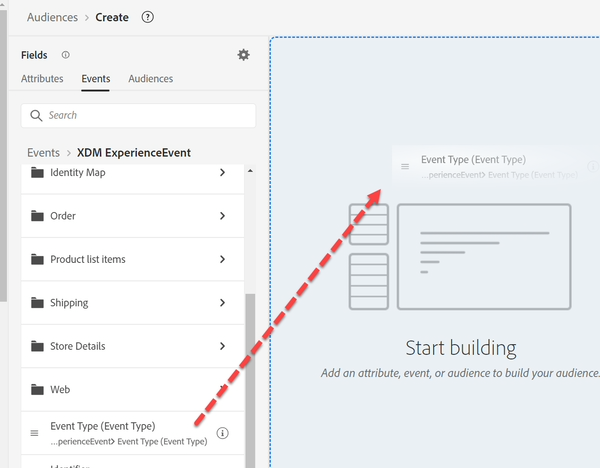
>
>Das Filtern mit Ereignistypkarten entspricht dem Filtern mit dem Feld Ereignistyp .
>
>
>
>Vorteile der Verwendung von Ereignistyp-Karten:
>
>- Es zeigt den Namen des Ereignistyps in der Zielgruppe an, wodurch er einfach und schnell verständlich ist
>- Es ist schnell und erfordert weniger Schritte
>
>Vorteile der Verwendung des Ereignistyp-Felds:
>
>- Sie ermöglicht die Auswahl mehrerer Ereignistypen (z. B. „Bestellung aufgenommen“ oder „Bestellung zugestellt„), wenn wir mehrere Typen in ein Kriterium aufnehmen möchten
>- Unterstützt die Groß-/Kleinschreibung

>[!NOTE]
>
>Es gibt einige Optionen für „Keine Bestellung vorhanden“.  Wir wählen einen einfachen Ansatz, aber hier sind Dinge, über die man in der realen Welt nachdenken sollte:
>
>- Bestellung aufgegeben, aber abgeholt oder versendet
>- Bestellung aufgegeben, aber storniert
>- Mehrere Bestellungen, aber eine storniert

Unser Marketer weiß aus seiner Schulung, dass mehr als eine Datenquelle geladen wurde:

- Bestellungen (vom Bestellsystem über alle Kanäle erfasst)
- Web (Client-seitiges Tracking dessen, worauf Personen klicken, einschließlich der auf der Website aufgegebenen Bestellungen)
- eCommerce (vom eCommerce-System auf der Website erfasst)

Welche Quelle sollten wir verwenden? Sie alle stellen logischerweise das gleiche Ereignis „Bestellung aufgegeben“ dar. Aber sie werden physisch in verschiedenen Systemen gespeichert. Woher wissen wir, welche zu verwenden sind? Die beste Möglichkeit besteht darin, sich die Beschreibungen der einzelnen Schemaobjekte und Felder anzusehen, um mehr darüber zu erfahren.

>[!NOTE]
>
>Beschreibungen sollten relevante Informationen enthalten, die bei diesen Entscheidungen hilfreich sind, z. B.:
>
>1. Woher kommen die Daten?
>2. Was enthält oder nicht?
>3. Wie hoch ist die Latenz?
>4. Wurde irgendein System als „Quelle der Wahrheit“ bezeichnet?
>5. Gibt es irgendwelche Nuancen, die wir berücksichtigen müssen?

Für uns möchten wir die aufgegebene Bestellung verwenden, aber denken Sie daran, dass wir je nach Anwendungsfall die folgenden Anforderungen hätten haben können, die beeinflussen können, aus welcher Quelle wir abrufen:

- Onsite-Käufe in den letzten 30 Minuten
- Aufgegebene und nicht stornierte Bestellungen
- Bestellungen werden innerhalb von 1 Tag nach ihrer Fertigstellung abgeholt

>[!TIP]
>
>Optionale Gedankenübung, stellen Sie sich vor, wir haben heute auf unserer Website eine einzige Bestellung aufgegeben (denken Sie daran, dass die Bestellung von allen drei Systemen aufgezeichnet wird):
>
>1. Wie viele Veranstaltungen würden für heute aufgegebene Bestellungen gezählt?
>2. Wie viele Bestellungen wurden aus Kundensicht aufgegeben?
>3. Wie viele Ereignisse würden gezählt werden, wenn wir nach Versandart = Übernachtung filtern würden (vorausgesetzt, sie haben dies gewählt)?
>4. Wie sollten wir dies angehen (Zielgruppe oder Datenmodell)?

Nachdem wir einige Analysen durchgeführt haben, werden wir mit dem `Orders Event of Event Type=”order. placed”` gehen. Wir möchten sicherstellen, dass unsere Zielgruppe die Quelle der Wahrheit zum Nachteil der Geschwindigkeit verwendet (die Web-Daten werden mit jedem Klick in gestreamt, während die Bestellung eine Verarbeitung durchläuft, bevor sie gesendet wird). Darüber hinaus möchten wir in Zukunft diejenigen ausschließen, die storniert haben, und das könnte über jeden Kanal geschehen.

## Teil 2: Aufbauen der Zielgruppe

Vollständiges Schema anzeigen aktivieren

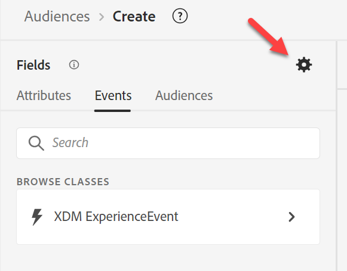

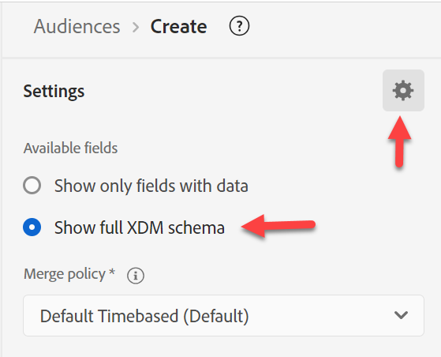

Bauen Sie auf dem auf, was Sie begonnen haben.  Klicken Sie auf der linken Leiste auf die Karte Platziert und **Sie dann in der** auf „Platziert“ und gehen Sie folgendermaßen vor:

XDM-Erlebnisereignis -> Ordner „Produktlistenelemente“

>[!WARNING]
>
>Eine häufige Verwirrung für Ihren Marketer wäre die Verwendung des Geräts anstelle des Produkts hier (da wir nach iPhone filtern werden). Noch ein Grund für gute Beschreibungen.

Wir suchen nach etwas, nach dem wir filtern können, das möglicherweise iPhone hat. Beachten Sie, dass wir drei Optionen haben

- Name
- Produkt
- SKU

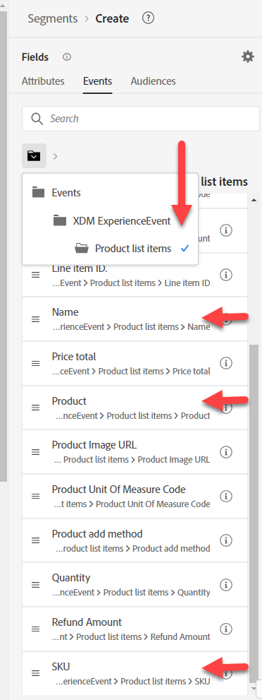

Sie alle könnten gute Kandidaten sein, aber wir wissen es nicht.  Klicken Sie auf das „i“, um weitere Details zu jedem anzuzeigen.

>[!NOTE]
>
>Sie können die Beschreibungen für alle vorkonfigurierten Felder ändern. Aktualisieren Sie die nicht verwendeten Felder oder blenden Sie sie sogar aus, um die Verwirrung Ihrer Benutzer zu verringern. Diese vorkonfigurierten Beschreibungen sind in Ihrer Branche/Ihrem Unternehmen möglicherweise nicht sinnvoll.
>
>Eine gute Beschreibung kann sogar Beispiele enthalten
>
>- Beschreibung des Namens = Der Anzeigename für das Produkt, wie er dem Benutzer für diese Produktansicht präsentiert wird. Beispiel: iPhone 14, Pixel 7
>- Artikelbeschreibung = Lagerhaltungseinheit (SKU), die eindeutige Kennung für ein vom Anbieter definiertes Produkt. Beispiel: iP14, Pix7
>- Produktbeschreibung = Die XDM-Kennung des Produkts selbst. Beispiel: 123, 456

„Nur Felder mit Daten anzeigen“ aktivieren

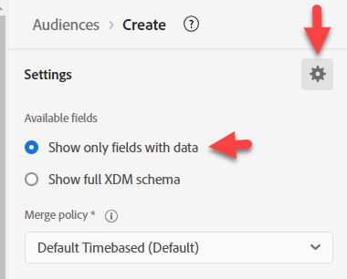

>[!NOTE]
>
>**Observable-Schema**
>
>Dies ist nur, was Felder Daten enthalten.  Dies ist eine Möglichkeit für Apps, die auf AEP basieren, Felder, die effektiv nutzlos sind, von der Verwendung auszuschließen.
>
>**Vollständiges XDM-Schema**
>
>Dies sind alle Felder im Vereinigungsschema, unabhängig davon, ob Daten in sie geladen wurden.

Wenn Sie „Nur Felder mit Daten anzeigen“ aktivieren, werden die Felder, die Sie verwenden möchten, entfernt.

Drilldown zu XDM ExperienceEvent > Produktlistenelemente > Tiefe > Modell

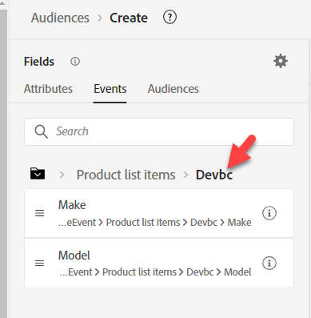

Das Modell sieht so aus, hat aber keine Beschreibungen.

Ziehen Sie sie auf die Karte Platziertes Ereignis .

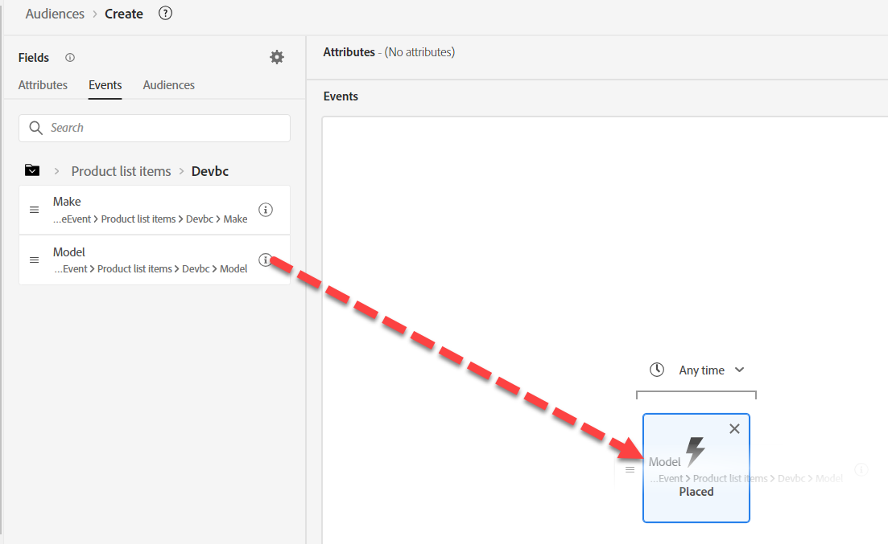

IPhone 14 hinzufügen

Ändern Sie über dem platzierten Ereignis „Immer“ in „Heute“

>[!NOTE]
>
>Wir filtern nach heute, da wir uns nicht um Bestellungen kümmern, die vor einer Woche, einem Monat oder einem Jahr aufgegeben wurden.  Im nächsten Abschnitt wird auch ein längerer Lookback behandelt.  Irgendwann wird aus der Bestellung &quot;*Owned*, und wir werden ein Segment dafür erstellen.

Beschreibung angeben

Auswertungsmethode in &quot;**&quot;**

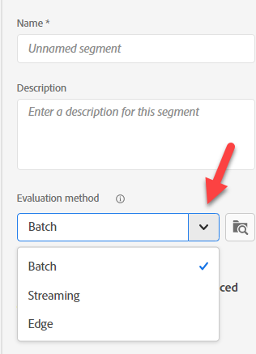

**Zielgruppe speichern** als &quot;*Bestellung iPhone 14*&quot;

Klicken Sie auf die blaue Schaltfläche **Zielgruppe aktivieren** zum Ziel

Wählen Sie das **Streaming-DEP-Webhook**-Ziel aus und klicken Sie auf Weiter

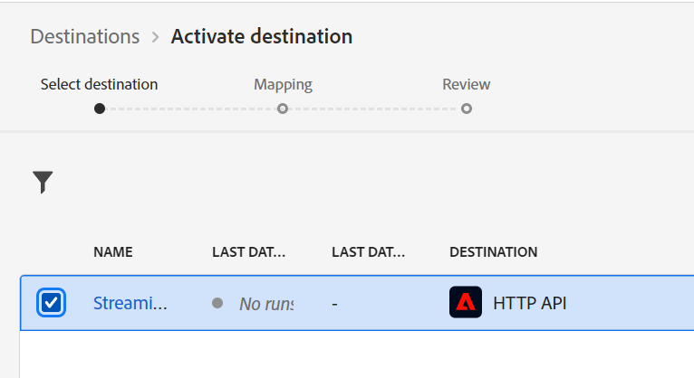

Ändern Sie die Zuordnung nicht und klicken Sie auf Weiter und dann auf Beenden

>[!NOTE]
>
>**Container**
>
>Beachten Sie, dass beim Filtern nach Namen in der Produktliste einige Container automatisch hinzugefügt wurden. Der Grund dafür ist, dass Produktlistenelemente vom Datentyp Array sind. Beim Filtern eines Arrays wird ein Container erstellt (in unserem Beispiel als Produktlistenelemente bezeichnet).
>
>
>
>
>
>Container sind eine Möglichkeit, auf eine Ereignisvariable oder ein Array-Element zu verweisen. In diesem Blog können Sie mehr über die Auswirkungen erfahren, aber der Einfachheit halber können Sie damit angeben, ob ein einzelnes Element im Array beide Bedingungen erfüllt oder die Bedingung auf zwei Elemente verteilt werden kann.
>
>[https://experienceleaguecommunities.adobe.com/t5/adobe-experience-platform-blogs/how-exactly-do-containers-work-in-aep-segmentation-a-deeper-look/ba-p/458780](https://experienceleaguecommunities.adobe.com/t5/adobe-experience-platform-blogs/how-exactly-do-containers-work-in-aep-segmentation-a-deeper-look/ba-p/458780)

>[!WARNING]
>
>**Zeitfilter**
>
>Obwohl in den Anforderungen nichts angegeben ist, hat diese Zielgruppe ein Problem, das wir zurückgehen und mit dem Unternehmen klären sollten.
>
>Für die Anforderungen gab es keinen Zeitfilter. Das bedeutet, dass jemand, der vor einem oder fünf Jahren eine Bestellung aufgab, Anspruch darauf hätte. Versuchen Sie immer, eine Methode einzubinden, um sicherzustellen, dass Sie nicht in diese Falle tappen, oder müssen Sie Ihre Zielgruppen immer aktualisieren, wenn die neue Version herauskommt.
>
>Wenn wir den hinzugefügten Zeitfilter ändern, wie weit können wir zurückgehen, bevor ein Edge-Segment zu Streaming oder sogar Batch wird?

>[!CAUTION]
>
>**Ist das Produkt an zwei Orten gelagert?**
>
>Beachten Sie die andere Pfadbenennungskonvention und -beschreibung. Mit der vorherigen Zielgruppe vergleichen
>
>- Individuelles XDM-Profil > Tiefe > Aktive Produkte > Produkt-ID-Eigenschaften > Produktname
>  - Beschreibung: Name des Produkts.
>- XDM ExperienceEvent > Produktlistenelemente > Dep > Modell
>  - Beschreibung: Der Anzeigename für das Produkt, wie er dem Benutzer für diese Produktansicht präsentiert wird.
>
>Wenn wir denselben Wert aus verschiedenen Gründen und zu verschiedenen Zwecken an verschiedenen Orten speichern, müssen wir die Auswirkungen auf unsere Benutzer durchdenken und überlegen, wie das Profil diese zusammenführen wird (und wie eine Zusammenführungsrichtlinie diesen Konflikt bei Bedarf lösen wird).
>
>Unsere aktuellen Beschreibungen erschweren es dem Marketing-Experten, zu wissen, welche verwendet werden sollen
