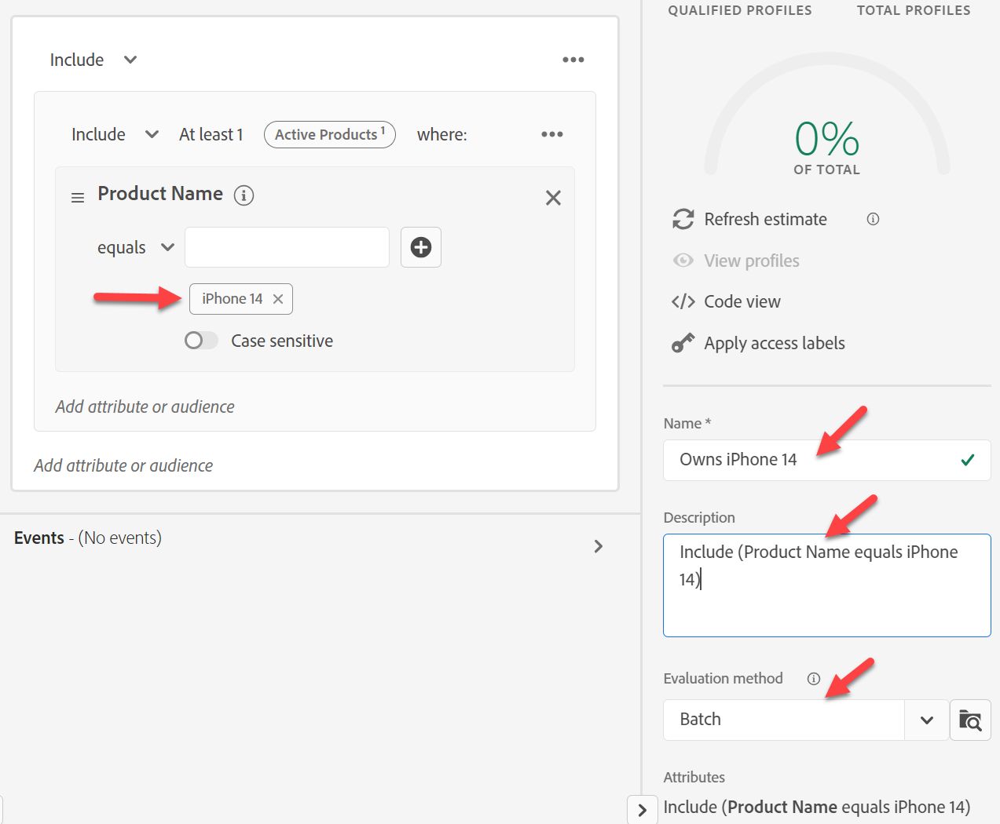
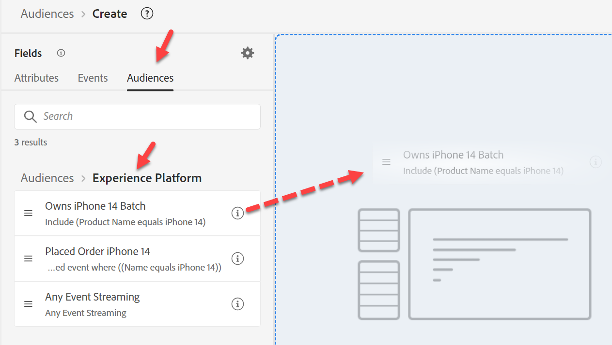
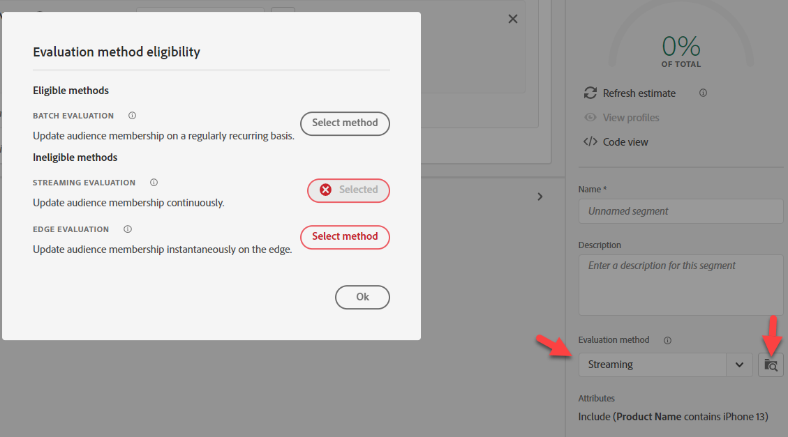
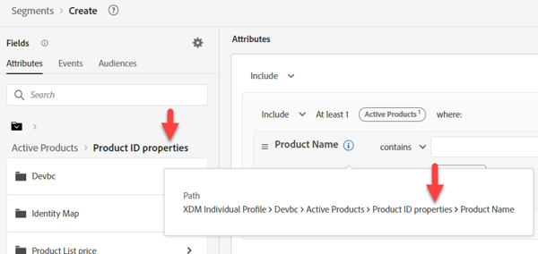
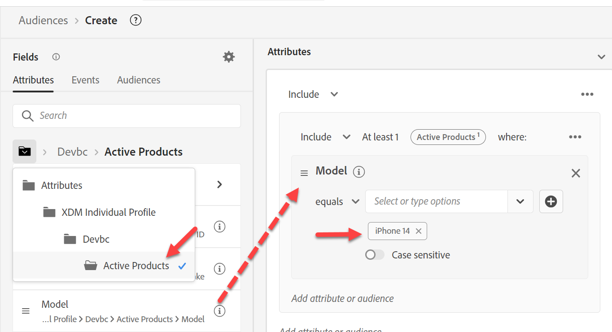

# Zielgruppen-#2 erstellen

## Laborziel

Erstellen Sie eine Zielgruppe, die alle Profile findet, die keine aktive Zeile haben, die eine iPhone 14 ist

## Analyseaufgaben

Diese Zielgruppe sind „diejenigen, die keine aktive iPhone 14 haben“

- Woher wissen wir, dass jemand „keinen aktiven iPhone 14 hat“?  Ideen:
  - Einschließen von Personen, die ein iPhone 14 erworben haben
  - Einschließen von Personen, die Rechnungsdaten für eine iPhone 14 haben
  - Einschließen von Personen mit Web-Daten aus iPhone 14
  - Noch andere?

Letzten Endes läuft dies auf eine geschäftliche Entscheidung darüber hinaus, an wen sie vermarkten möchten. In unserem Fall hat das Unternehmen dies als so wichtig erachtet, dass wir ein Schema erstellt haben, das aktive Linien definiert. Verwenden Sie dies also.

>[!NOTE]
>
>Da Active Lines ein Array ist, das in einem Profil gespeichert ist, wird hier der Kontoinhaber bzw. jeder einzelne Besitzer des Geräts ausgewählt. Stellen Sie sicher, dass das Marketing-Team dies weiß und möchte. Andernfalls könnten Sie einen anderen Ansatz wünschen.

## Neue Zielgruppe erstellen (Besitzt iPhone 14)

1. Navigieren Sie auf der Registerkarte Attribute in der linken Leiste nach unten zu Produktname (oder suchen Sie danach).
   - Individuelles XDM-Profil —> \&lt;Mandantenname> —> Aktive Produkte —> Produkt-ID-Eigenschaften —> Produktname
1. Produktname auf die Arbeitsfläche ziehen

## Zielgruppe speichern

1. Typ iPhone 14 (als Batch-Auswertung beibehalten)
1. Beschreibung angeben
1. Zielgruppe als &quot;*Besitzt iPhone 14*&quot; speichern
   - Gehen Sie für Pixel 7 die gleichen Schritte durch (wenn Sie Zeit haben).

>[!TIP]
>
>**Side dachte: „Könnten wir nicht einfach nach den Ereignissen filtern, anstatt ein anderes Feld im Profilspeicher zu haben?“?**
>
>Ja, das könnten wir, aber wir müssen uns mit einigen geschäftlichen und technischen Nuancen befassen, die die Zielgruppen komplex machen und einige Herausforderungen mit sich bringen:
>
>1. Wenn wir das Kaufereignis verwenden:
>   1. Was wäre, wenn sie nicht bei uns eingekauft hätten, sondern eine aktive Linie hätten?
>   1. Was passiert, wenn sie vor 2 Jahren gekauft haben, meine Regel n Jahre zurückblicken muss und wir nur 1 Jahr Ereignisse im Profil aufbewahrt haben?
>1. Das Billing-Ereignis scheint besser zu passen:
>   1. Aber jetzt sind die Daten bis zu einem Monat alt.
>   1. Was wäre, wenn das letzte Abrechnungs-Ereignis vor 2 Jahren stattgefunden hätte? Dies könnte Personen einschließen, die keine Kunden sind
>   1. Was passiert, wenn das Laden meiner Daten fehlschlägt? Meine Anzahl könnte auf null sinken, wenn ich nur einen Monat zurückblicke, um alte Daten auszuschließen
>   1. Wird das Gerät überhaupt für ein Abrechnungs-Ereignis erfasst? Nein, wir müssten also unseren Daten-Feed ändern
>
>Am Ende müssen wir einige Kompromisse mit dieser Zielgruppe eingehen. Wenn Sie immer noch mit der Verwendung von Ereignissen für diese Regel vertraut sind, lesen Sie diesen Blog darüber: https\://experienceleaguecommunities.adobe.com/t5/adobe-experience-platform-blogs/how-to-collection-latest-experience-event-in-adobe-experience/ba-p/430941

>[!NOTE]
>
>**Aktivieren einer Zusammenführungsrichtlinie für Edge**
>
>Stellen Sie sicher, dass Ihre Zusammenführungsrichtlinie für Edge-Zielgruppen konfiguriert ist. Wechseln Sie zu Ihren Zusammenführungsrichtlinien und bearbeiten Sie die standardmäßige Zusammenführungsrichtlinie für \_xdm.context.profile .  Aktivieren Sie die Zusammenführungsrichtlinie Active-On-Edge und speichern Sie sie.
>
>
>
>
>
>

## Zielgruppe neu erstellen

Marketing betrat heute und gab uns die Anforderung, dieses Streaming zu haben, und leider haben wir dies in Batch erstellt. Korrigieren Sie Folgendes:

1. Öffnen Sie die Zielgruppe &quot;*gehört zu iPhone*&quot; und ändern Sie den Namen in &quot;*gehört zu iPhone 14 Batch*&quot;.

   >[!WARNING]
   >
   >Derzeit können wir die Auswertungsmethode in der Benutzeroberfläche nicht ändern. Alle Zielgruppen, die auf diese Zielgruppe verweisen, müssen ebenfalls gelöscht werden. Beachten Sie dies bei der Entscheidung über Ihre Erstellungsstrategie zur Verwendung von Segmenten innerhalb von Segmenten.

2. Erstellen Sie eine neue Zielgruppe. Fügen Sie die Zielgruppe „Besitzt iPhone 14-Zielgruppen-Batch“ zur Arbeitsfläche hinzu und klicken Sie auf In Regeln konvertieren .

   

   

3. Aktualisieren Sie Beschreibung, Name und Auswertungsmethode auf Streaming in der rechten unteren Ecke und klicken Sie dann auf das Ordnersymbol neben der Auswertungsmethode. Sie sollten Folgendes sehen:

   

   Der Grund dafür ist zwar nicht offensichtlich, aber wir verwenden den Produktnamen in einem Suchschema

   >[!NOTE]
   >
   >Wenn wir eine Suche verwenden, wird unsere Auswertungsmethode zu Batch gezwungen.
   >
   >Sie können dies erkennen, wenn Sie den Pfad betrachten und er „Eigenschaften“ überall enthält
   >
   >

4. Ersetzen Sie den vorhandenen Wert für den Produktnamen, der jetzt aus dem Schema Individuelles XDM-Profil stammt.

   Ersetzen Sie den folgenden Pfad:

   - Individuelles XDM-Profil > Tiefe > Aktive Produkte > Produkt-ID-Eigenschaften > Produktname

   Fügen Sie den neuen Pfad hinzu:

   - Individuelles XDM-Profil > Tiefe > Aktive Produkte > Modell

   

   

5. Ändern Sie die Auswertungsmethode in Streaming und klicken Sie auf das Ordnersymbol

   

6. Geben Sie für Ihre neue für Streaming geeignete Zielgruppe eine Beschreibung ein.

   - Speichern Sie die Zielgruppe als Zielgruppe &quot;*gehört iPhone 14*&quot;.
   - Klicken Sie auf die blaue Schaltfläche **Zielgruppe aktivieren** zum Ziel

   

7. Wählen Sie das **Streaming-DEP-Webhook**-Ziel aus und klicken Sie auf **Weiter**

8. Klicken Sie auf **Weiter** und **Beenden**

>[!NOTE]
>
>Überlegungen zur Auswahl von Batch vs. Streaming oder Edge:
>
>Neueste Leitplanken: [https://experienceleague.adobe.com/docs/experience-platform/profile/guardrails.html?lang=en](https://experienceleague.adobe.com/docs/experience-platform/profile/guardrails.html?lang=de)

>[!TIP]
>
>**Optionales Challenge-Lab**
>
>Früh fertig?
>
>Erstellen Sie eine Zielgruppe von &quot;Apple Device Loyalty“ in einer Familie.  Alle Personen im Plan verfügen über denselben Gerätetyp (Apple).
