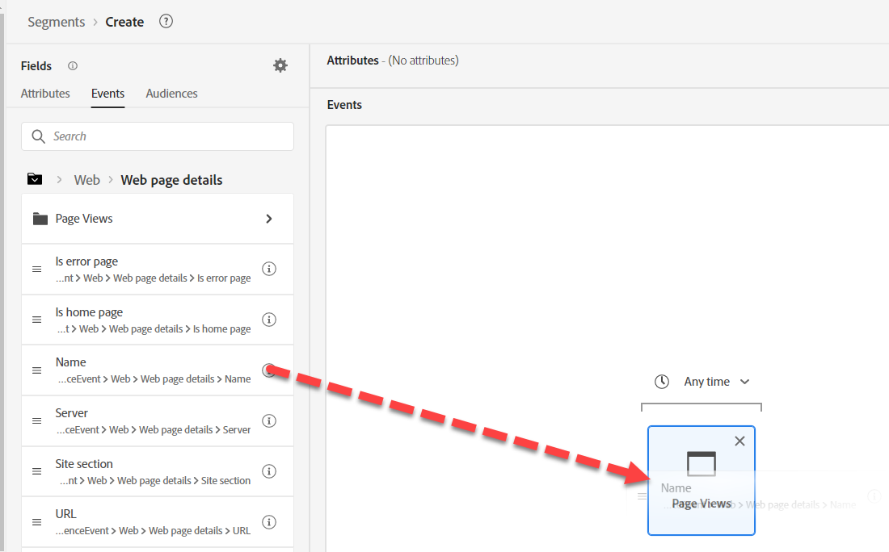
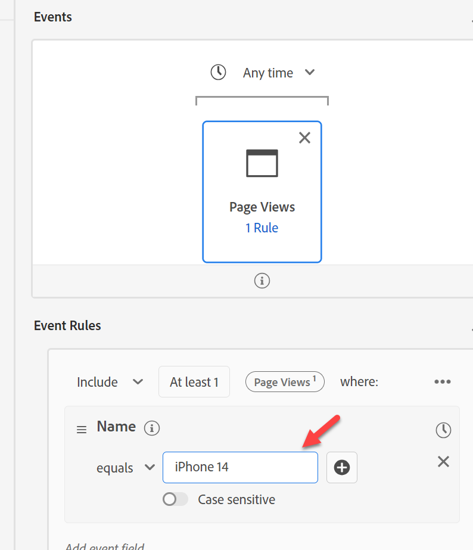
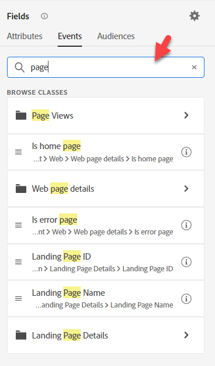
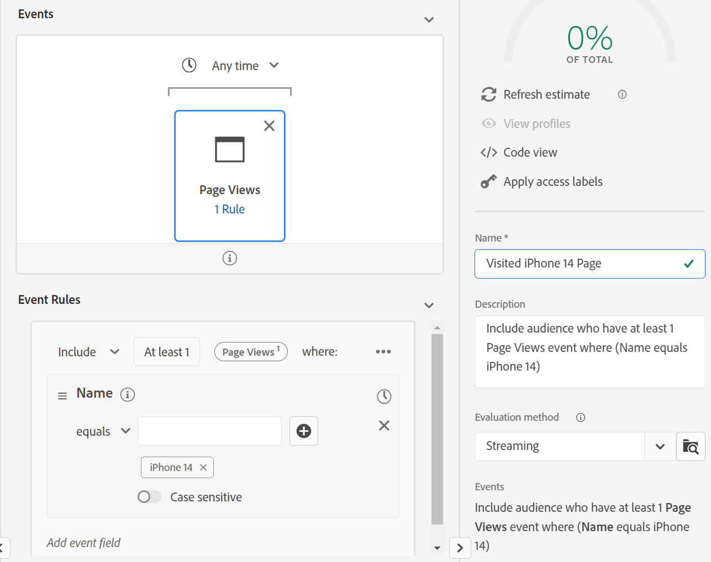
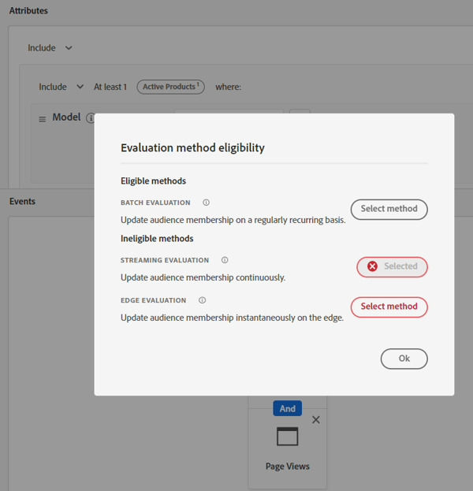

# Zielgruppen-#3 erstellen

## Laborziel

Erstellen einer Zielgruppe, die eine iPhone 14-Produktseite besucht hat

## Analyseaufgaben

Diese Zielgruppe sollte direkt sein.  Wir haben vielleicht mehrere Produktseiten, aber nichts Kompliziertes hier.

## Zielgruppe erstellen (beliebige Seite besucht)

1. Suchen Sie das Seitenansichtsereignis auf der Registerkarte Ereignis unter Ereignistypen in der linken Leiste und fügen Sie es der Audience hinzu.

   

   >[!NOTE]
   >
   >**Verwenden von Ereignistypen**
   >
   >Durch die Verwendung des Seitenansichtsereignisses stellen wir sicher, dass die Zielgruppe nur den Seitennamen im Kontext einer Seitenansicht bewertet. Sie sollte redundant sein, da ein Seitenname nur in einer Seitenansicht vorhanden ist, aber zwei Vorteile bietet:
   >
   >- Bietet eine allgemeine visuelle Dokumentation für Benutzende, die die Benutzeroberfläche aufrufen
   >- Stellt eine Filterung bereit, um sicherzustellen, dass beim Hinzufügen neuer Ereignisse diese nicht einbezogen werden, obwohl dies nicht beabsichtigt war
   >
   >Aus diesem Grund empfehlen wir, bei jedem von Ihnen erstellten Ereignisschema viel über die von Ihnen verwendeten Ereignistypen nachzudenken. Sie sind für das Filtern und visuelle Handbücher von grundlegender Bedeutung.

2. Geben Sie eine Beschreibung ein und machen Sie sie zum Streaming .

3. Ändern Sie über dem platzierten Ereignis „Immer“ in „Heute“

   

4. Speichern Sie diese Zielgruppe als &quot;*Beliebige Seite besucht*&quot;

5. Klicken Sie auf die blaue Schaltfläche **Zielgruppe aktivieren** zum Ziel

6. Wählen Sie das **Streaming-DEP-Webhook**-Ziel aus und klicken Sie auf Weiter

7. Klicken Sie auf Weiter und beenden Sie

## Zielgruppe erstellen (besuchte iPhone 14-Seite, aber nicht Inhaber/Bestellt)

1. Erstellen einer neuen Zielgruppe und Hinzufügen des Seitenansichtsereignisses

   

2. Navigieren Sie zu der Stelle, an der sich der Seitenname befindet, und fügen Sie dem Ereignis das Feld Seitenname hinzu, damit wir nach ihm filtern können.

   - XDM ExperienceEvent —> Web —> Web-Seitendetails —> Name

   

3. Hinzufügen enthält &quot;iPhone 14“

   

   >[!TIP]
   >
   >**Suchen nach „Seite“**
   >
   >Versuchen Sie, nach „Seite“ zu suchen, anstatt zum Feld zu navigieren
   >
   >Der Seitenname wird nicht angezeigt. Dies liegt an der Art und Weise, wie sie benannt ist:
   >
   >- XDM ExperienceEvent > Web > Web-Seitendetails > Name
   >
   >Ihr Ordner wird angezeigt, aber nicht das Feld selbst. Berücksichtigen Sie beim Zusammensetzen Ihrer Namenskonventionen diesen und andere gängige Begriffe, nach denen Personen suchen und diese in Ihre Namensgebung integrieren könnten.
   >
   >Die Suche durchsucht keine Beschreibungen
   >
   >

4. Ändern Sie über dem platzierten Ereignis „Immer“ in „Heute“

   

   >[!NOTE]
   >
   >Da wir auf der Grundlage von Ereignissen aktivieren, die heute passiert sind, konzentrieren wir uns nur auf Seitenansichten für heute.

5. Überprüfen Sie, ob es sich um Streaming handelt, und geben Sie eine Beschreibung an.

6. Speichern Sie die Zielgruppe als &quot;*Besuchte iPhone 14-Seite*&quot;

   

7. Klicken Sie auf die blaue Schaltfläche **Zielgruppe aktivieren** zum Ziel

8. Wählen Sie das **Streaming-DEP-Webhook**-Ziel aus und klicken Sie auf Weiter

9. Klicken Sie auf Weiter und beenden Sie

## Erstellen einer Zielgruppe von Zielgruppen

1. Navigieren Sie zur Registerkarte Zielgruppen im linken oberen Navigationsbereich
1. Aufschlüsselung nach Experience Platform
1. Rufen Sie die drei anderen zuvor erstellten Zielgruppen ab
1. Ändern Sie „Einschließen“ in „Nicht einschließen“ für „Besitzt iPhone 14“ und „Bestellung aufgegeben“ in &quot;iPhone 14“.

   

1. Geben Sie eine Beschreibung ein.

1. Wechsel zu Streaming

1. Speichern unter &quot;*iPhone 14-Seite besucht, aber nicht Inhaber/Bestellt*&quot;

1. Klicken Sie auf die blaue Schaltfläche **Zielgruppe aktivieren** zum Ziel

1. Wählen Sie das **Streaming-DEP-Webhook**-Ziel aus und klicken Sie auf Weiter

1. Klicken Sie auf Weiter und beenden Sie

>[!NOTE]
>
>**Zeitfilter**
>
>Für die Anforderungen galt keine Zeitvorgabe. Wenn also jemand vor drei Jahren zu Besuch war, würde er sich qualifizieren. Je nach Anwendungsfall kann dies funktionieren oder nicht. Es lohnt sich zu fragen. Wir haben eine hinzugefügt, da wir basierend auf Personen, die unsere Website heute besucht haben, eine Aktivierung durchführen.  Dies funktioniert möglicherweise nicht in allen Anwendungsfällen.  Wenn wir einen Zeitfilter hinzufügen, wie weit können wir zurückgehen, bevor eine Edge-Zielgruppe zu Streaming oder sogar Batch wird?

>[!NOTE]
>
>**Auswirkungen der Trennung**
>
>Wir haben aus einigen Gründen eine einfache Anforderung in viele Zielgruppen aufgeteilt. Die Anforderung gilt für ein Streaming, aber diese beiden Anforderungen machen unsere Zielgruppe zu Batch. Weitere Informationen zu den Streaming-Eignungsregeln finden Sie hier:
>
>[https://experienceleague.adobe.com/docs/experience-platform/segmentation/ui/streaming-segmentation.html](https://experienceleague.adobe.com/docs/experience-platform/segmentation/ui/streaming-segmentation.html)

>[!NOTE]
>
>**Was sind Zielgruppen des Zielgruppen-Streaming**
>
>Unser *-Blog Underneath the Hood of Audience* (Link unten), spricht ein wenig darüber. Sie zeigt an, wie das Ergebnis einer Zielgruppe im Profil gespeichert wird. Dies ist wichtig, da bei Daten-Streams in die Ergebnisse einer im Profil gespeicherten Zielgruppe geschaut wird und die Zielgruppe zu diesem Zeitpunkt nicht erneut ausgeführt wird! Eine einfache Nuance, aber es lohnt sich zu verstehen. Die meisten Profilattribute werden regelmäßig aktualisiert, sodass dieser Ansatz sinnvoll ist.
>
>Wir müssen wissen, dass AEP bei Verwendung einer Zielgruppe innerhalb einer Zielgruppe nach Möglichkeit versucht, eine Sequenz durchzuführen. Es gibt Randfälle, in denen dies nicht möglich ist, z. B. Wenn eine Zielgruppe verwendet wird, erfolgt alle 24 Stunden eine Profildisqualifizierung.
>
>[https://experienceleaguecommunities.adobe.com/t5/adobe-experience-platform-blogs/peeking-underneath-the-hood-of-segments-in-aep-adobe-experience/ba-p/453535](https://experienceleaguecommunities.adobe.com/t5/adobe-experience-platform-blogs/peeking-underneath-the-hood-of-segments-in-aep-adobe-experience/ba-p/453535)

## Warum mehrere Zielgruppen erstellen?

Wenn wir alle diese Zielgruppen in einer Zielgruppe anstatt in vier erstellt hätten, würden wir eine Batch-Auswertungsmethode erhalten, obwohl jede Zielgruppe einzeln Streaming ist.

Indem wir diese Zielgruppen aufschlüsseln und eine Zielgruppe verwenden, erhalten wir dieses Verhalten.  Echtzeit-Qualifizierung dieser Zielgruppen als Datenströme in

- Bestellt iPhone 14
- Besitzt iPhone 14
- IPhone 14 besucht

>[!WARNING]
>
>Heute gibt es eine tägliche/24-Stunden-Latenzdisqualifizierung von Zielgruppen

Fazit: Wir tauschten einen schnelleren Eintritt in das Publikum ein, indem wir es in Stücke teilten mit einer 24-Stunden-Latenz, von denen sie aus dem Publikum fielen.

>[!TIP]
>
>**Optionales Challenge-Lab**
>
>Früh fertig?
>
>Ich möchte Personen mit einer E-Mail ansprechen, wenn sie ein altes Telefon haben.  Erstellen Sie eine Zielgruppe mit „Hat altes Telefon“.  Wie können wir sie ins Visier nehmen?
