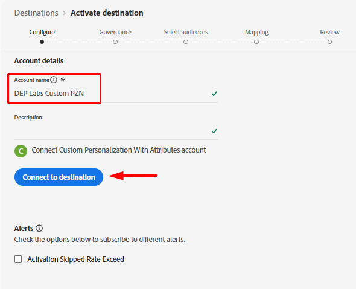
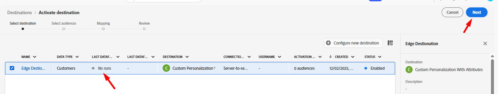
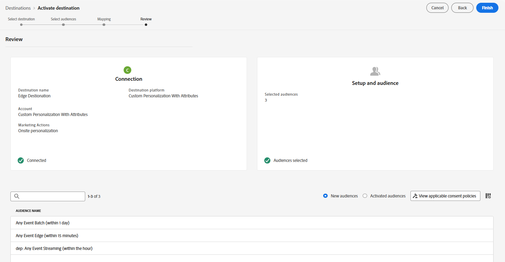

# Einrichten eines benutzerdefinierten Personalization-Ziels

Die Verwendung eines [benutzerdefinierten Personalization-Ziels](https://experienceleague.adobe.com/de/docs/experience-platform/destinations/catalog/personalization/custom-personalization) ist eine Möglichkeit, Zielgruppen auf der Edge für die Verwendung durch einen Drittanbieter verfügbar zu machen, der in der Regel die Network Server-API verwendet, um sie für die Personalisierung zu verwenden.

In diesem Labor wird das benutzerdefinierte Personalization-Ziel konfiguriert, sodass wir Profilattribute an Edge senden können.

## Zielkatalog durchsuchen

>[!NOTE]
>
>Für die Personalisierung mit Adobe Target würden wir das [Adobe Target-Ziel verwenden.](https://experienceleague.adobe.com/de/docs/experience-platform/destinations/catalog/personalization/adobe-target-v2) Das Verhalten ist mit dem von Custom Personalization identisch.

1. Klicken Sie in der linken Leiste auf **Ziele**
1. Klicken Sie in der oberen Leiste auf **Katalog**
1. Wählen Sie als Nächstes die Kategorie von **Personalization aus**
1. In der Mitte des Bildschirms sollte das Ziel mit dem Titel **Benutzerdefinierte Personalization mit Attributen“ angezeigt werden** Klicken Sie auf **Karte auf** Schaltfläche „Einrichten“.

## Konfigurieren des Ziels

### Konto einrichten

Benennen Sie Ihr Konto `DEP Labs Custom PZN` und klicken Sie dann auf die Schaltfläche **Mit Ziel verbinden**

### Hinzufügen von Zieldetails

Füllen Sie die folgenden Zieldetails aus:

1. Name -> **Edge-Ziel**
1. Integrationsalias -> **edgeAlias**
1. Datenstrom-ID -> *Wählen Sie den zuvor erstellten Datenstromnamen aus*
1. Klicken Sie abschließend auf die Schaltfläche **Weiter**.

>[!CAUTION]
>
>Sobald Sie auf Weiter klicken, können Sie den **Namen** oder **Integrationsalias** nicht mehr ändern.  Diese Dinge werden später in den Edge Network-Antworten angezeigt

### Governance-Richtlinie auswählen

Wählen **Onsite Personalization** und klicken Sie dann auf die Schaltfläche **Erstellen**

>[!NOTE]
>
>Dieser Schritt ist optional, es wird jedoch dringend empfohlen, dass jedem Ziel, das Sie erstellen, eine Governance-Richtlinie zugewiesen wird, um zu vermeiden, dass Profile fälschlicherweise aktiviert werden

Wenn Sie fertig sind, sollten Sie diesen Bildschirm sehen, um Ihren Erfolg zu vermerken!

## Ziel aktivieren

### Audiences auswählen

Wählen Sie das soeben erstellte Ziel aus, indem Sie auf die Zeile klicken, um sie zu markieren, und klicken Sie dann auf **Weiter**.

Wählen Sie **Alle Zielgruppen** aus und klicken Sie auf **Weiter**

### Mapping

Fügen Sie eine **neue Zuordnung** wie folgt hinzu:

| Source-Feld | Zielfeld |
| ---------------------- | ------------ |
| \_tenantName.plan.name | Planname |

&#x200B;> [!NOTE]
>
>Denken Sie daran, **\_tenantName** durch Ihren Mandantennamen zu ersetzen

>[!NOTE]
>
>Im Zielfeld können Sie einen Anzeigenamen angeben, der sich vom XDM-Namen unterscheiden kann

Danach sollte der Bildschirm wie im folgenden Bild aussehen.  Sie können dann auf die Schaltfläche Weiter **klicken**

>[!NOTE]
>
>Da Profilattribute vertrauliche Daten enthalten können, müssen alle [Aufrufe der Edge Network](https://experienceleague.adobe.com/de/docs/experience-platform/edge-network-server-api/overview)Server-API in einem authentifizierten Kontext erfolgen, um das Attribut abzurufen, sobald es sich in der Edge befindet.

### Überprüfung

Im letzten Bildschirm können Sie die Details Ihrer Konfiguration überprüfen und dann auf die Schaltfläche Beenden klicken.

>[!NOTE]
>
>Dies ist der Punkt[&#x200B; an dem die &#x200B;](https://experienceleague.adobe.com/de/docs/experience-platform/data-governance/enforcement/auto-enforcement)Automatische Durchsetzung“ mit Ihren [Datennutzungsrichtlinien“ &#x200B;](https://experienceleague.adobe.com/de/docs/experience-platform/data-governance/policies/overview). Dadurch werden Ihre Marketing-Aktionen mit den von Ihnen erstellten Regeln überprüft und Fehler ausgelöst.
