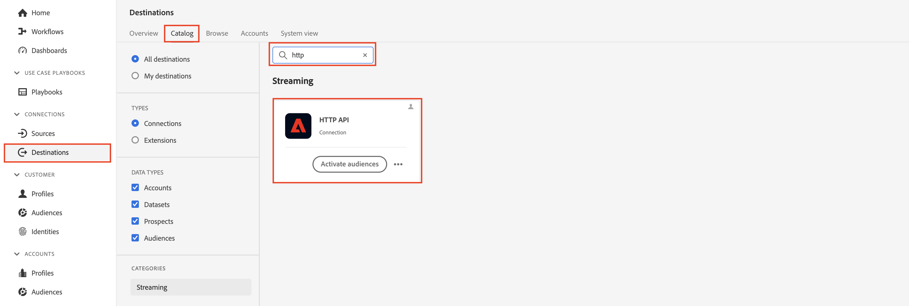
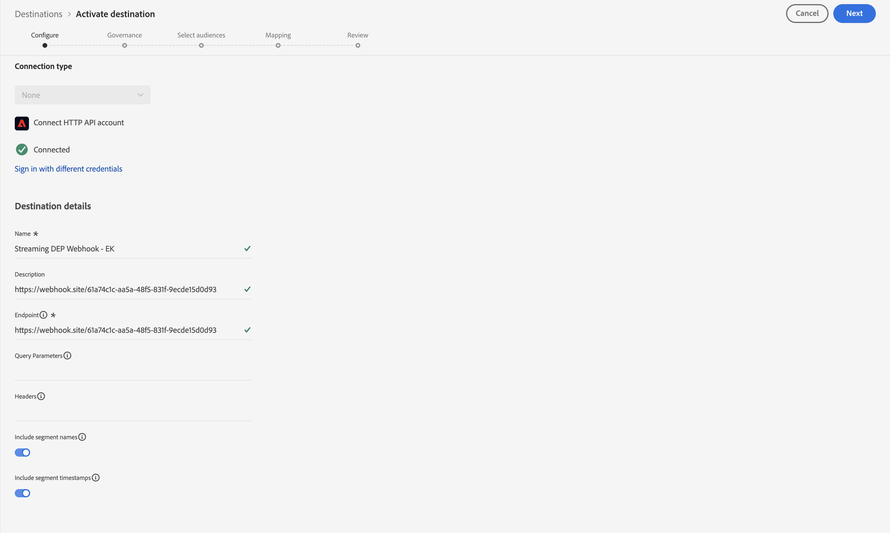
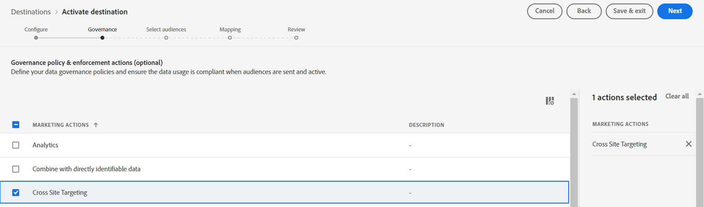
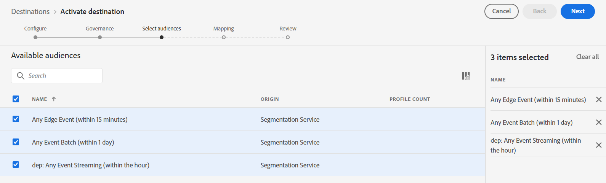

# Streaming-Ziel einrichten

>[!NOTE]
>
>Springen Sie zum nächsten Schritt, wenn Sie bereits Ihr Streaming-Ziel konfiguriert haben!

## Webhook-URL abrufen

>[!NOTE]
>
>Wir verwenden hier einen Webhook, um zu sehen, ob die Daten bei dem Ziel angekommen sind, an das wir senden. In einem realen Szenario würden wir uns stattdessen bei diesem Ziel anmelden und ihre Werkzeuge benutzen, um zu sehen, was angekommen ist.

1. Öffnen Sie den folgenden Link in einer neuen Registerkarte in Ihrem Browser -> [https://webhook.site](https://webhook.site/)
1. Kopieren Sie die angezeigte eindeutige URL und speichern Sie sie an einem sicheren Ort

## Konfigurieren des HTTP-API-Ziels

>[!NOTE]
>
>Wir verwenden ein Streaming-Ziel als Proxy für den Versand dieser Daten an einen Drittanbieter (z.B. Facebook). In einem realen Szenario würden Sie ein Facebook-Ziel anstelle eines HTTP-API-Ziels verwenden, um Daten an Facebook zu senden.

Navigieren Sie in der Experience Platform-Benutzeroberfläche wie folgt zum Zielkatalog

1. Klicken Sie **der linken Leiste** Ziele“
1. Klicken Sie **der oberen Leiste** Katalog“.
1. Geben Sie im Suchfeld &quot;**&quot;**
1. Klicken Sie auf die Schaltfläche **Einrichten**, um das HTTP-API-Ziel zu konfigurieren

>[!NOTE]
>
>Sie verwenden das HTTP-API-Streaming-Ziel für die Labore, um zu demonstrieren, wie ein echter Streaming-Connector funktionieren würde.

## Konfigurieren

1. Verbindungstyp **Keine**
1. Klicken Sie auf **Mit Ziel verbinden**

   

   >[!NOTE]
   >
   >Normalerweise würden wir zu diesem Zeitpunkt Anmeldeinformationen zur Authentifizierung hinzufügen, aber keine sind für diesen Webhook erforderlich.

1. Füllen Sie die Konfigurationsdetails Ihres Ziels wie folgt aus:

- **Name** -> `Streaming DEP Webhook - [Your Initials]`
- **Beschreibung** -> `[your webhook endpoint you copied above]`
- **Endpunkt** -> ` [your webhook endpoint you copied above]`
- **Abfrageparameter** -> `leave blank`
- **Kopfzeilen** -> `leave blank`
- Segmentnamen einschließen -> umschalten
- Zeitstempel für Segmente einschließen -> Umschalten

Stellen Sie anschließend sicher, dass die Konfiguration mit der unten angezeigten übereinstimmt.  Wenn es gut aussieht, klicken Sie auf **Weiter** oben rechts, um mit dem nächsten Schritt fortzufahren

>[!CAUTION]
>
>Die Endpunkt-, Header- und Abfrageparameter können nach dem Speichern nicht mehr in der Benutzeroberfläche geändert werden

## Governance definieren

1. Wählen Sie **Site-übergreifendes**) aus den Marketing-Aktionen aus
1. Klicken Sie abschließend auf **Weiter**, um mit dem nächsten Schritt fortzufahren

>[!NOTE]
>
>Weitere Informationen zu Governance-Richtlinien finden Sie in Experience League
>
>[https://experienceleague.adobe.com/docs/experience-platform/data-governance/policies/overview.html?lang=de#core-actions](https://experienceleague.adobe.com/docs/experience-platform/data-governance/policies/overview.html?lang=de#core-actions)

## Audiences auswählen

1. Alle Zielgruppen auswählen
1. Klicken Sie abschließend auf **Weiter**, um mit dem nächsten Schritt fortzufahren

## Hinzufügen von Zuordnungen

>[!NOTE]
>
>Hier fügen wir ein Feld aus dem Profil hinzu. Wenn dieses Feld keine Daten enthält, wird möglicherweise nichts an das Ziel übergeben. Mehrere Updates im Laufe der Zeit im gesamten Profil und in den Ereignissen können manchmal dazu führen, dass das Ziel mehrmals einen Trigger verursacht und mehrere Payloads sendet.

1. Klicken Sie auf **Neues Feld hinzufügen**, um ein Feld zum Schema hinzuzufügen
1. Geben Sie **model** in das Eingabefeld für das Schemafeld ein und wählen Sie das Feld **\_dep.activeProducts\[0].model** aus der angezeigten Feldliste aus
1. Ändern Sie die **\[0]** im Feldnamen in **\[\*]**.  Ihr endgültiges Feld sollte jetzt als **\_dep.activeProducts\[\*].model angezeigt werden**
1. Klicken Sie abschließend auf **Weiter**, um mit dem nächsten Schritt fortzufahren

>[!NOTE]
>
>Hierbei handelt es sich um die Zuordnung eines Felds auf einem Profil, nicht auf einem Erlebnisereignis. Obwohl wir Profile basierend auf der Zielgruppen-Qualifizierung an ein Ziel senden, müssen wir uns daran erinnern, was passiert.
>
>1. Ein Ereignis kommt herein
>2. Zielgruppe qualifiziert das Profil anhand von Regeln
>3. Die Qualifikation wird im Profil gespeichert
>4. Das Ziel wird benachrichtigt, dass sich das Profil qualifiziert hat
>5. Das Ziel sendet das Profil. Das bedeutet, dass das Ziel, wenn es das Profil sendet, nicht mehr über das Ereignis verfügt, das die Zielgruppenbewertung ausgelöst hat.

## Schritt überprüfen

Überprüfen Sie, ob Ihr endgültiges Ziel gut aussieht, und klicken Sie dann auf die **Beenden**-Schaltfläche

>[!NOTE]
>
>Das Ziel ist jetzt konfiguriert und wartet auf Segmentqualifikationen aus allen hinzugefügten Segmenten basierend auf ihrer Auswertungsgeschwindigkeit:
>
>- Edge
>- Stream
>- Batch

>[!NOTE]
>
>Beim erstmaligen Einrichten eines -Ziels sollten Sie Folgendes beachten:
>
>- Es dauert bis zu 2 Stunden, bis eine Aufstockung (vorhandenes qualifiziertes Profil) aktiviert wird
>- Es dauert bis zu 20 Minuten, bis eine neu hinzugefügte Zielgruppe aktiviert wird
