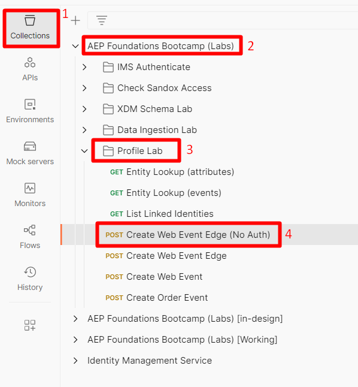
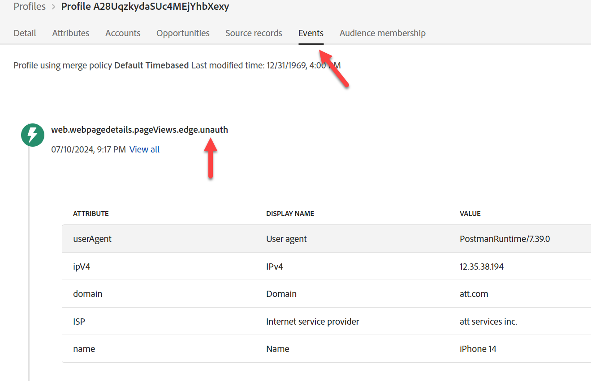
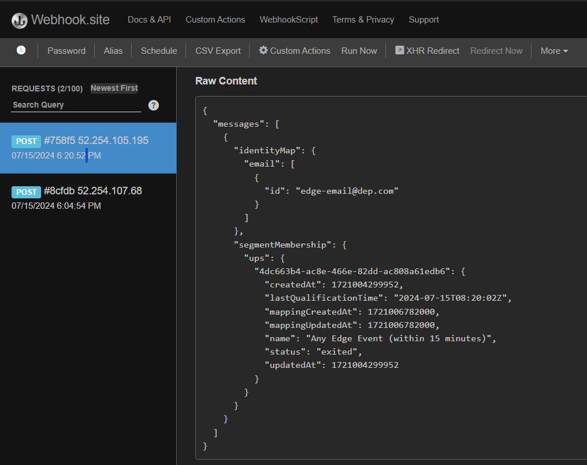

# Edge-Ereignis senden

Nachdem alles konfiguriert ist, senden Sie ein -Ereignis an die Edge, damit alles funktioniert. Verwenden Sie dazu Postman, um ein Web-Ereignis an den von Ihnen erstellten Datenstrom zu senden. Dies sendet ein -Ereignis **ohne OAuth-Token** um eine Seitenansicht, die aus dem Web eingeht, an die Edge zu simulieren.  Stellen Sie sicher, dass Postman auf Ihrem Computer geöffnet ist, um dieses Labor durchzuführen.

>[!NOTE]
>
>Da Sie kein authentifiziertes Token übergeben, erhalten Sie keine Attribute zurück.

## Laborerwartungen

1. Erlebnisereignis, das auf die Edge trifft
1. Datenstromkonfiguration zur Verwendung des Ereignisweiterleitungs-Service
1. Ereignisweiterleitung, um das Ereignis an den Webhook zu senden
1. Datenstromkonfiguration zur Verwendung des AEP-Service
   1. Edge-Zielgruppe zum Ausführen
   2. Ereignis an den Hub senden
1. Postman-Antwort, um Edge-Zielgruppe einzuschließen (aber keine Attribute)
1. Profilspeicher zum Empfangen des Ereignisses und Hinzufügen eines Ereignisprofilfragments
1. Identitätsspeicher zum Hinzufügen einer Beziehung
1. Datensatz zum Empfangen von Daten und Speichern im Data Lake
1. Streaming-Zielgruppen zur Auswertung und Speicherung von Ergebnissen im Profil auf dem Hub
1. Benutzerdefinierte Personalization-Ziele, um alle Streaming-Zielgruppen-„Einträge“ zurück an Edge zu senden
1. HTTP-API-Ziele zum Senden von Streaming-Zielgruppen-„Einträgen“ an den Webhook
1. Schließlich werden HTTP-API-Ziele zum Senden von Streaming-Zielgruppen-Ausstiegen an den Webhook verwendet
1. Schließlich müssen benutzerdefinierte Personalization-Ziele alle Streaming-Zielgruppen-Ausstiege an Edge senden


## Zum Aufruf navigieren

1. **Linke Seitenleiste von Postman** -> Sammlungen
1. **Sammlung** -> AEP Foundations Bootcamps (Labs)
1. **Ordner** -> Profile Lab
1. **API-Anfrage** -> Web-Ereignis-Edge erstellen (keine Authentifizierung)



## API-Anfrage ändern

Wenn Sie dies bereits getan haben, können Sie zum Ausführen der API springen.

Bevor Sie die API-Anfrage ausführen können, müssen Sie der Anfrage einige zusätzliche Informationen hinzufügen. Erfassen Sie zunächst die folgenden Werte:

## Datenstrom-ID erfassen

1. Klicken Sie in der linken Leiste auf **Datenströme** (unter der Überschrift Datenerfassung )
1. Wählen Sie Ihren Datenstrom aus und kopieren Sie den Wert **Datenstrom-ID** .


## Postman-Abfrageparameter aktualisieren

1. Klicken Sie in der Anfrage selbst auf **Parameter**
1. Aktualisieren Sie **Wert** mit der Datenstrom-ID aus dem vorherigen Schritt
1. Klicken Sie auf **Speichern**, um die Aktualisierung zu speichern
1. E-Mail in E-Mail ändern


## Ausführen der API

Führen Sie Ihre Anfrage aus, indem Sie auf die Schaltfläche **Senden** klicken.


Was Sie in der Antwort sehen sollten, sind diese Kernpunkte:

- Eine Antwort von 200 OK bedeutet, dass die Daten erfolgreich gesendet und von der Edge Network akzeptiert wurden
- In der Payload-Antwort sollte auch Folgendes angezeigt werden:
  - Die destinationId des benutzerdefinierten Personalization-Ziels, das Sie einrichten
  - Aliasname dieses Ziels (Ihr Aliasname hieß CustomPersonalization)
  - Alle Segmente, für die sich das Profil qualifiziert hat und die im Edge vorhanden sind

>[!NOTE]
>
>Streaming- und Batch-Segmente werden erst angezeigt, wenn sie zuerst am Hub ausgewertet werden

>[!NOTE]
>
>Wenn Sie mit einem Bearer-Token an server.adobedc.net senden, wird auch das -Attribut angezeigt, das Sie im benutzerdefinierten Personalization-Ziel konfiguriert haben

## Fehler, auf die Sie stoßen können

Nachfolgend finden Sie ein Beispiel für einen Fehler, auf den Sie stoßen können. Dies bedeutet, dass die Edge-Segmentierungs-Auswertung noch nicht zur Auswertung der an das Edge-Netzwerk gesendeten Daten verfügbar ist.

```none
"errors": [
        {
            "type": "https://ns.adobe.com/aep/errors/EXEG-0203-502",
            "status": 502,
            "title": "The service call has failed.",
            "detail": "An error occurred while calling the 'com.adobe.experience_platform.edge_segmentation' service for this request. Try again.",
            "report": {
                "eventIndex": 0
            }
        }
    ]
```

## Validieren der Ereignisweiterleitung

Auf webhook.site sollte sofort derselbe Payload-Text angezeigt werden, den Sie über Ihre Postman-Anfrage gesendet haben.


>[!NOTE]
>
>Beachten Sie, dass die Payload die Geo-Lookup-Informationen hinzugefügt hat, nach denen Sie beim Einrichten des in Ihrer Edge-Einrichtung verwendeten Datenstroms gefragt haben

## Profil nachschlagen

Suchen Sie in Adobe Experience Platform das Profil, das Sie gerade von dem Ereignis gesendet haben, das Sie gerade an Edge Network gesendet haben.  Navigieren Sie zu Profile > Durchsuchen, um die Suche mit den folgenden Informationen durchzuführen:

- Zusammenführungsrichtlinie -> Standardzeitbasiert
- Identity-Namespace -> E-Mail
- Identitätswert -> edge-email\@dep.com


1. Klicken Sie **Anzeigen**, um das Profil zu suchen
1. Klicken Sie auf **Profil-ID**, um das Profil zu öffnen


3. Klicken Sie **oberen Navigationsbereich auf** Ereignisse“, um das gerade gesendete Ereignis anzuzeigen




4. Überprüfen Sie, ob sich das Profil für die Zielgruppen qualifiziert hat, indem Sie die Registerkarte Zielgruppenmitgliedschaft im oberen Navigationsbereich aufrufen.  Sie sollten Folgendes sehen:

- Beliebige Event Edge (innerhalb der letzten 15 Minuten)
- Beliebiges Ereignis-Streaming (innerhalb der letzten Stunde)
- In #1 Anwendungsfall sollten Sie auch die Zielgruppen von sehen:
  - IPhone 14-Seite besucht, sie jedoch nicht besitzt/bestellt
  - IPhone 14 besucht


## Validieren der Streaming-Zielaktivierung

Überprüfen Sie Ihren Webhook, um festzustellen, ob für das konfigurierte Streaming-Ziel Segmente aktiviert wurden.  Sie sollten in \~5 Minuten angezeigt werden.


>[!NOTE]
>
>Streaming-Ziele können eine andere Segmentqualifikations-Payload senden, wenn die beiden Identitäten noch nicht verknüpft sind.

Wenn ECID und E-Mail noch nicht verknüpft sind, wird einige Minuten danach möglicherweise eine andere Payload mit denselben Werten angezeigt, mit der Ausnahme, dass identityMap jetzt zwei Identitäten aufweist (E-Mail und ECID)

Im Laufe der Zeit sollten Sie mehr Payloads für den Webhook erhalten, um den Status „beendet“ zu erhalten.



## Interpretieren aller Prüfungen

1. Überprüfen auf eine 200-Antwort in Postman (ordnungsgemäß formatierte Payload)
1. Überprüfen, ob der Webhook das Ereignis enthält (ordnungsgemäß konfigurierte Ereignisweiterleitung)
1. Überprüfen, ob das Profil über die Ereignisse verfügt (ordnungsgemäß konfigurierter AEP-Service, Ereignis wurde empfangen und im Hub verarbeitet)
1. Überprüfen, ob das Profil zwei Identitäten hat (das Identitätsdiagramm ist im Hub verknüpft)
1. Überprüfen, ob sich das Profil für die Zielgruppen qualifiziert hat (ordnungsgemäß definierte Zielgruppe)
1. Überprüfen, ob der Webhook die Streaming-Zielgruppen empfangen hat (ordnungsgemäß konfiguriertes HTTP-API-Ziel)
1. Überprüfen, ob die Postman-Antwort Segmente enthält (ordnungsgemäß konfiguriertes benutzerdefiniertes Personalization-Ziel)
1. Überprüfen, ob Data Lake über ein Versandprotokoll verfügt (ordnungsgemäß konfiguriert und an Zielgruppen-Qualifizierung und Streaming-Ziel gesendet). Siehe unten.

## Data-Lake-„Log“ von Zielen

Nach mindestens 60 Minuten können Sie sogar überprüfen, ob Ihr Datensatz das gesendete Ereignis enthält. Führen Sie dazu die folgende Abfrage mit dem Abfrage-Service aus.

Ändern Sie den unten stehenden Tabellennamen in den aus Ihrer Sandbox. Um ihn zu finden, gehen Sie zu Ihrer Datensatzliste und filtern Sie nach &quot;`dest`&quot;, öffnen Sie den Datensatz und kopieren Sie den Tabellennamen in die rechte Leiste.

```sql
SELECT * FROM profile_export_for_destination_merge_policy_xxx
WHERE extSourceSystemAudit.LASTREFERENCEDDATE >= CURRENT_DATE
AND identitymap['email'][0].ID in ('edge-email@dep.com')
ORDER BY extSourceSystemAudit.LASTREFERENCEDDATE DESC
LIMIT 10
```
