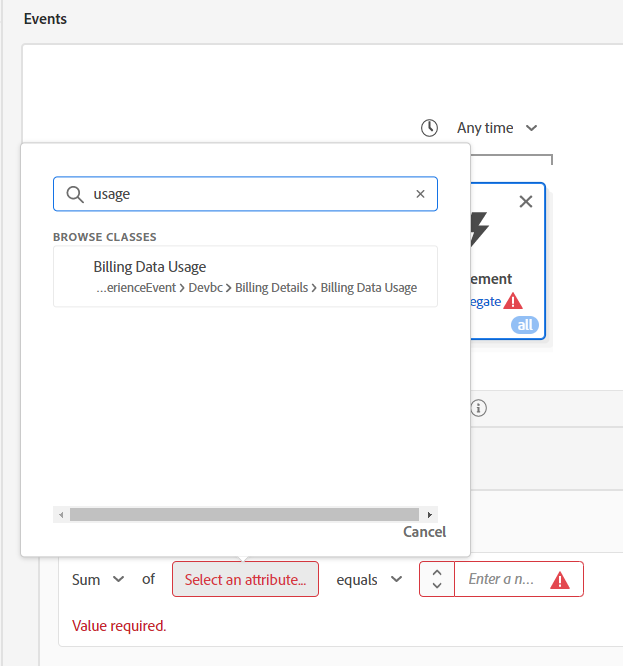
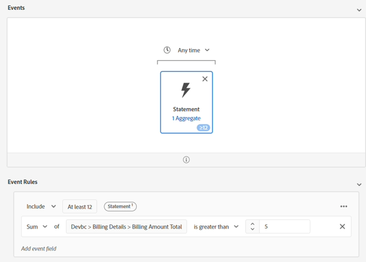
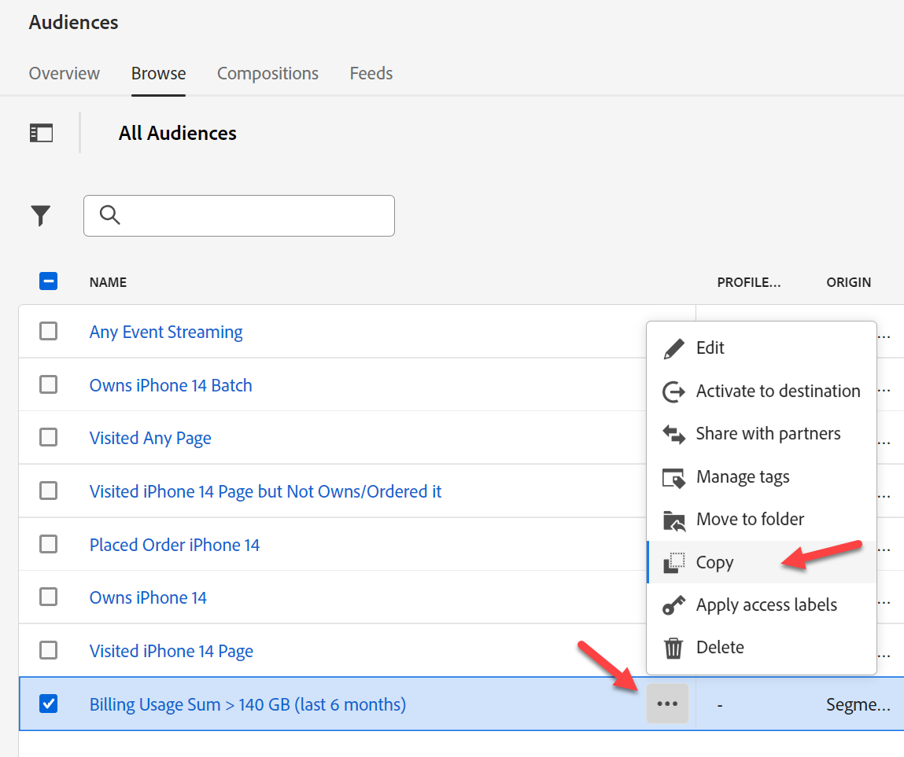
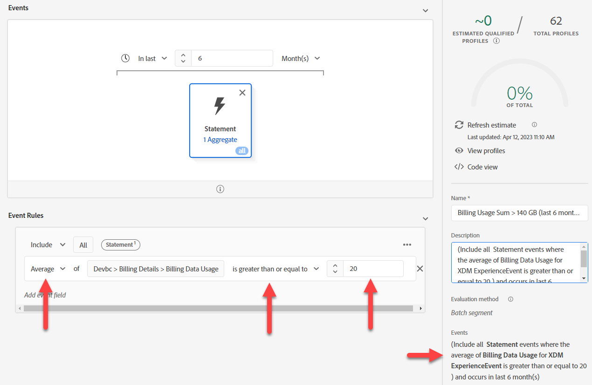
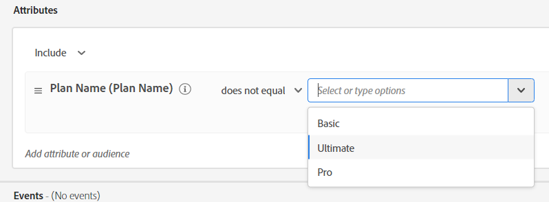

# Option #1 - Verwenden von Zielgruppen zum Aggregieren

Mit Aggregaten in Zielgruppen können Sie Ereignisse in der Zielgruppenregel aggregieren. Da wir jedoch nur jeweils ein Aggregat erstellen können, müssen wir beide von unserem Anwendungsfall trennen.

## Audience #1 - Nutzung der Abrechnungsdaten in den letzten 6 Monaten > 140 GB

In diesem Zielgruppen-Build bestimmen Sie die gesamte Nutzung der Abrechnungsdaten in den letzten 6 Monaten > 140 GB. Gehen Sie dazu wie folgt vor:

1. Erstellen Sie eine neue Zielgruppe.  Verwenden Sie die Ereigniskarte „Abrechnung“.

   

   >[!NOTE]
   >
   >Eine gute Struktur des Ereignistyps erleichtert es Ihren Benutzenden, ihn zu verwenden und zu verstehen.  Nehmen Sie sich Zeit, um einen standardisierten Ansatz für Ihre Schemata zu entwickeln.
   >
   >Es hilft bei Rechtschreibfehlern.
   >
   >Sie können immer auf das Feld Ereignistyp zurückgreifen und Dinge manuell eingeben.

2. Klicken Sie auf die Auslassungszeichen in den Regeln unten rechts und wählen Sie Aggregieren . Klicken Sie auf Attribut auswählen und geben Sie Nutzung ein. Wählen Sie das Feld Nutzung der Fakturierungsdaten .

   

   

3. Ändern Sie „ist gleich“ in „größer als“ und den Wert in „140“.

4. Ändern Sie die Zeit über der Ereigniskarte von Beliebig in Zuletzt und den Wert in 6 und die Tage in Monate

   

5. Geben Sie eine Beschreibung ein und speichern Sie.

6. Geben Sie der Zielgruppe den Namen &quot;*Abrechnung Nutzungssumme > 140 GB (letzte 6 Monate)*&quot;

>[!NOTE]
>
>Aggregierte Zielgruppen können nur als Batch gespeichert werden

>[!NOTE]
>
>Es gibt zwei Möglichkeiten, Aggregate in Zielgruppen zu verwenden.
>
>- Summe/Anzahl/Min/Max/Durchschnitt (wie oben)
>- Zählt nur (hierbei wird jedes Ereignis als 1 gezählt)
>
>
>
>Beide können bei Bedarf zusammen verwendet werden
>
>

## Zielgruppen-#2 - rollierend, Durchschnitt 6 Monate. Monatliche Datennutzung von >= 20 GB

1. Klicken Sie nicht auf den Hyperlink, sondern wählen Sie die Zeile in der Zielgruppenlisten-Benutzeroberfläche aus, damit die gerade erstellte Zeile hervorgehoben wird. Klicken Sie anschließend auf „Kopieren“.

   

2. Klicken Sie auf die Kopie und bearbeiten Sie sie.  Klicken Sie auf die Karte Ereignis und ändern Sie die Summe in Durchschnitt. Ändern Sie den Wert größer als auf größer oder gleich und den Wert auf 20. Kopieren Sie den Pseudo-Code in die Beschreibung.

   

3. Geben Sie der Zielgruppe den Namen &quot;*Abrechnungsnutzung Durchschn. > 20 GB (letzte 6 Monate)*&quot;

## Zielgruppen-#3 - hat keinen ultimativen Telefonplan

1. Neue Zielgruppe erstellen
1. Suchen Sie unter Attribute nach dem Plannamen
1. Plannamen hinzufügen (Planname)
1. Wählen Sie &quot;Ultimate&quot; aus.  Änderung in ist nicht gleich

   >[!NOTE]
   >
   >Erinnern Sie sich an Ihre Vorarbeit? Hierbei wird ein Feld in unserer Lookup-Dimension verwendet:
   >
   >Individuelles XDM-Profil > devBC > Plandetails > Plan-ID-Eigenschaften **Planname (Planname)**

   

5. Klicken Sie auf Zielgruppen > Experience Platform. Ziehen Sie Abrechnungsnutzungssumme > 140 GB und Abrechnungsnutzungsdurchschnitt >= 20 GB neben Planname.

   

6. Kopieren Sie den Pseudo-Code in die Beschreibung

7. Aktivieren Sie diese Option, wenn es sich um Streaming handelt. **Es kann nicht Streaming sein**. Nehmen Sie einige Änderungen vor:

   >[!NOTE]
   >
   >Jede Verwendung eines Lookup-Datensatzes erzeugt eine Zielgruppe mit mehreren Entitäten, die im Batch ausgewertet wird.  Wir haben in unserer Zielgruppe ein Feld verwendet:
   >
   >Individuelles XDM-Profil > DevBC > Plandetails > Plan-ID-Eigenschaften > Planname (Planname)

8. Ersetzen Sie **Planname (Planname)** durch: XDM-Kontaktprofil > Devbc > Plandetails > **Planname**

   

   >[!NOTE]
   >
   >Erinnern Sie sich daran, dass der Schritt „LID-Denormalize“ dem Profil einen Plannamen hinzufügt. Auf diese Weise können Sie in einer Zielgruppe darauf verweisen. Daher wird ein Join aus der Suche entfernt und Sie können die Auswertungsmethode Streaming festlegen.
   >
   >Der Nachteil besteht darin, dass wir diese Logik während der Zielgruppenbewertung nach vorn verschoben haben, um die Datenaufnahme vorzubereiten.
   >
   >Wir müssen jetzt auch alle Profile aktualisieren, wenn sich der Planname ändert.
   >
   >Der Vorteil ist jedoch, dass wir jetzt in Echtzeit reagieren können.

9. Überprüfen Sie, ob Sie dies jetzt als Streaming speichern können. Zielgruppe als &quot;*Abrechnung der Datennutzung hoch, aber kein Ultimate-Plan*&quot; speichern

>[!NOTE]
>
>Diese Auswertungsmethode ist zwar Streaming, sie basiert jedoch auf der Zielgruppen-Qualifizierung auf zwei Batch-Zielgruppen.

>[!NOTE]
>
>Dieser Ansatz funktioniert, aber wir haben jetzt eine Streaming-Zielgruppe (in Echtzeit), die Batch-Zielgruppen verwendet (die alle 24 Stunden einmal ausgeführt wird). Wenn dies für unsere Anwendungsfälle und Datenladevorgänge funktioniert, ist dies eine gute Wahl (z. B. werden unsere Abrechnungsdaten täglich oder monatlich geladen, was sehr wahrscheinlich ist, aber nicht alle Anwendungsfälle sind so). Andernfalls besteht ein gängiger Ansatz darin, die Daten zu aggregieren, bevor sie an AEP gesendet werden. Schauen Sie sich eine andere Option an, wenn Sie einen Echtzeitansatz benötigen.
