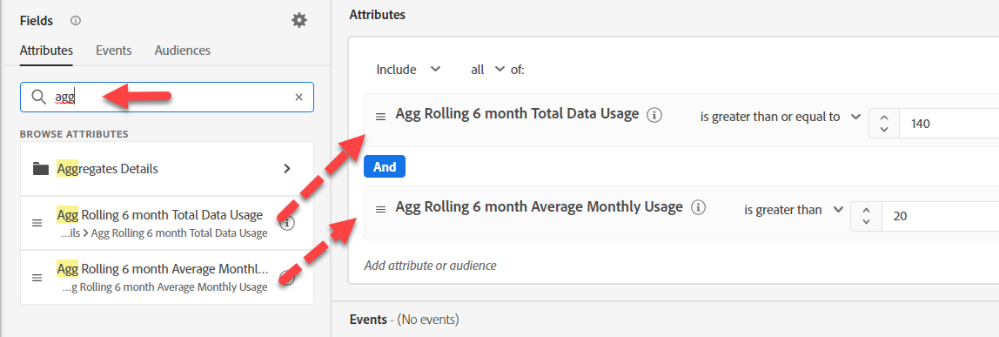
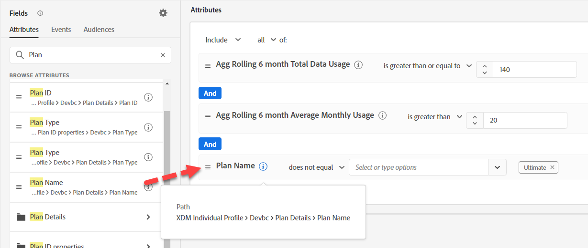

# Option #2 - Verwenden von Pre-Aggregaten

Die Herausforderung bei Aggregaten in unserer Zielgruppe besteht darin, dass unsere Zielgruppe (beim Streaming) auf Aggregationen basiert, die innerhalb von Zielgruppen durchgeführt werden, bei denen es sich um Batch-Zielgruppen handelt. Da das Marketing festgestellt hat, dass ein Echtzeitansatz erforderlich ist, haben wir drei Dinge getan, um dies in das Design zu integrieren:

- Berechnen der Aggregate vor dem Streaming der Daten in

>[!NOTE]
>
>Dies ist recht ungewöhnlich, da die meisten gestreamten Daten auf ein einzelnes Ereignis oder auf ein Aggregat ausgerichtet sind

- Denormalisierten Plannamen verwenden
- Streamen der Daten in

## Zielgruppe erstellen

Erstellen Sie eine Audience für alle Profile, deren Abrechnungsdatennutzung hoch ist, aber derzeit keinen ultimativen Telefonplan hat.

1. Neue Zielgruppe erstellen
1. Suchen Sie auf der Registerkarte Attribute statt Ereignis nach „Tag“ und ziehen Sie die beiden Aggregate auf die Arbeitsfläche. Legen Sie die entsprechenden Operatoren und Werte für jeden Parameter fest.

   

1. Suchen Sie im Profil nach dem Plannamen und fügen Sie ihn hinzu (XDM-Kontaktprofil > DevBC > Plandetails > Planname). &quot;Ultimate&quot; auswählen

   

1. Geben Sie eine Beschreibung ein.  Validieren Sie, ob die Auswertungsmethode Streaming ist.

1. Speichern Sie die Zielgruppe als &quot;*Abrechnung - Datennutzung hoch, aber kein Ultimate-Plan (AGG)*&quot;

>[!NOTE]
>
>Denken Sie daran, dass wir die Aggregatlogik in unsere vorgelagerte Streaming-ETL-Ebene verschoben haben.
>
>Bei dieser Wahl wird zwischen einer Batch-Zielgruppe gewählt, bei der der Marketer die Logik und eine Streaming-Zielgruppe steuert, die Definition und Steuerung jedoch auf die ETL-Ebene bringt, auf der das Engineering beteiligt sein muss.

>[!TIP]
>
>**Optionales Challenge-Lab**
>
>Früh fertig?
>
>Wir möchten unsere VIPs beim Kauf in Echtzeit mit einer speziellen Nachricht kontaktieren.  Erstellen Sie eine Zielgruppe von „VIPs“.  Ein VIP ist jemand, der im letzten Monat mehr als 1.000 Dollar gekauft hat.
