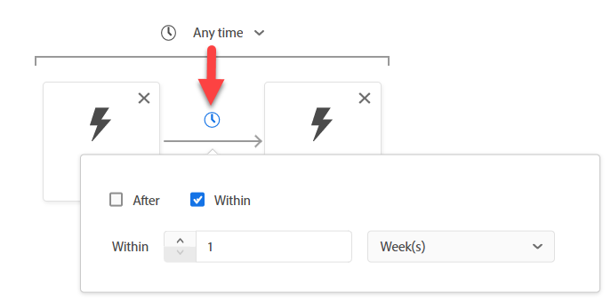
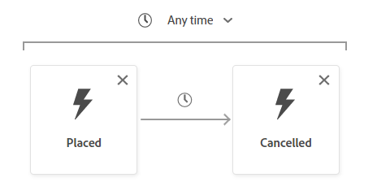
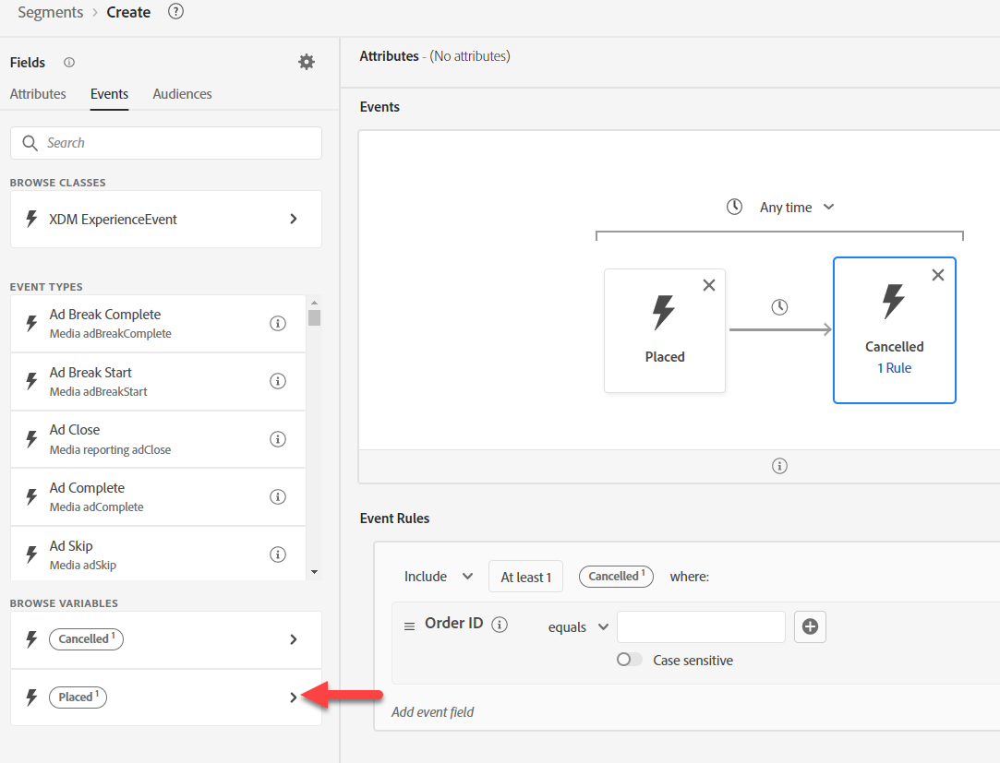
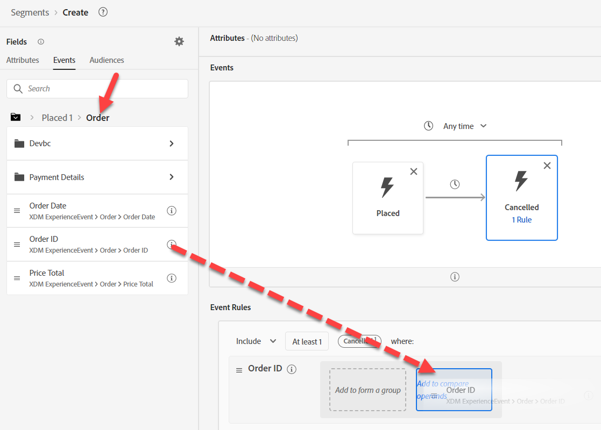

# Anwendungsfall #3 erstellen

## Zielgruppe erstellen

1. Neue Zielgruppe erstellen
1. Hinzufügen des Ereignisses „Platzierte Reihenfolge“ zur Arbeitsfläche
1. Fügen Sie das Ereignis „Stornierte Bestellung“ rechts neben dem Ereignis „Auftragserteilung“ hinzu
1. Zeit in innerhalb einer Woche ändern

>[!NOTE]
>
>**Feld Ereignistyp**
>
>Wir hätten verwenden können:
>
>- Beliebiges Ereignis gefiltert nach Ereignistyp=order.apped
>- Beliebiges Ereignis gefiltert nach Ereignistyp=order.canceled

>[!NOTE]
>
>**Zeit**
>
>Die Zielgruppen-Engine verwendet nur den Zeitstempel, um die Reihenfolge der Ereignisse zu interpretieren. Wenn Sie also mehrere Datums-/Uhrzeitfelder für das Ereignis haben, beachten Sie, dass das Zeitstempelfeld verwendet wird.

## Abgebrochenes Ereignis konfigurieren

Suchen Sie nach der Auftrags-ID und ziehen Sie das Feld auf das Ereignis „Bestellung abgebrochen“.

>[!NOTE]
>
>Wir fügen einen Filter für die Auftrags-ID hinzu, um sicherzustellen, dass es sich bei der aufgegebenen Bestellung um dieselbe stornierte Bestellung handelt

Löschen Sie alle Suchvorgänge und klicken Sie unter **Variablen durchsuchen** **auf „Platziert**

Drilldown zur Auftrags-ID durchführen und dann per Drag-and-Drop dorthin ziehen, um einen Vergleichsoperanden hinzuzufügen

>[!WARNING]
>
>**Verwenden Sie keine Suche innerhalb einer Variablen**
>
>Der Kontext der Variablen wird nicht beibehalten

Ihr endgültiges Ergebnis sollte wie unten dargestellt sein

>[!NOTE]
>
>**Container**
>
>Hierbei wird der Variablencontainer verwendet, um sicherzustellen, dass es sich bei der stornierten Bestellung um dieselbe Bestellung handelt, die aufgegeben wurde
>
>Zuvor haben wir einen Container verwendet, um ein Element in einem Array zu isolieren. Hier verwenden wir Container, um in einem Filterkriterium innerhalb eines anderen Ereignisses auf ein bestimmtes Ereignis zu verweisen.
>
>Das Ereignis „Stornierte Bestellung“ stellt sicher, dass die eigene Auftrags-ID mit der Auftrags-ID übereinstimmt.
>
>Wie sonst könnten wir das nutzen?
>
>- Beim Vergleichen einer Produkt-SKU für eine Seitenansicht wird die gekaufte Produkt-SKU verwendet
>- Ein Schiff mit Stadt zu vergleichen, unterscheidet sich von der Rechnung mit Stadt
>- Der Vergleich von zwei Feldern desselben Datentyps sollte möglich sein, auch wenn die Ereignisse aus verschiedenen Schemata stammen können
>
>https\://experienceleaguecommunities.adobe.com/t5/adobe-experience-platform-blogs/how-exact-do-containers-work-in-aep-segmentation-a-deep-look/ba-p/458780

>[!NOTE]
>
>**Container-Namen**
>
>Container übernehmen ihren Variablennamen aus ihrem Kontext.
>
>Wenn Sie beispielsweise die Karte „Beliebiges Ereignis“ verwenden, lautet der Container-Name „Beliebig1“

## Zielgruppe speichern

1. Geben Sie eine Beschreibung ein. Legen Sie die Auswertungsmethode als Batch fest.
1. Speichern Sie Ihre Audience als &quot;*Bestellung aufgegeben und Bestellung innerhalb einer Woche storniert*&quot;

>[!TIP]
>
>**Optionales Challenge-Lab**
>
>Früh fertig? Jetzt ausprobieren…
>
>Wir möchten eine neue Kampagne für den Warenkorbabbruch starten.  Erstellen Sie eine Zielgruppe für den Warenkorb „Abbruch“, stellen Sie jedoch sicher, dass wir keine Stunde lang Personen ansprechen.
>
>
>
>Haben Sie noch Zeit? Jetzt ausprobieren…
>
>Das Unternehmen ging durch eine Fusion und erwarb zwei neue Geschäftsbereiche für:
>
>- ISP
>- Telegramm
>
>Wie müssen Sie die Schemata ändern, um diese einzubeziehen?
