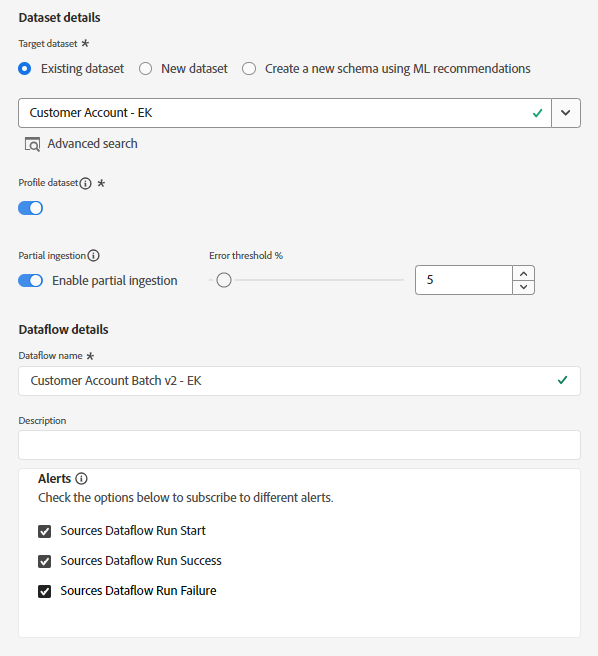
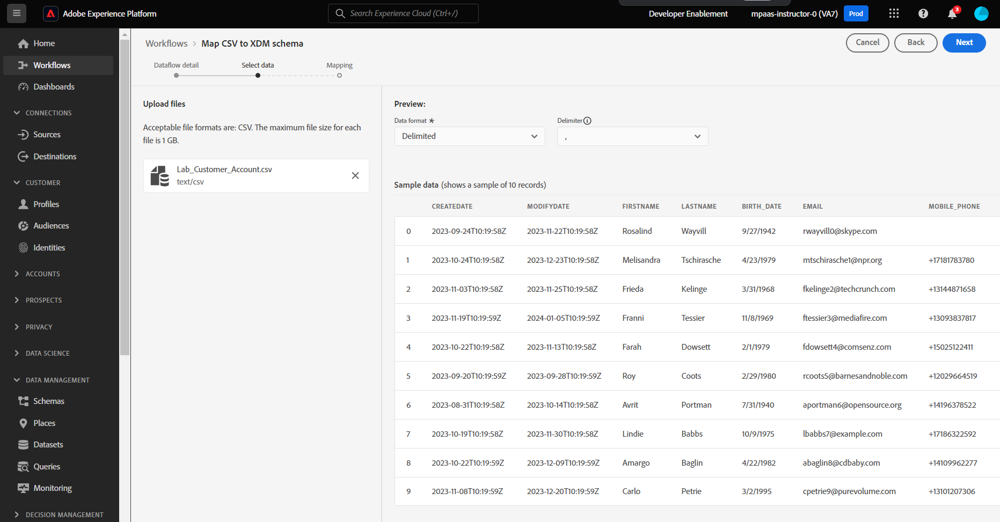
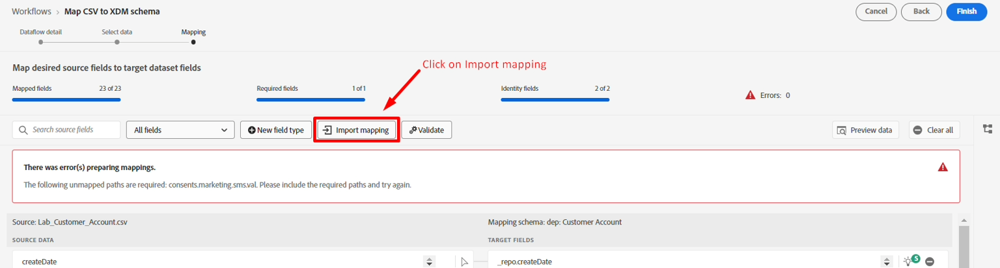
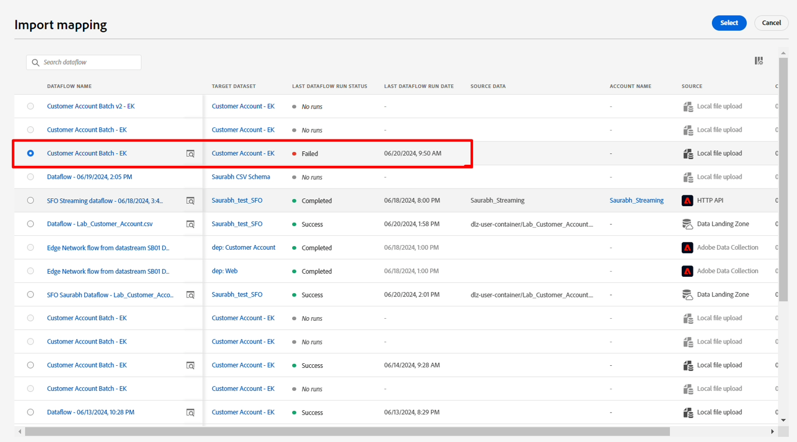

# Erstellen eines neuen Datenflusses

## Zu Quellen navigieren

1. Navigieren Sie in der Adobe Experience Platform-Benutzeroberfläche zum folgenden Speicherort:\
   **Quellen** -> **Katalog** -> **Lokales System**
1. Klicken Sie als Nächstes auf **Daten hinzufügen** für die Karte **Lokaler Datei-Upload** .

## Datenfluss einrichten

1. Wählen Sie im Bildschirm „Datenflussdetails“ die Option **Vorhandener Datensatz**.
1. Verwenden Sie den zuvor erstellten Datensatz mit dem Namen **Kundenkonto - &lt;Ihre Initialen>**
1. Stellen Sie sicher, dass der Umschalter **Profildatensatz** aktiviert ist.
(Wenn Sie dies nicht aktivieren, kann der Profilspeicher nicht überwachen, ob neue Daten in diesen Datensatz eingehen, und nimmt diese Daten daher nicht in Profile auf.)
1. Stellen Sie sicher, dass **Umschalter „Partielle Aufnahme aktivieren** eingeschaltet ist
(Wenn Sie dies nicht aktivieren, kann die gesamte Aufnahme fehlschlagen, wenn nur einer der Datensätze einen Fehler aufweist)
1. Legen Sie den Datenflussnamen als **Kundenkonto-Batch v2 - \&lt;Ihre Initialen>** fest
1. Aktivieren Sie alle Warnhinweise **Quellen: Datenflussstart/-erfolg/-fehler**
1. Wenn alles gut aussieht, klicken Sie auf **Weiter** in der oberen rechten Ecke des Bildschirms, um mit dem nächsten Schritt fortzufahren.

## Beispieldatei hochladen

1. Ziehen Sie die Datei „Lab\_&#x200B;**\_Account.csv“ per Drag-and-Drop**/oder laden Sie sie in die Benutzeroberfläche hoch.  Danach sollte der Bildschirm wie folgt aussehen.

## Zuordnungen importieren

Auf dem Zuordnungsbildschirm können Sie die zuvor erstellten Zuordnungen importieren, anstatt alle Zuordnungen erneut einzurichten.

1. Klicken Sie auf die Schaltfläche **Zuordnung importieren**.
1. Wählen Sie den Datenfluss aus, der die zuvor erstellte Zuordnung enthält

>[!NOTE]
>
>Der Import von Zuordnungen ist eine praktische Möglichkeit, Zuordnungen aus anderen Datenflüssen wiederzuverwenden und den Zuordnungsaufwand zu reduzieren
