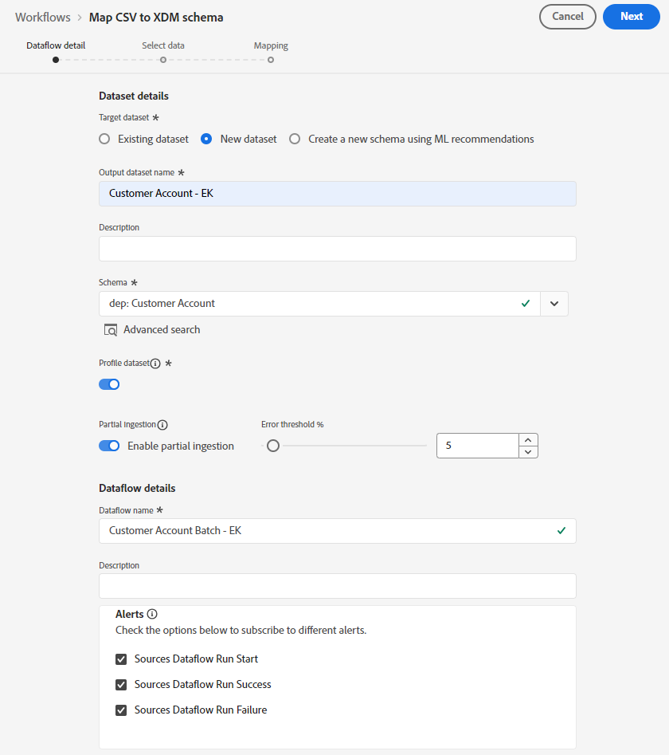
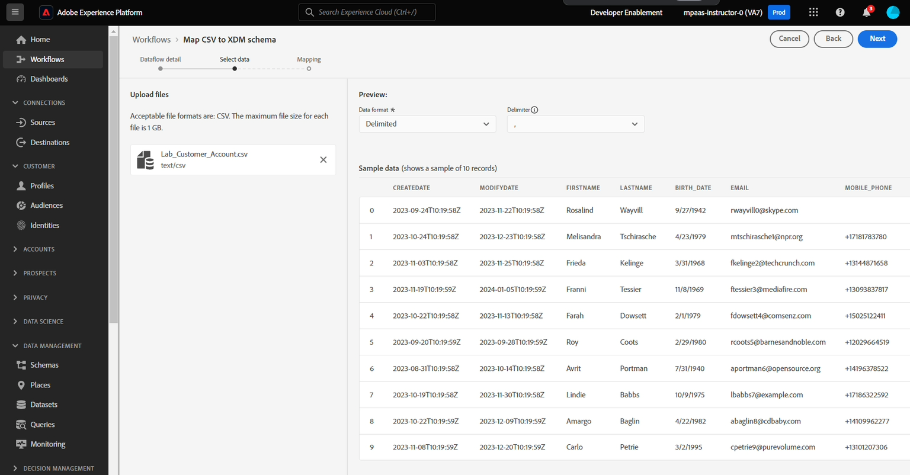

# Datenfluss erstellen

## Zu Quellen navigieren

1. Navigieren Sie in der Adobe Experience Platform-Benutzeroberfläche zum folgenden Speicherort:\
   **Quellen** -> **Katalog** -> **Lokales System**
1. Klicken Sie als Nächstes auf **Daten hinzufügen** für die Karte **Lokaler Datei-Upload** .

## Datenfluss einrichten

1. Wählen Sie im Bildschirm Datenflussdetails die Option **Neuer Datensatz**.
1. Benennen Sie den Ausgabedatensatz als **Kundenkonto - &lt;Ihre Initialen>**
1. Wählen Sie das Schema **dep: Kundenkonto** aus der Dropdown-Liste aus.
1. Aktivieren Sie das **Profildatensatz**-Umschalter.
(Wenn Sie dies nicht aktivieren, kann der Profilspeicher nicht überwachen, ob neue Daten in diesen Datensatz eingehen, und nimmt diese Daten daher nicht in Profile auf.)
1. Aktivieren Sie die **Teilweise Aufnahme aktivieren**.
(Wenn Sie dies nicht aktivieren, kann die gesamte Aufnahme fehlschlagen, wenn nur einer der Datensätze einen Fehler aufweist)
1. Legen Sie den Datenflussnamen als **Kundenkonto-Batch - &lt;Ihre Initialen>** fest
1. Aktivieren Sie alle Warnhinweise **Quellen: Datenflussstart/-erfolg/-fehler**

   

   >[!NOTE]
   >
   >**Teilweise Aufnahme aktivieren** gibt die Anzahl der Fehler (**INGEST** und **DCVS**) als Prozentsatz der Gesamtzahl der Datensätze an, die fehlschlagen können, bevor der gesamte Datenfluss als Fehler deklariert wird.

   >[!CAUTION]
   >
   >Stellen Sie sicher **dass Sie den** sowohl für die Profil- als auch für die partielle Aufnahme aktiviert haben, bevor Sie fortfahren!

1. Wenn alles gut aussieht, klicken Sie auf **Weiter** in der oberen rechten Ecke des Bildschirms, um mit dem nächsten Schritt fortzufahren.

## Beispieldatei hochladen

1. Laden Sie die Beispieldateien aus dem [Beispieldateien](../sample-files.md) zur Verwendung mit diesem Labor herunter
1. Ziehen Sie die Datei „Lab\_**\_Account.csv“ per Drag-and-Drop**/oder laden Sie sie in die Benutzeroberfläche hoch.  Danach sollte der Bildschirm wie folgt aussehen.

   

1. Sehen Sie sich im Vorschaufenster die folgenden Attribute an und beachten Sie die folgenden Punkte:

   - **sms\_optIn** ist ein Einverständnisfeld mit mehreren fehlenden Werten (in der Vorschau als - angezeigt)
   - **KONTO\_ERSTELLEN\_**) hat nicht das richtige Datumsformat. Sie enthält Zeichenfolgenwerte sowie Datums- und Uhrzeitwerte in einer Zeichenfolge.
   - **account\_end\_date** hat das richtige Datumsformat.

   

   

   >[!NOTE]
   >
   >Die fehlenden Werte, Daten und falsch formatierten Felder müssen Sie später in diesem Labor in den Zuordnungsschritten berücksichtigen

1. Klicken Sie auf **Weiter** in der oberen rechten Ecke des Bildschirms, um mit dem nächsten Schritt fortzufahren
