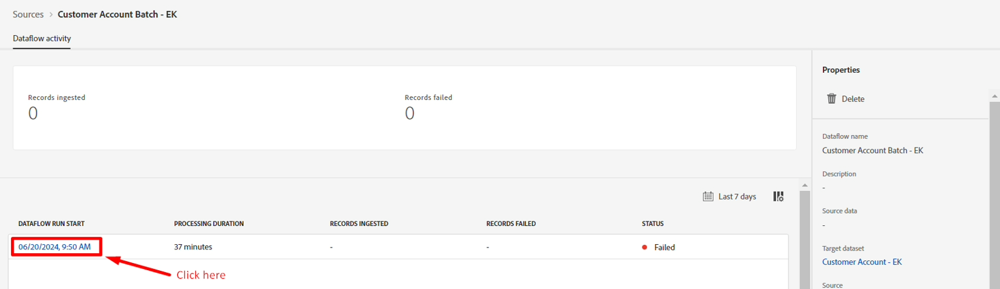
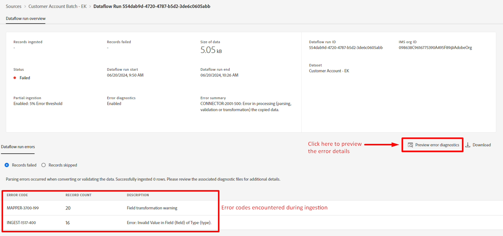

# Debuggen von Fehlern

## Vorschau der Fehlerdiagnose

Nach einigen Minuten sollten Sie beachten, dass **Status** einen Fehler anzeigt. Drilldown in die Fehlerdetails, um zu sehen, was den Fehler verursacht hat.

1. Klicken Sie auf **Startdatum des Datenflusses**
1. Klicken Sie auf **Vorschau der Fehlerdiagnose**, um die spezifischen Details für jede fehlgeschlagene Zeile anzuzeigen






Der Bildschirm, den Sie jetzt sehen, zeigt Ihnen eine Reihe von Details darüber, was die Fehlercodes mit der vollständigen Fehlermeldung bedeuten und welche Zeile fehlgeschlagen ist.


>[!NOTE]
>
>Scrollen Sie nach rechts, um die mit diesem Fehlercode verknüpften Quelldaten anzuzeigen


## Fehlertypen verstehen

### Fehler beim Aufnehmen von XXXX-XXX

Dieser Fehler tritt auf, weil **person.bornDayAndMonth** im Format eines zweistelligen Monats plus eines zweistelligen Tages erwartet wird (d. h. der 27. April sollte als 04-27 formatiert sein)

```none
The value (9-27) does not conform to the specified
regex pattern: [0-1][0-9]-[0-9][0-9] in field: 
person.birthDayAndMonth of type: String
```

>[!CAUTION]
>
>Beachten Sie, dass person.BirthDayAndMonth kein erforderliches Feld ist, aber die Nichteinhaltung regulärer Ausdrücke vom System als „Datenbeschädigungsproblem“ behandelt wird und einen schwerwiegenden Fehler darstellt.


### MAPPER-XXXX-XXX-Fehler

Dieser Fehler tritt auf, weil das Quellfeld von **createDate** Zeichenfolgenwerte von `Created on 2022-04-22T19:34:17Z` hat. Dieser Wert kann wegen des Textes am Anfang nicht automatisch in ein Datum umgewandelt werden: `Created on`. Ein berechnetes Feld muss zum Bereinigen der Daten verwendet werden.

```none
Error transforming data for destination path 
_dep.account.createDate. Details: Unable to convert 
Created on 2023-09-24T10:19:58Z to schema type DATE_TIME
```

>[!NOTE]
>
>Dieser Fehler ist nicht schwerwiegend, da dies nur zu Warnungen während der Zuordnung führt. Die Datenflussausführung schlägt aus diesem Grund nicht fehl, sodass dieses Labor diesen Fehler nicht behebt.
