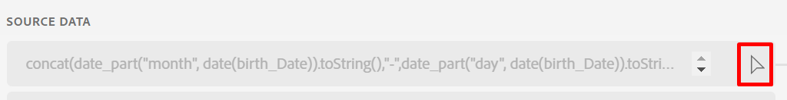
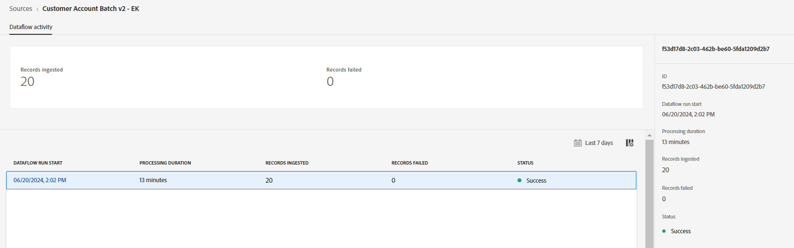
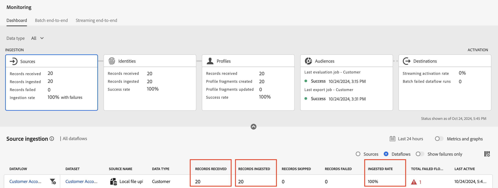

# Beheben von Fehlern

## Geburtstag und -monat festlegen

1. Klicken Sie auf das Pfeilsymbol neben dem berechneten Feld, das das XDM-Feld **person.bornDayAndMonth** ausfüllt



1. Aktualisieren Sie den Ausdruck mit dem unten angegebenen berechneten Feld-Code und klicken Sie auf **Vorschau**

```none
concat(date_part("mm", date(birth_Date, "M/d/yyyy")).toString(),"-", date_part("dd", date(birth_Date, "M/d/yyyy")).toString())
```

>[!NOTE]
>
>Die Daten sollten als zweistelliger Monat und zweistelliger Tag angezeigt werden (d. h. der 27. April wird als 04-27 angezeigt). Der `mm` und die `dd` Parameter fügen 0 Abstand hinzu.

1. Wenn alles gut aussieht **Speichern** das berechnete Feld

1. Klicken Sie dann auf **Beenden**, um die Datenflussaufnahme auszuführen.


## Validieren der Aufnahme

Nach einigen Minuten sollte der Datenfluss ausgeführt werden und Sie sollten Erfolg sehen!




## Überwachungsbildschirm

1. Navigieren Sie zum Überwachungsbildschirm, indem Sie auf die linke Leiste auf dem **Monitoring**-Symbol unter dem Abschnitt **Daten-Management** klicken.
1. Klicken Sie auf die Karte **Quellen** und scrollen Sie dann in der unteren Leiste, um die Details für Ihre Datenflussausführung anzuzeigen. Beachten Sie Folgendes:
   - **Empfangene Datensätze:** 20 Datensätze wurden von der Quelle zur Verarbeitung empfangen
   - **Aufgenommene Datensätze:** 20 Datensätze wurden nach der Zuordnung und der Datenverarbeitung in den Data Lake aufgenommen.
   - **Fehlgeschlagene Datensätze:** Hier sollte eine 0 angezeigt werden. Dies stellt die Gesamtzahl der Aufnahme- und DCVS-Fehler dar. Die MAPPER-Warnungen werden ausgeschlossen.
   - **Aufnahmegeschwindigkeit:** Dies ist das Verhältnis zwischen den aufgenommenen und den empfangenen Datensätzen. 100 % der eingegangenen Datensätze wurden erfolgreich verarbeitet



>[!NOTE]
>
>Wenn die partielle Datenaufnahme aktiviert ist **kann die &quot;**&quot; für einen bestimmten Datenfluss-Durchgang \&lt;100 % bis zum Schwellenwert betragen, den Sie im Rahmen der Datenflussdetails festgelegt haben. Beachten Sie außerdem, dass 100 % Erfolg bei Datenflussausführungen gemeldet wird, bei denen keine Daten aufgenommen wurden.

>[!NOTE]
>
>Beachten Sie, dass Datensätze nicht verloren gehen können.
>
>**Datensätze empfangen** = **Datensätze aufgenommen** + **Datensätze fehlgeschlagen**
>
>**Aufnahmegeschwindigkeit = Aufgenommene Datensätze / Empfangene Datensätze**
>
>**Schwellenwert für die partielle Aufnahme = fehlgeschlagene Datensätze / Empfangene Datensätze**


## Identitäten

Klicken Sie auf die Karte **Identitäten** und scrollen Sie dann in der unteren Leiste, um die detaillierten Details für Ihre Datenflussausführung anzuzeigen. Beachten Sie Folgendes im Identity Service

- **Empfangene Datensätze:** 20 Datensätze wurden vom *Identity Store* empfangen, da er neue Batches überwachte, d. h. der Datensatz wurde für das Profil markiert.
- **Aufgenommene Datensätze:** 20 Datensätze wurden aufgenommen (d. h. für Identitätsinformationen verarbeitet)
- **Übersprungene Datensätze:** Keine, da wir keine einzelnen Identitätsdatensätze oder Datensätze mit jetzt neuen Identitätsbeziehungen hatten.
- **Erfolgsrate (nur auf der Karte verfügbar):** Dies ist das Verhältnis zwischen den empfangenen und den aufgenommenen Datensätzen.
- **Identitäten hinzugefügt:** 40 Identitäten (jeweils 20 für Kunden-ID und 20 für E-Mail-Adresse) wurden zum Gesamtidentitätsdiagramm für das Echtzeit-Kundenprofil hinzugefügt
- **Erstellte Diagramme:** 20 eindeutige Diagramme wurden basierend auf den verarbeiteten Datensätzen erstellt (d. h. Beziehungen, die in jeder Datenzeile gefunden wurden)
- **Diagramme aktualisiert:** Dies würde Ihnen mitteilen, ob einem Diagramm Identitäten hinzugefügt wurden.


## Profile

Klicken Sie auf die Karte **Profile** und scrollen Sie dann in der unteren Leiste, um die Details für Ihre Datenflussausführung anzuzeigen. Beachten Sie Folgendes im Profil-Service:

- **Empfangene Datensätze:** 20 Datensätze wurden vom Profilspeicher zur Verarbeitung empfangen
- **Fehlgeschlagene Datensätze:** Datensätze sind nicht fehlgeschlagen. Aber wenn sie versagt hatten, dann wissen Sie, dass es sich um eine Aufnahme in das Profil-Problem handelte.
- **Profilfragmente erstellt:** 20 Profilfragmente wurden erstellt
- **Profilfragmente aktualisiert:** 20 Profilfragmente insgesamt wurden berührt
- **Erfolgsrate:** ist 100 %. Dies ist das Verhältnis zwischen fehlgeschlagenen und empfangenen Datensätzen.

>[!NOTE]
>
>Beachten Sie **dass die Metrik** Datensätze übersprungen“ für das Profil nicht verfügbar ist.


>[!NOTE]
>
>Beachten Sie, dass es die Zielkarte gibt und sie Metriken aufweist, die den Ergebnissen in diesem Labor ähneln. Diese Metriken sind erst sinnvoll, wenn Sie eine Zielgruppe oder einen Datensatz aktivieren.
