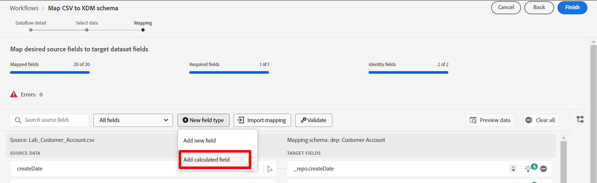

# Berechnete Felder

## Übersicht

Das Feld „sms_optIn“ ist ein Pflichtfeld im Kundenkontenschema. Das Problem ist, dass das Feld „sms\_optIn“ in unserer Streaming-Quelle *null*-Werte senden kann, sodass ein berechnetes Feld erforderlich ist, um dies zu beheben. Andernfalls werden diese Datensätze bei der Aufnahme übersprungen, was einen Verlust darstellt.


## Berechnetes Feld erstellen

1. Erstellen Sie ein berechnetes Feld, indem Sie auf das Symbol **Neuer Feldtyp** klicken und dann **Berechnetes Feld hinzufügen** auswählen. Bei allen fehlenden Werten wird davon ausgegangen, dass die Einwilligung nicht erteilt wurde und wird mit **„n“** gekennzeichnet. Beachten Sie, dass berechnete Felder in der linken Spalte angezeigt werden, da die Umwandlung über ein berechnetes Feld die Eingabe für diese neue Zuordnung ist.




1. Fügen Sie im Dialogfeld Berechnetes Feld erstellen den folgenden Ausdruck hinzu und klicken Sie dann auf **Vorschau**

```none
iif(sms_optIn == null or sms_optIn == "", 'n', sms_optIn)
```


1. Oben rechts im Blackbox sollte ein grünes Häkchen angezeigt werden, das die Gültigkeit des Ausdrucks angibt, und in der Datenvorschau sollte nur **„n“** oder **„y“** als Werte angezeigt werden. Wenn alles gut aussieht, klicken Sie auf **Speichern**.


## Zielgruppe zuordnen

Ein neues Feld wird dem Zuordnungsbildschirm hinzugefügt, weist jedoch einen nicht zugeordneten Zielfeldpfad auf.


1. Klicken Sie auf das **Zielfeld zuordnen** für das neue berechnete Feld, das Sie erstellt haben
1. Im rechten Bereich sehen Sie jetzt, dass das Bedienfeld „Zielschema“ geöffnet ist. Geben Sie **sms** im Suchfeld ein
1. Wählen Sie das Feld **val** aus


Ihre endgültige Zuordnung sollte wie folgt aussehen:


1. Validieren Sie Ihre Zuordnung, um sicherzustellen, dass sie gut aussieht.


>[!NOTE]
>
>Alle Zeilen ohne gültigen SMS-Wert werden während der Aufnahme zurückgewiesen. Wenn die teilweise Aufnahme nicht aktiviert ist, schlägt der Aufnahmefehler mit dieser Zeile in unserem Fall bei der Aufnahme des gesamten Batches oder der Datei fehl. Bei aktivierter partieller Aufnahme werden die Zeilen mit erforderlichen Feldern mit fehlenden Werten abgelehnt, aber andere Zeilen werden aufgenommen.


## Umgang mit Geburtstagen

Es ist erforderlich, den Geburtstag, den Monat und das Jahr in separate Felder zu unterteilen, damit einige von ihnen nicht für nachgelagerte Aktivitäten verwendet werden können. Sie müssen zwei berechnete Felder erstellen, um dies zu beheben.

### Erstellen einer Zuordnung für Geburtsdatum und -monat

1. Neues berechnetes Feld hinzufügen, um den Geburtstag und -monat der Profile zu erfassen
1. Verwenden Sie den folgenden Code für das berechnete Feld:

>[!NOTE]
>
>Anstatt nur den obigen Code zu kopieren, versuchen Sie zu verstehen, was passiert, indem Sie die Code-Teile separat ausführen, um zu sehen, wie sie zusammengestellt wurden, um komplexere berechnete Felder in einer einzigen Zeile zu erstellen, da mehrzeilige Werte nicht zulässig sind. Probieren Sie Folgendes aus:
>
>1. `date(birth_Date,"M/d/yyyy")`
>2. `date_part("day", date(birth_Date,"M/d/yyyy")).toString()`
>3. `date_part("month", date(birth_Date,"M/d/yyyy")).toString()`
>4. `concat(date_part("month", date(birth_Date,"M/d/yyyy")).toString(),`
>   `"-", date_part("day", date(birth_Date,"M/d/yyyy")).toString())`


1. Klicken Sie auf Vorschau , und Sie sollten das folgende Ergebnis sehen. Wenn alles gut aussieht, klicken Sie auf **Speichern**


1. Zuordnen des berechneten Felds zu **person.bornDayAndMonth**

1. Validieren der Zuordnung


### Erstellen einer Zuordnung für das Geburtsjahr

1. Erstellen Sie ein neues berechnetes Feld, um das Geburtsjahr des Profils mithilfe des unten stehenden Codes zu erfassen.

```none
date_part("yyyy",date(birth_Date,"M/d/yyyy"))
```

1. Ordnen Sie das berechnete Feld dem Zielspeicherort „person.**&quot;**

1. Validieren der Zuordnung

>[!NOTE]
>
>Beachten Sie, dass die Datumsangaben im **MM/TT/JJJJ**-Format vorliegen **die Daten des Beispiels jedoch** oder zweistellig für den Tag und den Monat sind. Damit die **date**-Funktion funktioniert, müssen Sie das Eingabeformat der Daten angeben, z. B. **M/d/yyyy**, damit Sie 1 bis 2 Stellen für den Monat und Tag berücksichtigen können. Ohne diese Datumseingabeformatspezifikation schlägt die Validierung dieser Zuordnungen fehl.
