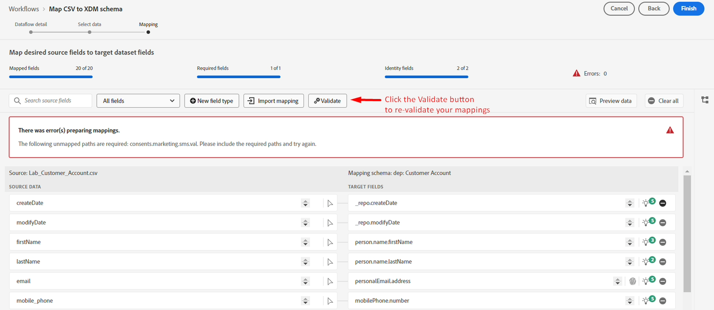
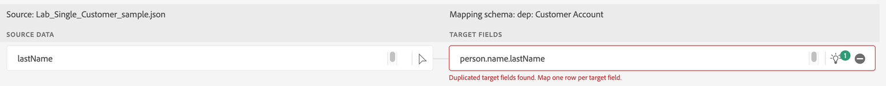
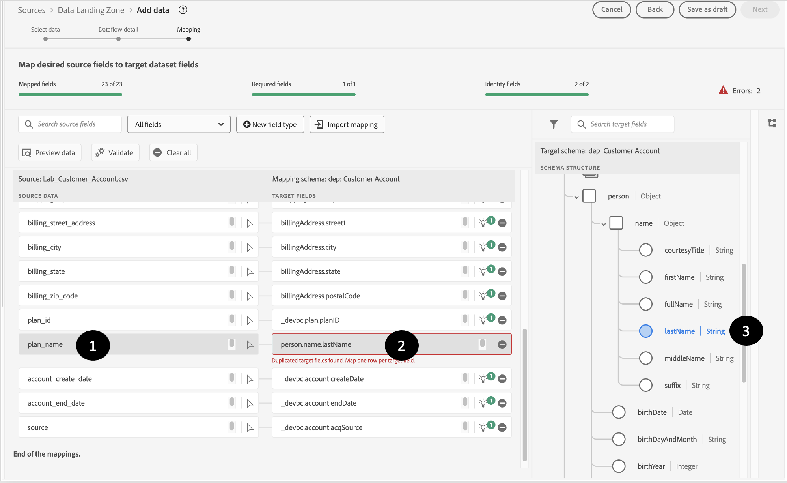

# Passthrough-Zuordnungen korrigieren

## Spezifische Zuordnungen ablegen

Einige der Quelldaten, die Sie haben, müssen mit berechneten Feldern verarbeitet werden.  Um diese zu beheben, ziehen Sie sie aus den Zuordnungen und überprüfen Sie die Zuordnungen erneut.

1. Folgende Quelldaten aus den Zuordnungen ablegen:
   - Geburtsdatum
   - Quelle
   - sms\_optIn
1. Validieren Sie die Zuordnungen erneut, indem Sie auf die Schaltfläche Validieren klicken

>[!NOTE]
>
>Nach dem Klicken auf Validieren sind möglicherweise weiterhin Fehler vorhanden

## Beispiele für falsche Zuordnungen

KI/ML-Empfehlungen sind zwar hilfreich, liegen aber manchmal falsch.  Wenn Sie Ihre Empfehlungen überprüfen, können diese Fehlertypen auftreten, die Sie beheben müssen

>[!NOTE]
>
>Im Folgenden finden Sie einige Beispiele für ungültige Zuordnungen, die Sie möglicherweise in Ihrer eigenen Sandbox sehen. Möglicherweise werden auch andere Fehler angezeigt.

## Doppelte Zuordnungen

In diesem Szenario sehen Sie, dass der KI/ML-Recommender zwei verschiedene Quellfelder demselben Zielfeld (person.name **lastName) zugeordnet**

## Fehlerhafte Zuordnungen

Diese Zuordnung sieht richtig aus, ist aber bei näherer **(**) nicht dasselbe wie **emailFormat**

Hier wird **email\_optIn** fälschlicherweise dem falschen Einverständnisobjekt zugeordnet

## Beheben von Passthrough-Zuordnungen

Führen Sie die folgenden Schritte aus, um Passthrough-Zuordnungen zu beheben, die fälschlicherweise auf das falsche Zielfeld verweisen.

### Beispiel

1. Beginnen Sie mit einer ungültigen Zuordnung und klicken Sie auf das Feld Zielfeld . In der folgenden Zuordnung wird beispielsweise das Feld **person.name.lastName** nicht korrekt zugeordnet und **planName**
1. Wählen Sie im rechts geöffneten Bedienfeld Zielschema das entsprechende Zielfeld aus und klicken Sie auf **\_devbc.plan.name**
1. Das Zielfeld sollte jetzt im Zielfeld aktualisiert werden
1. Nachdem Sie jeden dieser Fehler behoben haben, sollten Sie auf die Schaltfläche **Validieren** klicken, um sicherzustellen, dass Sie diese Fehlerarten reduzieren und keine neuen einführen.

>[!WARNING]
>
>Fahren Sie erst mit dem nächsten Schritt fort, wenn Sie alle Zuordnungsfehler behoben haben
