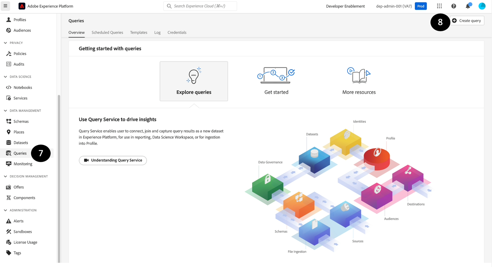

# Überprüfung und Validierung

## Vorschau des Datensatzes

1. Klicken Sie auf **Datensätze**
1. **Suchen** und **Klicken** den von Ihnen erstellten Datensatznamen.

   


1. Klicken Sie oben **auf** Datensatz in der Vorschau anzeigen“

   


1. **Überprüfen** und **validieren** Sie dieselben Datensätze, die Sie aufgenommen haben, indem Sie auf den linken Bereich klicken, der die Schemahierarchie anzeigt.


>[!NOTE]
>
>**Vorschau des Datensatzes** zeigt den letzten erfolgreichen Batch in diesem Datensatz an. Die vorherigen Batches werden nicht angezeigt. Komplexe Daten wie Arrays und Zuordnungen sind heute nicht mehr sichtbar und erscheinen als leere Spalten. Um eine umfassendere Ansicht zu erhalten, müssen Sie SQL verwenden, um den Datensatz wie unten beschrieben zu untersuchen.


## Abfragedatensatz

1. **Vorschau** schließen)
1. Klicken Sie im Datensatzbildschirm auf das Kopiersymbol unter **Tabellenname**. Im folgenden Beispielbildschirm ist der Tabellenname `customer_account_sm`

   


1. Navigieren Sie zum Abschnitt **Abfragen**

1. Klicken Sie auf **Abfrage erstellen**

   


1. Kopieren Sie die folgende SQL-Abfrage in den **Editor**. Denken Sie daran, `<table_name>` durch den Wert zu ersetzen, den Sie in Schritt 6 erhalten haben.

   ```sql
   SELECT * FROM <table_name>
   ```


1. Drücken Sie die **Play**-Taste.

   


1. **Vorschau** der Ergebnisse

1. Um das XDM-Schema zusammen mit den Daten abzurufen, führen Sie auch die folgende SQL-Abfrage aus:

```sql
SELECT to_json(shippingAddress) FROM <table_name>
```

Um auf die Daten im Knoten `postalCode`**zuzugreifen** können Sie Folgendes eingeben:

```sql
SELECT shippingAddress.postalCode FROM <table_name>
```

>[!SUCCESS]
>
>Herzlichen Glückwunsch!  Sie haben erfolgreich einen Beispielsatz von Echtzeit-Kundenprofilen aufgenommen und erstellt
