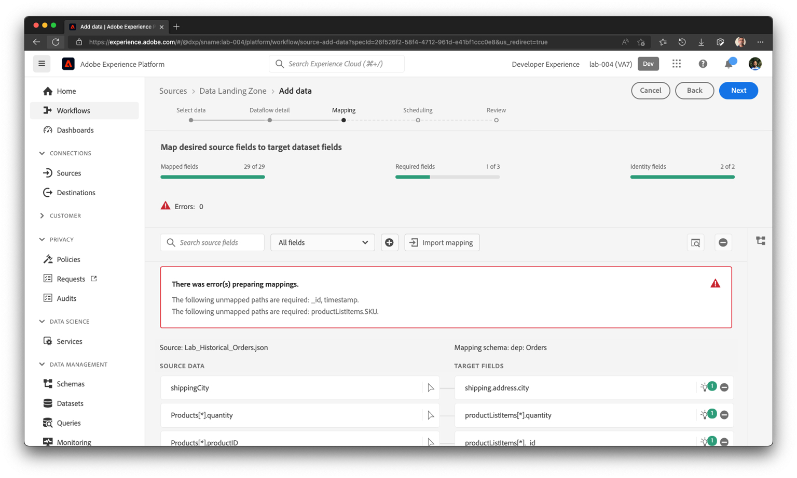
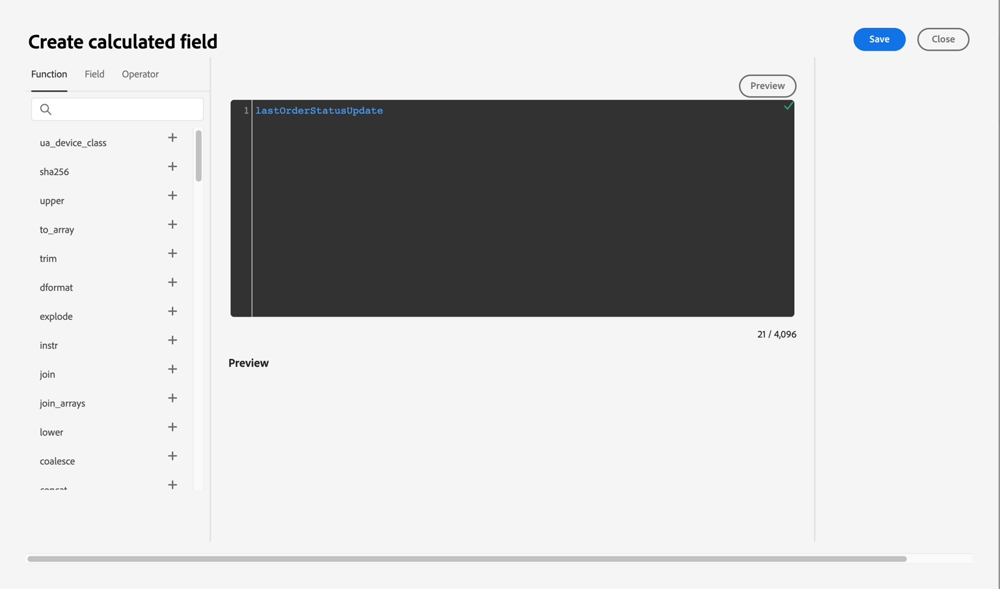
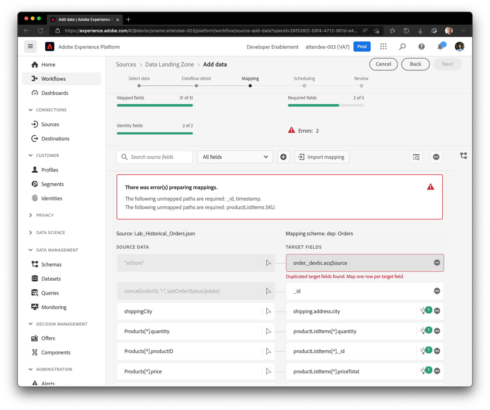
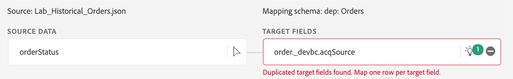

# Erste Zuordnungen

Wie in der vorherigen Übung müssen Sie die Zuordnung überprüfen und in einigen Fällen ändern.

## ML-Empfehlungen überprüfen

1. Im Schritt Zuordnung ordnen ML-Empfehlungen automatisch die meisten Attribute zu. Es werden jedoch auch mehrere Fehler angezeigt. Der Startbildschirm sieht in etwa wie folgt aus.



>[!NOTE]
>
>Da wir zum ersten Mal einen Erlebnisereignis-Datensatz zuordnen, beachten Sie, dass **\_id** und **timestamp** für Erlebnisereignisse nie standardmäßig empfohlen oder zugeordnet werden. Sie müssen manuell sicherstellen, dass diese korrekt zugeordnet sind.

## \_id, Zeitstempel und Reihenfolge zuordnen.\_devbc.acqSource-Felder

1. Um **\_id zuzuordnen,** Sie den folgenden berechneten Feldausdruck ein und klicken Sie auf „Vorschau“

```none
concat(orderID, "-", lastOrderStatusUpdate)
```


1. Stellen Sie sicher **dass** Feld „Zeitstempel“ im Zielschema dem folgenden berechneten Feld zugeordnet wird:

```none
lastOrderStatusUpdate
```




1. Ordnen Sie den berechneten Feldausdruck **„inStore“** zu **order.\_devbc.acqSource**


## Umgang mit doppelten Zuordnungen

Wenn im Zuordnungsbildschirm jetzt eine doppelte Zuordnung angezeigt wird, z. B. **orderStatus**, die **order.\_devbc.acqSource zugeordnet ist,** klicken Sie auf das Symbol &quot;-&quot;, um die Zuordnung zu entfernen.

&#x200B;> [!NOTE]
>
>Beachten Sie, dass mehrere Eingabefelder nicht demselben Ausgabefeld zugeordnet werden können, da dies die Zuordnung mehrdeutig macht. Ein einzelnes Eingabefeld kann jedoch mehreren Ausgabefeldern im XDM-Schema zugeordnet werden.





