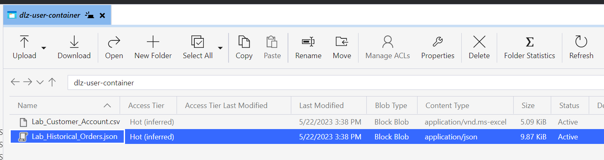
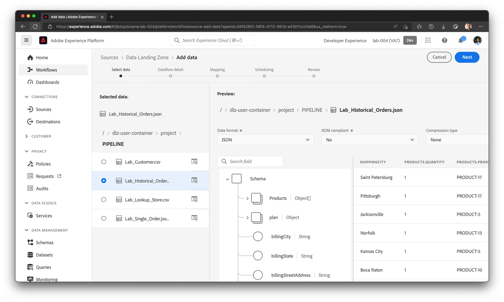

# Einrichten der Quelle

## Beispieldatei hochladen

Sie müssen eine Beispieldatendatei über den Azure Storage Explorer in Ihre Data Landing Zone hochladen, damit Sie sie im Labor verwenden können.  Gehen Sie dazu wie folgt vor:

1. Herunterladen der [Beispieldateien](../../../sample-files.md)
1. Ziehen Sie die Datei **Lab\_Historical\_Orders.json“ per Drag-and** Drop in die Data Landing Zone, die Sie oben gespeichert haben.

Nach dem Hochladen sollte Ihr Bildschirm wie der folgende Screenshot aussehen.

## Zu Quellen navigieren

1. Wechseln Sie zu Adobe Experience Platform und navigieren Sie zu: **Quellen** -> **Katalog** -> **Cloud-Speicher**
1. Klicken Sie auf **Setup**/**Daten hinzufügen** für die Data Landing Zone

>[!NOTE]
>
>Sie sehen **Daten hinzufügen** als Standardaktion, wenn Sie bereits eine Verbindung aus dem vorherigen Batch-Aufnahme-Labor eingerichtet haben

## Vorschau der Datei

1. Wählen Sie die Datei **Lab\_Historical\_Orders.json** aus und zeigen Sie eine Vorschau des Inhalts an
1. Klicken **oben** auf „Weiter“, um mit dem nächsten Schritt fortzufahren

## Datenfluss einrichten

1. Wählen Sie im Bildschirm Datenflussdetails die Option **Neuer Datensatz**
1. Benennen Sie den Ausgabedatensatz als &quot;**- YourNameHere**
1. Wählen Sie den Schemanamen aus **dep: Orders**
1. Aktivieren Sie das **Profildatensatz**-Umschalter
(Wenn Sie dies nicht aktivieren, kann der Profilspeicher nicht überwachen, ob neue Daten in diesen Datensatz eingehen, und nimmt diese Daten daher nicht in Profile auf.)
1. Aktivieren Sie die **Teilweise Aufnahme aktivieren**
(Wenn Sie dies nicht aktivieren, kann die Aufnahme fehlschlagen, wenn einer der Datensätze Fehler aufweist)
1. Legen Sie den Datenflussnamen als &quot;**- Aufstockung - YourNameHere“ fest**
1. Aktivieren Sie alle Warnhinweise **Quellen: Datenflussstart/-erfolg/-fehler**

>[!CAUTION]
>
>Stellen Sie sicher **dass Sie** Datensatz sowohl für die Profil- als auch für die partielle Aufnahme aktiviert haben.

Klicken **oben** auf „Weiter“, um mit dem nächsten Schritt fortzufahren
