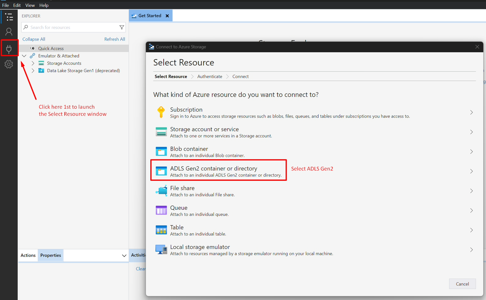
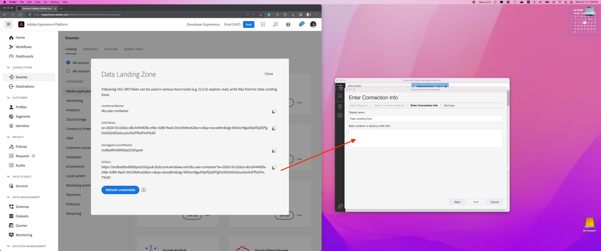
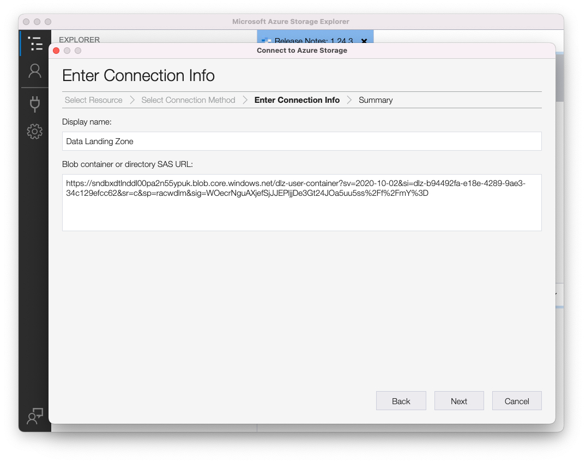
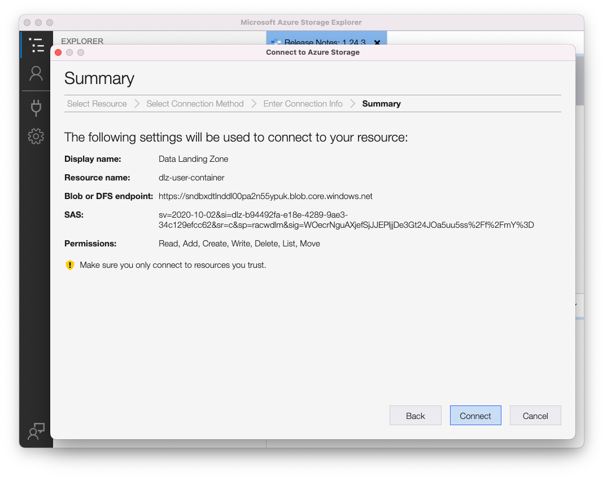
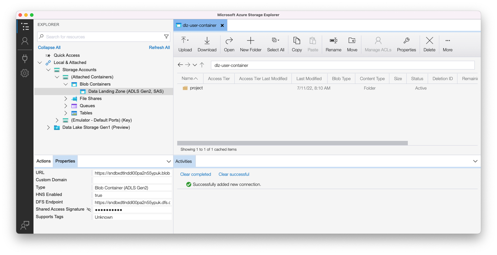

# Verwenden der Data Landing Zone

## Voraussetzungen

Wenn Sie Azure Storage Explorer nicht heruntergeladen haben, tun Sie dies jetzt, da dies für dieses Labor erforderlich ist.  Den Download finden Sie unter folgendem Link:

[Herunterladen von Azure Storage Explorer](https://azure.microsoft.com/en-us/blog/microsoft-azure-data-lake-storage-adls-in-storage-explorer-public-preview/)

1. Installieren des Programms
1. Akzeptieren Sie beim ersten Öffnen der Anwendung die Endbenutzer-Lizenzvereinbarung

## Konfigurieren von Azure Storage Explorer mit Experience Platform

1. Öffnen Sie Azure Storage Explorer, klicken Sie auf das Symbol **Ressource auswählen** und wählen Sie dann **ADLS Gen2-Container oder -Verzeichnis**

   

1. Wählen Sie **Shared Access Signature URL (SAS)** und klicken Sie auf **Weiter**

   

1. Geben Sie den Anzeigenamen als **Data Landing Zone“**

   >[!NOTE]
   >
   >Sie können mit diesem Schritt nicht fortfahren, bis Sie die SAS-URL angeben.  Sie erhalten dies von der Experience Platform, die Sie im nächsten Schritt sehen.

   

1. Gehen Sie zu Adobe Experience Platform und navigieren Sie wie folgt zur Data Landing Zone:

   - Navigieren Sie zu **Quellen -> Katalog**
   - Wählen Sie **Cloud-Speicher** unter den Quellen aus.
   - Suchen Sie als Nächstes die Karte **Data Landing Zone** .
   - Klicken Sie auf die Karte Data Landing Zone und dann auf **Anmeldedaten anzeigen** in der rechten Leiste

   

1. Kopieren Sie den **SASUri** aus dem modalen Fenster, das angezeigt wird.

   Navigieren Sie zurück zum Azure-Speicher-Explorer und fügen Sie den **SASUri-Wert** in den **Blob-Container oder Verzeichnis-SAS-URL** ein, den Sie im vorherigen Schritt leer gelassen haben

   

1. Klicken Sie **Weiter** um fortzufahren

   

1. Klicken Sie im Bildschirm Zusammenfassung auf **Verbinden**

Jetzt sollte ein Bildschirm angezeigt werden, der wie folgt aussieht

>[!SUCCESS]
>
>Herzlichen Glückwunsch!  Sie haben Azure Storage Explorer erfolgreich konfiguriert
