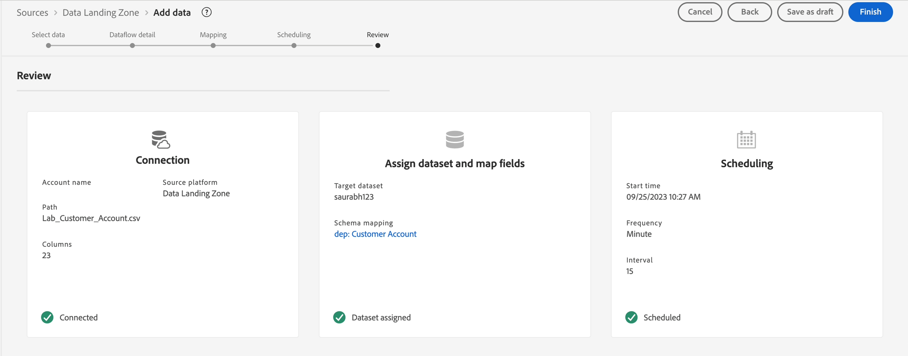
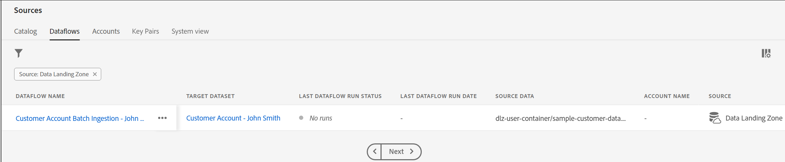

# Datenfluss planen

Im Schritt **Planung**:

1. Stellen Sie die **Häufigkeit** auf Minute ein.
1. Stellen Sie **Intervall** auf 15 ein, d. h. auf 15 Minuten.
1. Aktivieren Sie **Option** Aufstockung“.

>[!NOTE]
>
>Beachten Sie, dass **Startzeit** in UTC angegeben ist.
>
>Coordinated Universal Time (UTC) ist ein globaler Zeitstandard, der als Bezugspunkt für die Zeitmessung weltweit verwendet wird. Für ein global verteiltes Team stellt sie eine gemeinsame Referenz für verschiedene Regionen und Länder bereit, was die Koordination von Aktivitäten und die Planung von Ereignissen über verschiedene Zeitzonen hinweg erleichtert.
>
>In verschiedenen Teilen der AEP-Benutzeroberfläche wird UTC-Zeit als Grundlage für die Zeitplanung angezeigt. UTC Time ist 1 Stunde hinter London Time. Wenn Sie sich bezüglich der UTC-Zeit nicht sicher sind, googeln Sie einfach „UTC-Zeit jetzt“.

>[!NOTE]
>
>In der Praxis führt **Option** Aufstockung“ eine einmalige Aufstockung aller Dateien durch, und die nachfolgenden Ausführungen nehmen neue Dateien auf.

Überprüfen Sie den Datenfluss und klicken Sie auf **Beenden.**

>[!CAUTION]
>
>Wenn Sie die Option **Einmal ausführen** für Ihren Datenfluss auswählen, können Sie diesen Zeitplan nicht bearbeiten oder den Datenfluss später aktualisieren. Sie können den Datenfluss jedoch bei Bedarf ausführen, d. h. erneut ausführen, wenn Sie neue Daten aufnehmen müssen.

Nachdem Sie auf **Beenden** geklickt haben, gelangen Sie zurück zum Bildschirm **Datenflüsse**. Es sollte einige Minuten dauern, bis der Datenfluss erstellt ist. Beachten Sie, dass der letzte Ausführungsstatus für den Datenfluss &quot;**Ausführungen“**. Der erste Durchgang sollte in ein paar Minuten beginnen.

&#x200B;> [!NOTE]
>
>Sie müssen die Seite kontinuierlich aktualisieren, um die Statusaktualisierung anzuzeigen, da das Backend keine Aktualisierungen an die Benutzeroberfläche sendet.

>[!NOTE]
>
>Wenn Sie alle Warnhinweise aktiviert haben, erhalten Sie einen Warnhinweis in Ihrem Browser in der oberen rechten Ecke Ihres Browsers, wenn der Fluss zu laufen beginnt und erfolgreich abgeschlossen wird oder fehlschlägt
