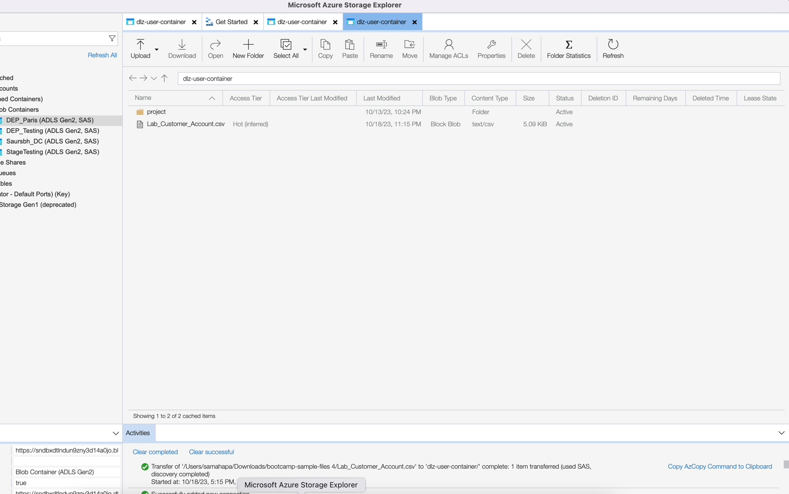
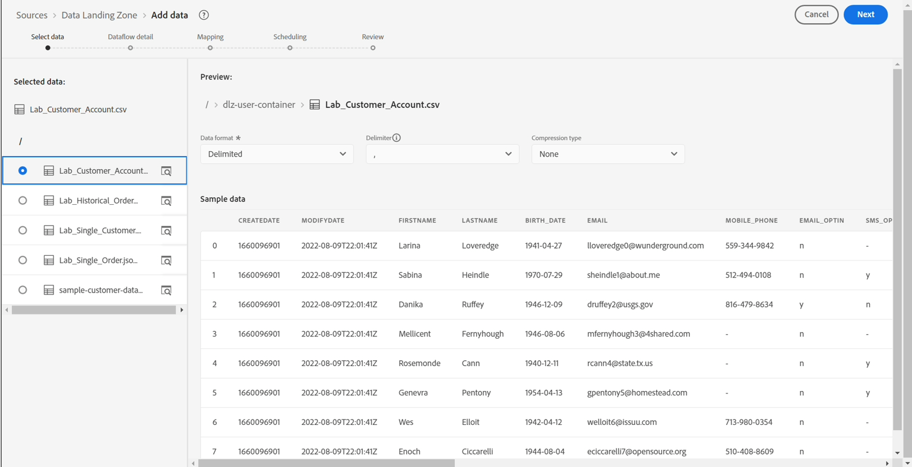
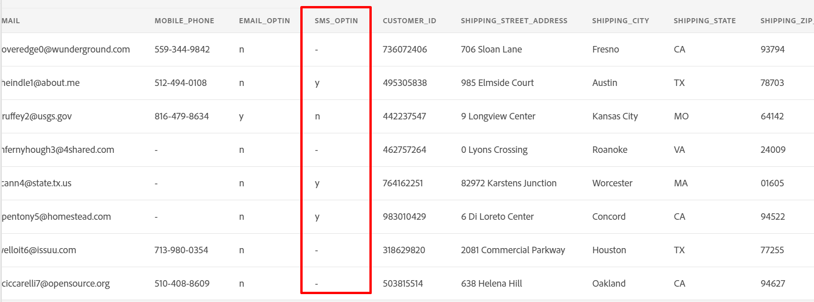

# Einrichten der Quelle

## Beispieldatei hochladen

Sie müssen eine Beispieldatendatei über den Azure Storage Explorer in Ihre Data Landing Zone hochladen, damit Sie sie im Labor verwenden können.  Gehen Sie dazu wie folgt vor:

1. Herunterladen der [Beispieldateien](../../sample-files.md)
1. Ziehen Sie die Datei „Lab\_**\_Account.csv“ per Drag-and-Drop**/oder laden Sie sie in die Data Landing Zone hoch, die Sie im vorherigen Schritt gespeichert haben.

Nach dem Hochladen sollte Ihr Bildschirm wie im folgenden Screenshot aussehen.

>[!WARNING]
>
>Laden Sie die Datei nicht in den Ordner *Projekt* hoch. Es enthält vorab geladene Daten, die Sie nicht in unseren Laboren verwenden.

## Zu Quellen navigieren

1. Wechseln Sie zu Adobe Experience Platform und navigieren Sie zu: **Quellen** -> **Katalog** -> **Cloud-Speicher**
1. Klicken Sie auf **Setup**/**Daten hinzufügen** für die Data Landing Zone

>[!NOTE]
>
>Wenn für diese Quelle mindestens eine Verbindung vorhanden ist, wird **Standardaktion &quot;** hinzufügen“ angezeigt. Wenn für diese Quelle keine Verbindungen vorhanden sind, wird **Setup** als Standardaktion angezeigt

## Vorschau der Datei

1. Wählen Sie **Lab\_customer\_account.csv**

1. Sehen Sie sich im Vorschaubereich die folgenden Attribute an und beachten Sie Folgendes:

- **sms\_optIn** ist ein Einverständnisfeld mit mehreren fehlenden Werten (in der Vorschau als - angezeigt)
- **KONTO\_ERSTELLEN\_**) hat nicht das richtige Datumsformat. Sie enthält Zeichenfolgenwerte sowie Datums- und Uhrzeitwerte in einer Zeichenfolge.
- **account\_end\_date** hat das richtige Datumsformat.

>[!NOTE]
>
>Die fehlenden Werte, Daten und falsch formatierten Felder müssen Sie später in diesem Labor in den Zuordnungsschritten berücksichtigen

1. Klicken **oben** auf „Weiter“, um mit dem nächsten Schritt fortzufahren

## Datenfluss einrichten

1. Wählen Sie im Bildschirm Datenflussdetails die Option **Neuer Datensatz**.
1. Benennen Sie den Ausgabedatensatz als **Kundenkonto - &lt;Ihre Initialen>**
1. Wählen Sie das Schema **dep: Kundenkonto** aus der Dropdown-Liste aus.
1. Aktivieren Sie das **Profildatensatz**-Umschalter.
(Wenn Sie dies nicht aktivieren, kann der Profilspeicher nicht überwachen, ob neue Daten in diesen Datensatz eingehen, und nimmt diese Daten daher nicht in Profile auf.)
1. Aktivieren Sie **Teilweise Aufnahme aktivieren**.
(Wenn Sie dies nicht aktivieren, kann die Aufnahme fehlschlagen, wenn einer der Datensätze Fehler aufweist)
1. Legen Sie den Datenflussnamen als **Batch-Aufnahme des Kundenkontos - &lt;Ihre Initialen>**
1. Aktivieren Sie alle Warnhinweise **Quellen: Datenflussstart/-erfolg/-fehler**

>[!CAUTION]
>
> Stellen Sie sicher **dass Sie den** sowohl für die Profil- als auch für die partielle Aufnahme aktiviert haben.

Klicken Sie **Weiter** in der oberen rechten Ecke des Bildschirms, um mit dem nächsten Schritt fortzufahren.

>[!NOTE]
>
>**Partielle Aufnahme aktivieren** gibt die Anzahl der Fehler (**INGEST** und **DCVS**) als Prozentsatz der Gesamtzahl der Datensätze an, die fehlschlagen können, bevor der gesamte Datenfluss als Fehler deklariert wird.
