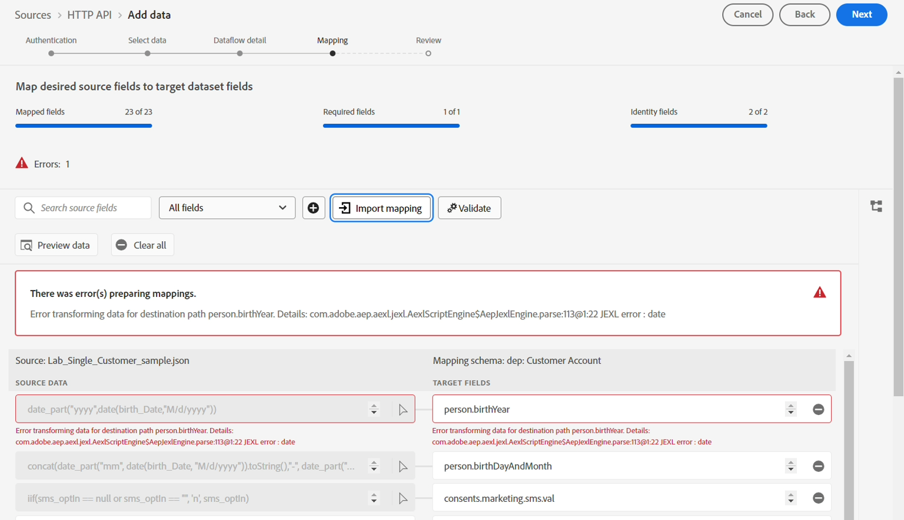
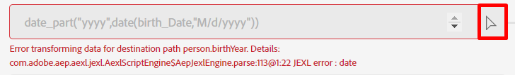

# Konfigurieren der Zuordnung

> [!NOTE]
>
>Befolgen Sie diesen Abschnitt nur, wenn Sie das Labor zur Batch-Aufnahme erfolgreich abgeschlossen haben.  Andernfalls führen Sie die Schritte [Zuordnungsdaten](../batch-ingestion/mapping-data/overview.md) im Labor zur Batch-Aufnahme aus.

## Zuordnungssatz importieren

Wenn Sie das Labor für die Batch-Aufnahme abgeschlossen haben, können Sie den dort erstellten Zuordnungssatz 😄🎉 wiederverwenden

Führen Sie die folgenden Schritte aus:

1. Klicken Sie auf die **Zuordnung importieren** im Bildschirm Zuordnung .

1. Wählen Sie den Datenfluss aus, den Sie im Abschnitt Batch-Aufnahme erstellt haben, und wählen Sie ihn aus.  Sie sollte wie folgt benannt sein **Customer Account Batch v2 - \&lt;Ihre Initialen>.**

Nach dem Import werden Fehler angezeigt.  Dies liegt daran, dass sich das für das Feld „Birth\_Date“ in der Beispieldatei verwendete Datumsformat geändert hat.

- Verwendete Batch-Beispieldatei -> MM/TT/JJJJ
- Stream-Beispieldatei verwendet -> JJJJ-MM-TT

Die berechneten Felder, die **date**-Funktionen verwenden, müssen aktualisiert werden, um die Änderung des verwendeten Datumsformats zu berücksichtigen.

## Berechnete Felder aktualisieren

Aktualisieren Sie jedes berechnete Feld, indem Sie einfach auf das Pfeilsymbol neben jedem berechneten Feld klicken und dann Ihre Zuordnungen validieren

| Zielfeld | Neues berechnetes Feld |
| ----------------------- | ----------------------------------------------------------------------------------------------------------------------------------- |
| person.BirthYear | date\_part(„jjjj“,date(Birth\_Date,„jjjj-M-d„)) |
| person.bornDayAndMonth | concat(date\_part(„mm“, date(born\_date, „yyyy-M-d„)).toString(), &quot;-&quot;, date\_part(„dd“, date(born\_date, „yyyy-M-d„)).toString()) |
