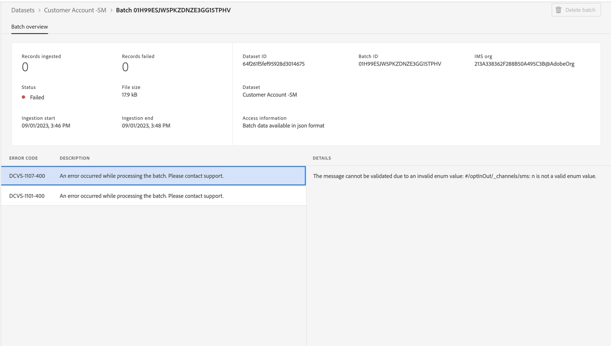
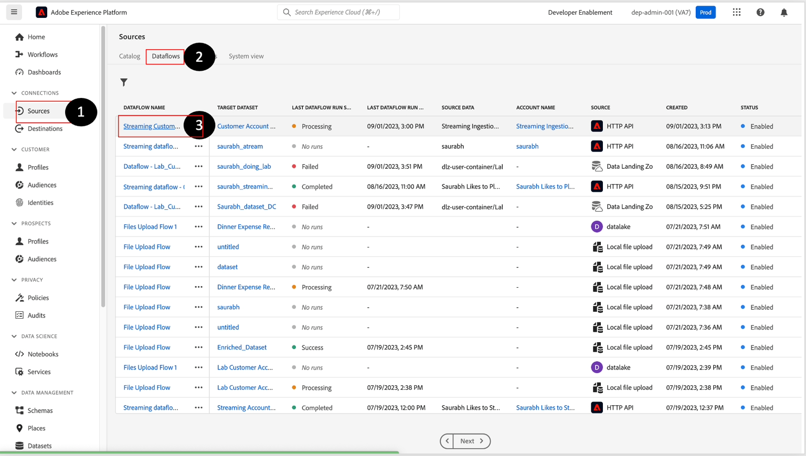

# Überwachung und Debugging von Fehlern

>[!NOTE]
>
>Die Überwachung der Streaming-Aufnahme erfolgt auf Datenflussebene, d. h. wenn Sie sie in der Benutzeroberfläche anzeigen, wird der Data Lake angezeigt.  Das bedeutet, dass Batches ca. alle 60 Minuten angezeigt werden (die Mikrobatches, die von der Streaming-Pipeline verarbeitet werden).  Wenn Ihre Daten also nicht im Echtzeit-Kundenprofil angezeigt werden, müssen Sie bis zu 60 Minuten warten, um das Problem zu diagnostizieren.

## Überwachungs-Dashboard anzeigen

1. Navigieren Sie zu **Überwachung->Streaming End-to-End** und suchen Sie Ihren **Datenfluss**:

   

1. Sie sollten eine Vorschau der Registerkarte **Dashboard** anzeigen, um Pipeline-Metriken zu Batch-Aufnahme-Workflows anzuzeigen.

>[!NOTE]
>
>Auf diesem Überwachungsbildschirm können Sie den Status Ihrer verschiedenen Datenflussausführungen sehen.  Beachten Sie die verschiedenen Metriken, die Ihnen im oberen Bereich zur Verfügung stehen.  Diese Metriken können äußerst nützlich sein, um den Zustand Ihrer Datenpipeline in der Experience Platform zu verstehen

## Debuggen von Fehlern

1. Wenn Ihr Datenfluss Fehler aufweist, weil Sie die Anweisungen nicht befolgt haben, sehen Sie Folgendes.

   

1. Wenn Sie auf Fehler klicken, wird der folgende Bildschirm angezeigt:

   

   >[!NOTE]
   >
   >Ein erfolgreicher Mikro-Batch kann länger als 15 Minuten dauern, da möglicherweise Zeit benötigt wird, um die Datensätze in den Data Lake zu schreiben.

1. Analysieren Sie die Fehlermeldung, identifizieren Sie die **Quell-/Zielfelder** und suchen Sie nach dem Code:

   - **XXXX**: Dies ist ein schwerwiegender Fehler, entweder aufgrund von Datenbeschädigungen oder Formatierungsproblemen, d. h. wenn kein Regex-Format eingehalten wird.
   - **DCVS XXXX** - Dieser Fehler tritt bei `required` Feldern auf. Wenn die Werte nicht vorhanden sind oder falsch zugeordnet wurden (also nicht innerhalb der Aufzählungsliste), werden diese Zeilen übersprungen.
   - **MAPPER XXXX** - Dies sind Warnungen, und es werden keine Zeilen übersprungen. Die Werte wurden jedoch möglicherweise „ungültig“ gemacht. Sie sollten daher sicherstellen, dass sie sich nicht auf nachgelagerte Aktivitäten auswirken.

1. Um die Fehler zu beheben, müssen Sie zu **Quellen->Datenflüsse->Datenflussname->Datenfluss aktualisieren** gehen und Ihre Zuordnungen korrigieren.

>[!NOTE]
>
>Sie müssen die JSON-Beispieldatei erneut hochladen, indem Sie sie zuerst löschen und erneut hinzufügen, damit der Mapper jetzt zur Validierung mit einer neuen Kopie aktualisiert wird.

