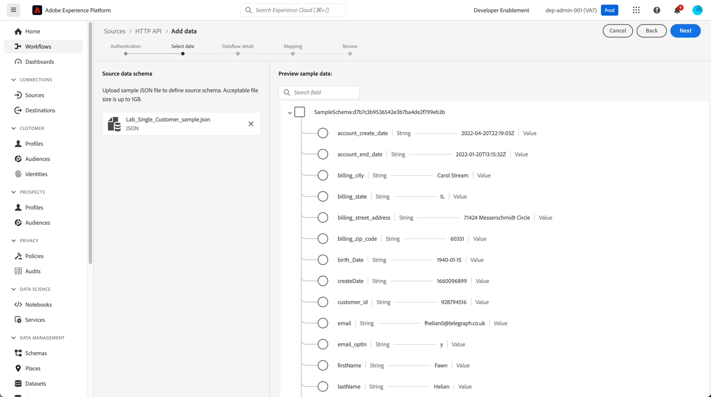

# Einrichten der Quelle

## Zu Streaming-Quellen navigieren

1. Wechseln Sie zur Adobe Experience Platform-Benutzeroberfläche und navigieren Sie zu **Quellen**
1. Klicken Sie in **oberen Navigationsleiste auf** Katalog“.
1. Wählen Sie **Streaming** aus der Liste der Quellen aus (stellen Sie sicher, dass das Optionsfeld Alle Quellen ausgewählt ist)
1. Klicken Sie auf **Setup** / **Daten hinzufügen** für die HTTP-API

## Erstellen eines HTTP-API-Kontos

Als Erstes müssen Sie ein neues Konto erstellen. Dieses Konto enthält Details dazu, wie die Authentifizierung verarbeitet wird und ob die in gestreamten Daten XDM-kompatibel sind (d. h. bereits mit der Struktur des zugrunde liegenden XDM-Schemas übereinstimmen)

Führen Sie die folgenden Aufgaben aus:

1. Wählen **Neues Konto** aus und fügen Sie die folgenden Details hinzu:
   - Kontoname -> `Streaming Ingestion - <Your Initials>`
1. Lassen Sie den Umschalter für **Authentifizierung aktivieren** deaktiviert
1. Lassen Sie das Kontrollkästchen für **XDM-kompatibel** deaktiviert
1. Klicken Sie auf die **Mit Quelle verbinden**, um fortzufahren

>[!CAUTION]
>
>Schalten Sie NICHT die Option **Authentifizierung aktivieren** ein oder aktivieren Sie nicht das Kontrollkästchen für **XDM-kompatibel**. Das bricht das Labor

Ihr Bildschirm sollte wie folgt aussehen:

Jetzt sollte ein grünes Kontrollkästchen mit der Meldung „Verbunden“ angezeigt werden. Klicken Sie auf **Weiter** oben rechts, um mit der Einrichtung Ihres Datenflusses fortzufahren:

## Hochladen von Beispieldaten

>[!NOTE]
>
>Wenn Sie dies noch nicht getan haben, laden Sie unbedingt die [Beispieldateien](../sample-files.md)

1. Laden Sie im Abschnitt Source-Datenschema des Bildschirms die JSON-Datei **Lab\_Single\_Customer\_sample.json** aus Ihrem lokalen Dateisystem hoch, das Sie aus dem vorherigen Labor heruntergeladen haben.
1. Nach dem Hochladen der Datei wird eine Vorschau wie folgt angezeigt. Klicken Sie auf **Weiter** oben rechts, um fortzufahren. Beobachten Sie, wie das Feld Geburtsdatum im Vergleich zum Format MM/TT/JJJJ, das Sie zuvor im Labor zur Batch-Aufnahme gesehen haben, in einem anderen Format JJJJ-MM-TT liegt.

>[!NOTE]
>
>Die JSON-Beispieldatei enthält einen einzelnen Datensatz für das Entwerfen und Validieren der Pipeline. Wenn Sie scrollen möchten, müssen Sie auf die XDM-Knoten klicken, damit die Knoten scrollen.

## Konfigurieren von Datenflussdetails

In diesem Bildschirm erstellen Sie einen bestimmten Datenfluss, der das von Ihnen eingerichtete HTTP-API-Konto nutzt.  Pro Konto können viele Datenflüsse vorhanden sein.  In diesem Szenario müssen Sie einen Datenfluss für das Streaming von Kundenkontodaten erstellen. Ein Datenfluss erfordert eine Verknüpfung zwischen einem Quellkonto, einem Datensatz mit verknüpftem Schema und Konfigurationsdetails.

Führen Sie die folgenden Schritte aus:

1. Erstellen Sie einen neuen Datensatz und nennen Sie ihn -> `Customer Account Stream - <Your Initials>`
1. Wählen Sie **Schema** als ->`dep: Customer Account`
1. Stellen Sie sicher **dass der Umschalter** Profildatensatz **aktiviert**.  Falls nicht **aktivieren**.
1. Aktualisieren Sie den **Datenflussnamen** wie folgt:
   - `Customer Account Stream - <Your Initials>`
1. Klicken Sie auf **Weiter**, um fortzufahren

>[!NOTE]
>
>Wenn Sie den Datensatz nicht für Profil aktivieren, werden die Daten nur in den Data Lake gestreamt. Ihre Streaming-Ereignisse werden nicht im Profil oder Identitätsdiagramm angezeigt.
