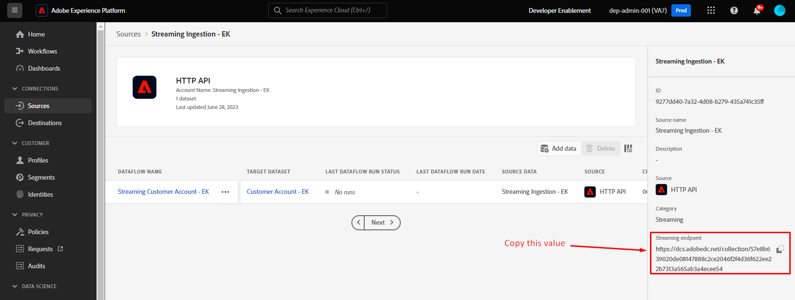
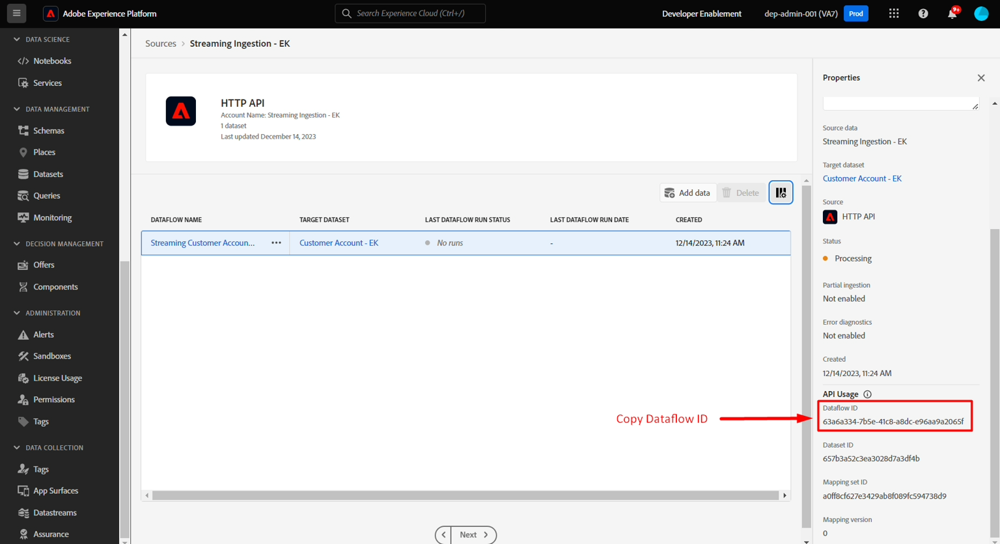
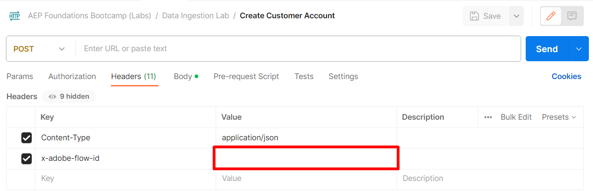
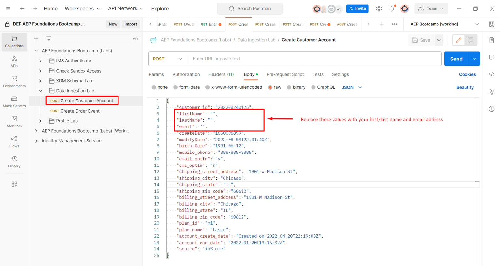

# Profil streamen

## API-Übersicht

Es ist wichtig, die Struktur der -API beim Streaming von Daten in Rohform an Adobe Experience Platform zu verstehen, damit Sie sie unabhängig davon, welchen Datenfluss Sie erstellen, einfach neu erstellen können.  Nachfolgend finden Sie ein Beispiel für die grundlegende Struktur des Aufrufs unter Verwendung von cURL

**Beispielanfrage (Rohdaten)**

```curl
curl --location '' \
--header 'Content-Type: application/json' \
--header 'x-adobe-flow-id:  <dataflow-id>;' \
--header 'Authorization: Bearer XXX;' \
--data '{
    "customer_id": "202208240125",
    "firstName": "",
    "lastName": "",
    "email": "",
    "createDate": "1660096899",
    "modifyDate": "2022-08-09T22:01:40Z",
    "birth_Date": "1991-06-12",
    "mobile_phone": "888-888-8888",
    "email_optIn": "y",
    "sms_optIn": "n",
    "shipping_street_address": "1901 W Madison St",
    "shipping_city": "Chicago",
    "shipping_state": "IL",
    "shipping_zip_code": "60612",
    "billing_street_address": "1901 W Madison St",
    "billing_city": "Chicago",
    "billing_state": "IL",
    "billing_zip_code": "60612",
    "plan_id": "m1",
    "plan_name": "basic",
    "account_create_date": "Created on 2022-04-20T22:19:03Z",
    "account_end_date": "2022-01-20T13:15:32Z",
    "source": "inStore"
}'
```


Einige wichtige Elemente, die in der obigen Aufforderung zu beachten sind:

| Schlüsselelemente | Erforderlich | Beschreibung |
| --------------------------- | -------- | ------------------------------------------------------------------------------------------------------------------------------------------------------------------------------------------- |
| Anfrage-URL (d. h. Speicherort) | - | Dies ist die URL des von Ihnen erstellten HTTP-API-Quellkontos, auf das die Streaming-Daten verweisen. **Es ist immer vom Typ POST** |
| Kopfzeile &#39;Content-Type&#39; | * | Die Einstellung ist immer `application/json`, da die gesendeten Daten im JSON-Format vorliegen |
| Kopfzeile „x-adobe-flow-id“ | - | Festgelegt auf die vom Quell-Connector erstellte Datenfluss-ID |
| Header &#39;Authorization&#39; | * | Optionaler Wert, wird aber aus Sicherheitsgründen dringend empfohlen. Dies ist der gleiche `access_token`, den Sie während des [Postman-Setups erstellt ](../../postman-setup/environment-file.md). |
| Hauptteilinhalt | - | Enthält die Daten, die tatsächlich an Adobe Experience Platform gesendet werden sollen |

>[!NOTE]
>
>Der Textinhalt sollte immer im JSON-Format vorliegen und mit der Beispiel-Payload übereinstimmen, die beim Entwurf des Datenflusses bereitgestellt wurde


## Sammeln erforderlicher Werte

Bevor Sie Daten streamen können, müssen Sie einige der oben aufgeführten erforderlichen Werte erfassen (d. h. speziell die URL des Streaming-Endpunkts und die „Header“-Werte für den Hauptteil des Inhalts).

Führen Sie die folgenden Schritte aus:

1. Kopieren Sie den **Streaming** Endpunkt) und speichern Sie ihn auf Ihrem lokalen Computer (vorausgesetzt, Sie haben den Schritt des vorherigen Abschnitts nicht verlassen). Wenn Sie die Seite verlassen haben, finden Sie sie unter Quellen->Konten.

   >[!NOTE]
   >
   >Wenn Sie die Seite verlassen haben, können Sie folgendermaßen zu dieser Seite gelangen:
   >
   >- Klicken Sie in **linken Leiste** Quellen“.
   >- Stellen Sie sicher, dass Sie sich auf **Registerkarte** Konten“ befinden und auf das von Ihnen erstellte Konto **Streaming-Aufnahme - \&lt;Ihre Initialen>** klicken

   >[!NOTE]
   >
   >Wenn dieser Wert nicht angezeigt wird, stellen Sie sicher, dass Sie die Datenflusszeile nicht durch Klicken auf die Zeile ausgewählt haben.  KLICKEN SIE NICHT AUF DIE BLAUEN LINKS

   


1. Wählen Sie die Datenflusszeile aus, indem Sie auf eine beliebige Stelle klicken und so die blauen Links vermeiden. Kopieren Sie die **Datenfluss-ID** und speichern Sie sie an einem sicheren Ort




## Aktualisieren der API-Anfrage

Wechseln Sie zu Ihrer Postman-Anwendung und aktualisieren Sie die Anfrage „Kundenkonto erstellen“ mit den soeben erfassten Informationen.

1. Öffnen Sie Postman und navigieren Sie zur **Datenaufnahme-Lab > Kundenkonto erstellen** API-Anfrage und öffnen Sie sie

   


1. Kopieren Sie den Wert **Streaming-Endpunkt** den Sie zuvor in die URL der Anfrage gespeichert haben, und fügen Sie ihn ein

   


1. Kopieren Sie den zuvor gespeicherten Datenfluss-ID-Wert und fügen Sie ihn in den Kopfzeilenwert **x-adobe-flow-id** ein

   


1. Aktualisieren Sie im Hauptteil der Anfrage die folgenden Attribute wie folgt:

   - **firstName** -> Ihr Vorname
   - **lastName** -> Ihr Nachname
   - **email** -> Ihre E-Mail-Adresse
   - **Geburtsdatum** -> JJJJ-MM-TT

   **5.** speichern

1. Klicken Sie auf die Schaltfläche **Senden**, um die Streaming-Anfrage in Ihrem Kundenkontoprofil auszuführen

   


1. Sie sollten eine `200 OK` erhalten, die angibt, dass sie erfolgreich vom Adobe Experience Platform empfangen wurde

Beispielantwort 200 OK

```none
{
    "inletId": "57e8b639020de08147888c2ce2046f2f4d36f622ee22b7313a565ab3a4ecee54",
    "xactionId": "1688068236344:7186:152",
    "flowId": "7d1d1a20-3df2-43fb-8bd8-2856bb3ea6a4",
    "receivedTimeMs": 1688068236344
}
```

>[!NOTE]
>
>Beachten Sie die **xactionId** in der Antwort.  Wenn jemals ein Fehler auftritt, bei dem kein Datensatz aufgenommen wird, sollte dieser stets als Teil eines Support-Tickets bereitgestellt werden, da es sich dabei um einen Aufzählungszeichen handelt, das von unseren Support-Teams verwendet wird, um Umgebungsprobleme zu debuggen

>[!TIP]
>
>Herzlichen Glückwunsch!  Sie haben einen Profildatensatz erfolgreich in Adobe Experience Platform gestreamt
