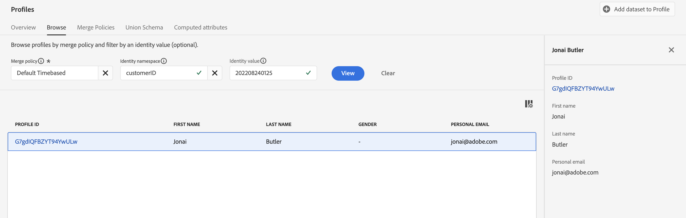

# Überprüfen des aufgenommenen Profils

## Streaming-Validierung

Für die Validierung von Streaming-Daten innerhalb von Adobe Experience Platform sind einige verschiedene Schritte erforderlich.  Beachten Sie, dass Streaming-Daten je nach Konfiguration des Datensatzes in mehrere Datenbanken schreiben können.

| Speicher | Latenz | Beschreibung |
| -------------- | -------------------------------------------------------------------------- | ---------------------------------------------------------------------- |
| Data Lake | \~Bis zu 60 Minuten | Der letzte Ruheplatz für alle Streaming-Daten |
| Profilspeicher | \~1 Min. im Durchschnitt Aber bis zu \~15min | verarbeitet Daten nur, wenn der zugrunde liegende Datensatz für das Profil aktiviert ist |
| Identitätsspeicher | \~1 min Durchschnitt \~10 min Mikro-Batches für neue Identitätsbeziehungen | verarbeitet Daten nur, wenn der zugrunde liegende Datensatz für das Profil aktiviert ist |

Je nachdem, was Sie zu validieren versuchen, müssen Sie möglicherweise zu einigen verschiedenen Orten gehen, wie Sie von oben sehen können.  In diesem Szenario haben Sie die Daten in das Profil geschrieben (da Sie den Datensatz für das Profil aktiviert haben). Überprüfen Sie daher den Profilspeicher, um festzustellen, ob das Profil vorhanden ist.

## Profil nachschlagen

1. Navigieren Sie in der Benutzeroberfläche zu **Profile -> Durchsuchen**
1. Geben Sie die folgenden Werte in die Eingabefelder Identity-Namespace und Identitätswert ein:
   - **Identity-Namespace** -> `customerID`
   - **Identitätswert** -> `202208240125`
1. Klicken Sie auf **Ansicht**, um Ihr Profil zu suchen
1. Klicken Sie auf den **Profilkennung** in der zurückgegebenen Zeile, um Ihr Profil anzuzeigen

Bitte schauen Sie sich Ihr Profil an und überprüfen Sie, ob es mit dem übereinstimmt, was Sie gestreamt haben. Ziemlich cool, was!

>[!NOTE]
>
>Angesichts der \~10min Latenz bei der Zuordnung neuer Identitätsbeziehungen hätten Sie, wenn Sie versucht hätten, Ihr Profil mithilfe des E-Mail-Namespace nachzuschlagen, keine Antwort erhalten.
>
>Durch die Verwendung des Namespace „customerID“ anstelle von (was der primären Identität entspricht) wurde sichergestellt, dass Sie das Profil sofort nachschlagen können.
>
>Denken Sie daran, dass das Profil nur über die primären Identitäten 😄 weiß
