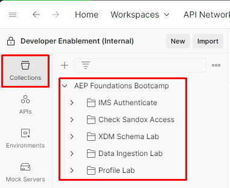

# API-Sammlung

## Postman-API-Sammlungsdatei

Datei herunterladen - [AEP Foundations Bootcamp (Labs).postman_collection.json](assets/aep-foundations-bootcamp-labs.postman_collection.json)

## API-Sammlung importieren

1. Öffnen Sie die `Postman API Collection File` von oben in Ihrem Browser, indem Sie auf die Datei klicken
1. URL der Datei in die Zwischenablage kopieren
1. Starten Sie Postman auf Ihrem lokalen Computer und klicken Sie in Ihrem Arbeitsbereich auf die Schaltfläche `Import` .
1. Fügen Sie die URL der `Postman API Collection File` in das Textfeld „Modal importieren“ ein. Dadurch wird ein automatischer Import Trigger

Jetzt wird in der linken Seitenleiste auf der Registerkarte &quot;`Collections`&quot; eine Sammlung namens &quot;`AEP Foundations Bootcamp`&quot; angezeigt

## Übersicht über die Bootcamp-Sammlung in AEP Foundations

Die von Ihnen importierte API-Sammlung enthält alle erforderlichen API-Aufrufe, die Sie für Labs im gesamten Bootcamp benötigen.  Jedes Labor ist in einen bestimmten Ordner mit eigenen APIs unterteilt.  Beachten Sie diese Ordnerstruktur, wenn Sie diese Woche Labs abschließen.

Details zu den einzelnen Ordnern finden Sie unten:

- **IMS Authenticate** - enthält eine einzelne Anfrage zum Generieren eines Zugriffs-Tokens, das beim Arbeiten mit einer der Adobe Experience Platform-APIs erforderlich ist
- **XDM Schema Lab** - enthält eine Reihe von Anfragen zum Erstellen der XDM-Komponenten, die zum Erstellen und Konfigurieren eines Schemas für das Echtzeit-Kundenprofil erforderlich sind
- **Datenaufnahme-Lab** - enthält eine Reihe von Anfragen für das Streaming von Daten an Experience Platform
- **Profil-Lab** - Enthält eine Reihe von Anfragen zum Anzeigen der Eigenschaften und Verhaltensweisen des Echtzeit-Kundenprofils

>[!SUCCESS]
>
>Herzlichen Glückwunsch!  Sie haben die Postman-Sammlung des Bootcamps erfolgreich importiert
