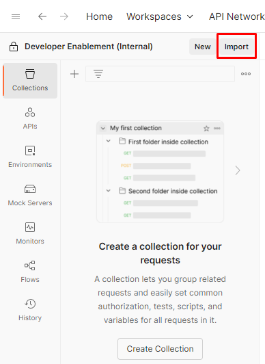
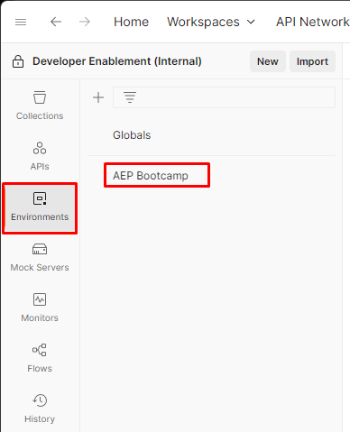
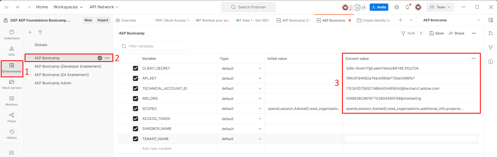
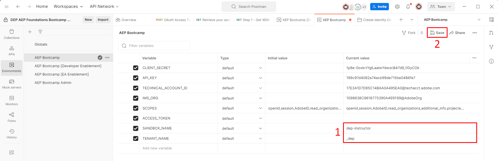

# Umgebungsdatei

## Postman-Umgebungsdatei

Datei herunterladen - [AEP Bootcamp.postman_environment.json](assets/aep-bootcamp.postman_environment.json)

## Umgebungsdatei importieren

1. Öffnen Sie die `Environment File` von oben in Ihrem Browser, indem Sie auf die Datei klicken
1. URL der Datei in die Zwischenablage kopieren
1. Starten Sie Postman auf Ihrem lokalen Computer und klicken Sie in Ihrem Arbeitsbereich auf die Schaltfläche `Import` .
1. Fügen Sie die URL der `Environment File` in das Textfeld „Modal importieren“ auf der Überlagerung ein.  Diese Aktion Trigger einen automatischen Import

Überprüfen Sie nach dem Import, ob Ihre Umgebungsdatei vorhanden ist, indem Sie in der linken Seitenleiste auf die Registerkarte `Environments` klicken.  Sie sehen etwas Ähnliches wie unten.

## Umgebungsvariablen

Bevor Sie API-Aufrufe ausführen, müssen Sie einige Variablen in der soeben importierten Umgebungsdatei aktualisieren.  Diese Variablen werden in den API-Aufrufen referenziert, um sicherzustellen, dass sie korrekt ausgefüllt sind.  Die Variablen sind in zwei Gruppen unterteilt:

- **Entwicklerprojektwerte** -> Dies sind die Standardvariablen, die aus dem Entwicklerprojekt generiert wurden, das in der Adobe Developer Console erstellt wurde
- **Other Values** -> Hierbei handelt es sich um benutzerdefinierte Variablen, die normalerweise von einem Benutzer für die Arbeit mit den verschiedenen Experience Platform-APIs erstellt werden

>[!NOTE]
>
>Diese Werte stammen von den OAuth-Server-zu-Server-Anmeldedaten, die Sie beim Einrichten von [Developer Console erstellt haben](../sandbox-setup/developer-console-setup.md#collect-your-values)

### Aktualisieren von Entwicklerprojektwerten

1. Klicken Sie in der linken Seitenleiste von Postman auf die Registerkarte `Environments` .
1. Klicken Sie als Nächstes auf die `AEP Bootcamp` Umgebungsdatei
1. Aktualisieren Sie die `current values` für die unten aufgeführten Variablen:
   - CLIENT\_SECRET
   - CLIENT\_ID (auch als API-SCHLÜSSEL bezeichnet)
   - TECHNICAL\_ACCOUNT\_ID
   - IMS\_ORG

Wenn Sie fertig sind, sollte Ihre Umgebungsdatei diesem Bild ähneln:

### Andere Werte aktualisieren

Die einzigen anderen Werte, die aktualisiert werden müssen, sind die Variable `SANDBOX_NAME` und die Variable `TENANT_NAME` .

- `SANDBOX_NAME`: Teilt Adobe Experience Platform mit, für welche Sandbox die Ausführung erfolgen soll
- `TENANT_NAME` - zum Vorausfüllen des Mandantennamens in bestimmten XDM-Aufrufen

>[!NOTE]
>
>Wenn Sie diese Labs unabhängig durchlaufen, anstatt an einer Live-Schulung mit einer sandbox-assignment.pdf zu arbeiten, suchen Sie über die URL der Adobe Experience Platform-Benutzeroberfläche nach beiden Werten, während Sie bei Ihrer Sandbox angemeldet sind. Beispiel:
>
>`https://experience.adobe.com/#/@dep/sname:prod/platform/home`
>
>- `SANDBOX_NAME` ist der Wert nach `sname:` - in diesem Beispiel `prod`
>- `TENANT_NAME` ist der Wert nach dem `@`, mit einem vorangestellten Unterstrich — in diesem Beispiel `_dep`

1. Aktualisieren Sie die `current values` für die unten aufgeführten Variablen:
   - SANDBOX\_NAME
   - MANDANT\_NAME
1. Speichern Sie Ihre Aktualisierungen, indem Sie auf die Schaltfläche `Save` oben rechts im Arbeitsbereich der Umgebung klicken

Wenn Sie fertig sind, sollte Ihre Umgebungsdatei wie folgt aussehen:

>[!SUCCESS]
>
>Herzlichen Glückwunsch! Sie haben die Konfiguration Ihrer Postman-Umgebung abgeschlossen
