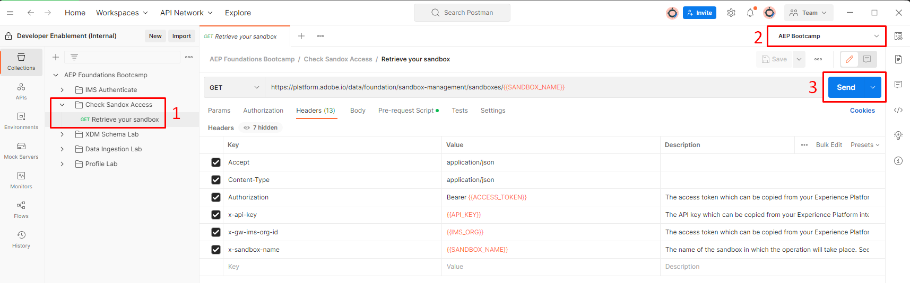
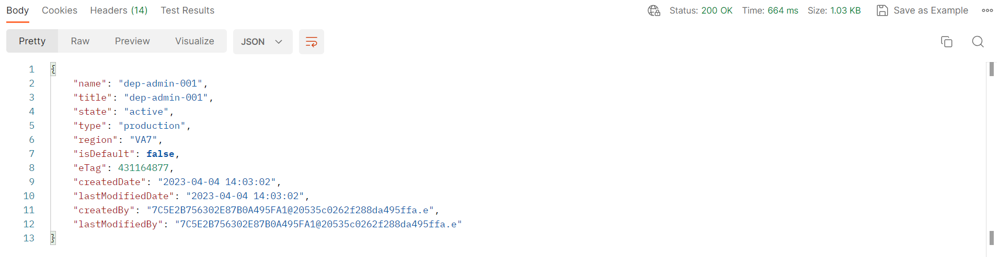

# Sandbox-Zugriff

Bevor Sie fortfahren, überprüfen Sie erneut, ob Ihr Zugriff gültig ist. Führen Sie die folgenden Schritte aus:

1. Öffnen Sie den Ordner mit dem Titel `Check Sandbox Access` und klicken Sie auf den Aufruf mit dem Titel `Retrieve Your Sandbox`
1. Als Nächstes sehen Sie in der oberen rechten Ecke von Postman ein Dropdown-Feld Umgebung .  Wählen Sie unbedingt die `AEP Bootcamp` Umgebung aus
1. Führen Sie den Aufruf aus, indem Sie auf die Schaltfläche `Send` klicken.

Eine erfolgreiche Antwort sieht wie folgt aus:

>[!NOTE]
>
>Der **name**-Wert sollte mit der Variablen „sandbox\_name“ in Ihrer Postman-Umgebung übereinstimmen

>[!SUCCESS]
>
>Herzlichen Glückwunsch!  Sie können jetzt mit der Verwendung der Experience Platform-APIs beginnen
