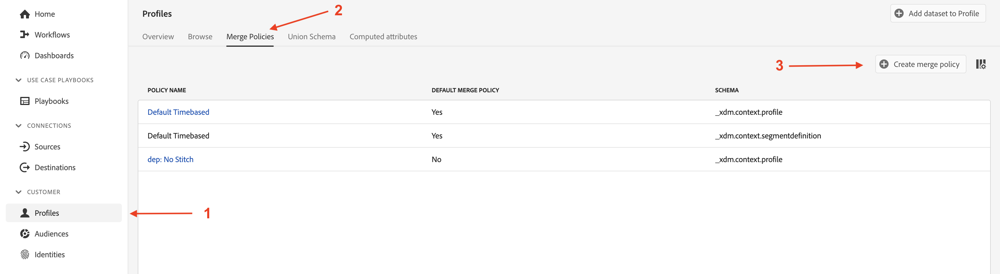
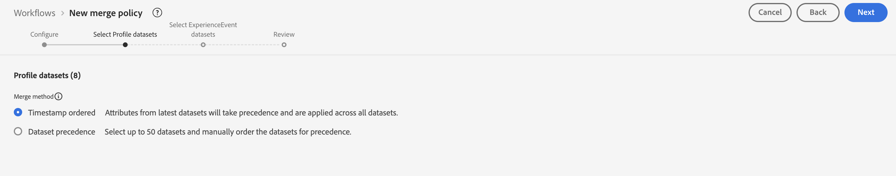
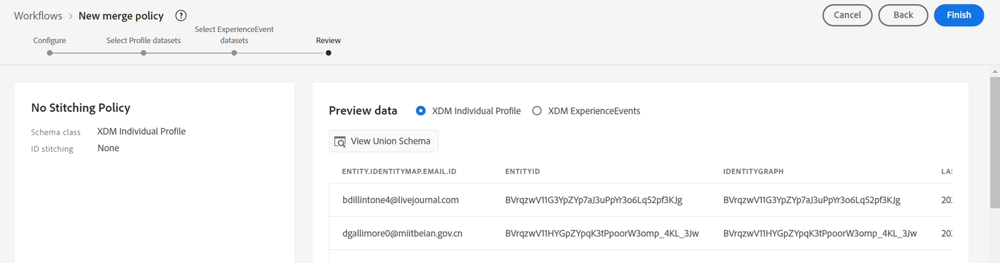
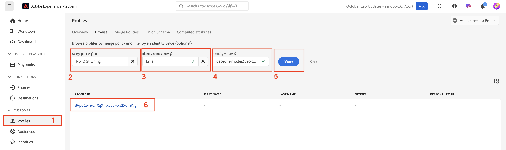
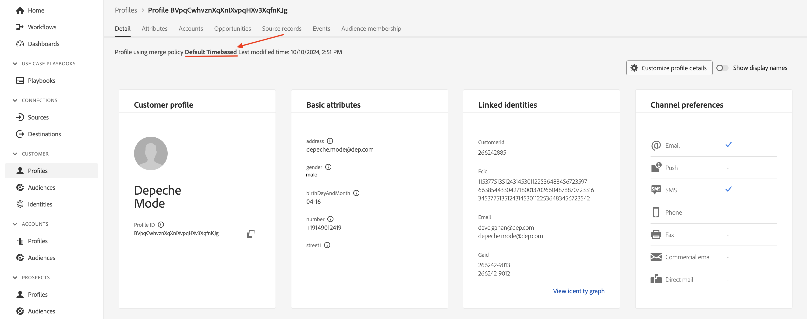
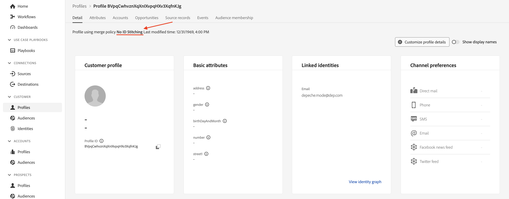
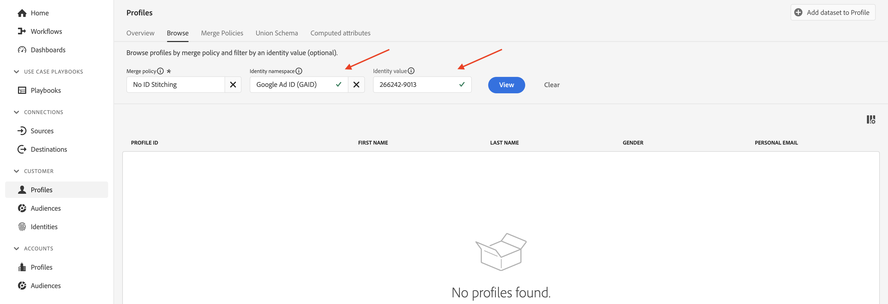

# Zusammenführungsrichtlinien

## Was ist das?

Sie sehen Zusammenführungsrichtlinien im Profil-Viewer jedes Mal, wenn Sie nach einem Profil suchen (Sie haben wahrscheinlich nur nicht bemerkt, dass es etwas bewirkt hat)

Eine Zusammenführungsrichtlinie hat zwei Aufgaben:

1. Enthält Anweisungen zum Zusammenführen der Fragmente im Profilspeicher (d. h. Identitätszuordnung). Es gibt zwei Möglichkeiten:
   - Identitätsdiagramm verwenden (d. h. Identity Service)
   - Verwenden Sie nicht das Identitätsdiagramm (d. h. verlassen Sie sich nur auf die angegebene Identität, um ähnlich gespeicherte Profilfragmente zu finden)
1. Teilt dem Profil-Service mit, wie Feldkonflikte in den klassenbasierten XDM Individual Profile-Datensätzen gelöst werden können, wenn ein Feld aus mehreren Datensätzen stammen kann (d. h. Zusammenführungsmethode). Es gibt zwei Möglichkeiten:
   - Zeitstempelpriorität - Verwenden Sie den neuesten Datensatz aus allen Datensätzen als Wahrheitsset und lassen Sie alle anderen Datensätze die Lücken füllen, in der Reihenfolge von „Zuletzt verwendet“ bis „Zuletzt verwendet“
   - Datensatzpriorität : Wählen Sie aus, welche XDM-Einzelprofildatensätze zum Erstellen des Profils verwendet werden dürfen und in welcher Reihenfolge sie zusammengestellt werden sollen

>[!NOTE]
>
>Wenn die Zusammenführungsmethode Datensatzpriorität ausgewählt ist, können Sie auswählen, welche XDM-Kontaktprofil- und XDM-Erlebnisereignis-Datensätze bei der Profilerstellung verwendet werden dürfen.
>
>Die Zusammenführungsmethode Zeitstempelpriorität verwendet IMMER alle Datensätze

>[!WARNING]
>
>Jede Sandbox erfordert mindestens eine als (Standard **markierte**, damit die Segmentierung und das Profil funktionieren

>[!NOTE]
>
>Oft wird so entworfen, dass wir keine benutzerdefinierte Zusammenführungsrichtlinie mit Datensatzpriorität verwenden müssen.
>
>- Anstatt mehrere Datensätze im selben Feld aufzuzeichnen, geben wir ihnen eindeutige Namen, z. B.:
>  - Vorname - CRM
>  - Vorname - Treue
>  - Vorname - Web-Formular
>- Dadurch kann ein Marketing-Experte auswählen, welche Datenquelle + welches Feld verwendet werden soll, anstatt dass das System automatisch eines auswählt, basierend auf einem Regelsatz, den er möglicherweise nicht versteht, und möglicherweise Felder des Profils aus einer Quelle und anderen Feldern aus einer anderen Quelle auswählt, ohne zu verstehen, was passiert.
>- Für unser Datenmodell müssen wir keine Feldkonflikte lösen, sodass keine benutzerdefinierte Zusammenführungsrichtlinie erforderlich ist

Um zu verstehen, wie Zusammenführungsrichtlinien mit dem Identitätsdiagramm funktionieren, erstellen Sie ein Identitätsdiagramm, das das Identitätsdiagramm nicht für die ID-Zuordnung verwendet.

## Erstellen einer Zusammenführungsrichtlinie ohne Zuordnung

Erstellen Sie eine Zusammenführungsrichtlinie, die nicht das ID-Diagramm verwendet, damit Sie ihr Verhalten bei der Profilerstellung sehen können.

## Erstellen

1. Klicken Sie in **linken Leiste** Profile“
1. Klicken Sie **oberen Navigationsbereich auf &quot;**&quot;
1. Klicken Sie **ganz rechts** Bildschirm auf Zusammenführungsrichtlinie erstellen .

## Konfigurieren

Jetzt müssen Sie die Einstellungen der Zusammenführungsrichtlinien konfigurieren.  Geben Sie die folgenden Informationen ein:

| Einstellung | Wert |
| --------------------------- | --------------- |
| Name | Keine ID-Zuordnung |
| ID-Zuordnung | Ohne |
| Standardmäßige Zusammenführungsrichtlinie | Disabled |
| Zusammenführungsrichtlinie „Active-On-Edge&quot; | Disabled |

Wenn Sie fertig sind, klicken Sie auf **Weiter**

## Profil-Datensätze auswählen

1. Wählen Sie für die Zusammenführungsmethode **Zeitstempel geordnet**
1. Klicken Sie auf **Weiter**

## Experience Event-Datensätze auswählen

Denken Sie daran, dass Sie dem Profil-Service mitteilen, dass alle auf XDM Individual Profile und Erlebnisereignis-Klassen basierenden Datensätze an der Profilerstellung beteiligt sind, wenn Sie für die Zusammenführungsmethode den Zeitstempel ordered auswählen.

Daher können Sie einfach auf **Weiter** klicken, da in diesem Schritt nichts zu tun ist.

## Überprüfung

Im letzten Schritt sehen Sie eine Vorschau der ausgewählten Einstellungen und Beispielprofile, die Ihnen die Zusammenführungsrichtlinie in Aktion zeigen.

Klicken Sie auf **Beenden**, um die Zusammenführungsrichtlinie zu erstellen

## Zusammenführen von Methoden in Aktion

Erinnern Sie sich an das Identitätsdiagramm des Profils, Depeche Mode, sah wie der folgende Screenshot aus. Um zu verstehen, wie der Profil-Service funktioniert, ist es am besten, dieses Identitätsdiagramm während des Zusammenstellungsprozesses zu ignorieren.

## Mit E-Mail vergleichen

Gehen Sie wie folgt vor, um den Profil-Viewer zu öffnen:

1. Klicken Sie in **linken Leiste auf** Profile“ und wählen Sie dann in der oberen Navigation **Durchsuchen**
1. Wählen Sie den Identity-Namespace von **email**
1. Geben Sie den Identitätswert von **depeche.mode\@dep.com ein**
1. Klicken Sie auf die Schaltfläche **Ansicht**, um das Profil zu suchen
1. Klicken Sie auf **Link** zum Profil, um dessen Details anzuzeigen

   

   Suchen Sie erneut nach dem Depeche-Modus-Profil, aber diesmal mithilfe der Zusammenführungsrichtlinie **Keine ID** Zuordnung“.

1. Klicken Sie mit der rechten **in** linken Leiste auf „Profile“ und wählen Sie **In einer neuen Registerkarte öffnen**
1. Wählen Sie in der oberen Navigation **Durchsuchen**
1. Wählen Sie die Zusammenführungsrichtlinie &quot;**ID-Zuordnung**
1. Wählen Sie den Identity-Namespace von **email**
1. Geben Sie den Identitätswert von **depeche.mode\@dep.com ein**
1. Klicken Sie auf die Schaltfläche **Ansicht**, um das Profil zu suchen
1. Klicken Sie auf **Link** zum Profil, um dessen Details anzuzeigen

Beim Vergleich beider Ansichten des Profils sollten Sie beachten, dass sie sehr unterschiedlich sind. Einige Attribute und Identitäten fehlen in der Version, die die Zusammenführungsrichtlinie **Keine ID-Zuordnung** verwendet.

Wenn Sie sich die Ereignisse der einzelnen Profile ansehen, stellen Sie fest, dass das Profil, das die Zusammenführungsrichtlinie **Keine ID-Zuordnung** verwendet, nur ein einzelnes Ereignis enthält, während die andere Version alle Ereignisse enthält.

Das einzelne Ereignis bei der Nicht-ID-Zuordnungsversion des Profils liegt daran, dass dieses Ereignis mit der primären Identität „personalEmail.address“ gespeichert wird.

>[!NOTE]
>
>Denken Sie daran, dass bei Verwendung einer Zusammenführungsmethode, die nicht das Identitätsdiagramm verwendet, das Profil nur auf der bereitgestellten Identität basiert, um ähnlich gespeicherte Profilfragmente zu finden.

## Vergleichen mit Kunden-ID

Sie können die verschiedenen Fragmente des Depeche-Modus-Profils mithilfe einiger anderer Identitäten aus dem Diagramm betrachten.  Versuchen Sie erneut, dasselbe Profil mit der Zusammenführungsrichtlinie Kein ID-Stitching zu suchen, aber verwenden Sie dieses Mal den unten angegebenen Namespace und Wert für customerID:

| Identity-Namespace | Wert |
| ------------------ | --------- |
| customerID | 266242885 |

**Fragen, die Sie sich stellen müssen**

Frage: Beachten Sie etwas über die Attribute? Es gibt keine, warum?

Antwort: Sie haben Attribute mit E-Mail als primäre Identität geladen

Frage: Bemerken Sie etwas von den Ereignissen?

Antwort: Die einzigen Ereignisse, die angezeigt werden, sind die, die CustomerID als primäre Identität haben

## Vergleichen mit GAID

Suchen Sie dasselbe Profil erneut mit der Zusammenführungsrichtlinie Keine ID-Zuordnung , aber diesmal mit dem GAID-Namespace und dem unten angegebenen Wert:

| Namespace | Wert |
| --------- | ----------- |
| GAID | 266242-9013 |

**Frage, die Sie sich stellen müssen**

Frage: Es wurden keine Profile gefunden! Was ist los? Warum wurden keine Profile gefunden? Antwort: Es gibt keine Profilfragmente, die diesen GAID-Wert als primäre Identität verwenden

## Profil + Identität

Kurzzusammenfassung:

- Der Profilspeicher enthält Profilfragmente, die unter Verwendung der primären Identität gespeichert werden
- Das Identitätsdiagramm enthält die Beziehungen zwischen zwei (2) oder mehr personenbasierten Identitäten

Wenn das Identitätsdiagramm mit dem Profilspeicher verwendet wird, können Sie es sich als Anleitung vorstellen, wie Sie die richtigen Profilfragmente finden, indem Sie jeden Identitätswert im Identitätsdiagramm als primäre Identitäten behandeln.

Ohne das Identitätsdiagramm kann der Profilspeicher nur Profilfragmente mit einer einzigen Kennung (d. h. primäre Identität) abrufen

>[!TIP]
>
>**Haben Sie etwas mehr Zeit und möchten experimentieren…:**
>
>- Suchen Sie in der Ihnen bekannten Benutzeroberfläche nach anderen Profilen, die zwei Identitäten haben
>- Anzeigen, wie einige Ereignisse für ein Fragment gespeichert werden, jedoch nicht für das andere
>- Anzeigen, wie einige Profilattribute für ein Fragment gespeichert werden, jedoch nicht für das andere
>- Wechseln Sie zu einem Profil, das Sie bereits nachgeschlagen haben, und suchen Sie es mithilfe der Zusammenführungsrichtlinie **Keine ID** Zuordnung“ erneut.  Notieren Sie den Unterschied
