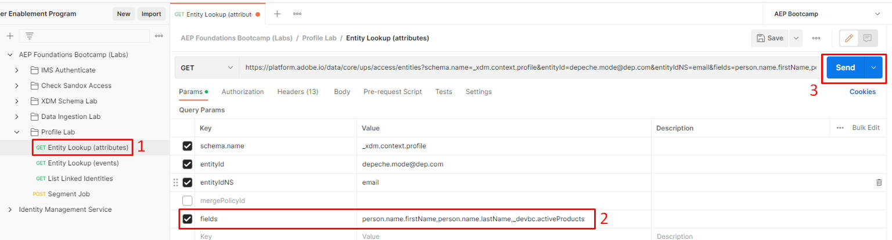
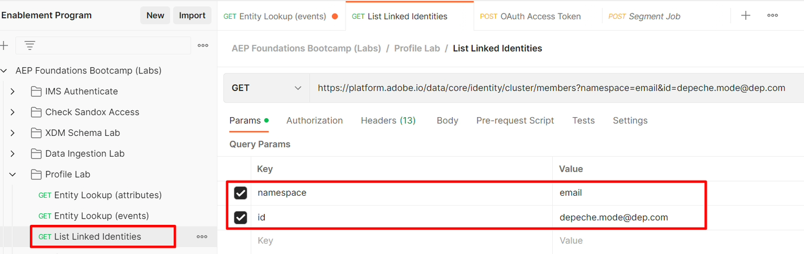

# Profil- und Identitäts-APIs

## Profilentitäts-API

Die Verwendung der Profil-APIs ist für die Arbeit mit dem Echtzeit-Kundenprofil von entscheidender Bedeutung. Dadurch wird die Möglichkeit für eine schnelle Klassifizierung und Fehlerbehebung freigeschaltet, während Sie gleichzeitig für viele mögliche Systemintegrationen verfügbar sind, von Callcentern bis hin zu Kiosks.

Eine der wichtigsten APIs ist die Profilentitäts-API. Mit dieser API können Sie ein einzelnes Profil suchen, wie Sie es in der Benutzeroberfläche gesehen haben. Sie verwendet Parameter, um anzugeben, ob die Attribute oder Ereignisse des Profils angezeigt werden sollen.

Nachfolgend finden Sie die gesamte Spezifikation für die GET-Methode für die Profilentitäts-API

## API-Übersicht

Nachfolgend finden Sie die zum Aufrufen der Profilentitäts-API mindestens erforderlichen Informationen.

`GET https://platform.adobe.io/data/core/ups/access/entities`

### Erforderlicher Abfrageparameter

Diesen Parameter bei jeder Anfrage senden. Der Wert hängt davon ab, ob Sie die Attribute eines Profils oder seine Ereignisse nachschlagen:

| Parameter | Typ | Beschreibung | Beispiel |
| ------------- | ------ | ---------------------------------------------------------------------------------------------------------------------------------------------- | ------------------------------ |
| `schema.name` | Zeichenfolge | Name der XDM-Schemaklasse der Entität, die Sie suchen. | `_xdm.context.profile` |
| `schema.name` | Zeichenfolge | Verwenden Sie stattdessen diesen Wert, um die Ereignisse eines Profils nachzuschlagen. Kombinieren Sie sie mit `relatedSchema.name=_xdm.context.profile` , um die Ereignisse auf ein Profil zu beschränken. | `_xdm.context.experienceevent` |

### Identifizieren der zu suchenden Entität

Die meisten Anfragen verwenden `entityId` und `entityIdNS`, um die Entität anhand eines bekannten Identitätswerts zu identifizieren - z. B. anhand einer E-Mail-Adresse, einer CRM-ID oder einer Treueprogramm-ID -, anstatt die XID bereits zu kennen. Eine XID ist eine base64-kodierte Kennung, die Identity Service intern generiert und zuweist, um eine Identität darzustellen, wobei sein Namespace und ID-Wert in einem einzigen kompakten Token konsolidiert werden (weitere Informationen finden Sie unter [Native ](https://experienceleague.adobe.com/docs/experience-platform/identity/api/list-native-id.html?lang=de)):

| Parameter | Typ | Beschreibung | Beispiel |
| ------------ | ------ | ---------------------------------------------------------------------------------------------------------------------------------------------- | ---------------------- |
| `entityId` | Zeichenfolge | Der nachzuschlagende Kennungswert. Wenn Sie die XID der Entität bereits kennen, verwenden Sie sie hier eigenständig und lassen Sie `entityIdNS` weg. | `depeche.mode@dep.com` |
| `entityIdNS` | Zeichenfolge | Identity-Namespace-Code, zu dem `entityId` gehört (z. B. `email`, `crmid`, `ECID`). Erforderlich, wenn `entityId` noch keine XID ist. | `email` |

>[!NOTE]
>
>Die Postman-Anfragen dieses Labors suchen das Depeche-Modus-Profil nach seiner E-Mail-Adresse (`entityIdNS=email`, `entityId=depeche.mode@dep.com`) und nicht nach seiner XID.

### Erforderliche Kopfzeilen

Für jede Anfrage sind auch diese Kopfzeilen erforderlich:

| Kopfzeile | Typ | Beschreibung | Beispiel |
| ----------------- | ------ | ---------------------------------------------- | --------------------- |
| `x-gw-ims-org-id` | Zeichenfolge | Kennung der IMS-Organisation. | `<your IMS org>` |
| `x-api-key` | Zeichenfolge | API-Schlüssel Ihres registrierten Projekts/Ihrer registrierten Anmeldedaten. | `<your API key>` |
| `Authorization` | Zeichenfolge | Bearer-Token für die Anfrage. | `Bearer <your token>` |

>[!NOTE]
>
>Unter [API-Referenz für Profilentitäten](https://developer.adobe.com/experience-platform-apis/references/profile#tag/Entities) finden Sie eine vollständige Liste der Abfrageparameter, einschließlich zusätzlicher Optionen zur Identitätssuche, Ereignisfilterung (`startTime`, `endTime`, `property`, `orderby`, `limit`), Feldauswahl und Überschreibungen von Zusammenführungsrichtlinien.

>[!WARNING]
>
>Denken Sie daran, dass alle API-Anfragen sandbox-spezifisch sind. Daher ist es bei der Arbeit mit den APIs wichtig, dass Sie sicherstellen, dass Ihr Header-Parameter in jeder Anfrage mit dem Namen `x-sandbox-name` korrekt auf die entsprechende Sandbox festgelegt ist.
>
>Für dieses Labor ist der `x-sandbox-name` bereits in Ihrer Umgebungsdatei festgelegt

## Entitätssuche (Attribute)

Um ein Gefühl für die Entity Lookup-API zu erhalten, verwenden Sie das Depeche Mode-Profil aus dem vorherigen Lab.

1. Öffnen Sie **Postman** und navigieren Sie zum Ordner **Profile Lab**
1. Klicken Sie auf die Anfrage **Entitätssuche (Attribute)**, um sie zu öffnen
1. Führen Sie den Aufruf durch Klicken auf die Schaltfläche **Senden** aus

   ")

   Eine erfolgreiche Anfrage sollte mit einem `200 OK` antworten, und Sie sollten ein Ergebnis sehen, das alle Attribute für das Depeche Mode-Profil enthält.

    API-Antwort")

   >[!NOTE]
   >
   >Wenn in einer Profilentitätsanfrage keine Zusammenführungsrichtlinie angegeben ist, wird standardmäßig die standardmäßige Zusammenführungsrichtlinie in der Sandbox verwendet

   Verwenden Sie bei der Entitäts-API die Abfrageparameter, um zu ändern, was als Antwort zurückgegeben wird.

1. Klicken Sie in der Anfrage „Entitätssuche (Attribute)“ auf die Option **Parameter** für die Anfrage
1. Aktivieren Sie das Kontrollkästchen neben **Schlüssel** namens **fields**
1. Ausführen der Anfrage durch Klicken auf die Schaltfläche **Senden**

>[!NOTE]
>
>Beachten Sie, dass auch ein Parameter zum Angeben der `mergePolicyId` vorhanden ist. Um den Wert dafür zu finden, verwenden Sie andere APIs oder suchen Sie die ID über die Benutzeroberfläche.

Eine erfolgreiche Anfrage sollte mit einem `200 OK` antworten, und Sie sollten nur die Felder sehen, die in dem soeben aktivierten Parameterfilter angegeben sind: Vorname, Nachname und ein Array von aktiven Produkten.

 mit aktiviertem Filter")

>[!SUCCESS]
>
>Herzlichen Glückwunsch!  Sie haben die Attribute eines Profils mithilfe der Profilentitäts-API erfolgreich nachgeschlagen

## Entitätssuche (Ereignisse)

Zum Nachschlagen der Ereignisse eines Profils verwenden Sie exakt dieselbe Profilentitäts-API.  Der einzige Unterschied besteht darin, dass Sie dem Profil-Service mitteilen müssen, dass Sie den Klassentyp ändern möchten, der in der Antwort verwendet werden soll.

1. Klicken Sie auf die **Entitätssuche (Ereignisse**, um sie zu öffnen
1. Führen Sie den Aufruf durch Klicken auf die Schaltfläche **Senden** aus

Eine erfolgreiche Anfrage sollte mit einem `200 OK` antworten, und Sie sollten ein Ergebnis sehen, das alle Ereignisse für das Depeche Mode-Profil enthält.

 im Depeche-Modus")

Beim Nachschlagen von Profilattributen verfügt die Entitäts-API über noch mehr Abfrageparameter, die ändern, was als Antwort zurückgegeben wird.

Probieren Sie einige davon aus, indem Sie sie im Abschnitt Parameter aktivieren und die Anfrage ausführen. Sehen Sie, wie es funktioniert!

**Beispielhafte Abfrageparameterdefinitionen**

| Schlüssel | Wert | Beschreibung |
| ------------- | ------------------------------- | ------------------------------------------------------------------------------------------------------- |
| mergePolicyId | \&lt;blank> | Wechselt die für die Suche verwendete Zusammenführungsrichtlinie. Wenn Sie das Feld leer lassen, wird die standardmäßige Zusammenführungsrichtlinie der Sandbox verwendet |
| Felder | eventType,timestamp,identityMap | Zeigt nur diese Felder aus jedem Ereignis an, unabhängig davon, ob sie einen Wert aufweisen oder nicht |
| Eigenschaft | eventType=„order.apped“ | Filtert Ereignisse nur nach Ereignissen des angegebenen Typs |
| orderby | +Zeitstempel | Sortiert Ereignisse in aufsteigender Reihenfolge |
| Grenze | 5 | Zeigt nur fünf Ereignisse in der Antwort |

>[!NOTE]
>
>Weitere Informationen zu allen Abfrageparameter-Optionen finden Sie hier -> [https://developer.adobe.com/experience-platform-apis/references/profile/#tag/Entities/operation/retrieveEntity](https://developer.adobe.com/experience-platform-apis/references/profile/#tag/Entities/operation/retrieveEntity)

## Identity Service-Cluster-API

Irgendwann haben Sie möglicherweise eine Frage darüber, welche Identitäten Teil des Identitäts-Clusters eines bestimmten Profils im Identitätsdiagramm sind.  Mit dieser API können Sie einen einzelnen Identity-Namespace/Wert übergeben und als Antwort erhalten Sie den vollständigen Identitäts-Cluster für dieses Profil.

Probieren Sie es selbst:

1. Klicken Sie auf die **Liste der verknüpften Identitäten**, um sie zu öffnen
1. Führen Sie den Aufruf durch Klicken auf die Schaltfläche **Senden** aus

>[!NOTE]
>
>Beachten Sie, dass die Parameter in der Anfrage der Identity-Namespace und die ID sind (d. h. der Wert)

Eine erfolgreiche Antwort sollte wie im Folgenden aussehen

>[!NOTE]
>
>Wie Sie sehen, enthält die Antwort alle Identitäten des Profilvertiefungsmodus
