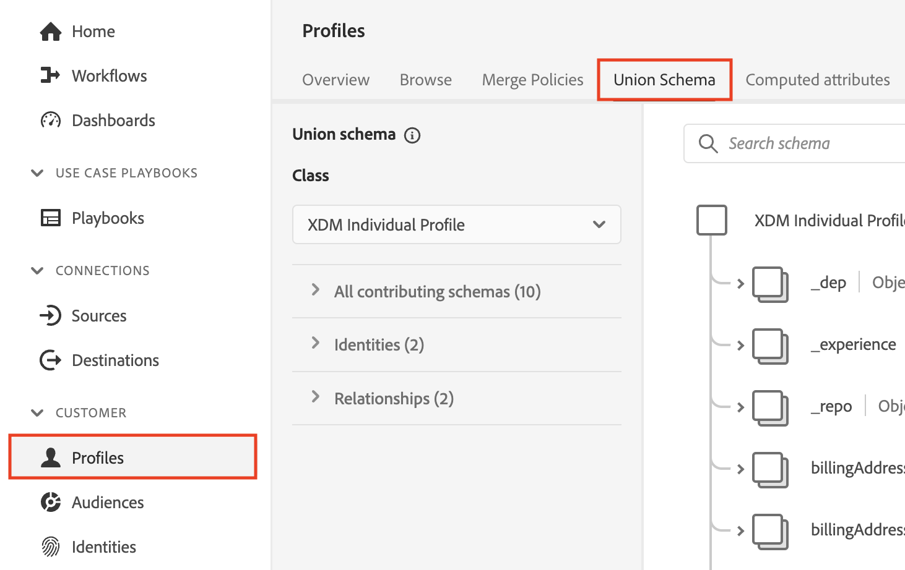
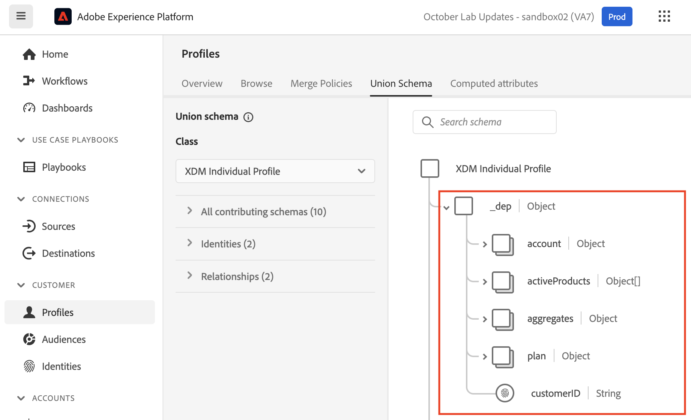
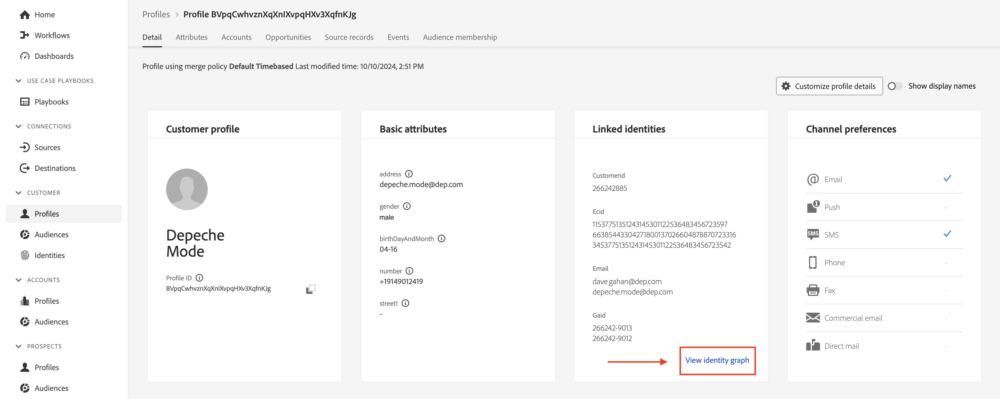
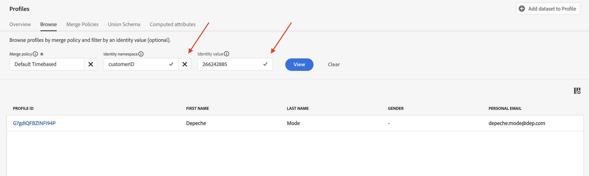
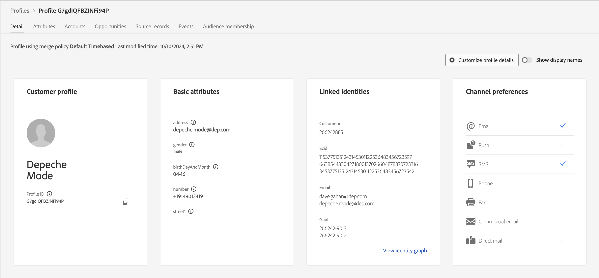

# Profilgrundlagen

## Profilvereinigungsschema

Denken Sie daran, dass die Ansicht eines Echtzeit-Kundenprofils anhand der Schemata erstellt wird, die Sie für das Profil definiert und aktiviert haben. Dies wird von Adobe als Vereinigungsschema des Profils bezeichnet.

Sie können das Vereinigungsschema des Profils wie folgt anzeigen:

1. Klicken Sie in **linken Leiste** Profile“
1. Klicken Sie in **oberen Navigationsleiste auf** Vereinigungsschema“.



>[!NOTE]
>
>Beachten Sie, dass das Profil eine Vereinigungsansicht für jede XDM-Klasse erstellt. Anhand dieser Ansicht können Sie sehen, welche Schemata zu welcher Klasse, zu den Identitäten innerhalb jeder Klasse und zu etwaigen Beziehungen beigetragen haben.

Überprüfen Sie das Vereinigungsschema für die Klasse XDM Individual Profile und erweitern Sie den Mandanten-Namespace. Hier sollten Sie eine Reihe von Elementen sehen, die aus verschiedenen Schemata stammen, die Sie in den **LID-Methodik** und **XDM Modeling Labs definiert haben.**



Klicken Sie auf **Konto** Objekt und beachten Sie, was in der rechten Leiste des Bildschirms angezeigt wird. Sie können jetzt die Details zum Objekt sehen, welche Schemas und Datensätze zu seiner Erstellung beigetragen haben sowie andere relevante Informationen.


>[!NOTE]
>
>Das Vereinigungsschema ist ein großartiges Tool, um zu verstehen, warum bestimmte Elemente innerhalb eines Profils vorhanden sind und woher sie stammen.
>
>Beachten Sie, dass das Vereinigungsschema beobachtbar ist, d. h. das Profil zeigt nur Felder an, die Daten enthalten, wenn ein tatsächliches Echtzeit-Kundenprofil angezeigt wird


## Profilsuche

1. Klicken Sie in **linken Leiste auf** Profile“ und wählen Sie dann in der oberen Navigation **Durchsuchen**
1. Wählen Sie den Identity-Namespace von **email**
1. Geben Sie den Identitätswert von **depeche.mode\@dep.com ein**
1. Klicken Sie auf die Schaltfläche **Ansicht**, um das Profil zu suchen
1. Klicken Sie auf **Link** zum Profil, um dessen Details anzuzeigen

")


Du solltest das jetzt sehen!


Nehmen Sie sich eine Minute Zeit, um das Profil Depeche Mode zu erkunden, indem Sie sich jede Registerkarte in der oberen Navigationsleiste ansehen. Diese Registerkarten werden Sie verwenden:

- Detail - zeigt benutzerdefinierte Karten an, die verschiedene Aspekte für das jeweilige Profil zeigen
- Attribute - zeigt alle zugehörigen Attribute für das angegebene Profil aus dem Vereinigungsschema an
- Ereignisse - zeigt alle zugehörigen Ereignisse für das angegebene Profil aus dem Vereinigungsschema an
- Zielgruppenzugehörigkeit - Zeigt die Zielgruppen an, zu denen das Profil derzeit gehört

## Attribute anzeigen

Navigieren Sie zur Registerkarte **Attribute** und klicken Sie auf **JSON anzeigen**


Hier erfahren Sie, wie Felder angezeigt werden, die aus den Feldergruppen stammen, die Sie zum Kundenkontenschema hinzugefügt haben.

- Suchen Sie nach dem übergeordneten Knoten mit dem Titel **entity**
- Notieren Sie das untergeordnete **billingAddress** (stammt aus der Feldergruppe „Persönliche Kontaktdaten„)

```json
"billingAddress": {
  "postalCode": "11355",
  "city": "New York City",
  "state": "NY",
  "street1": "108 Ruskin Terrace"
}
```

Vergleichen Sie dies mit dem Profil-Vereinigungsschema und Sie sollten abwarten, was Observable 😄

```json
"billingAddress": {
    "_repo": {
        "createDate": "datetime",
        "modifyDate": "datetime",
    },
    "_schema": {
        "description": "string",
        "elevation": "double",
        "latitude": "double",
        "longitude": "double"
    },
    "_id": "string",
    "city": "string",
    "country": "string",
    "countryCode": "string",
    "createdByBatchID": "string",
    "dmaID": "integer",
    "label": "string",
    "lastVerifiedDate": "date",
    "modifiedByBatchID": "string",
    "msaID": "string",
    "postOfficeBox": "string",
    "postalCode": "string",
    "primary": "boolean"
    "region": "string",
    "repositoryCreatedBy": "string",
    "repositoryLastModifiedBy": "string",
    "state": "string",
    "stateProvince": "string",
    "status": "string",
    "statusReason": "string"
    "street1": "string",
    "street2": "string",
    "street3": "string",
    "street4": "string"
}
```

>[!NOTE]
>
>Beobachtbares Schema bedeutet wörtlich, nur die Felder anzuzeigen, in denen Daten vorhanden sind, und die Felder auszublenden, die keine Daten enthalten.  Sehr anders als die traditionelle relationale Datenbank!


Suchen Sie als Nächstes **Einverständnis**-Objekt (dieses stammt aus der Einverständnis- und Voreinstellungsdetails -Feldergruppe)

```json
"consents":{
   "marketing":{
      "sms":{
         "val":"y"
      },
      "email":{
         "val":"y"
      }
   }
}
```


Scrollen Sie nach unten zum Mandanten-Namespace **\_** und suchen Sie nach **Plan**-Objekt (dieses stammt aus einer benutzerdefinierten Feldergruppe namens „dep: Plandetails„)

```json
"plan": {
    "planID": "m3",
    "type": "mobile",
    "name": "pro"
}
```


Beachten Sie das **aggregates**-Objekt, das Sie für den Upsell-Anwendungsfall definiert haben. Diese Felder befinden sich auch unter dem Mandanten-Namespace \_devbc. Sie stammen aus einem anderen Schema (dep: Kundenaggregate) und einer benutzerdefinierten Feldergruppe (dep: Aggregate)

```json
"aggregates":{
   "rollingSixMonthAvgMonthlyDataUsage":30,
   "rollingSixMonthTotalDataUsage":200
}
```

## Identitätszuordnung anzeigen

Sie können auch die zugehörigen Identitäten eines Profils sehen, da sie in einem zuordnungsbasierten Objekt mit dem Namen **identityMap.** Suchen Sie **identityMap** unten im JSON-Dokument.

Dies ist eine Darstellung aller übergebenen Identitäten, unabhängig davon, ob Sie das Feld identityMap verwendet oder ein Feld mit einem Identitätsdeskriptor markiert haben.

```json
"identityMap": {
  "ecid": [{
          "id": "34537751351243145301122536487445728054"
      },
      {
          "id": "66385443304271800137026604878870723316"
      },
      {
          "id": "34537751351243145301122536483456723542"
      }
  ],
  "email": [{
          "id": "dave.gahan@dep.com"
      },
      {
          "id": "depeche.mode@dep.com"
      }
  ],
  "customerid": [{
      "id": "266242885"
  }],
  "gaid": [{
          "id": "266242-9013"
      },
      {
          "id": "266242-9012"
      }
  ]
}
```

>[!NOTE]
>
>Beachten Sie, dass es in der identityMap keinen Verweis auf das Konzept der „primären Identität“ gibt. Dafür gibt es zwei Gründe:
>
>1. Die identityMap, die Sie in den Profilattributen sehen, wird für jedes Profil unter Verwendung des Graphen\* des Identity Services erstellt
>2. Das Identitätsdiagramm berücksichtigt nur die Beziehungen zwischen Identitäten. Jede Identität wird gleich behandelt. A ist mit B verbunden und es spielt keine Rolle, ob es über eine primäre Identität, Personenidentität usw. war.
>
>*\* Wenn kein Identitätsdiagramm verwendet wird, besteht die identityMap nur aus der bei der Suche angeforderten Identität*

>[!NOTE]
>
>Beim Erstellen des Kundenkontenschemas war nur ein E-Mail-Feld als Identität markiert (d. h. personalEmail.address). Haben Sie bemerkt, dass die identityMap zwei E-Mail-Adressen hat!
>
>Was ist los?
>
>- Das Identitätsdiagramm zeichnet ständig neue Beziehungen und die Werte innerhalb dieser Beziehungen auf, während Daten in seinen Service fließen
>- Das Verhalten des Profils besteht darin, vorhandene Feldwerte bei der Aufnahme von Daten in seinen Service mit neuen Werten zu überschreiben
>- Wenn Sie ein Feld mit einem Identitätsdeskriptor kennzeichnen, ist es weiterhin ein Feld für das Profil


## Identitätsdiagramm

Navigieren Sie zurück zur Registerkarte **Detail** in der oberen Navigationsleiste und klicken Sie auf den **Identitätsdiagramm anzeigen** Link unten auf der Karte **Verknüpfte Identitäten** .



Dieser Bildschirm sollte nun angezeigt werden.


Die obige Ansicht ist das Identitätsdiagramm des Depeche Mode-Profils und ist in drei (3) Schlüsselbereiche unterteilt:

**Identitätsdiagramm-Visualizer** - Zeigt die Identitäten und ihre zugehörigen Beziehungen innerhalb des Identitäts-Clusters der Profile an

**Details zum Identitätsdiagramm** - liefert spezifische Details zu den Namespaces, Werten und Datenquellen des Gesamtidentitätsdiagramms, durch die alle in der Identitätsdiagramm-Visualizer angezeigten Beziehungen erstellt wurden

**Ausgewählte Identitätsdetails** - zeigt detaillierte Informationen zur ausgewählten Identität zusammen mit den letzten fünf (5) Batches an, in denen diese Identität in einer Beziehung verarbeitet wurde

>[!NOTE]
>
>Der Identitätsdiagramm-Viewer zeigt sowohl die Beziehungen zwischen allen Identitäten als auch Informationen zur letzten Anzeige der Identitätsbeziehung an und dazu, aus welchem Datensatz die Beziehung stammt


Zeigen Sie stattdessen das Identitätsdiagramm von Depeche Mode mit der customerID an.  Führen Sie die folgenden Aktionen aus:

1. Kopieren Sie die **customerID** und speichern Sie sie an einem beliebigen Ort.
1. Ändern Sie den Namespace-Wert im Feld Identity-Namespace in **customerID**
1. Fügen Sie den Wert **customerID** ein, den Sie im vorherigen Schritt gespeichert haben.
1. Klicken Sie auf **Ansicht**, um das Identitätsdiagramm anzuzeigen, das diese Identität enthält, indem Sie den neuen Identitätswert verwenden


>[!NOTE]
>
>Beachten Sie, dass genau dasselbe Identitätsdiagramm angezeigt wird! Jede Identität, die Sie aus diesem Diagramm verwenden, führt immer zum gleichen Ergebnis


## Ändern von Identitäten

Kehren Sie zum Profil-Viewer zurück und suchen Sie jetzt im Depeche-Modus mit der customerID .

1. Ändern Sie den Identity-Namespace in **customerID**
1. Aktualisieren Sie den Identitätswert mit dem Wert „customerID“, den Sie im letzten Abschnitt gespeichert haben
1. Klicken Sie auf die **Ansicht**-Schaltfläche




Sie sollten dasselbe Profil sehen, das Sie gerade angesehen haben!



>[!NOTE]
>
>Das Identitätsdiagramm stellt sicher, dass jede verwendete Identität beim Zusammenstellen der verschiedenen Profilfragmente im selben Profil resultiert
