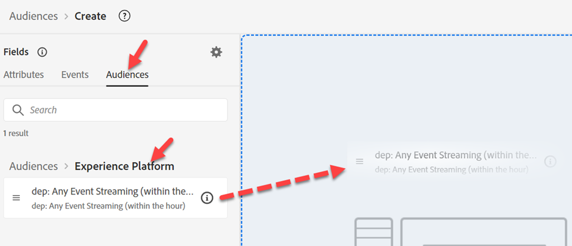
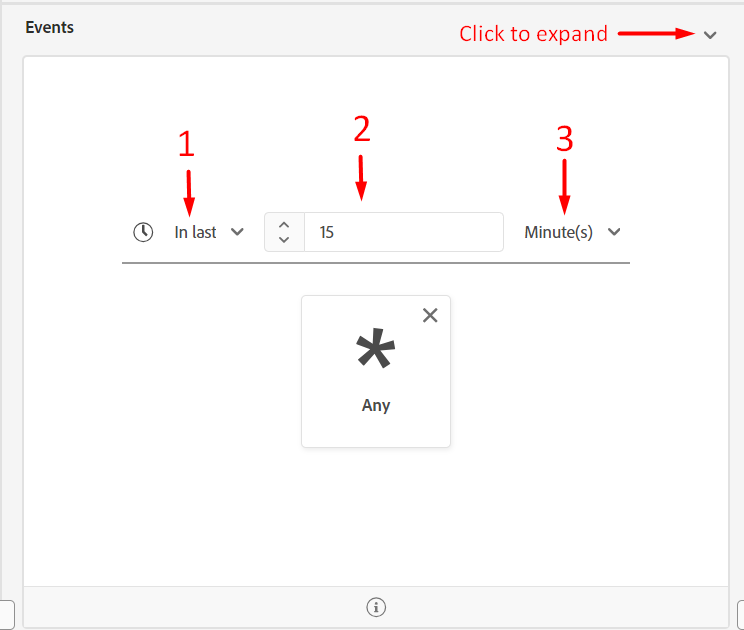

# Edge-Zielgruppe erstellen

Diese Zielgruppe wird verwendet, um jemanden zu qualifizieren, wenn eine Payload (z. B. eine Seitenansicht) vom Client (z. B. Web SDK) zur Edge kommt.

>[!NOTE]
>
>Wir werten eine Zielgruppe auf der Edge in der Regel aus, damit wir sie umdrehen und in Personalization verwenden können. Wenn wir Personalization nicht auf dem Edge durchführen, können wir einfach die Zielgruppe als Streaming auf dem Hub bewerten lassen.

## Zielgruppe erstellen

1. Klicken Sie in der linken Leiste auf Zielgruppen .
1. Klicken Sie dann auf Zielgruppe erstellen in der oberen rechten Ecke Ihres Bildschirms
1. Klicken Sie dann auf Regel erstellen .

## Zielgruppe in Regeln konvertieren

1. Wechseln Sie zu **Zielgruppen** und klicken Sie in den Ordner **Experience Platform**
1. Ziehen Sie die Zielgruppe mit dem Namen **dep: Beliebiges Ereignis-Streaming (innerhalb einer Stunde)** auf die Arbeitsfläche

1. Konvertieren Sie die Zielgruppe in einen Regelsatz auf der Arbeitsfläche, indem Sie auf das **Symbol** unten klicken und dann auf **Konvertieren**

## Ereignisregeln aktualisieren

Nehmen Sie die folgenden Änderungen an den Ereignisregeln vor (möglicherweise müssen Sie das Ereignis erweitern, um es anzuzeigen)

1. Letzte
1. 15
1. Minuten

## Segment veröffentlichen

1. Aktualisieren Sie den Segmentnamen auf &quot;**Edge&quot; (innerhalb von 15 Minuten)**
1. Aktualisieren der Auswertungsmethode auf Edge
1. Segment veröffentlichen

## Batch-evaluiertes Segment erstellen

Wiederholen Sie die gleichen Schritte, die Sie gerade für das von Ihnen erstellte Edge-Segment ausgeführt haben, verwenden Sie jedoch stattdessen die folgenden Informationen:

>[!NOTE]
>
>Wir erstellen eine Batch-Zielgruppe, damit Sie sehen können, dass, obwohl ein Ereignis an die Edge übergeben wird, alle Zielgruppen, die als Batch-Auswertung gespeichert wurden, nicht gestreamt werden.

Ereignisregeln:

- Letzte
- 1
- Tag

Segmentdetails:

- Name -> **Beliebiger Ereignis-Batch (innerhalb von 1 Tag)**
- Auswertungsmethode -> Batch
