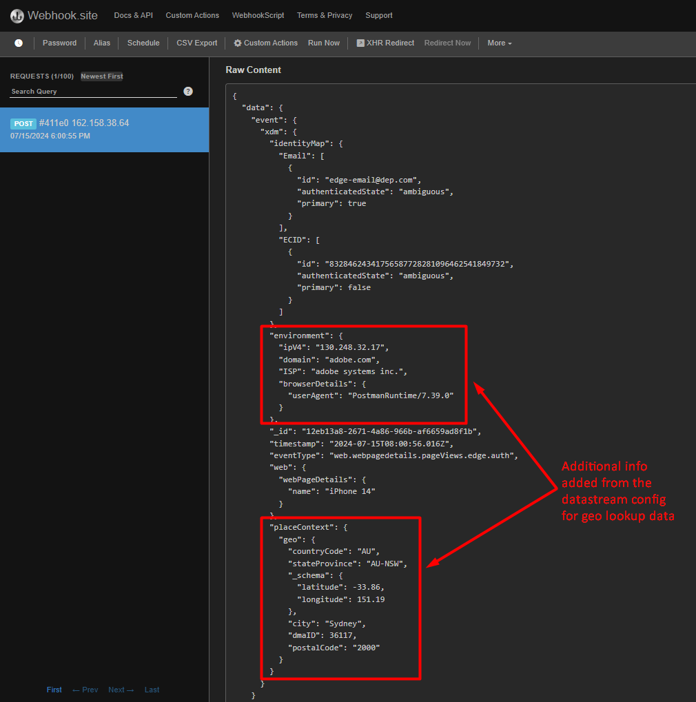
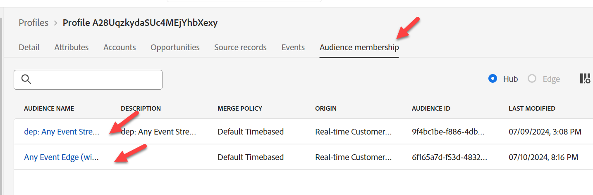

# Edge-Ereignis senden

Nachdem alles konfiguriert ist, senden Sie ein -Ereignis an die Edge, damit alles funktioniert.

Verwenden Sie dazu Postman, um ein Web-Ereignis an den von Ihnen erstellten Datenstrom zu senden.

Dies sendet ein -Ereignis **ohne OAuth-Token** um eine Seitenansicht, die aus dem Web eingeht, an die Edge zu simulieren.  Stellen Sie sicher, dass Postman auf Ihrem Computer geöffnet ist, um dieses Labor durchzuführen.

>[!NOTE]
>
>Da Sie kein authentifiziertes Token übergeben, erhalten Sie keine Attribute zurück.

## Laborerwartungen

1. Erlebnisereignis, das auf die Edge trifft
1. Datenstromkonfiguration zur Verwendung des Ereignisweiterleitungs-Service
1. Ereignisweiterleitung, um das Ereignis an den Webhook zu senden
1. Datenstromkonfiguration zur Verwendung des AEP-Service
   1. Edge-Zielgruppe zum Ausführen
   1. Ereignis an den Hub senden
1. Postman-Antwort, um Edge-Zielgruppe einzuschließen (aber keine Attribute)
1. Profilspeicher zum Empfangen des Ereignisses und Hinzufügen eines Ereignisprofilfragments
1. Identitätsspeicher zum Hinzufügen einer Beziehung
1. Datensatz zum Empfangen von Daten und Speichern im Data Lake

## Zum Aufruf navigieren

1. **Linke Seitenleiste von Postman** -> Sammlungen
1. **Sammlung** -> AEP Foundations Bootcamps (Labs)
1. **Ordner** -> Profile Lab
1. **API-Anfrage** -> Web-Ereignis-Edge erstellen (keine Authentifizierung)

## API-Anfrage ändern

Bevor Sie die API-Anfrage ausführen können, müssen Sie der Anfrage einige zusätzliche Informationen hinzufügen. Erfassen Sie zunächst die folgenden Werte:

## Datenstrom-ID erfassen

1. Klicken Sie in der linken Leiste auf **Datenströme** (unter der Überschrift Datenerfassung )
1. Wählen Sie Ihren Datenstrom aus und kopieren Sie den Wert **Datenstrom-ID** .

## Postman-Abfrageparameter aktualisieren

1. Klicken Sie in der Anfrage selbst auf **Parameter**
1. Aktualisieren Sie **Wert** mit der Datenstrom-ID aus dem vorherigen Schritt
1. Klicken Sie auf **Speichern**, um die Aktualisierung zu speichern

E-Mail in E-Mail ändern

## Ausführen der API

Führen Sie Ihre Anfrage aus, indem Sie auf die Schaltfläche **Senden** klicken.

Was Sie in der Antwort wiedersehen sollten, ist diese Kernsache:

- Eine Antwort von 200 OK bedeutet, dass die Daten erfolgreich gesendet und von der Edge Network akzeptiert wurden

>[!NOTE]
>
>Streaming- und Batch-Segmente werden erst angezeigt, wenn sie zuerst am Hub ausgewertet werden

## Validieren der Ereignisweiterleitung

Auf webhook.site sollte sofort derselbe Payload-Text angezeigt werden, den Sie über Ihre Postman-Anfrage gesendet haben.

>[!NOTE]
>
>Beachten Sie, dass die Payload die Geo-Lookup-Informationen hinzugefügt hat, nach denen Sie beim Einrichten des in Ihrer Edge-Einrichtung verwendeten Datenstroms gefragt haben

## Profil nachschlagen

Suchen Sie in Adobe Experience Platform das Profil, das Sie gerade von dem Ereignis gesendet haben, das Sie gerade an Edge Network gesendet haben. Navigieren Sie zu Profile > Durchsuchen, um die Suche mit den folgenden Informationen durchzuführen:

- Zusammenführungsrichtlinie -> Standardzeitbasiert
- Identity-Namespace -> E-Mail
- Identitätswert -> edge-email\@dep.com
  - Hinweis: Ändern Sie diese Einstellung so, dass sie mit der E-Mail übereinstimmt, *Sie im obigen Schritt Aktualisieren des Abfrageparameters* Postman verwendet haben

1. Klicken Sie **Anzeigen**, um das Profil zu suchen
1. Klicken Sie auf **Profil-ID**, um das Profil zu öffnen

   

1. Klicken Sie **oberen Navigationsbereich auf** Ereignisse“, um das gerade gesendete Ereignis anzuzeigen

   

1. Überprüfen Sie, ob sich das Profil für die Zielgruppen qualifiziert hat, indem Sie die Registerkarte Zielgruppenmitgliedschaft im oberen Navigationsbereich aufrufen. Sie sollten Folgendes sehen:

- Beliebige Event Edge (innerhalb von 15 Minuten)
- Tiefe: Beliebiges Ereignis-Streaming (innerhalb einer Stunde)

## Interpretation der Prüfungen

1. Überprüfen auf eine 200-Antwort in Postman (ordnungsgemäß formatierte Payload)
1. Überprüfen, ob der Webhook das Ereignis enthält (ordnungsgemäß konfigurierte Ereignisweiterleitung)
1. Überprüfen, ob das Profil über die Ereignisse verfügt (ordnungsgemäß konfigurierter AEP-Service, Ereignis wurde empfangen und im Hub verarbeitet)
1. Überprüfen, ob das Profil nach einigen Minuten zwei Identitäten hat (Identitätsdiagramm wurde im Hub verknüpft)
1. Überprüfen, ob sich das Profil für die Zielgruppen qualifiziert hat (ordnungsgemäß definierte Zielgruppe)
1. Überprüfen, ob der Data Lake das Ereignis enthält.
