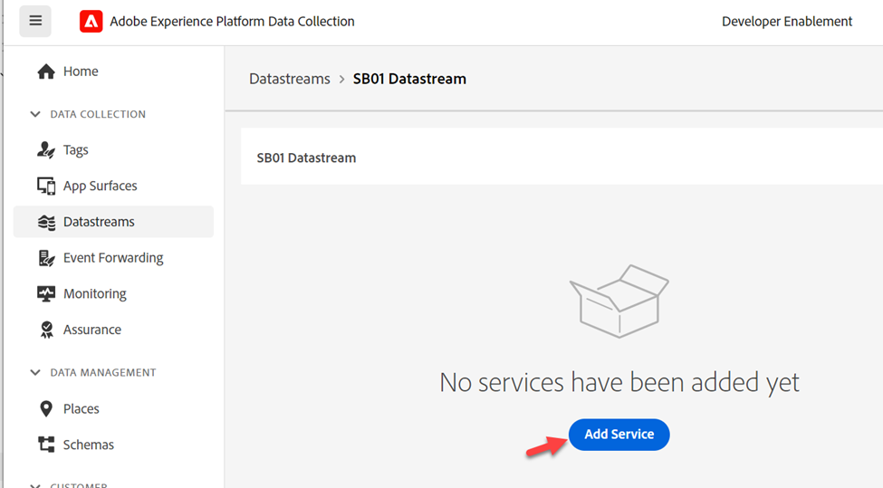
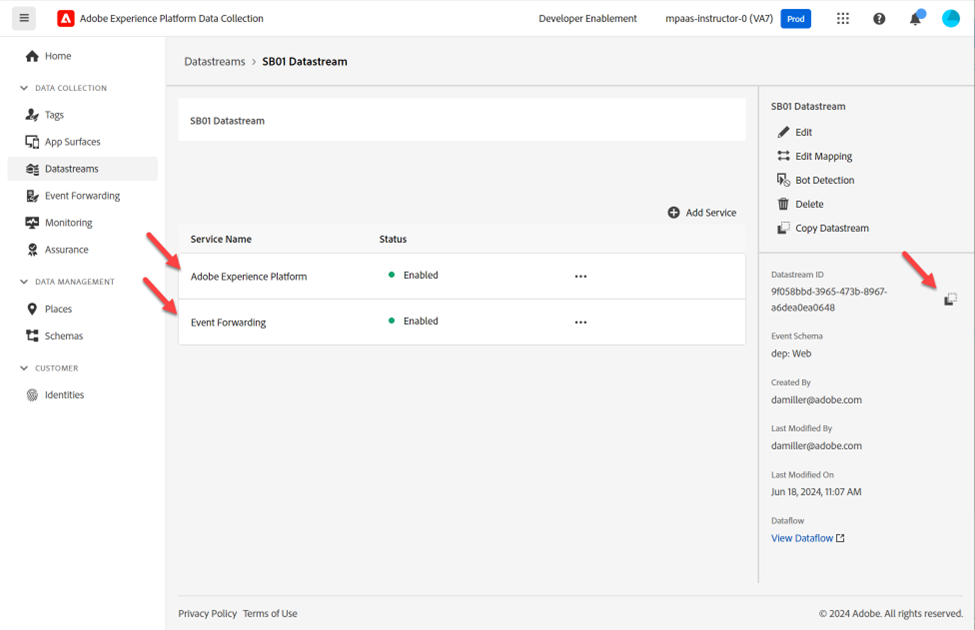

# Erstellen eines Datenstroms

Ein Datenstrom definiert, welche Services ihn verwenden.

- Beim Senden von Daten an die Edge geben Sie an, welcher Datenstrom verwendet werden soll
- Daten, die an diese Datenströme gesendet werden, können dann entsprechend dem konfigurierten Service Aktionen ausführen
  - Ereignisweiterleitung
  - Adobe Experience Platform

## Erstellen eines neuen Datenstroms

1. Klicken Sie in der linken Leiste unter **Datenerfassung** auf **Datenströme**
1. Klicken Sie dann auf **Neuer Datenstrom**, um einen zu erstellen

## Konfigurieren des Datenstroms

Konfigurieren Sie den Datenstrom mit folgenden Informationen:

1. Name -> **Datenstrom SB + \&lt;Sandbox-Name> (d. h. Datenstrom SB01)**
1. Ereignisschema -> **dep: Web**
1. Schalten Sie **on** alle Optionen unter **Geolocation und Netzwerksuche**
1. Klicken Sie abschließend auf **Speichern**.

>[!WARNING]
>
>Klicken Sie nicht auf Speichern und Zuordnung hinzufügen .  Wenn Sie versehentlich abbrechen

Nach dem Speichern des Datenstroms wird der folgende Bildschirm angezeigt:

## Hinzufügen des Ereignisweiterleitungs-Service

Auf diese Weise können Sie die Ereignisweiterleitung für Daten verwenden, die von diesem Datenstrom empfangen werden.

1. Klicken Sie auf **Service hinzufügen**

   

1. Konfigurieren Sie die folgenden Elemente:

   - Service -> Ereignisweiterleitung
   - Eigenschaft -> Wählen Sie die Eigenschaft aus, die Sie im vorherigen Schritt erstellt haben.  Sie sollte wie folgt benannt sein: Ereignisweiterleitungseigenschaft SB + \&lt;Ihre Sandbox-Nummer>
   - Umgebung -> Entwicklung

1. Klicken Sie abschließend auf **Speichern**

## Adobe Experience Platform-Service hinzufügen

Auf diese Weise können Sie Daten an den Hub senden und für Daten, die von diesem Datenstrom empfangen werden, in einen Datensatz aufnehmen.

1. Klicken Sie auf **Service hinzufügen**

   

1. Konfigurieren Sie die folgenden Elemente:

   - Service -> Adobe Experience Platform
   - Ereignisdatensatz -> Tiefe: Web
   - Profildatensatz -> Tiefe: Kundenkonto
   - Kontrollkästchen -> Edge-Segmentierung auswählen
   - Aktivieren Sie das Kontrollkästchen -> Personalization-Ziel

   

1. Klicken Sie abschließend auf **Speichern**.

1. Ihr endgültiger Bildschirm sollte wie folgt aussehen, wobei zwei Services vorhanden sind. **Kopieren** und **Speichern** die **Datenstrom-ID** auf Ihrem lokalen Computer (Sie verwenden sie später in Postman)

