# Eigenschaft erstellen

Normalerweise möchten wir ein Erlebnisereignis an einen Drittanbieter weiterleiten (obwohl dies nicht unbedingt erforderlich ist). Dies wird in der Regel verwendet, wenn eine Ereigniskopie in Echtzeit benötigt wird, um einen Drittanbieter unter bestimmten Umständen zu benachrichtigen (z. B. wenn Google, Meta oder TikTok über einen Kauf informiert werden).

>[!NOTE]
>
>Erinnerung: Eine Eigenschaft enthält alle Erweiterungen, Datenelemente und Regeln, die für die Entscheidung über die Weiterleitung und den Zielort erforderlich sind

1. Klicken Sie in der linken Leiste auf Ereignisweiterleitung .
2. Klicken Sie dann auf Neue Eigenschaft


3. Aktualisieren Sie den Eigenschaftsnamen mithilfe der folgenden Formel: `Event Forward Property SB + [sandbox number]`. Ihr endgültiger Name würde in etwa wie folgt aussehen: **Event Forward Property SB01**

4. Klicken Sie abschließend **Speichern**.

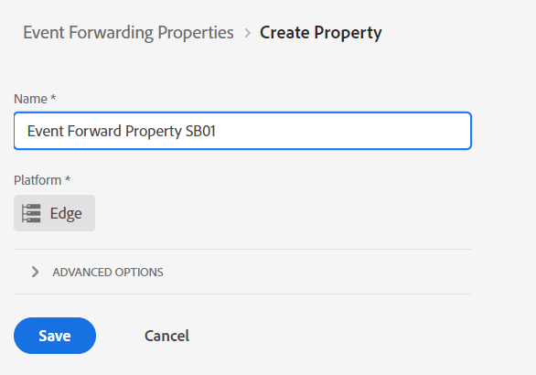

## Installieren einer Erweiterung

1. Klicken Sie auf die soeben erstellte Ereignisweiterleitungs-Eigenschaft

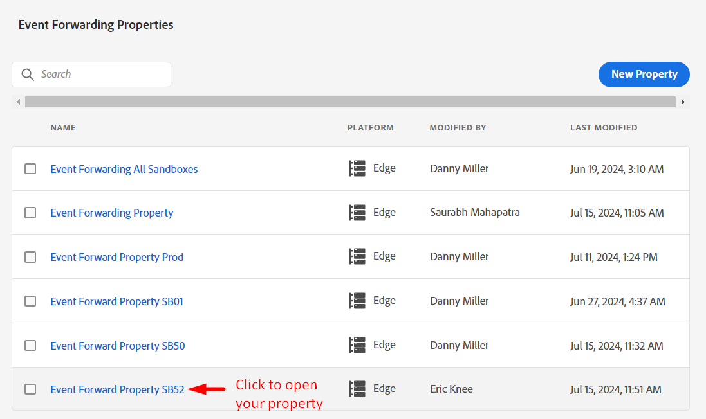


2. Es sollte ein Bildschirm wie unten angezeigt werden.  Klicken Sie auf **Erweiterungen**.

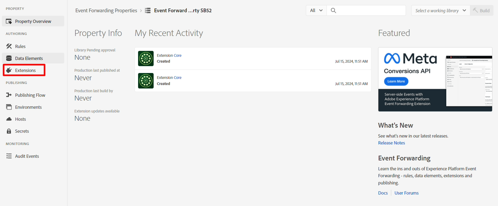


3. Installieren Sie die Erweiterung Adobe Cloud Connector wie folgt:

4. Klicken Sie in **oberen Navigationsleiste auf** Katalog“.
5. Klicken Sie auf die Karte **Adobe Cloud Connector** .
6. Klicken Sie in der rechten Leiste auf die Schaltfläche **Installieren**


Nach dem Klicken auf Installieren sollte die Erweiterung unter Installierte Erweiterungen für Ihre Eigenschaft angezeigt werden, wie unten dargestellt


## Datenelement erstellen

>[!NOTE]
>
>Ein Datenelement verweist auf das eingehende Ereignis und kann es bei Bedarf in mehrere einzelne Komponenten zerlegen

1. Klicken Sie in der linken Leiste auf **Datenelemente**


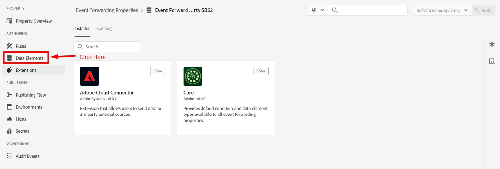


2. Klicken Sie auf **Schaltfläche Neues Datenelement erstellen**

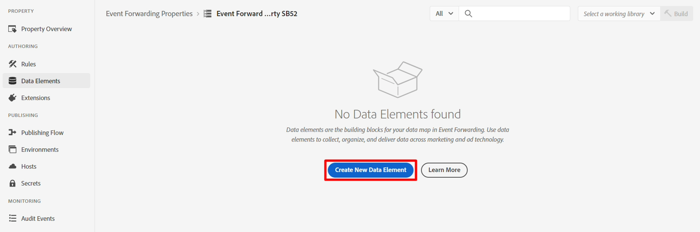


3. Konfigurieren Sie das neue Datenelement mit den folgenden Informationen:

| Elementtyp | Zu konfigurierender Wert |
| ----------------- | ------------------ |
| Name | Datenobjekt |
| Erweiterung | Core |
| Datenelementtyp | Benutzerspezifischer Code |

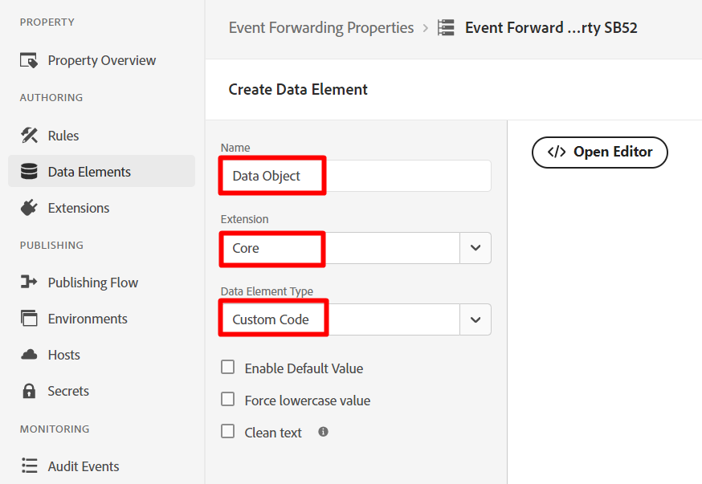


4. Klicken Sie auf die Schaltfläche **Editor öffnen**, um den folgenden benutzerdefinierten Code hinzuzufügen:

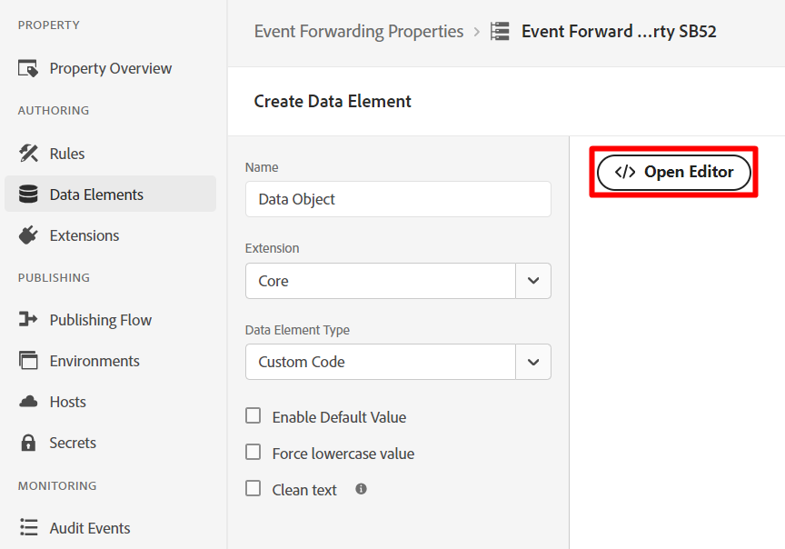


5. Fügen Sie dem Editor auf diese Weise benutzerdefinierten Code hinzu und speichern Sie ihn

```none
var xdm = arc?.event || '';
return xdm;
```


>[!NOTE]
>
>Dadurch wird das gesamte XDM-Objekt erfasst, ohne dass Übersetzungen an der Payload durchgeführt werden.  Bei Bedarf können wir jedes einzelne Element innerhalb des XDM-Objekts (z. B. Seitenname, Kaufbetrag) in ein Datenelement pro Feld analysieren.  Der Grund dafür könnte sein, wenn es eine Umwandlung der Struktur in eine andere Struktur gibt


6. Klicken Sie auf **Speichern**, um Ihr Datenelement zu speichern.

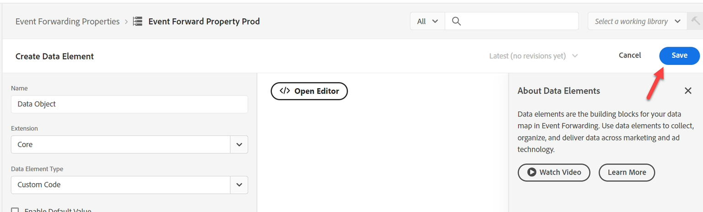


Wenn Sie fertig sind, sollte der folgende Bildschirm angezeigt werden, der bestätigt, dass Ihr Datenelement hinzugefügt wurde:


## Regeln erstellen

>[!NOTE]
>
>Eine Regel enthält:
>
>1. Bedingungen für die Weiterleitung
>2. Aktionen, die die Payload transformieren und definieren können, wohin sie gesendet werden soll


1. Klicken Sie in der linken Leiste auf **Regeln**


2. Klicken Sie dann auf **Neue Regel erstellen**

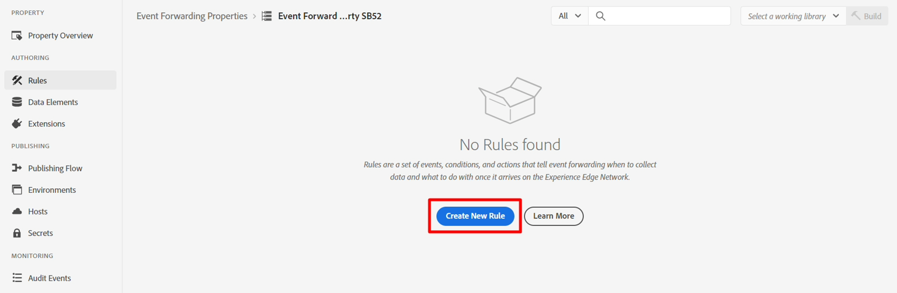


3. Aktualisieren Sie den Regelnamen mithilfe der folgenden Formel: `"EF Rule SB" + [your sandbox number]` (d. h. EF-Regel SB01). Ihre Sandbox-Nummer finden Sie oben rechts im Browser-Fenster, wie unten dargestellt\…


4. Klicken Sie abschließend **Speichern**.

>[!NOTE]
>
>Stellen Sie sicher, dass Ihr Regelname dem Formelmuster von `"EF Rule SB" + [sandbox number]` folgt

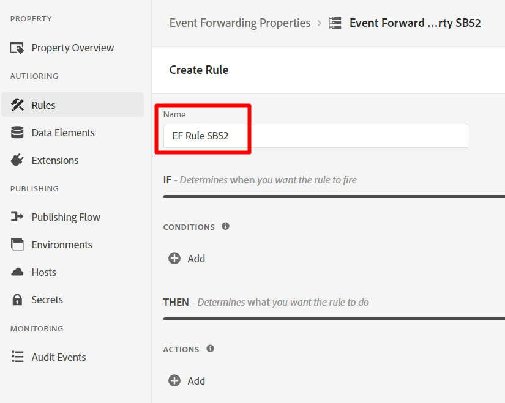


5. Fügen Sie Ihrer Regel eine Aktion hinzu, indem Sie auf das Pluszeichen (+) klicken, um eine neue Aktion hinzuzufügen

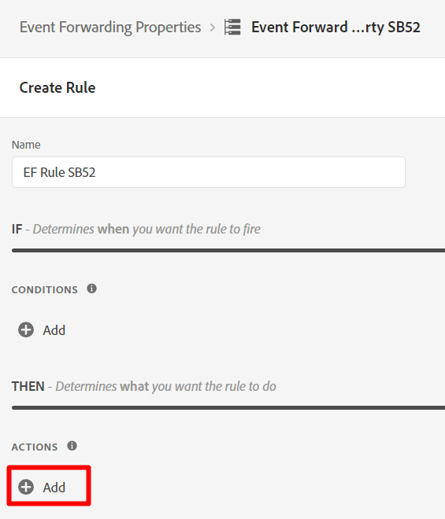

## Webhook-URL abrufen (zur Verwendung in Aktion)

>[!NOTE]
>
>Dieses Labor verwendet hier einen Webhook, mit dem Sie sehen können, ob die Daten bei dem Ziel angekommen sind, an das Sie senden. In einem realen Szenario würden Sie sich stattdessen bei diesem Ziel anmelden und seine Tools verwenden, um zu sehen, was angekommen ist.


1. Öffnen Sie den folgenden Link in einer neuen Registerkarte in Ihrem Browser -> [https://webhook.site](https://webhook.site/)
2. Kopieren Sie die angezeigte eindeutige URL und speichern Sie sie an einem sicheren Ort


3. Konfigurieren Sie Ihre Aktion mit den folgenden Informationen:

| Einstellung | Wert |
| ----------- | ------------------------------------------------------------------------------------------------------------------------------------------------------------------- |
| Erweiterung | Adobe Cloud Connector |
| Aktionstyp | Abrufaufruf ausführen |
| Methode | Veröffentlichen |
| URL | Verwenden Sie dieselbe Webhook-URL wie beim Einrichten Ihres Streaming-Ziels. Sie können ihn finden, indem Sie eine neue Registerkarte im Browser öffnen und zu Ziele navigieren -> Durchsuchen |
| Textkörper | Roh |
| Hauptteildaten | \{ „Daten“: \{ „Ereignis“: &quot;\{\{Datenobjekt\}\}&quot; } } |

>[!NOTE]
>
>Das hier referenzierte \{\{Datenobjekt\}\} ist das zuvor erstellte Datenelement. Hier bestand die Anforderung des nachgelagerten Systems darin, das Ereignis in einem Datenobjekt in ein Ereignisobjekt einzuschließen. Sie können hier beliebige Formatierungen einfügen.
>
>Wenn wir \{\{Data Object\}\} in mehrere Felder aufgeteilt hätten (z. B. Seitenname, Kauf usw.), konnten wir die JSON-Struktur transformieren, indem wir jedes Feld an der gewünschten Stelle platzierten, was uns mehr Kontrolle über die Zuordnung des Ziels gab.


Wenn Sie fertig sind, überprüfen Sie, ob Ihr Bildschirm ähnlich wie unten aussieht und klicken Sie dann auf **Änderungen beibehalten**


4. Wenn Sie fertig sind, sollte Ihre Aktion zu Ihrer Regel hinzugefügt werden. Klicken Sie auf **Speichern**, um fortzufahren.


>[!WARNING]
>
>Wenn Sie ein Erlebnisereignis senden, senden Sie das Ereignis, nicht das Profil oder eines seiner Attribute, einschließlich aller Zielgruppenqualifikationen (auch wenn es eine Edge-Zielgruppe ist).
>
>Dies geschieht zu Geschwindigkeitszwecken.


## Veröffentlichen der Änderungen

1. Klicken Sie in der linken Leiste auf **Veröffentlichungsfluss**

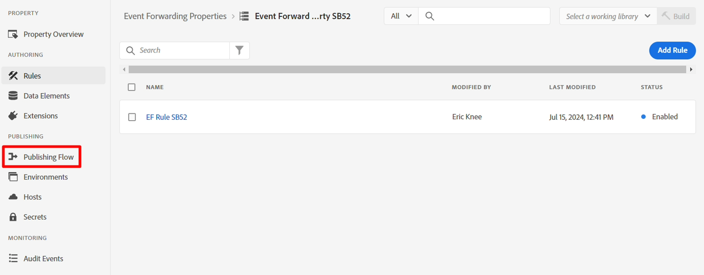


2. Klicken Sie auf die Schaltfläche **Bibliothek hinzufügen**

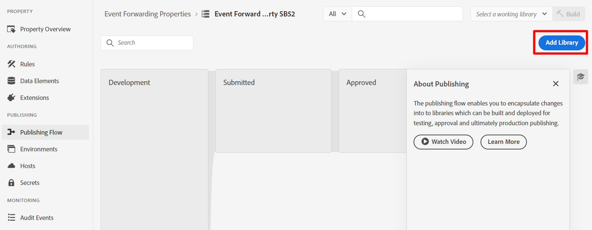


3. Konfigurieren Sie die Bibliothek mit den folgenden Informationen:

- Name -> **EF Library**
- Umgebung -> **Entwicklung**
- Klicken Sie auf **Alle geänderten Ressourcen hinzufügen**


Danach sollte der Bildschirm dem folgenden Screenshot ähneln.  Wenn alles gut aussieht, klicken Sie auf die Schaltfläche **Speichern und in Entwicklung erstellen**


4. Anschließend sollte der Entwicklungs-Build grün angezeigt werden, sodass er einsatzbereit ist

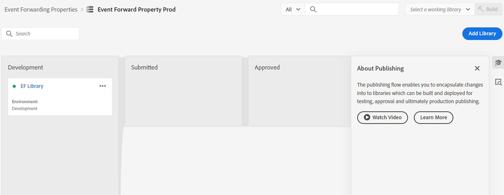
