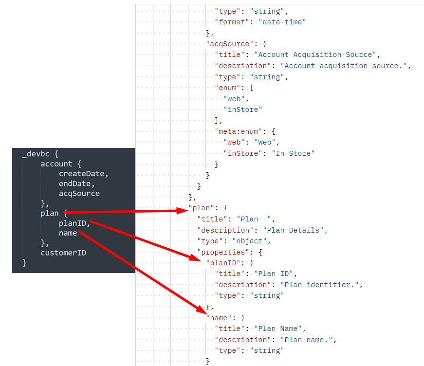
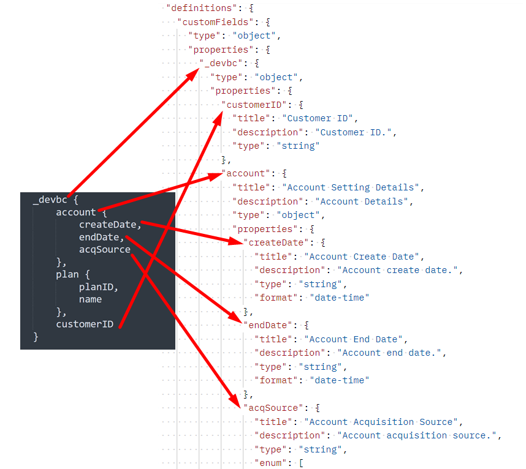
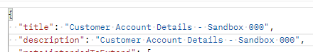
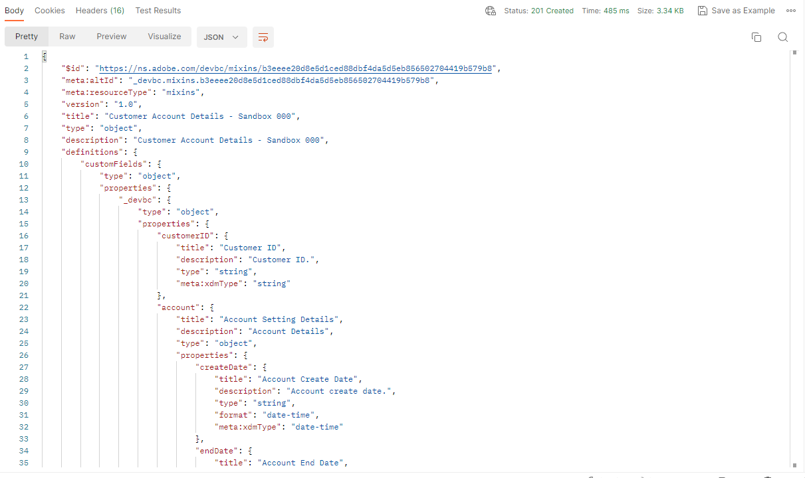

# Erstellen benutzerdefinierter Feldergruppen

## Struktur der Feldergruppen

Eine Feldergruppe besteht immer aus den folgenden Feldern. Dies wird im nächsten Schritt in der Anfrage angezeigt.

| Erforderliche Werte | Beschreibung |
| --------------------------- | ---------------------------------------------------------------------------------------------------------------------------------------------------------------------------------------------- |
| Anrede | Der Name der Feldergruppe, die Sie in der Schemaregistrierung erstellen möchten. Der Name MUSS EINDEUTIG SEIN. |
| Beschreibung | Eine kurze Beschreibung des Zwecks der Feldergruppe |
| Typ | Immer ein Objekt |
| meta\:intendedToExtend | Definiert, mit welchen Klassen die Feldergruppe verwendet werden kann. Klassen werden immer durch ihren `$id` referenziert |
| allOf | Beschreibt die Ressourcen, die in die Feldergruppe aufgenommen werden können. Bei benutzerdefinierten Feldern wird der Pfad immer `#/definitions/customFields` |
| definition.customFields… | Dies ist die standardmäßige JSON-Schemastruktur, die zum Erstellen benutzerdefinierter Feldergruppen erforderlich ist. Sie muss mit dem `allOf` von oben übereinstimmen |
| \&lt;TENANT\_NAME> | Der Mandantenname (d. h. der eindeutige Name) wird während des Bereitstellungsprozesses erstellt. Dadurch wird sichergestellt, dass vorgenommene Anpassungen nicht mit bestehenden oder künftigen Änderungen an der Adobe-Schemaregistrierung in Konflikt stehen |

## Feldergruppe „Kundenkontodetails erstellen“

1. Klicken Sie im Ordner `XDM Schema Lab -> Create Schema` auf den API-Aufruf `Step 2 - Create Customer Account Details Field Group` Anfrage .

Überprüfen Sie den Text der Anfrage, bevor Sie sie ausführen. Beachten Sie, dass die im Abschnitt Feldergruppenstruktur erwähnten erforderlichen Felder wie folgt aussehen:

>[!NOTE]
>
>Beachten Sie, dass im Bild rechts oben der `allOf` auf den Pfad von &quot;/definitions/customFields“ verweist.  Diese muss mit der im Schema definierten Struktur übereinstimmen (Bild links), da sie dem XDM-System mitteilt, wo die benutzerdefinierten erstellten Objekte zu finden sind.
>
>

Beachten Sie außerdem, wie jedes einzelne Feld aus dem Zuordnungsblatt innerhalb der XDM-JSON-Struktur erhärtet wird.

1. Aktualisieren Sie die `title` und `description` für die Feldergruppe im folgenden Format: `Customer Account Details - Sandbox <your number here>`

   

1. Führen Sie durch Klicken auf die Schaltfläche `Send` aus.  Es sollte eine -Antwort ähnlich der im folgenden Screenshot angezeigt werden.

1. Kopieren Sie den `$id` Wert der neu erstellten Feldergruppe Kundenkontodetails .

>[!WARNING]
>
>Fahren Sie erst fort, wenn Sie die `$id` an einer anderen Stelle gespeichert haben.  Später muss das Kundenkontenschema erstellt werden
>
>
