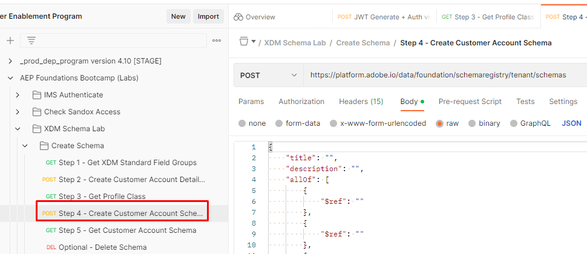
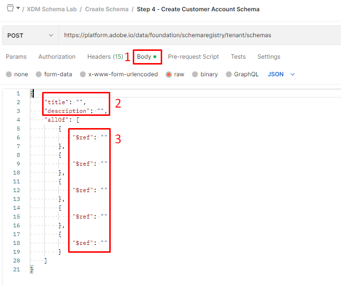
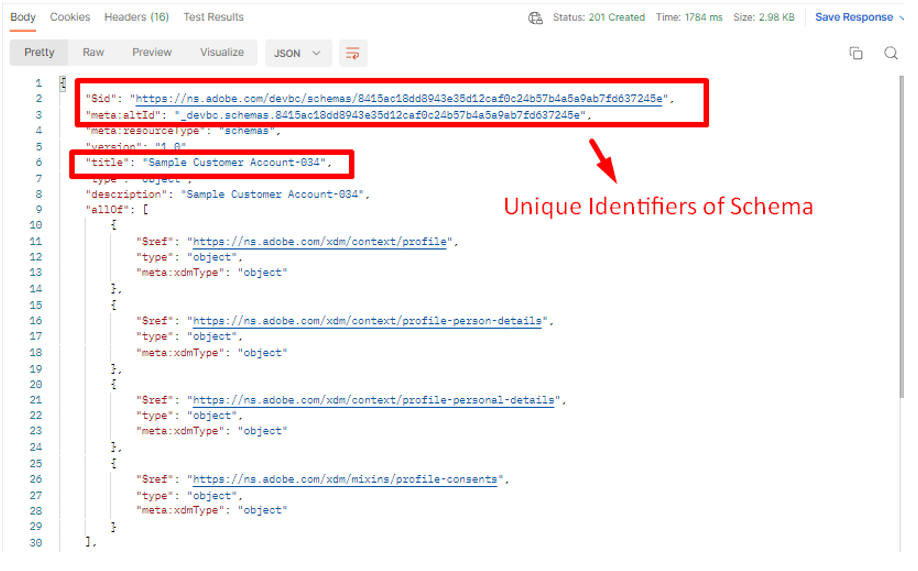

# Schema erstellen

## Ändern des Bodys der API

>[!CAUTION]
>
>**Führen Sie den Aufruf noch nicht aus…**

1. Klicken Sie im Ordner `XDM Schema Lab -> Create Schema` auf den `Step 4 - Create Customer Account Schema`-API-Aufruf.

2. Öffnen Sie den Hauptteil des Aufrufs und zeigen Sie die Struktur der Definition eines Schemas an. Denken Sie daran, dass ein Schema immer nur aus einer (1) Klasse und einer oder mehreren Feldergruppen besteht.

3. Füllen Sie die Felder `title` und `description` im Hauptteil des Schemas wie folgt aus:

- Titel -> `Sample Customer Schema - <your sandbox number>`
- Beschreibung -> `Sample Customer Schema - <your sandbox number>`

4. Füllen Sie die `$ref` Felder mit den `$ids`, die Sie aus den vorherigen von Ihnen abgeschlossenen Lab-Abschnitten gespeichert haben: [Erstellen benutzerdefinierter Feldergruppen](./create-custom-field-groups.md) und [Profilklasse abrufen](./get-profile-class.md). Sie sollten $ids für jedes der folgenden Elemente haben:

- Klasse -> Individuelles XDM-Profil
- Feldergruppe -> Demografische Details
- Feldergruppe -> Persönliche Kontaktdaten
- Feldergruppe -> Einverständnis- und Voreinstellungsdetails
- Feldergruppe (benutzerdefiniert) -> Kundenkontodetails

5. Überprüfen Sie Ihren endgültigen Textkörper und stellen Sie sicher, dass er in etwa wie folgt aussieht

>[!NOTE]
>
>Die Reihenfolge der `$refs` spielt ebenso wenig eine Rolle wie die Lage der `title` und `description` im Körper.

## Ausführen der API

1. Speichern Sie Ihre Änderungen an der API-Anfrage, bevor Sie fortfahren.
1. Führen Sie die API aus, indem Sie auf die Schaltfläche `Send` klicken

Eine erfolgreiche Antwort zum Erstellen des Schemas sollte zu einem `201 Created` Status führen und wie die Abbildung unten aussehen

>[!WARNING]
>
>Anfrage bei Erfolg nicht erneut ausführen

## Suchen und speichern Sie das Schema $id

1. Nachdem Sie die API-Anfrage ausgeführt haben, kopieren Sie die `$id` und `$meta:altId` aus der Antwort
1. Speichern Sie die Werte an einer beliebigen Stelle, damit Sie sie später wiederverwenden können

>[!WARNING]
>
>Fahren Sie nicht fort, bis Sie die `$id` gespeichert und irgendwo `$meta:altId` haben.  Sie werden in zukünftigen Laborschritten erforderlich sein

>[!TIP]
>
>**Herzlichen Glückwunsch! Sie haben soeben ein Schema nur mit den APIs erstellt**
