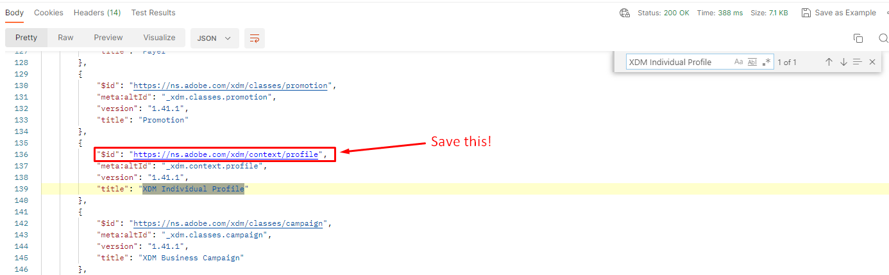

# Profilklasse abrufen

## Schritt 3 ausführen - Profil-Klasse abrufen

1. Klicken Sie auf die `Step 3 - Get Profile Class` im `XDM API Lab -> Create Schema`
1. Führen Sie durch Klicken auf die Schaltfläche `Send` aus

>[!NOTE]
>
>Beachten Sie, dass in der GET-Anfrage der `global` Pfad …/schemaRegistry/**global**/classes Denken Sie daran, dass die Verwendung von `global` der Schemaregistrierung mitteilt, dass wir nur standardmäßige Adobe-XDM-Objekte zurückgeben möchten

## Suchen und speichern Sie die Klasse $id

Nachdem Sie die API-Anfrage ausgeführt haben, führen Sie die folgenden Schritte aus, um die `$id` für die Klasse „XDM Individual Profile“ zu suchen und zu speichern.

1. Suchen Sie in der Antwort nach der Klasse `XDM Individual Profile` .
1. Kopieren Sie die `$id` für die `XDM Individual Profile` und speichern Sie sie an einem Ort, auf den Sie später verweisen können.

>[!WARNING]
>
>Fahren Sie erst fort, wenn Sie die `$id` an einer anderen Stelle gespeichert haben.  Später muss das Kundenkontenschema erstellt werden
