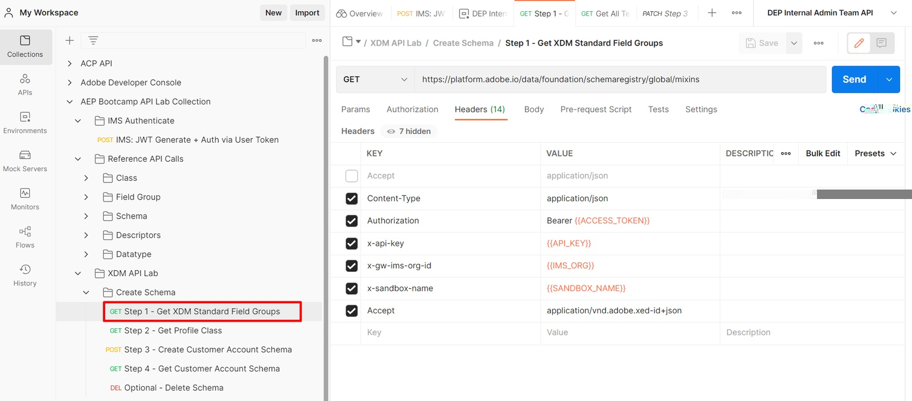
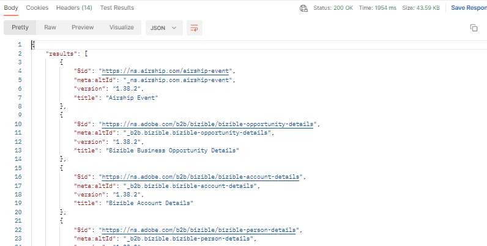
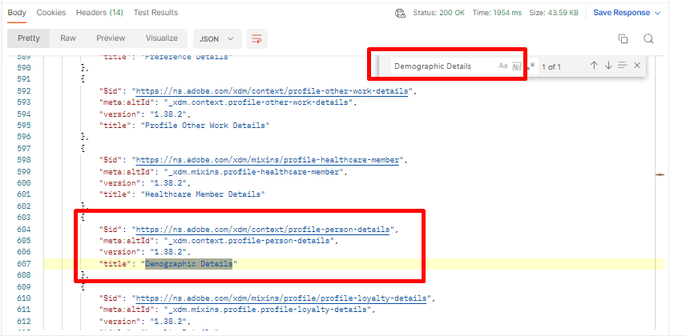

# Abrufen von Standardfeldgruppen

>[!NOTE]
>
>**„Feldergruppe“** wurde zuvor als **„Mixin“** bezeichnet, sodass diese Begriffe in allen API-Anfragen und im Handbuch synonym verwendet werden können.

## XDM-Standardfeldgruppen anfordern

1. Klicken Sie auf `Step 1 - Get XDM Standard Field Groups` API-Aufruf im Ordner `XDM Schema Lab -> Create Schema` .
1. Führen Sie den Aufruf aus, indem Sie auf die Schaltfläche `Send` klicken.

**Anfrage**

>[!NOTE]
>
>Beachten Sie die Verwendung `global` Werts in der folgenden Anfrage-URL:
>
>https\://platform.adobe.io/data/foundation/schemaRegistry/**global**/mixins
>
>`global` wird verwendet, um nur XDM-Standardkomponenten anzufordern (in diesem Fall Feldergruppe/Mixin). In der XDM-Registrierung in Experience Platform gibt es zwei Arten von Eigentümern: Adobe und Mandant (d. h. benutzerdefiniert).
>
>- Von Adobe erstellte Objekte verwenden in allen XDM-Auflistungs- oder Suchanfragen immer das Wort `global` .
>- Von Mandanten erstellte Objekte (d. h. benutzerdefinierte Objekte) verwenden in jeder XDM-Auflistung oder jedem Suchaufruf immer das Wort `tenant` .

**Antwort**

## Identifizieren erforderlicher XDM-Standardfeldgruppen

Ein Schema besteht immer aus einer oder mehreren Feldergruppen und einer Klasse.  Suchen Sie für das Schema „Connection 5G Individual Profile“ die standardmäßigen XDM-Feldergruppen, die für das Schema erforderlich sind.

- Demografische Details
- Persönliche Kontaktdaten
- Details zu Einverständnis und Voreinstellungen

1. Suchen Sie in der Antwort des Aufrufs nach der Feldergruppe `Demographic Details` .
1. Kopieren Sie die `$id` der Feldergruppe und speichern Sie sie zur späteren Verwendung an einem anderen Speicherort
1. Wiederholen Sie die Schritte 1 und 2 für die beiden anderen oben aufgeführten Feldergruppen

>[!WARNING]
>
>Fahren Sie nicht fort, bis Sie alle drei (3) `$ids` irgendwo gespeichert haben.  Sie werden später benötigt, um das Kundenkontenschema zu erstellen
