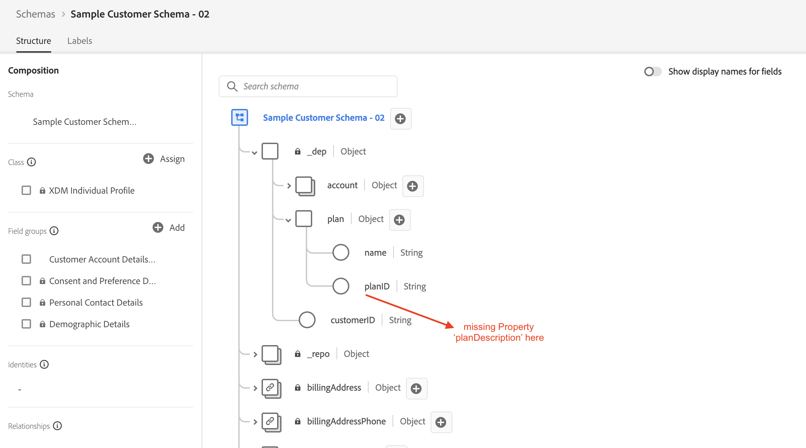
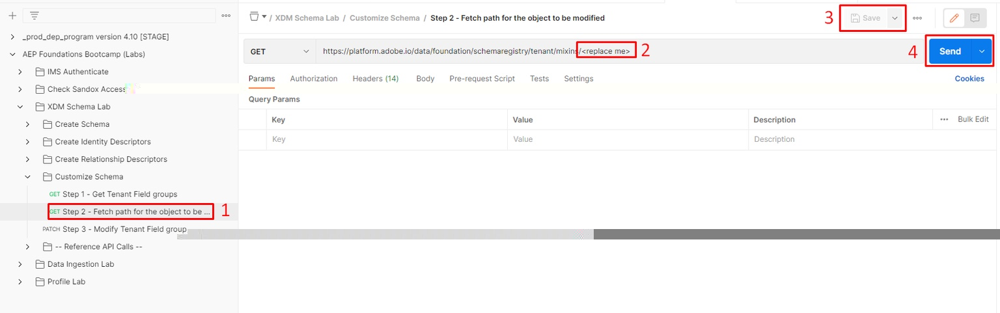
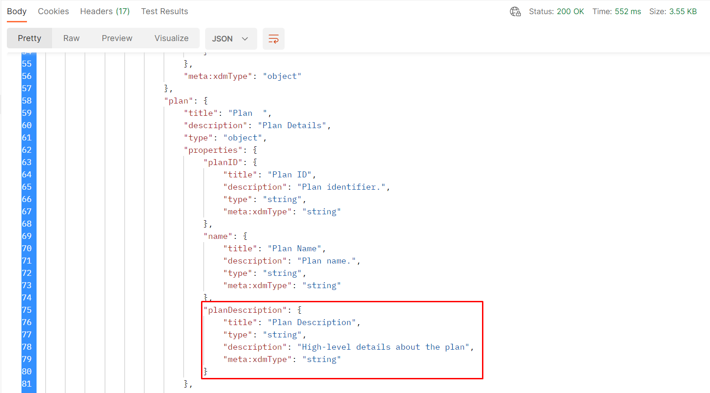
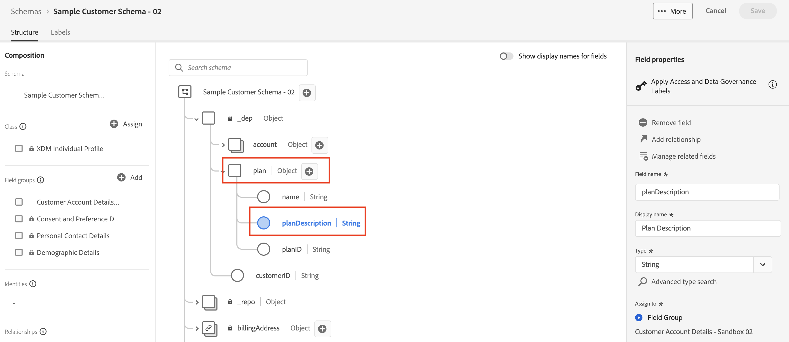

# Schema ändern - JSON-Patch

## Übersicht

Angenommen, Sie müssen nach dem Erstellen des Schemas zurückkehren und ein zusätzliches Feld zum `plan`-Objekt namens `planDescription` hinzufügen, da Sie entweder beim Erstellen vergessen haben, es hinzuzufügen, oder es war eine Anfrage, die in Monaten später kam.  Um diese Aufgabe durchzuführen, können Sie einfach einen `PATCH` ausführen, der das Schema mit dem neuen Feld aktualisiert.

Sie können mehr über JSON PATCH unter den unten stehenden Links erfahren. Für dieses Labor gehen Sie jedoch davon aus, dass Sie ein Konzept dafür haben, wie dies 😄 funktioniert

- [https://jsonpatch.com/](https://jsonpatch.com/)
- [Experience League API-Grundlagen](https://experienceleague.adobe.com/docs/experience-platform/landing/platform-apis/api-fundamentals.html?lang=en#json-patch)



>[!NOTE]
>
>Denken Sie an die folgenden Punkte:
>
>- Ein Schema besteht aus einer (1) Klasse und einer (1) oder mehreren Feldergruppen
>- Es ist nicht möglich, neue Felder direkt zu einem Schema hinzuzufügen, ohne sie zuerst zu einer Feldergruppe hinzuzufügen. Dadurch wird die Wiederverwendbarkeit eines Felds über jedes Schema hinweg sichergestellt, das diese Feldergruppe verwendet.


Um ein neues Feld zu einem Schema hinzuzufügen, müssen Sie die folgenden Vorgänge in der richtigen Reihenfolge ausführen.  Dies ist, was Sie in den folgenden Laborschritten tun.

- Identifizieren Sie die Feldergruppe, der Sie die neue Eigenschaft hinzufügen möchten
- Erstellen eines JSON-PATCH-Aufrufs zum Aktualisieren der Feldergruppe
- Führen Sie den JSON-PATCH-Aufruf aus, um die Feldergruppe zu aktualisieren (die das Schema erbt).


## Suchen und identifizieren Sie die zu aktualisierende Feldergruppe

1. Wählen Sie den `Step 1 - Get Tenant Field groups` API-Aufruf im Ordner `XDM Schema Lab -> Customize Schema` aus
1. Ausführen der Anfrage durch Klicken auf die Schaltfläche `Send`


>[!NOTE]
>
>Denken Sie daran, dass Sie das `plan`-Objekt innerhalb einer benutzerdefinierten Feldergruppe erstellt haben. Benutzerdefinierte erstellte Objekte in der XDM-Schemaregistrierung werden als „Mandant“ bezeichnet. Daher wird der API-Aufruf unter Verwendung des `/schemaregistry/tenant/mixins/`-Pfads ausgeführt.


1. Suchen Sie in der Antwort nach der Schema-ID für die benutzerdefinierte Feldergruppe, die Sie zuvor mit dem Titel `Customer Account Details - Sandbox <your number here> ` erstellt haben

1. Kopieren Sie die `$meta:altId` und speichern Sie sie an einem sicheren Ort, da Sie sie für den nächsten Schritt benötigen werden


>[!CAUTION]
>
>Stellen Sie sicher, dass Sie die richtige Feldergruppe zum Kopieren auswählen!  Es gibt einen, der ähnlich `dep: Customer Account Details` heißt und den Sie **nicht verwenden**

>[!WARNING]
>
>Fahren Sie nicht fort, bis Sie die `$meta:altId ` gespeichert haben.  Dies wird in zukünftigen Laborschritten erforderlich sein


## Suchen der Feldergruppe nach $meta\:altId

1. Wählen Sie den `Step 2 - Fetch path for the object to be modified`-API-Aufruf im `XDM Schema Lab -> Customize Schema` aus
1. Ersetzen Sie in der URL der Anfrage den `<replace me>` durch den `$meta:altId`, den Sie vom vorherigen Abschnittsschritt bis zum Ende des Aufrufs gespeichert haben, wie unten dargestellt
1. Speichern Sie die an der Anfrage vorgenommenen Änderungen
1. Ausführen der Anfrage durch Klicken auf die Schaltfläche `Send`




Überprüfen Sie die Antwort und beachten Sie, dass der JSON-Zeigerpfad für das **plan**-Objekt mit jeder der unten hervorgehobenen Eigenschaften erstellt wurde.


Der vollständig erstellte Pfad sieht wie folgt aus:  Kopieren Sie diesen Pfad und speichern Sie ihn zur Referenz

```none
/definitions/customFields/properties/_devbc/properties/plan/properties
```

>[!NOTE]
>
>Denken Sie daran, den oben genannten Mandantennamen (\_devbc) mit Ihrem eigenen zu aktualisieren


## PATCH - die Feldergruppe

### Beispiel für einen JSON PATCH-API-Hauptteil

```none
[
    {
        "op": "",
        "path": "",
        "value": {
            "title": "",
            "type": "",
            "description": ""
        }
    }
]
```

- **op (Vorgang)** -> stellt eine Anweisung bereit, welche Aktion die PATCH durchführen soll
- **Path** -> Dies ist der Pfad, den Sie erstellen, aktualisieren oder löschen möchten (d. h. dies ist der JSON-Zeiger auf den Speicherort des neuen Felds)
- **Wert** -> Dies ist ein optionales Feld und wird nur beim Erstellen oder Ersetzen eines vorhandenen Felds verwendet


### Ausführen der API-Anfrage

1. Klicken Sie auf den `Step 3 - Modify Tenant Field group` API-Aufruf im Ordner `XDM Schema Lab -> Customize Schema` .


&#x200B;2. Aktualisieren Sie den Text der Anfrage mit den folgenden Informationen

- **op** ->` add`
- **path** -> `path from previous step +`&#x200B;` the new field name`
- **value** ->
  - **title** -> `Plan Description`
  - **type** -> `string`
  - **description** -> `High-level details about the plan`

Wenn Sie fertig sind, sollte Ihre API-Anfrage in etwa wie folgt aussehen


>[!WARNING]
>
>Stellen Sie sicher, dass Sie den neuen Feldnamen **planDescription** in Ihren Pfad aufnehmen


&#x200B;3. Wenn alles gut `Save` deinem Anruf aussieht

&#x200B;4. `Execute` des Aufrufs zum Ausführen der PATCH

Es sollte eine &quot;`200 OK `&quot; angezeigt werden und das `planDescription` Feld sollte nun in Ihrer Feldergruppe wie folgt angezeigt werden:



>[!TIP]
>
>Herzlichen Glückwunsch! Sie haben eine Feldergruppe/ein Schema mithilfe von JSON PATCH erfolgreich aktualisiert.


## Änderung in der Benutzeroberfläche anzeigen

Durchsuchen Sie Ihr Schema über die Benutzeroberfläche und sehen Sie sich das neu hinzugefügte Feld an.  Ziemlich cool, was?


